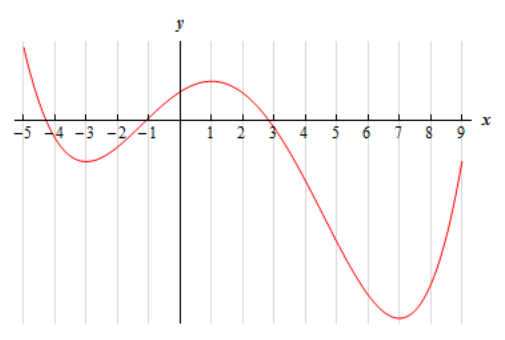

# Section 4.5 : The Shape Of A Graph, Part I

In the previous section we saw how to use the derivative to determine the
absolute minimum and maximum values of a function. However, there is a lot more
information about a graph that can be determined from the first derivative of a
function. We will start looking at that information in this section. The main
idea we'll be looking at in this section will be identifying all the relative
extrema of a function.

Let's start this section off by revisiting a familiar topic from the previous
chapter. Let's suppose that we have a function, $f(x)$. We know from our work in
the previous chapter that the first derivative, $f'(x)$, is the rate of change
of the function. We used this idea to identify where a function was increasing,
decreasing or not changing.

Before reviewing this idea let's first write down the mathematical definition of
increasing and decreasing. We all know what the graph of an
increasing/decreasing function looks like but sometimes it is nice to have a
mathematical definition as well. Here it is.

**Definition**

> 1. Given any $x_1$ and $x_2$ from an interval $I$ with $x_1 < x_2$ if
>    $f(x_1) < f(x_2)$ then $f(x)$ is **_increasing_** on $I$.
> 2. Given any $x_1$ and $x_2$ from an interval $I$ with $x_1 < x_2$ if
>    $f(x_1) > f(x_2)$ then $f(x)$ is **_decreasing_** on $I$.

This definition will actually be used in the proof of the next fact in this
section.

Now, recall that in the previous chapter we constantly used the idea that if the
derivative of a function was positive at a point then the function was
increasing at that point and if the derivative was negative at a point then the
function was decreasing at that point. We also used the fact that if the
derivative of a function was zero at a point then the function was not changing
at that point. We used these ideas to identify the intervals in which a function
is increasing and decreasing.

The following fact summarizes up what we were doing in the previous chapter.

**Fact**

> 1. If $f'(x) > 0$ for every $x$ on some interval $I$, then $f(x)$ is
>    increasing on the interval.
> 2. If $f'(x) < 0$ for every $x$ on some interval $I$, then $f(x)$ is
>    decreasing on the interval.
> 3. If $f'(x) = 0$ for every $x$ on some interval $I$, then $f(x)$ is constant
>    on the interval.

The proof of this fact is in the
[**Proofs From Derivative Applications**](https://tutorial.math.lamar.edu/Classes/CalcI/DerivativeAppsProofs.aspx#Extras_DerAppPf_ShapeIFact)
section of the Extras chapter.

Let's take a look at an example. This example has two purposes. First, it will
remind us of the increasing/decreasing type of problems that we were doing in
the previous chapter. Secondly, and maybe more importantly, it will now
incorporate critical points into the solution. We didn't know about critical
points in the previous chapter, but if you go back and look at those examples,
the first step in almost every increasing/decreasing problem is to find the
critical points of the function and so the process we'll be using in the
following example should be familiar.

---

**Example 1** Determine all intervals where the following function is increasing
or decreasing.

$$ f(x) = -x^5 + \frac{5}{2}x^4 + \frac{40}{3}x^3 + 5 $$

**Solution**

To determine if the function is increasing or decreasing we will need the
derivative.

$$ f'(x) = -5x^4 + 10x^3 + 40x^2 $$

$$ \quad = -5x^2\left(x^2 - 2x - 8\right) $$

$$ \quad = -5x^2(x - 4)(x + 2) $$

Note that when we factored the derivative we first factored a "-1" out to make
the rest of the factoring a little easier.

From the factored form of the derivative we see that we have three critical
points : $x = -2$, $x = 0$, and $x = 4$. We'll need these in a bit.

We now need to determine where the derivative is positive and where it's
negative. We've done this several times now in both the Review chapter and the
previous chapter. Since the derivative is a polynomial it is continuous and so
we know that the only way for it to change signs is to first go through zero.

In other words, the only place that the derivative _may_ change signs is at the
critical points of the function. We've now got another use for critical points.
So, we'll build a number line, graph the critical points and pick test points
from each region to see if the derivative is positive or negative in each
region.

Here is the number line and the test points for the derivative.

Make sure that you test your points in the derivative. One of the more common
mistakes here is to test the points in the function instead! Recall that we know
that the derivative will be the same sign in each region. The only place that
the derivative can change signs is at the critical points and we’ve marked the
only critical points on the number line.

So, it looks like we've got the following intervals of increase and decrease.

$$ \text{Increase : } -2 < x < 0 \text{ and } 0 < x < 4 $$

$$ \text{Decrease : } -\infty < x < -2 \text{ and } 4 < x < \infty $$

---

In this example we used the fact that the only place that a derivative can
change sign is at the critical points. Also, the critical points for this
function were those for which the derivative was zero. However, the same thing
can be said for critical points where the derivative doesn't exist. This is nice
to know. A function, in this section a derivative, can change signs where it is
zero or doesn't exist. In the previous chapter all our examples of this type had
only critical points where the derivative was zero. Now, that we know more about
critical points we'll also see an example or two later on with critical points
where the derivative doesn't exist.

If you aren't sure you believe that functions (they don't have to be derivatives
of course) can change sign where they don't exist consider
$f(x) = \dfrac{1}{x}$. This function clearly does not exist at $x = 0$ and is
negative if $x < 0$ and positive if $x > 0$ and so does change sign at the point
where it does not exist. Be careful to not assume this will always be true
however. Take $f(x) = \dfrac{1}{x^2}$ for example. Again, this cearly does not
exist at $x = 0$ and yet is positive on both sides of $x = 0$.

So, just to reiterate one more time. Functions, regardless of whether they are
derivatives or not, may (but are not guaranteed to) change sign where they are
either zero or do not exist.

Now that we have the previous "reminder" example out of the way let's move into
some new material. Once we have the intervals of increasing and decreasing for a
function we can use this information to get a sketch of the graph. Note that the
sketch, at this point, may not be super accurate when it comes to the curvature
of the graph, but it will at least have the basic shape correct. To get the
curvature of the graph correct we'll need the information from the next section.

Let's attempt to get a sketch of the graph of the function we used in the
previous example.

---

**Example 2** Sketch the graph of the following function.

$$ f(x) = -x^5 + \frac{5}{2}x^4 + \frac{40}{3}x^3 + 5 $$

**Solution**

There really isn't a whole lot to this example. Whenever we sketch a graph it's
nice to have a few points on the graph to give us a starting place. So we'll
start by the function at the critical points. These will give us some starting
points when we go to sketch the graph. These points are,

$$ f(-2) = -\frac{89}{3} = -29.67 \quad f(0) = 5 \quad f(4) =\frac{1423}{3} = 474.33 $$

Once these points are graphed we go to the increasing and decreasing information
and start sketching. For reference purposes here is the increasing/decreasing
information.

$$ \text{Increase : } -2 < x < 0 \text{ and } 0 < x < 4 $$

$$ \text{Decrease : } -\infty < x < -2 \text{ and } 4 < x < \infty $$

Note that we are only after a sketch of the graph. As noted before we started
this example we won’t be able to accurately predict the curvature of the graph
at this point. However, even without this information we will still be able to
get a basic idea of what the graph should look like.

To get this sketch we start at the very left of the graph and knowing that the
graph must be decreasing and will continue to decrease until we get to $x = -2$.
At this point the function will continue to increase until it gets to $x = 4$.
However, note that during the increasing phase it does need to go through the
point at $x = 0$ and at this point we also know that the derivative is zero here
and so the graph goes through $x = 0$ horizontally. Finally, once we hit $x = 4$
the graph starts, and continues, to decrease. Also, note that just like at
$x = 0$ the graph will need to be horizontal when it goes through the other two
critical points as well.

Here is the graph of the function. We, of course, used a graphical program to
generate this graph, however, outside of some potential curvature issues if you
followed the increasing/decreasing information and had all the critical points
plotted first you should have something similar to this.

---

Let's use the sketch from this example to give us a very nice test for
classifying critical points as relative maximums, relative minimums or neither
minimums or maximums.

Recall from the
[**Minimum and Maximum Values**](https://tutorial.math.lamar.edu/Classes/CalcI/MinMaxValues.aspx#FT)
section that all relative extrema of a function come from the list of critical
points. The graph in the previous example has two relative extrema and both
occur at critical points as the we predicted in that section. Note as well that
we’ve got a critical point that isn’t a relative extrema ($x = 0$). This is okay
since there is no reason to think that all critical points will be relative
extrema. We only know that relative extrema will come from the list of critical
points.

In the sketch of the graph from the previous example we can see that to the left
of $x = -2$ the graph is decreasing and to the right of $x = -2$ the graph is
increasing and $x = -2$ is a relative minimum. In other words, the graph is
behaving around the minimum exactly as it would have to be in order for $x = -2$
to be a minimum. The same thing can be said for the relative maximum at $x = 4$.
The graph is increasing on the left and decreasing on the right exactly as it
must be in order for $x = 4$ to be a maximum. Finally, the graph is increasing
on both sides of $x = 0$ and so this critical point can't be a minimum or a
maximum.

These ideas can be generalized to arrive at a nice way to test if a critical
point is a relative minimum, relative maximum or neither. If $x = c$ is a
critical point and the function is decreasing to the left of $x = c$ and is
increasing to the right then $x = c$ must be a relative minimum of the function.
Likewise, if the function is increasing to the left of $x = c$ and decreasing to
the right then $x = c$ must be a relative maximum of the function. Finally, if
the function is increasing on both sides of $x = c$ or decreasing on both sides
of $x = c$ then $x = c$ can be neither a relative minimum nor a relative
maximum.

These ideas can be summarized up in the following test.

**First Derivative Test**

> Suppose that $x = c$ is a critical point of $f(x)$ then,
>
> 1. If $f'(x) > 0$ to the left of $x = c$ and $f'(x) < 0$ to the right of
>    $x = c$ then $x = c$ is a relative maximum.
> 2. If $f'(x) < 0$ to the left of $x = c$ and $f'(x) > 0$ to the right of
>    $x = c$ then $x = c$ is a relative minimum.
> 3. If $f'(x)$ is the same sign on both sides of $x = c$ then $x = c$ is
>    neither a relative maximum nor a relative minimum.

It is important to note here that the first derivative test will only classify
critical points as relative extrema and not as absolute extrema. As we recall
from the
[**Finding Absolute Extrema**](https://tutorial.math.lamar.edu/Classes/CalcI/AbsExtrema.aspx)
section absolute extrema are largest and smallest function values and may not
even exist or be critical points if they do exist.

The first derivative test is exactly that, a test using the first derivative. It
doesn't ever use the value of the function and so no conclusions can be drawn
from the test about the relative "size" of the function at the critical points
(which would be needed to identify absolute extrema) and can't even begin to
address the fact that absolute extrema may not occur at critical points.

Let's take at another example.

---

**Example 3** Find and classify all the critical points of the following
function. Give the intervals where the function is increasing and decreasing.

$$ g(t) = t\sqrt[3]{t^2 - 4} $$

**Solution**

First, we'll need the derivative so we can get our hands on the critical points.
Note as well that we'll do some simplification on the derivative to help us find
the critical points.

$$ g'(t) = \left(t^2 - 4\right)^{\frac{1}{3}} + \frac{2}{3}t^2\left(t^2 - 4\right)^{-\frac{2}{3}} $$

$$ \quad = \left(t^2 - 4\right)^{\frac{1}{3}} + \frac{2t^2}{3\left(t^2 - 4\right)^{\frac{2}{3}}} $$

$$ \quad = \frac{3\left(t^2 - 4\right) + 2t^2}{3\left(t^2 - 4\right)^{\frac{2}{3}}} $$

$$ \quad = \frac{5t^2 - 12}{3\left(t^2 - 4\right)^{\frac{2}{3}}} $$

So, it looks like we'll have four critical points here. They are,

$$ t = \pm 2 \quad \quad \text{ The derivative doesn't exist here.} $$

$$ t = \pm \sqrt{\frac{12}{5}} = \pm 1.549 \quad \quad \text{ The derivative is zero here.} $$

Finding the intervals of increasing and decreasing will also give the
classification of the critical points so let's get those first. Here is a number
line with the critical points graphed and test points

So, it looks like we've got the following intervals of increasing and
decreasing.

$$ \text{Increasing : } -\infty < x < -2 \text{, } -2 < x < -\sqrt{\frac{12}{5}} \text{, } \sqrt{\frac{12}{5}} < x < 2 \text{, } \& \text{ } 2 < x < \infty $$

$$ \text{Decrease : } -\sqrt{\frac{12}{5}} < x < \sqrt{\frac{12}{5}} $$

From this it looks like $t = -2$ and $t = 2$ are neither relative minimum or
relative maximums since the function is increasing on both side of them. On the
other hand, $t = -\sqrt{\dfrac{12}{5}}$ is a relative maximum and
$t = \sqrt{\dfrac{12}{5}}$ is a relative minimum.

For completeness sake here is the graph of the function. Note that this graph is
a little trickier to sketch based only on the increasing and decreasing
information. It is only presented here for reference so you can see what it
looks like.

---

In the previous example the two critical points where the derivative didn't
exist ended up not being relative extrema. Do not read anything into this. They
often will be relative extrema. Check out
[**Example 5**](https://tutorial.math.lamar.edu/Classes/CalcI/AbsExtrema.aspx#DerivApps_AbsExt_Ex5)
in the Absolute Extrema to see an example of one such critical point.

Let’s work a couple more examples.

---

**Example 4** Suppose that the elevation above sea level of a road is given by
the following function.

$$ E(x) = 500 + \cos\left(\frac{x}{4}\right) + \sqrt{3}\sin\left(\frac{x}{4}\right) $$

where $x$ is in miles. Assume that if $x$ is positive we are to the east of the
initial point of measurement and if $x$ is negative we are to the west of the
initial point of measurement.

If we start 25 miles to the west of the initial point of measurement and drive
until we are 25 miles east of the initial point how many miles of our drive were
we driving up an incline?

**Solution**

Okay, this is just a really fancy way of asking what the intervals of increasing
and decreasing are for the function on the interval $[-25, 25]$. So, we first
need the derivative of the function.

$$ E'(x) = -\frac{1}{4}\sin\left(\frac{x}{4}\right) + \frac{\sqrt{3}}{4}\cos\left(\frac{x}{4}\right) $$

Setting this equal to zero gives,

$$ -\frac{1}{4}\sin\left(\frac{x}{4}\right) + \frac{\sqrt{3}}{4}\cos\left(\frac{x}{4}\right) = 0 $$

$$ \quad \tan\left(\frac{x}{4}\right) = \sqrt{3} $$

The solutions to this and hence the critical points are,

$$ \frac{x}{4} = 1.0472 + 2\pi n \text{, } \quad n = 0, \pm 1,\pm 2, \dots \quad \Rightarrow \quad x = 4.1888 + 8\pi n \text{, } \quad n = 0, \pm 1, \pm 2, \dots $$

$$ \frac{x}{4} = 4.1888 + 2\pi n \text{, } \quad n = 0, \pm 1,\pm 2, \dots \quad \Rightarrow \quad x = 16.7552 + 8\pi n \text{, } \quad n = 0, \pm 1, \pm 2, \dots $$

I'll leave it to you to check that the critical points that fall in the interval
that we're after are,

$$ -20.9439 \text{, } -8.3775 \text{, } 4.1888 \text{, } 16.7552 $$

Here is the number line with the critical points and test points.

So, it looks like the intervals of increasing and decreasing are,

$$ \text{Increasing : } -25 < x < -20.9438 \text{, } -8.3775 < x < 4.1888 \text{ and } 16.7552 < x < 25 $$

$$ \text{Decrease : } -20.9438 < x < -8.3775 \text{ and } 4.1888 < x < 16.7552 $$

Notice that we had to end our intervals at -25 and 25 since we’ve done no work
outside of these points and so we can’t really say anything about the function
outside of the interval $[-25, 25]$.

From the intervals we can actually answer the question. We were driving on an
incline during the intervals of increasing and so the total number of miles is,

$$ \text{Distance } = (-20.9439 - (-25)) + (4.1888 - (-8.3775)) + (25 - 16.7552) $$

$$ \quad = 24.8652 \text{ miles} $$

Even though the problem didn't ask for it we can also classify the critical
points that are in the interval $[-25, 25]$.

$$ \text{Relative Maximums : } -20.9439 \text{, } 4.1888 $$

$$ \text{Relative Minimums : } -8.3775 \text{, } 16.7552 $$

---

**Example 5** The population of rabbits (in hundreds) after $t$ years in a
certain area is given by the following function,

$$ P(t) = t^2\ln(3t) + 6 $$

Determine if the population ever decreases in the first two years.

**Solution**

So, again we are really after the intervals and increasing and decreasing in the
interval $[0, 2]$.

We found the only critical point to this function back in the
[**Critical Points**](https://tutorial.math.lamar.edu/Classes/CalcI/CriticalPoints.aspx#DerivApps_CP_Ex6)
section to be,

$$ x = \frac{1}{3\sqrt{\mathbf{e}}} = 0.202 $$

Here is a number line for the intervals of increasing and decreasing.

So, it looks like the population will decrease for a short period and then
continue to increase forever.

Also, while the problem didn't ask for it we can see that the single critical
point is a relative minimum.

---

In this section we've seen how we can use the first derivative of a function to
give us some information about the shape of a graph and how we can use this
information in some applications.

Using the first derivative to give us information about a whether a function is
increasing or decreasing is a very important application of derivatives and
arises on a fairly regular basis in many areas.

---

## Practice Problems

For problems 1 & 2 the graph of a function is given. Determine the intervals on
which the function increases and decreases.

**1.**

**Solution**

**2.**

**Solution**

Below is the graph of the **derivative** of a function. From this graph
determine the intervals in which the **function** increases and decreases.

**3.**

**Solution**

**4.** This problem is about some function. All we know about the function is
that it exists everywhere and we also know the information given below about the
derivative of the function. Answer each of the following questions about this
function.

**(a)** Identify the critical points of the function.

**(b)** Determine the intervals on which the function increases and decreases.

**\(c\)** Classify the critical points as relative maximums, relative minimums
or neither.

$$ f'(-5) = 0 \quad f'(-2) = 0 \quad f'(4) = 0 \quad f'(8) = 0 $$

$$ f'(x) < 0 \quad \text{ on } \quad (-5, -2) \text{, } (-2, 4) \text{, } (8, \infty) \quad \quad f'(x) > 0 \quad \text{ on } (-\infty, 5) \text{, } (4, 8) $$

**Solution**

For problems 5 – 12 answer each of the following.

**(a)** Identify the critical points of the function.

**(b)** Determine the intervals on which the function increases and decreases.

**\(c\)** Classify the critical points as relative maximums, relative minimums
or neither.

**5.** $f(x) = 2x^3 - 9x^2 - 60x$

**Solution**

**6.** $h(t) = 50 + 40t^3 - 5t^4 - 4t^5$

**Solution**

**7.** $y = 2x^3 - 10x^2 + 12x - 12$

**Solution**

**8.** $p(x) = \cos(3x) + 2x \text{ on } \left[-\dfrac{3}{2}, 2\right]$

**Solution**

**9.** $R(z) = 2 - 5z - 14\sin\left(\dfrac{z}{2}\right) \text{ on } [-10, 7]$

**Solution**

**10.** $h(t) = t^2\sqrt[3]{t - 7}$

**Solution**

**11.** $f(w) = w\mathbf{e}^{2 - \frac{1}{2}w^2}$

**Solution**

**12.** $g(x) = x - 2\ln\left(1 + x^2\right)$

**Solution**

**13.** For some function, $f(x)$, it is known that there is a relative maximum
at $x = 4$. Answer each of the following questions about this function.

**(a)** What is the simplest form for the derivative of this function?

**Note :** There really are many possible forms of the derivative so to make the
rest 9f this problem as simple as possible you will want to use the simplest
form of the derivative that you can come up with.

**(b)** Using your answer from (a) determine the most general form of the
function.

**\(c\)** Given that $f(4) = 1$ find a function that will have a relative
maximum at $x = 4$.

**Note :** You should be able to use your answer from (b) to determine an answer
to this part.

**Solution**

**14.** Given that $f(x)$ and $g(x)$ are increasing functions. If we define
$h(x) = f(x) + g(x)$ show that $h(x)$ is an increasing function.

**Solution**

**15.** Given that $f(x)$ is an increasing function and define
$h(x) = \left[f(x)\right]^2$. Will $h(x)$ be an increasing function? If yes,
prove that $h(x)$ is an increasing function. If not, can you determine any other
conditions needed on the function $f(x)$ that will guarantee that $h(x)$ will
also increase?

**Solution**

---

## Assignment Problems

For problems 1 – 4 the graph of a function is given. Determine the intervals on
which the function increases and decreases.

**1.**

**Solution**

**2.**

**Solution**

**3.**

**Solution**

**4.**

**Solution**

For problems 5 – 7 the graph of the **derivative** of a function is given. From
this graph determine the intervals in which the **function** increases and
decreases.

**5.**

**Solution**

**6.**

**Solution**

**7.**

**Solution**

For problems 8 – 10 The known information about the derivative of a function is
given. From this information answer each of the following questions.

**(a)** Identify the critical points of the function.

**(b)** Determine the intervals on which the function increases and decreases.

**\(c\)** Classify the critical points as relative maximums, relative minimums
or neither.

**8.**

$$ f'(1) = 0 \quad f'(3) = 0 \quad f'(8) = 0 $$

$$ f'(x) < 0 \text{ on } (-\infty, 1) \text{, } (3, 8) \quad f'(x) > 0 \text{ on } (1, 3) \text{, } (8, \infty) $$

**9.**

$$ g'(-2) = 0 \quad g'(0) = 0 \quad g'(3) = 0 \quad g'(6) = 0 $$

$$ g'(x) < 0 \text{ on } (0, 3) \text{, } (6, \infty) \quad g'(x) > 0 \text{ on } (-\infty, -2) \text{, } (-2, 0) \text{, } (3, 6) $$

**10.**

$$ h'(-1) = 0 \quad h'(2) = 0 \quad h'(5) = 0 $$

$$ h'(x) < 0 \text{ on } (-\infty, -1) \text{, } (-1, 2) \quad h'(x) > 0 \text{ on } (2, 5) \text{, } (5, \infty) $$

For problems 11 – 28 answer each of the following.

**(a)** Identify the critical points of the function.

**(b)** Determine the intervals on which the function increases and decreases.

**\(c\)** Classify the critical points as relative maximums, relative minimums
or neither.

**11.** f(t) = t^3 - 15t^2 + 63t + 3$$

**Solution**

**12.** $g(x) = 20 + 8x^2 + 4x^3 - x^4$

**Solution**

**13.** $Q(w) = 8w^3 - 18w^2 - 24w - 10$

**Solution**

**14.** $f(x) = x^5 + \dfrac{5}{4}x^4 - 20x^3 - 7$

**Solution**

**15.** $P(x) = 5 - 4x - 9x^2 - 3x^3$

**Solution**

**16.** $R(z) = z^5 + z^4 - 6z^3 + 5$

**Solution**

**17.** $h(z) = 1 - 12z^2 - 9z^3 - 2z^4$

**Solution**

**18.**
$Q(t) = 7 - t + \sin(4t) \text{ on } \left[-\dfrac{3}{2}, \dfrac{3}{2}\right]$

**Solution**

**19.** $f(z) = 6z - 20\cos\left(\dfrac{z}{2}\right) \text{ on } [0, 22]$

**Solution**

**20.** $g(x) = 24\cos\left(\dfrac{x}{3}\right) + 8x + 2 \text{ on } [-30, 25]$

**Solution**

**21.** $h(w) = 9w - 5\sin(2w) \text{ on } [-5, 0]$

**Solution**

**22.** $h(x) = \sqrt[5]{x}(x + 7)$

**Solution**

**23.** $W(z) = \left(10 - w^2\right)(w + 2)^{\frac{2}{3}}$

**Solution**

**24.** $f(t) = \left(t^2 - 8\right)\sqrt[3]{t^2 - 4}$

**Solution**

**25.** $f(x) = \mathbf{e}^{\frac{1}{3}x^3 - x^2 - 3x}$

**Solution**

**26.** $h(z) = \left(z^2 - 8\right)\mathbf{e}^{3 - z}$

**Solution**

**27.** $A(t) = \ln\left(t^2 + 5t + 8\right)$

**Solution**

**28.** $g(x) = x - 3 + \ln\left(1 + x + x^2\right)$

**Solution**

**29.** Answer each of the following questions.

**(a)** What is the minimum degree of a polynomial that has exactly one relative
extrema?

**(b)** What is the minimum degree of a polynomial that has exactly two relative
extrema?

**\(c\)** What is the minimum degree of a polynomial that has exactly three
relative extrema?

**(d)** What is the minimum degree of a polynomial that has exactly $n$ relative
extrema?

**Solution**

**30.** For some function, $f(x)$ it is known that there is a relative minimum
at $x = -4$. Answer each of the following questions about this function.

**(a)** What is the simplest form that the derivative of this function?

**Note :** There really are many possible forms of the derivative so to make the
rest of this problem as simple as possible you will want to use the simplest
form of the derivative.

**(b)** Using your answer from (a) determine the most general form that the
function itself can take.

**\(c\)** Given that $f(-4) = 6$ find a function that will have a relative
minimum at $x = -4$.

**Note :** There are many possible answers here so just give one of them.

**Solution**

**31.** For some function, $f(x)$ it is known that there is a relative minimum
at $x = -1$. Answer each of the following questions about this function.

**(a)** What is the simplest form that the derivative of this function?

**Note :** There really are many possible forms of the derivative so to make the
rest of this problem as simple as possible you will want to use the simplest
form of the derivative.

**(b)** Using your answer from (a) determine the most general form that the
function itself can take.

**\(c\)** Given that $f(-1) = 3$ find a function that will have a relative
minimum at $x = -1$.

**Note :** There are many possible answers here so just give one of them.

**Solution**

**32.** For some function, $f(x)$ it is known that there is a relative minimum
at $x = 3$. Answer each of the following questions about this function.

**(a)** What is the simplest form that the derivative of this function?

**Note :** There really are many possible forms of the derivative so to make the
rest of this problem as simple as possible you will want to use the simplest
form of the derivative.

**(b)** Using your answer from (a) determine the most general form that the
function itself can take.

**\(c\)** Given that $f(3) = 2$ find a function that will have a relative
minimum at $x = 3$.

**Note :** There are many possible answers here so just give one of them.

**Solution**

**33.** For some function, $f(x)$ it is known that there is a relative maximum
at $x = 1$ and a relative minimum at $x = 4$. Answer each of the following
questions about this function.

**(a)** What is the simplest form that the derivative of this function?

**Note :** There really are many possible forms of the derivative so to make the
rest of this problem as simple as possible you will want to use the simplest
form of the derivative.

**(b)** Using your answer from (a) determine the most general form that the
function itself can take.

**\(c\)** Given that $f(1) = 6$ and $f(4) = -2$ find a function that will have a
relative maximum at $x = 1$ and a relative minimum at $x = 4$.

**Note :** There are many possible answers here so just give one of them.

**Solution**

**34.** Given athat $f(x)$ and $g(x)$ are increasing functions will
$h(x) = f(x) - g(x)$ always be an increasing function? If so, prove that $h(x)$
will be an increasing function. If not, find increasing functions, $f(x)$ and
$g(x)$, so that $h(x)$ will be a decreasing function and find a different set of
increasing functions so that $h(x)$ will be an increasing function.

**Solution**

**35.** Given that $f(x)$ is an increasing function. There are several possible
conditions that we can impose on $g(x)$ so that $h(x) = f(x) - g(x)$ will be an
increasing function. Determine as many of these possible conditions as you can.

**Solution**

**36.** For a function $f(x)$ determine a set of conditions $f(x)$, different
from those given in #15 in the practice problems, for which
$h(x) = \left[f(x)\right]^2$ will be an increasing function.

**Solution**

**37.** For a function $f(x)$ determine a single condition on $f(x)$ for whic
$h(x) = \left[f(x)\right]^3$ will be an increasing function.

**Solution**

**38.** Given that $f(x)$ and $g(x)$ are positive functions. Determine a set of
conditions on them for which $h(x) = f(x)g(x)$ will be an increasing function.
Note that there are several possible sets of conditions here but try to
determine the "simplest" set of conditions.

**Solution**

**39.** Repeat #38 for $h(x) = \dfrac{f(x)}{g(x)}$.

**Solution**

**40.** Given that $f(x)$ and $g(x)$ are increasing functions prove that
$h(x) = f\left(g(x)\right)$ will also be an increasing function.

**Solution**
