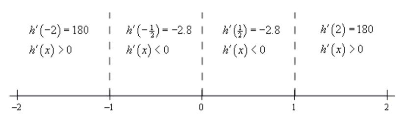

# Section 4.6 : The Shape Of A Graph, Part II

In the previous section we saw how we could use the first derivative of a
function to get some information about the graph of a function. In this section
we are going to look at the information that the second derivative of a function
can give us a about the graph of a function.

Before we do this we will need a couple of definitions out of the way. The main
concept that we'll be discussing in this section is concavity. Concavity is
easiest to see with a graph (we’ll give the mathematical definition in a bit).

So, a function is **concave up** if it "opens" up and the function is **concave
down** if it "opens" down. Notice as well that concavity has nothing to do with
increasing or decreasing. A function can be concave up and either increasing or
decreasing. Similarly, a function can be concave down and either increasing or
decreasing.

It’s probably not the best way to define concavity by saying which way it
"opens" since this is a somewhat nebulous definition. Here is the mathematical
definition of concavity.

**Definition 1**

> Given the function $f(x)$ then
>
> 1. $f(x)$ is **concave up** on an interval $I$ if all of the tangents to the
>    curve on $I$ are below the graph of $f(x)$.
> 2. $f(x)$ is **concave down** on an interval $I$ if all of the tangents to the
>    curve on $I$ are above the graph of $f(x)$.

To show that the graphs above do in fact have concavity claimed above here is
the graph again (blown up a little to make things clearer).

So, as you can see, in the two upper graphs all of the tangent lines sketched in
are all below the graph of the function and these are concave up. In the lower
two graphs all the tangent lines are above the graph of the function and these
are concave down.

Again, notice that concavity and the increasing/decreasing aspect of the
function is completely separate and do not have anything to do with each other.
This is important to note because students often mix these two up and use
information about one to get information about the other.

There's one more definition that we need to get out of the way.

**Definition 2**

> A point $x = c$ is called an **inflection point** if the function is
> continuous at the point and the concavity of the graph changes at that point.

Now that we have all the concavity definitions out of the way we need to bring
the second derivative into the mix. We did after all start off this section
saying we were going to be using the second derivative to get information about
the graph. The following fact relates the second derivative of a function to its
concavity. The proof of this fact is in the
[**Proofs From Derivative Applications**](https://tutorial.math.lamar.edu/Classes/CalcI/DerivativeAppsProofs.aspx#Extras_DerAppPf_ShapeIIFact)
section of the Extras chapter.

**Fact**

> Given the function $f(x)$ then,
>
> 1. If $f''(x) > 0$ for all $x$ in some interval $I$ then $f(x)$ is concave up
>    on $I$.
> 2. If $f''(x) < 0$ for all $x$ in some interval $I$ then $f(x)$ is concave
>    down on $I$.

So, what this fact tells us is that the inflection points will be all the points
where the second derivative changes sign. We saw in the previous chapter that a
function may change signs if it is either zero or does not exist. Note that we
were working with the first derivative in the previous section but the fact that
a function possibly changing signs where it is zero or doesn't exist has nothing
to do with the first derivative. It is simply a fact that applies to all
functions regardless of whether they are derivatives or not.

This in turn tells us that a list of possible inflection points will be those
points where the second derivative is zero or doesn't exist, as these are the
only points where the second derivative might change sign.

Be careful however to not make the assumption that just because the second
derivative is zero or doesn't exist that the point will be an inflection point.
We will only know that it is an inflection point once we determine the concavity
on both sides of it. It will only be an inflection point if the concavity is
different on both sides of the point.

Now that we know about concavity we can use this information as well as the
increasing/decreasing information from the previous section to get a pretty good
idea of what a graph should look like. Let's take a look at an example of that.

---

**Example 1** For the following function identify the intervals where the
function is increasing and decreasing and the intervals where the function is
concave up and concave down. Use this information to sketch the graph.

$$ h(x) = 3x^5 - 5x^3 + 3 $$

**Solution**

Okay, we are going to need the first two derivatives so let's get those first.

$$ h'(x) = 15x^4 - 15x^2 = 15x^2(x - 1)(x + 1) $$

$$ h''(x) = 60x^3 - 30x = 30x\left(2x^2 - 1\right) $$

Let’s start with the increasing/decreasing information since we should be fairly
comfortable with that after the last section.

There are three critical points for this function : $x = -1$, $x = 0$, and
$x = 1$. Below is the number line for the increasing/decreasing information.

So, it looks like we’ve got the following intervals of increasing and
decreasing.

$$ \text{Increasing : }  -\infty < x < -1 \text{ and } 1 < x < \infty $$

$$ \text{Decreasing : } -1 < x < 0 \text{, } 0 < x < 1 $$

Note that from the first derivative test we can also say that $x = -1$ is a
relative maximum and that $x = 1$ is a relative minimum. Also $x = 0$ is neither
a relative minimum or maximum.

Now let's get the intervals where the function is concave up and concave down.
If you think about it this process is almost identical to the process we use to
identify the intervals of increasing and decreasing. This only difference is
that we will be using the second derivative instead of the first derivative.

The first thing that we need to do is identify the possible inflection points.
These will be where the second derivative is zero or doesn't exist. The second
derivative in this case is a polynomial and so will exist everywhere. It will be
zero at the following points.

$$ x = 0 \text{, } x = \pm \frac{1}{\sqrt{2}} = \pm 0.7071 $$

As with the increasing and decreasing part we can draw a number line up and use
these points to divide the number line into regions. In these regions we know
that the second derivative will always have the same sign since these three
points are the only places where the function may change sign. Therefore, all
that we need to do is pick a point from each region and plug it into the second
derivative. The second derivative will then have that sign in the whole region
from which the point came from.

Here is the number line for this second derivative.

So, it looks like we've got the following intervals of concavity.

$$ \text{Concave Up : } -\frac{1}{\sqrt{2}} < x < 0 \text{ and } \frac{1}{\sqrt{2}} < x < \infty $$

$$ \text{Concave Down : } -\infty < x < -\frac{1}{\sqrt{2}} \text{ and } 0 < x < \frac{1}{\sqrt{2}} $$

This also means that

$$ x = 0 \text{, } x = \pm \frac{1}{\sqrt{2}} = \pm 0.7071 $$

are all inflection points.

All this information can be a little overwhelming when going to sketch the
graph. The first thing that we should do is get some starting points. The
critical points and inflection points are good starting points. So, first graph
these points.

From this point there are several ways to proceed with sketching the graph. The
way that we find to be the easiest (although you may not and that is perfectly
fine....) is to start with the increasing/decreasing information and start
sketching the graph from just that information as we did in the previous
section. However, unlike the previous section, this time as we draw an
increasing or decreasing portion of the curve we will also pay attention to the
concavity of the curve as we are doing this.

So, if we start with $x < -1$ we know that we have an increasing function. At
the same time, we know that we also have to be concave down in this range. So,
we can start off with sketching an increasing curve that has is also concave
down until we reach $x = -1$.

At this point the graph starts to decrease and will continue to decrease until
we hit $x = 1$. However, as we decrease the concavity needs to switch to concave
up at $x \approx -0.707$ and then switch back to concave down at $x = 0$ with a
final switch to concave up at $x \approx 0.707$.

Once we hit $x = 1$ the graph starts to increase and is still concave up and
both of these behaviors continue for the rest of the graph.

Putting all this information together will give us the following graph of the
function.

---

We can use the previous example to illustrate another way to classify some of
the critical points of a function as relative maximums or relative minimums.

Notice that $x = -1$ is a relative maximum and that the function is concave down
at this point. This means that $f''(x)$ must be negative. Likewise, $x = 1$ is a
relative minimum and the function is concave up at this point. This means that
$f''(1)$ must be positive.

As we'll see in a bit we will need to be very careful with $x = 0$. In this case
the second derivative is zero, but taht will not actually mean that $x = 0$ is
not a relative minimum or maximum. We'll see some examples of this in a bit, but
we need to get some other information taken care of first.

It is also important to note here that all of the critical points in this
example were critical points in which the first derivative was zero and this is
required for this to work. We will not be able to use this test on critical
points where the derivative doesn't exist.

Here is the test that can be used to classify some of the critical points of a
function. The proof of this test is in the
[**Proofs of Derivative Applications**](https://tutorial.math.lamar.edu/Classes/CalcI/DerivativeAppsProofs.aspx#Extras_DerAppPf_SDT)
section of the Extras chapter.

**Second Derivative Test**

> Suppose that $x = c$ is a critical point of $f(x)$ such that $f'(c) = 0$ and
> that $f''(x)$ is continuous in a region around $x = c$. Then,
>
> 1. If $f''(c) < 0$ then $x = c$ is a relative maximum.
> 2. If $f''(c) > 0$ then $x = c$ is a relative minimum.
> 3. If $f''(c) = 0$ then $x = c$ can be a relative maximum, relative minimum or
>    neither.

The third part of the second derivative test is important to notice. If the
second derivative is zero then the critical point can be anything. Below are the
graphs of three functions all of which have a critical point at $x = 0$, the
second derivative of all of the functions is zero at $x = 0$ and yet all three
possibilities are exhibited.

The first is the graph of $f(x) = x^4$. This graph has a relative minimum at
$x = 0$.

Next is the graph of $f(x) = -x^4$ which has a relative maximum at $x = 0$.

Finally, there is the graph of $f(x) = x^3$ and this graph had neither a
relative minimum or a relative maximum at $x = 0$.

So, we can see that we have to be careful if we fall into the third case. For
those times when we do fall into this case we will have to resort to other
methods of classifying the critical point. This is usually done with the first
derivative test.

Let's go back and take a look at the critical points from the first example and
use the Second Derivative Test on them, if possible.

---

**Example 2** Use the second derivative test to classify the critical points of
the function,

$$ h(x) = 3x^5 - 5x^3 + 3 $$

**Solution**

Note that all we're doing here is verifying the results from the first example.
The second derivative is,

$$ h''(x) = 60x^3 - 30x $$

The three critical points ($x = -1$, $x = 0$, and $x = 1) of this function are
all critical points where the first derivative is zero so we know that we at
least have a chance that the Second Derivative Test will work. The value of the
second derivative for each of these are,

$$ h''(-1) = -30 \quad \quad h''(0) = 0 \quad \quad h''(1) = 30 $$

The second derivative at $x = -1$ is negative so by the Second Derivative Test
this critical point this is a relative maximum as we saw in the first example.
The second derivative at $x = 1$ is positive and so we have a relative minimum
here by the Second Derivative Test as we also saw in the first example.

In the case of $x = 0$ the second derivative is zero and so we can't use the
Second Derivative Test to classify this critical point. Note however, that we do
know from the First Derivative Test we used in the first example that _in this
case_ the critical point is not a relative extrema.

---

Let's work one more example.

---

**Example 3** For the following function find the inflection points and use the
second derivative test, if possible, to classify the critical points. Also,
determine the intervals of increase/decrease and the intervals of concave
up/concave down and sketch the graph of the function.

$$ f(t) = t(6 - t)^{\frac{2}{3}} $$

**Solution**

We'll need the first and second derivatives to get us started. We'll leave it to
you to verify these derivatives but be aware that we did a little simplification
after taking each derivative.

$$ f'(t) = \frac{18 - 5t}{3(6 - t)^{\frac{1}{3}}} \quad \quad f''(t) = \frac{10t - 7w}{9(6 - t)^{\frac{4}{3}}} $$

The critical points are,

$$ t = \frac{18}{5} = 3.6 \quad \quad t =  $$

Notice as well that we won’t be able to use the second derivative test on
$t = 6$ to classify this critical point since the derivative doesn't exist at
this point. To classify this, we'll need the increasing/decreasing information
that we'll get to sketch the graph.

We can however, use the Second Derivative Test to classify the other critical
point so let's do that before we proceed with the sketching work. Here is the
value of the second derivative at $t = 3.6$.

$$ f''(3.6) = -1.245 < 0 $$

So, according to the second derivative test $t = 3.6$ is a relative maximum.

Now let's proceed with the work to get the sketch of the graph and notice that
once we have the increasing/decreasing information we'll be able to classify
$t = 6$.

Here is the number line for the first derivative.

So, according to the first derivative test we can verify that $t = 3.6$ is in
fact a relative maximum. We can also see that $t = 6$ is a relative minimum.

Be careful not to assume that a critical point that can't be used in the second
derivative test won't be a relative extrema. We've clearly seen now both with
this example and in the discussion after we have the test that just because we
can't use the Second Derivative Test or the Second Derivative Test doesn't tell
us anything about a critical point doesn't mean that the critical point will not
be a relative extrema. This is a common mistake that many students make so be
careful when using the Second Derivative Test.

Okay, let's finish the problem out. We will need the list of possible inflection
points. These are,

$$ t = 6 \quad \quad t = \frac{72}{10} = 7.2 $$

Here is the number line for the second derivative. Note that we will need this
to see if the two points above are in fact inflection points.

So, the concavity only changes at $t = 7.2$ and so this is the only inflection
point for this function.

Here is the sketch of the graph.

The change of concavity at $t = 7.2$ is hard to see, but it is there it's just a
very subtle change in concavity.

---

## Practice Problems

**1.** The graph of a function is given below. Determine the intervals on which
the function is concave up and concave down.

**Solution**

$$ \text{Concave Up : } -1 < x < 2 \text{, } 6 < x < \infty $$

$$ \text{Concave Down : } -\infty < x < -1 \text{, } 2 < x < 6 $$

**2.** Below is the graph the **2nd derivative** of a function. From
this graph determine the intervals in which the **function** is concave up and
concave down.

**Solution**

$$ \text{Concave Up : } -\infty < x < -4 \text{, } -2 < x < 3 \text{, } 3 < x < \infty $$

$$ \text{Concave Down : } -4 < x < -2 \text{, } $$

For problems 3 – 8 answer each of the following.

**(a)** Determine a list of possible inflection points for the function.

**(b)** Determine the intervals on which the function is concave up and concave
down.

**\(c\)** Determine the inflection points of the function.

**3.** $f(x) = 12 + 6x^2 - x^3$

**Solution**

**(a)**

$$ f'(x) = 12x - 3x^2 $$

$$ f'(x) = 3x(4 - x) $$

$$ f''(x) = 12 - 6x $$

$$ f''(x) = 6(2 - x) $$

$$ 2 - x = 0 $$

$$ \boxed{x = 2} $$

**(b)**

Test intervals:

$$ -\infty < x < 2 \text{, } 2 < x < \infty $$

$$ f''(1) = 12 - 6(1) $$

$$ f''(1) = 12 - 6 = 6 $$

$$ f''(1) > 0 \text{ concave up} $$

$$ f''(3) = 12 - 6(3) $$

$$ f''(3) = 12 - 18 = -6 $$

$$ f''(3) < 0 \text{ concaven down} $$

$$ \boxed{\text{Concave Up : } -\infty < x < 2} $$

$$ \boxed{\text{Concave Down: } 2 < x < \infty} $$

**\(c\)**

The concavity does indeed change at $x = 2$, as it goes from concave up to
concave down at $x = 2$.

$$ \boxed{x = 2} $$

**4.** $g(z) = z^4 - 12z^3 + 84z + 4$

**Solution**

**(a)**

$$ g'(z) = 4z^3 - 36z^2 + 84 $$

$$ g'(z) = 4\left(z^3 - 9z^2 + 21\right) $$

$$ g''(z) = 12z^2 - 72z $$

$$ g''(z) = 12z(z - 6) $$

$$ \boxed{z = 0 \text{, } z = 6} $$

**(b)**

Test Intervals:

$$ -\infty < z < 0 \text{, } 0 < z < 6 \text{, } 6 < z < \infty $$

$$ g''(-1) = 12(-1)^2 - 72(-1) $$

$$ g''(-1) = 12 + 72 = 84 $$

$$ g''(-1) > 0 \text{ concave up} $$

$$ g''(1) = 12(1)^2 - 72(1) $$

$$ g''(1) = 12 - 72 = -60 $$

$$ g''(1) < 0 \text{ concave down} $$

$$ g''(7) = 12(7)^2 - 72(7) $$

$$ g''(7) = 84 $$

$$ g''(7) > 0 \text{ concave up} $$

$$ \boxed{\text{Concave Up : } -\infty < z < 0 \text{, } 6 < z < \infty} $$

$$ \boxed{\text{Concave Down : } 0 < z < 6} $$

**\(c\)**

$$ \boxed{z = 0 \text{, } z = 6} $$

**5.** $h(t) = t^4 + 12t^3 + 6t^2 - 36t + 2$

**Solution**

**(a)**

$$ h'(t) = 4t^3 + 36t^2 + 12t - 36 $$

$$ h''(t) = 12t^2 + 72t + 12 $$

$$ h''(t) = 12\left(t^2 + 6t + 1\right) $$

$$ t^2 + 6t + 1 = 0 $$

$$ t = \frac{-(6) \pm \sqrt{(6)^2 - 4(1)(1)}}{2(1)} $$

$$ t = \frac{-6 \pm 4\sqrt{2}}{2} $$

$$ t = -3 \pm 2\sqrt{2} $$

$$ t \approx -5.8284 \text{, } t \approx -0.1716 $$

$$ \boxed{t = -3 - 2\sqrt{2} \text{, } t = -3 + 2\sqrt{2}} $$

**(b)**

Test intervals:

$$ -\infty < t < -3 - 2\sqrt{2} \text{, } -3 - 2\sqrt{2} < t < -3 + 2\sqrt{2} \text{, } -3 + 2\sqrt{2} < t < \infty $$

$$ h''(-6) = 12(-6)^2 + 72(-6) + 12 $$

$$ h''(-6) = 12 $$

$$ h''(-6) > 0 \text{ concave up} $$

$$ h''(-1) = 12(-1)^2 + 72(-1) + 12 $$

$$ h''(-1) = -48 $$

$$ h''(-1) < 0 \text{ concave down} $$

$$ h''(0) = 12(0)^2 + 72(0) + 12 $$

$$ h''(0) = 12 $$

$$ h''(0) > 0 \text{ concave up} $$

$$ \boxed{\text{Concave Up : } -\infty < t < -3 - 2\sqrt{2} \text{, } -3 + 2\sqrt{2} < t < \infty} $$

$$ \boxed{\text{Concave Down : } -3 - 2\sqrt{2} < t < -3 + 2\sqrt{2}} $$

**\(c\)**

$$ \boxed{t = -3 - 2\sqrt{2} \text{, } t = -3 + 2\sqrt{2}} $$

**6.** $h(w) = 8 - 5w + 2w^2 - \cos(3w) \text{ on } [-1, 2]$

**Solution**

**(a)**

$$ h'(w) = -5 + 4w + 3\sin(3w) $$

$$ h''(w) = 4 + 9\cos(3w) $$

$$ 4 + 9\cos(3w) = 0 $$

$$ 9\cos(3w) = -4 $$

$$ \cos(3w) = -\frac{4}{9} $$

$$ 3w = \cos^{-1}\left(-\frac{4}{9}\right) \approx 2.0314 $$

$$ 3w = 2\pi - \cos^{-1}\left(-\frac{4}{9}\right) \approx 4.2518 $$

$$ 3w = 2.0314 + 2\pi n \text{, } \quad n = 0, \pm 1, \pm 2, \dots $$

$$ 3w = 4.2518 + 2\pi n \text{, } \quad n = 0, \pm 1, \pm 2, \dots $$

$$ w = 0.6771 + \frac{2}{3}\pi n \text{, } \quad n = 0, \pm 1, \pm 2, \dots $$

$$ w = 1.4173 + \frac{2}{3}\pi n \text{, } \quad n = 0, \pm 1, \pm 2, \dots $$

$n = -1$ :

$$ w = \cancel{-1.4173} $$

$$ w = -0.6771 $$

$n = 0$ :

$$ w = 0.6771 $$

$$ w = 1.4173 $$

$n = 1$ :

$$ w = \cancel{2.771} $$

$$ w = \cancel{3.5117} $$

$$ \boxed{w = -0.6771 \text{, } w = 0.6771 \text{, } w = 1.4173} $$

**(b)**

Test intervals:

$$ [-1, -0.6771) \text{, } (-0.6771, 0.6771) \text{, } (0.6771, 1.4173) \text{, } (1.4173, 2] $$

$$ h''(-0.75) = 4 + 9\cos(3(-0.75)) $$

$$ h''(-0.75) = -1.6536 $$

$$ h''(-0.75) < 0 \text{ concave down} $$

$$ h''(0) = 4 + 9\cos(3(0)) $$

$$ h''(0) = 13 $$

$$ h''(0) > 0 \text{ concave up} $$

$$ h''(0.75) = 4 + 9\cos(3(0.75)) $$

$$ h''(0.75) = -1.6536 $$

$$ h''(0.75) < 0 \text{ concave down} $$

$$ h''(1.75) = 4 + 9\cos(3(1.75)) $$

$$ h''(1.75) = 8.6088  $$

$$ h''(1.75) > 0 \text{ concave up} $$

$$ \boxed{\text{Concave Up : } (-0.6771, 0.6771) \text{, } (1.4173, 2]} $$

$$ \boxed{\text{Concave Down : } [-1, -0.6771) \text{, } (0.6771, 1.4173)} $$

**\(c\)**

$$ \boxed{w = -0.6771 \text{, } w = 0.6771 \text{, } w = 1.4173} $$

**7.** $R(z) = z(z + 4)^{\frac{2}{3}}$

**Solution**

**(a)**

$$ R'(z) = (z)'(z + 4)^{\frac{2}{3}} + (z)\left[(z + 4)^{\frac{2}{3}}\right]' $$

$$ R'(z) = (z + 4)^{\frac{2}{3}} + z\left(\frac{2}{3}\right)(z + 4)^{-\frac{1}{3}}(z + 4)' $$

$$ R'(z) = (z + 4)^{\frac{2}{3}} + z\left(\frac{2}{3}\right)(z + 4)^{-\frac{1}{3}}(1) $$

$$ R'(z) = (z + 4)^{\frac{2}{3}} + \frac{2z}{3(z + 4)^{\frac{1}{3}}} $$

$$ R'(z) = \frac{3(z + 4) + 2z}{3(z + 4)^{\frac{1}{3}}} $$

$$ R'(z) = \frac{3z + 12 + 2z}{3(z + 4)^{\frac{1}{3}}} $$

$$ R'(z) = \frac{5z + 12}{3(z + 4)^{\frac{1}{3}}} $$

$$ R''(z) = \frac{(5z + 12)'\left[3(z + 4)^{\frac{1}{3}}\right] - (5z + 12)\left[3(z + 4)^{\frac{1}{3}}\right]'}{\left[3(z + 4)^{\frac{1}{3}}\right]^2} $$

$$ R''(z) = \frac{(5)(3)(z + 4)^{\frac{1}{3}} - (5z + 12)(3)\left(\dfrac{1}{3}\right)(z + 4)^{-\frac{2}{3}}(z + 4)'}{\left[3(z + 4)^{\frac{1}{3}}\right]^2} $$

$$ R''(z) = \frac{15(z + 4)^{\frac{1}{3}} - (5z + 12)(z + 4)^{-\frac{2}{3}}(1)}{\left[3(z + 4)^{\frac{1}{3}}\right]^2} $$

$$ R''(z) = \frac{15(z + 4)^{\frac{1}{3}} - (5z + 12)(z + 4)^{-\frac{2}{3}}}{\left[3(z + 4)^{\frac{1}{3}}\right]^2} $$

$$ R''(z) = \frac{15(z + 4)^{\frac{1}{3}} - (5z + 12)(z + 4)^{-\frac{2}{3}}}{9(z + 4)^{\frac{2}{3}}} $$

$$ R''(z) = \frac{(z + 4)^{-\frac{2}{3}}\left[15(z + 4) - (5z + 12)\right]}{9(z + 4)^{\frac{2}{3}}} $$

$$ R''(z) = \frac{15(z + 4) - (5z + 12)}{9(z + 4)^{\frac{4}{3}}} $$

$$ R''(z) = \frac{15z + 60 - 5z - 12}{9(z + 4)^{\frac{4}{3}}} $$

$$ R''(z) = \frac{10z + 48}{9(z + 4)^{\frac{4}{3}}} $$

$$ 10z + 48 = 0 $$

$$ 10z = -48 $$

$$ z = -\frac{48}{10} $$

$$ z = -\frac{24}{5} \approx -4.8 $$

$$ z + 4 = 0 $$

$$ z = -4 $$

$$ \boxed{z = -\frac{24}{5} \text{, } z = -4} $$

**(b)**

Test Intervals:

$$ \left(-\infty, -\frac{24}{5}\right) \text{, } \left(-\frac{24}{5}, -4\right) \text{, } (-4, \infty) $$

$$ R''(-5) = \frac{10(-5) + 48}{9((-5) + 4)^{\frac{4}{3}}} $$

$$ R''(-5) = -\frac{2}{9} $$

$$ R''(-5) < 0 \text{ concave down} $$

$$ R''(-4.5) = \frac{10(-4.5) + 48}{9((-4.5) + 4)^{\frac{4}{3}}} $$

$$ R''(-4.5) \approx 0.8399 $$

$$ R''(-4.5) > 0 \text{ concave up} $$

$$ R''(0) = \frac{10(0) + 48}{9((0) + 4)^{\frac{4}{3}}} $$

$$ R''(0) \approx 0.8399 $$

$$ R''(0) > 0 \text{ concave up} $$

$$ \text{Concave Up : } \left(-\frac{24}{5}, -4\right) \text{, } (-4, \infty) $$

$$ \text{Concave Down : } \left(-\infty, -\frac{24}{5}\right) $$

**\(c\)**

$$ \boxed{z = -\frac{24}{5}} $$

**8.** $h(x) = \mathbf{e}^{4 - x^2}$

**Solution**

$$ h'(x) = \mathbf{e}^{4 - x^2}\left(4 - x^2\right)' $$

$$ h'(x) = \mathbf{e}^{4 - x^2}(-2x) $$

$$ h'(x) = -2x\mathbf{e}^{4 - x^2} $$

$$ h''(x) = (-2x)'\left(\mathbf{e}^{4 - x^2}\right) + (-2x)\left(\mathbf{e}^{4 - x^2}\right)' $$

$$ h''(x) = -2\mathbf{e}^{4 - x^2} + (-2x)\mathbf{e}^{4 - x^2}\left(4 - x^2\right)' $$

$$ h''(x) = -2\mathbf{e}^{4 - x^2} + (-2x)\mathbf{e}^{4 - x^2}(-2x) $$

$$ h''(x) = -2\mathbf{e}^{4 - x^2} + \left(4x^2\right)\mathbf{e}^{4 - x^2} $$

$$ h''(x) = -2\mathbf{e}^{4 - x^2} + 4x^2\mathbf{e}^{4 - x^2} $$

$$ h''(x) = \mathbf{e}^{4 - x^2}\left(4x^2 - 2\right) $$

Don't evaluate the exponential as it can never be $0$.

$$ 4x^2 - 2 = 0 $$

$$ 4x^2 = 2 $$

$$ x^2 = \frac{2}{4} $$

$$ x^2 = \frac{1}{2} $$

$$ x = \pm \frac{1}{\sqrt{2}} $$

$$ x \approx -0.7071 $$

$$ x \approx 0.7071 $$

**(a)**

$$ \boxed{x = -\frac{1}{\sqrt{2}} \text{, } x = \frac{1}{\sqrt{2}}} $$

**(b)**

Test intervals:

$$ \left(-\infty, -\frac{1}{\sqrt{2}}\right) \text{, } \left(-\frac{1}{\sqrt{2}}, \frac{1}{\sqrt{2}}\right) \text{, } \left(\frac{1}{\sqrt{2}}, \infty\right) $$

$$ h''(-1) = \mathbf{e}^{4 - (-1)^2}\left(4(-1)^2 - 2\right) $$

$$ h''(-1) = 2\mathbf{e}^3 \approx 40.1711 $$

$$ h''(-1) > 0 \text{ concave up} $$

$$ h''(0) = \mathbf{e}^{4 - (0)^2}\left(4(0)^2 - 2\right) $$

$$ h''(0) = -2\mathbf{e}^4 \approx -109.1963 $$

$$ h''(0) < 0 \text{ concave down} $$

$$ h''(1) = \mathbf{e}^{4 - (1)^2}\left(4(1)^2 - 2\right) $$

$$ h''(1) = 2\mathbf{e}^3 \approx 40.1711 $$

$$ h''(1) > 0 \text{ concave up} $$

$$ \boxed{\text{Concave Up : } \left(-\infty, -\frac{1}{\sqrt{2}}\right) \text{, } \left(\frac{1}{\sqrt{2}}, \infty\right)} $$

$$ \boxed{\text{Concave Down : } \left(-\frac{1}{\sqrt{2}}, \frac{1}{\sqrt{2}}\right)} $$

**\(c\)**

$$ \boxed{x = -\frac{1}{\sqrt{2}} \text{, } x = \frac{1}{\sqrt{2}}} $$

For problems 9 – 14 answer each of the following.

**(a)** Identify the critical points of the function.

**(b)** Determine the intervals on which the function increases and decreases.

**\(c\)** Classify the critical points as relative maximums, relative minimums
or neither.

**(d)** Determine the intervals on which the function is concave up and concave
down.

**(e)** Determine the inflection points of the function.

**(f)** Use the information from steps **(a) - (e)** to sketch the graph of the
function.

**9.** $g(t) = t^5 - 5t^4 + 8$

**Solution**

**(a)**

$$ g'(t) = 5t^4 - 20t^3 $$

$$ g'(t) = 5t^3(t - 4)$$

$$ \boxed{t = 0 \text{, } t = 4} $$

**(b)**

Test intervals:

$$ (-\infty, 0) \text{, } (0, 4) \text{, } (4, \infty) $$

$$ g'(-1) = 5(-1)^3((-1) - 4)$$

$$ g'(-1) = 25 $$

$$ g'(-1) > 0 \text{ increasing} $$

$$ g'(1) = 5(1)^3((1) - 4)$$

$$ g'(1) = -15 $$

$$ g'(1) < 0 \text{ decreasing} $$

$$ g'(5) = 5(5)^3((5) - 4)$$

$$ g'(5) = 625 $$

$$ g'(5) > 0 \text{ increasing} $$

$$ \boxed{\text{Increasing : } (-\infty, 0) \text{, } (4, \infty)} $$

$$ \boxed{\text{Decreasing: } (0, 4)} $$

**\(c\)**

$$ \boxed{\text{Relative Maximums : } t = 0} $$

$$ \boxed{\text{Relative Minimums : } t = 4} $$

$$ \boxed{\text{Neither: } \emptyset} $$

**(d)**

$$ g'(t) = 5t^4 - 20t^3 $$

$$ g''(t) = 20t^3 - 60t^2 $$

$$ g''(t) = 20t^2(t - 3) $$

$$ t = 0 \text{, } t = 3 $$

Test intervals:

$$ (-\infty, 0) \text{, } (0, 3) \text{, } (3, \infty) $$

$$ g''(-1) = 20(-1)^2((-1) - 3) $$

$$ g''(-1) = -80 $$

$$ g''(-1) < 0 \text{ concave down} $$

$$ g''(1) = 20(1)^2((1) - 3) $$

$$ g''(1) = -40 $$

$$ g''(1) < 0 \text{ concave down} $$

$$ g''(4) = 20(4)^2((4) - 3) $$

$$ g''(4) = 320 $$

$$ g''(4) > 0 \text{ concave up} $$

$$ \boxed{\text{Conave Up : } (3, \infty)} $$

$$ \boxed{\text{Conave Down : } (-\infty, 0) \text{, } (0, 3)} $$

**(e)**

$$ \boxed{t = 3} $$

**(f)**

**10.** $f(x) = 5 - 8x^3 - x^4$

**Solution**

**(a)**

$$ f'(x) = -24x^2 - 4x^3 $$

$$ f'(x) = -4x^2(x + 6) $$

$$ \boxed{x = -6 \text{, } x = 0} $$

**(b)**

Test intervals:

$$ (-\infty, -6) \text{, } (-6, 0) \text{, } (0, \infty) $$

$$ f'(-7) = -4(-7)^2((-7) + 6) $$

$$ f'(-7) = 196 $$

$$ f'(-7) > 0 \text{ increasing} $$

$$ f'(-1) = -4(-1)^2((-1) + 6) $$

$$ f'(-1) = -20 $$

$$ f'(-1) < 0 \text{ decreasing} $$

$$ f'(1) = -4(1)^2((1) + 6) $$

$$ f'(1) = -28 $$

$$ f'(1) < 0 \text{ decreasing} $$

$$ \boxed{\text{Increasing : } (-\infty, -6)} $$

$$ \boxed{\text{Decreasing : } (-6, 0) \text{, } (0, \infty)} $$

**\(c\)**

$$ \boxed{\text{Relative Maximum(s) : } x = -6} $$

$$ \boxed{\text{Relative Minimum(s) : } \emptyset} $$

$$ \boxed{\text{Neither : } x = 0} $$

**(d)**

$$ f'(x) = -24x^2 - 4x^3 $$

$$ f''(x) = -48x - 12x^2 $$

$$ f''(x) = -12x(x + 4) $$

$$ x = -4 \text{, } x = 0 $$

Test intervals:

$$ (-\infty, -4) \text{, } (-4, 0) \text{, } (0, \infty) $$

$$ f''(-5) = -12(-5)((-5) + 4) $$

$$ f''(-5) = -60 $$

$$ f''(-5) < 0 \text{ concave down} $$

$$ f''(-3) = -12(-3)((-3) + 4) $$

$$ f''(-3) = 36 $$

$$ f''(-3) > 0 \text{ concave up} $$

$$ f''(1) = -12(1)((1) + 4) $$

$$ f''(1) = -60 $$

$$ f''(1) < 0 \text{ concave down} $$

$$ \boxed{\text{Concave Up : } (-4, 0)} $$

$$ \boxed{\text{Concave Down : } (-\infty, -4) \text{, } (0, \infty)} $$

**(e)**

$$ \boxed{x = -4 \text{, } x = 0} $$

**(f)**

**11.** $h(z) = z^4 - 2z^3 - 12z^2$

**Solution**

**(a)**

$$ h'(z) = 4z^3 - 6z^2 - 24z $$

$$ h'(z) = 2z\left(2z^2 - 3z - 12\right) $$

$$ z = 0 $$

$$ 2z^2 - 3z - 12 = 0 $$

$$ z = \frac{-(-3) \pm \sqrt{(-3)^2 - 4(2)(-12)}}{2(2)} $$

$$ z = \frac{3 \pm \sqrt{105}}{4} $$

$$ z \approx -1.8117 $$

$$ z \approx 3.3117 $$

$$ \boxed{z = \frac{3 - \sqrt{105}}{4} \text{, } z = 0 \text{, } z = \frac{3 + \sqrt{105}}{4}} $$

**(b)**

Test intervals:

$$ \left(-\infty, \frac{3 - \sqrt{105}}{4}\right) \text{, } \left(\frac{3 - \sqrt{105}}{4}, 0\right) \text{, } \left(0, \frac{3 + \sqrt{105}}{4}\right) \text{, } \left(\frac{3 + \sqrt{105}}{4}, \infty\right) $$

$$ h'(-2) = 4(-2)^3 - 6(-2)^2 - 24(-2) $$

$$ h'(-2) = -8 $$

$$ h'(-2) < 0 \text{ decreasing} $$

$$ h'(-0.5) = 4(-0.5)^3 - 6(-0.5)^2 - 24(-0.5) $$

$$ h'(-0.5) = 10 $$

$$ h'(-0.5) > 0 \text{ increasing} $$

$$ h'(1) = 4(1)^3 - 6(1)^2 - 24(1) $$

$$ h'(1) = -26 $$

$$ h'(1) < 0 \text{ decreasing} $$

$$ h'(4) = 4(4)^3 - 6(4)^2 - 24(4) $$

$$ h'(4) = 64 $$

$$ h'(4) > 0 \text{ increasing} $$

$$ \boxed{\text{Increasing : } \left(\frac{3 - \sqrt{105}}{4}, 0\right) \text{, } \left(\frac{3 + \sqrt{105}}{4}, \infty\right)} $$

$$ \boxed{\text{Decreasing : } \left(-\infty, \frac{3 - \sqrt{105}}{4}\right) \text{, } \left(0, \frac{3 + \sqrt{105}}{4}\right)} $$

**\(c\)**

$$ \boxed{\text{Relative Maximum(s) : } z = \frac{3 - \sqrt{105}}{4} \text{, } z = \frac{3 + \sqrt{105}}{4}} $$

$$ \boxed{\text{Relative Minimum(s) : } z = 0} $$

$$ \boxed{\text{Neither : } \emptyset} $$

**(d)**

$$ h'(z) = 4z^3 - 6z^2 - 24z $$

$$ h''(z) = 12z^2 - 12z - 24 $$

$$ h''(z) = 12\left(z^2 - z - 2\right) $$

$$ z^2 - z - 2 = 0 $$

$$ z = \frac{-(-1) \pm \sqrt{(-1)^2 - 4(1)(-2)}}{2(1)} $$

$$ z = \frac{1 \pm 3}{2} $$

$$ z = -1 \text{, } z = 2 $$

Test intervals:

$$ (-\infty, -1) \text{, } (-1, 2) \text{, } (2, \infty) $$

$$ h''(-2) = 12(-2)^2 - 12(-2) - 24 $$

$$ h''(-2) = 48 $$

$$ h''(-2) > 0 \text{ concave up} $$

$$ h''(0) = 12(0)^2 - 12(0) - 24 $$

$$ h''(0) = -24 $$

$$ h''(0) < 0 \text{ concave down} $$

$$ h''(3) = 12(3)^2 - 12(3) - 24 $$

$$ h''(3) = 48 $$

$$ h''(3) > 0 \text{ concave up} $$

$$ \boxed{\text{Concave Up : } (-\infty, -1) \text{, } (2, \infty)} $$

$$ \boxed{\text{Concave Down : } (-1, 2)} $$

**(e)**

$$ \boxed{z = -1 \text{, } z = 2} $$

**(f)**

**12.** $Q(t) = 3t - 8\sin\left(\dfrac{t}{2}\right) \text{ on } [-7, 4]$

**Solution**

**(a)**

$$ Q'(t) = 3 - 4\cos\left(\frac{t}{2}\right) $$

$$ 3 - 4\cos\left(\frac{t}{2}\right) = 0 $$

$$ -4\cos\left(\frac{t}{2}\right) = -3 $$

$$ \cos\left(\frac{t}{2}\right) = \frac{3}{4} $$

$$ \frac{t}{2} = \cos^{-1}\left(\frac{3}{4}\right) \approx 0.7227 $$

$$ \frac{t}{2} = 2\pi - \cos^{-1}\left(\frac{3}{4}\right) \approx 5.5605 $$

$$ \frac{t}{2} = 0.7227 + 2\pi n \text{, } \quad n = 0, \pm 1, \pm 2, \dots $$

$$ \frac{t}{2} = 5.5605 + 2\pi n \text{, } \quad n = 0, \pm 1, \pm 2, \dots $$

$$ t = 1.4454 + 4\pi n \text{, } \quad n = 0, \pm 1, \pm 2, \dots $$

$$ t = 11.1210 + 4\pi n \text{, } \quad n = 0, \pm 1, \pm 2, \dots $$

$n = -1$:

$$ t = \cancel{-11.1210} $$

$$ t = -1.4454 $$

$n = 0$:

$$ t = 1.4454 $$

$$ t = \cancel{11.1210} $$

$$ \boxed{t = -1.4454 \text{, } t = 1.4454} $$

**(b)**

Test Intervals:

$$ [-7, -1.4454) \text{, } (-1.4454, 1.4454) \text{, } (1.4454, 4] $$

$$ Q'(-2) = 3 - 4\cos\left(\frac{(-2)}{2}\right) $$

$$ Q'(-2) \approx 0.8388 $$

$$ Q'(-2) > 0 \text{ increasing} $$

$$ Q'(0) = 3 - 4\cos\left(\frac{(0)}{2}\right) $$

$$ Q'(0) = -1 $$

$$ Q'(0) < 0 \text{ decreasing} $$

$$ Q'(2) = 3 - 4\cos\left(\frac{(2)}{2}\right) $$

$$ Q'(2) \approx 0.8388 $$

$$ Q'(2) > 0 \text{ increasing} $$

$$ \boxed{\text{Increasing : } [-7, -1.4454) \text{, } (1.4454, 4]} $$

$$ \boxed{\text{Decreasing : } (-1.4454, 1.4454)} $$

**\(c\)**

$$ \boxed{\text{Relative Maximum(s) : } t = -1.4454} $$

$$ \boxed{\text{Relative Minimum(s) : } t = 1.4454} $$

$$ \boxed{\text{Neither : } \emptyset} $$

**(d)**

$$ Q'(t) = 3 - 4\cos\left(\frac{t}{2}\right) $$

$$ Q''(t) = 2\sin\left(\frac{t}{2}\right) $$

$$ \sin\left(\frac{t}{2}\right) = 0 $$

$$ \frac{t}{2} = \sin^{-1}(0) = 0 $$

$$ \frac{t}{2} = \sin^{-1}(0) = \pi $$

$$ \frac{t}{2} = 2\pi n \text{, } \quad n = 0, \pm 1, \pm 2, \dots $$

$$ \frac{t}{2} = \pi + 2\pi n \text{, } \quad n = 0, \pm 1, \pm 2, \dots $$

$$ t = 4\pi n \text{, } \quad n = 0, \pm 1, \pm 2, \dots $$

$$ t = 2\pi + 4\pi n \text{, } \quad n = 0, \pm 1, \pm 2, \dots $$

$n = -1$:

$$ t \approx \cancel{-12.5664} $$

$$ t \approx -6.2832 $$

$n = 0$:

$$ t = 0 $$

$$ t = \cancel{2\pi \approx 6.2832} $$

$$ t = -6.2832 \text{, } t = 0 $$

Test intervals:

$$ [-7, -6.2832) \text{, } (-6.2832, 0) \text{, } (0, 4] $$

$$ Q''(-6.5) = 2\sin\left(\frac{(-6.5)}{2}\right) $$

$$ Q''(-6.5) \approx 0.2164 $$

$$ Q''(-6.5) > 0 \text{ concave up} $$

$$ Q''(-1) = 2\sin\left(\frac{(-1)}{2}\right) $$

$$ Q''(-1) \approx -0.9589 $$

$$ Q''(-1) < 0 \text{ concave down} $$

$$ Q''(1) = 2\sin\left(\frac{(1)}{2}\right) $$

$$ Q''(1) \approx 0.9589 $$

$$ Q''(1) > 0 \text{ concave up} $$

$$ \boxed{\text{Concave Up : } [-7, -6.2832) \text{, } (0, 4]} $$

$$ \boxed{\text{Concave Down : } (-6.2832, 0)} $$

**(e)**

$$ \boxed{t = -6.2832 \text{, } t = 0} $$

**(f)**

**13.** $f(x) = x^{\frac{4}{3}}(x - 2)$

**Solution**

**(a)**

$$ f'(x) = \left(x^{\frac{4}{3}}\right)'(x - 2) + \left(x^{\frac{4}{3}}\right)(x - 2)' $$

$$ f'(x) = \frac{4}{3}x^{\frac{1}{3}}(x - 2) + x^{\frac{4}{3}}(1) $$

$$ f'(x) = \frac{4}{3}x^{\frac{1}{3}}(x - 2) + x^{\frac{4}{3}} $$

$$ f'(x) = x^{\frac{1}{3}}\left(\frac{4}{3}(x - 2) + x\right) $$

$$ f'(x) = x^{\frac{1}{3}}\left(\frac{4}{3}x - \frac{8}{3} + x\right) $$

$$ f'(x) = x^{\frac{1}{3}}\left(\frac{7}{3}x - \frac{8}{3}\right) $$

$$ f'(x) = \frac{1}{3}x^{\frac{1}{3}}(7x - 8) $$

$$ x = 0 $$

$$ 7x - 8 = 0 $$

$$ 7x = 8 $$

$$ x = \frac{8}{7} $$

$$ \boxed{x = 0 \text{, } x = \frac{8}{7}} $$

**(b)**

Test intervals:

$$ (-\infty, 0) \text{, } \left(0, \frac{8}{7}\right) \text{, } \left(\frac{8}{7}, \infty\right) $$

$$ f'(-1) = \frac{1}{3}(-1)^{\frac{1}{3}}(7(-1) - 8) $$

$$ f'(-1) = 5 $$

$$ f'(-1) > 0 \text{ increasing} $$

$$ f'(1) = \frac{1}{3}(1)^{\frac{1}{3}}(7(1) - 8) $$

$$ f'(1) = -\frac{1}{3} $$

$$ f'(1) < 0 \text{ decreasing} $$

$$ f'(2) = \frac{1}{3}(2)^{\frac{1}{3}}(7(2) - 8) $$

$$ f'(2) = 2\sqrt[3]{2} \approx 2.5198  $$

$$ f'(2) > 0 \text{ increasing} $$

$$ \boxed{\text{Increasing : } (-\infty, 0) \text{, } \left(\frac{8}{7}, \infty\right)} $$

$$ \boxed{\text{Decreasing : } \left(0, \frac{8}{7}\right)} $$

**\(c\)**

$$ \boxed{\text{Relative Maximum(s) : } x = 0} $$

$$ \boxed{\text{Relative Minimum(s) : } x = \frac{8}{7}} $$

$$ \boxed{\text{Neither : } \emptyset} $$

**(d)**

$$ f'(x) = \frac{1}{3}x^{\frac{1}{3}}(7x - 8) $$

$$ f''(x) = \left(\frac{1}{3}x^{\frac{1}{3}}\right)'(7x - 8) + \left(\frac{1}{3}x^{\frac{1}{3}}\right)(7x - 8)' $$

$$ f''(x) = \frac{1}{9}x^{-\frac{2}{3}}(7x - 8) + \left(\frac{1}{3}x^{\frac{1}{3}}\right)(7) $$

$$ f''(x) = \frac{7x - 8}{9x^{\frac{2}{3}}} + \frac{7x^{\frac{1}{3}}}{3} $$

$$ f''(x) = \frac{7x - 8}{(3)(3)x^{\frac{2}{3}}} + \frac{7x^{\frac{1}{3}}}{3} $$

$$ f''(x) = \frac{7x - 8 + 7x^{\frac{1}{3}}3x^{\frac{2}{3}}}{9x^{\frac{2}{3}}} $$

$$ f''(x) = \frac{7x - 8 + 21x}{9x^{\frac{2}{3}}} $$

$$ f''(x) = \frac{28x - 8}{9x^{\frac{2}{3}}} $$

$$ f''(x) = \frac{4(7x - 2)}{9x^{\frac{2}{3}}} $$

$$ x = 0 $$

$$ 7x - 2 = 0 $$

$$ 7x = 2 $$

$$ x = \frac{2}{7} $$

$$ x = 0 \text{, } x = \frac{2}{7} $$

Test intervals:

$$ (-\infty, 0) \text{, } \left(0, \frac{2}{7}\right) \text{, } \left(\frac{2}{7}, \infty\right) $$

$$ f''(-1) = \frac{4(7(-1) - 2)}{9(-1)^{\frac{2}{3}}} $$

$$ f''(-1) = -4 $$

$$ f''(-1) < 0 \text{ concave down} $$

$$ f''(0.25) = \frac{4(7(0.25) - 2)}{9(0.25)^{\frac{2}{3}}} $$

$$ f''(0.25) = -0.2800 $$

$$ f''(0.25) < 0 \text{ concave down} $$

$$ f''(1) = \frac{4(7(1) - 2)}{9(1)^{\frac{2}{3}}} $$

$$ f''(1) = \frac{20}{9} $$

$$ f''(1) > 0 \text{ concave up} $$

$$ (-\infty, 0) \text{, } \left(0, \frac{2}{7}\right) \text{, } \left(\frac{2}{7}, \infty\right) $$

$$ \boxed{\text{Concave Up : } \left(\frac{2}{7}, \infty\right)} $$

$$ \boxed{\text{Concave Down : } (-\infty, 0) \text{, } \left(0, \frac{2}{7}\right)} $$

**(e)**

$$ \boxed{x = \frac{2}{7}} $$

**(f)**

**14.** $P(w) = w\mathbf{e}^{4w}$

**Solution**

**(a)**

$$ P'(w) = w'\mathbf{e}^{4w} + (w)\left(\mathbf{e}^{4w}\right)' $$

$$ P'(w) = \mathbf{e}^{4w} + w\mathbf{e}^{4w}(4w)' $$

$$ P'(w) = \mathbf{e}^{4w} + 4w\mathbf{e}^{4w} $$

$$ P'(w) = \mathbf{e}^{4w}(1 + 4w) $$

Don't evaluate exponentials for critical points as they cannot evaluate to $0$.

$$ 1 + 4w = 0 $$

$$ 4w = -1 $$

$$ \boxed{w = -\frac{1}{4}} $$

**(b)**

Test Intervals:

$$ \left(-\infty, -\frac{1}{4}\right) \text{, } \left(-\frac{1}{4}, \infty\right) $$

$$ P'(-1) = \mathbf{e}^{4(-1)}(1 + 4(-1)) $$

$$ P'(-1) \approx -0.0549 $$

$$ P'(-1) < 0 \text{ decreasing} $$

$$ P'(1) = \mathbf{e}^{4(1)}(1 + 4(1)) $$

$$ P'(1) \approx 272.9908 $$

$$ P'(1) > 0 \text{ increasing} $$

$$ \boxed{\text{Increasing : } \left(-\frac{1}{4}, \infty\right)} $$

$$ \boxed{\text{Decreasing : } \left(-\infty, -\frac{1}{4}\right)} $$

**\(c\)**

$$ \boxed{\text{Relative Maximum(s) : } \emptyset} $$

$$ \boxed{\text{Relative Minimum(s) : } w = -\frac{1}{4}} $$

$$ \boxed{\text{Neither : } \emptyset} $$

**(d)**

$$ P'(w) = \mathbf{e}^{4w}(1 + 4w) $$

$$ P''(w) = \left(\mathbf{e}^{4w}\right)'(1 + 4w) + \mathbf{e}^{4w}(1 + 4w)' $$

$$ P''(w) = \mathbf{e}^{4w}(4w)'(1 + 4w) + \mathbf{e}^{4w}(4) $$

$$ P''(w) = \mathbf{e}^{4w}(4)(1 + 4w) + \mathbf{e}^{4w}(4) $$

$$ P''(w) = 4\mathbf{e}^{4w}(1 + 4w) + 4\mathbf{e}^{4w} $$

$$ P''(w) = 4\mathbf{e}^{4w}((1 + 4w) + 1) $$

$$ P''(w) = 4\mathbf{e}^{4w}(4w + 2) $$

$$ P''(w) = 8\mathbf{e}^{4w}(2w + 1) $$

Don't evaluate exponentials for $0$ as they cannot evaluate to $0$.

$$ 2w + 1 = 0 $$

$$ 2w = -1 $$

$$ w = -\frac{1}{2} $$

Test intervals:

$$ \left(-\infty, -\frac{1}{2}\right) \text{, } \left(-\frac{1}{2}, \infty\right) $$

$$ P''(-1) = 4\mathbf{e}^{4(-1)}(4(-1) + 2) $$

$$ P''(-1) \approx -0.1465 $$

$$ P''(-1) < 0 \text{ concave down} $$

$$ P''(0) = 4\mathbf{e}^{4(0)}(4(0) + 2) $$

$$ P''(0) = 8 $$

$$ P''(0) > 0 \text{ concave up} $$

$$ \boxed{\text{Concave Up : } \left(-\frac{1}{2}, \infty\right)} $$

$$ \boxed{\text{Concave Down : } \left(-\infty, -\frac{1}{2}\right)} $$

**(e)**

$$ \boxed{w = -\frac{1}{2}} $$

**(f)**

**15.** Determine the minimum degree of a polynomial that has exactly one
inflection point.

**Solution**

An inflection point is inferred by the presence of a factor within the second
derivative of a function. Therefore the second derivative must look something
like:

$$ f''(x) = a(x - c) $$

Or even just:

$$ f''(x) = x $$

If we then deduce how the first derivative would look from this, we would get:

$$ f'(x) = \frac{1}{2}x^2 $$

And then if we further deduce the function itself, it would be:

$$ f(x) = \frac{1}{6}x^{3} $$

So we can deduce that for a polynomial that has exactly one inflection point,
the degree of the polynomial must be **three**.

**16.** Suppose that we know that $f(x)$ is a polynomial with critical points
$x = -1$, $x = 2$, and $x = 6$. If we also know that the 2nd derivative is
$f''(x) = -3x^2 + 14x - 4$. If possible, classify each of the critical points as
relative minimums, relative maximums. If it is not possible to classify the
critical points clearly explain why they cannot be classified.

**Solution**

We can use the second derivative test to find out whether these critical points
are relative minimums, relative maximums, or neither. This is especially true
since we know from seeing $f''(x)$ that our function is a polynomial and
therefore is not undefined anywhere (in which case we could not perform the
second derivative test).

This means we can simply plug in our critical points into $f''(x)$ to determine
which they are:

$$ f''(-1) = -3(-1)^2 + 14(-1) - 4 $$

$$ f''(-1) = -21 $$

$$ f''(-1) < 0 \text{ relative maximum} $$

$$ f''(2) = -3(2)^2 + 14(2) - 4 $$

$$ f''(2) = 12 $$

$$ f''(2) > 0 \text{ relative minimum} $$

$$ f''(6) = -3(6)^2 + 14(6) - 4 $$

$$ f''(6) = -28 $$

$$ f''(6) < 0 \text{ relative maximum} $$

$$ \boxed{\text{Relative Maximum(s) : } x = -1 \text{, } x = 6} $$

$$ \boxed{\text{Relative Minimum(s) : } x = 2} $$

$$ \boxed{\text{Neither : } \emptyset} $$

---

## Assignment Problems

For problems 1 & 2 the graph of a function is given. Determine the intervals on
which the function is concave up and concave down.

**1.**

**Solution**

$$ \boxed{\text{Concave Up : } -2 < x < 0 \text{, } 2 < x < \infty} $$

$$ \boxed{\text{Concave Down : } -\infty < x < -2 \text{, } 0 < x < 2} $$

**2.**

**Solution**

$$ \boxed{\text{Concave Up : } -3 < x < -1 \text{, } 1 < x < \infty} $$

$$ \boxed{\text{Concave Down : } -\infty < x < -3 \text{, } -1 < x < 1} $$

For problems 3 - 5 the graph of the **2nd derivative** of a function
is given. From this graph determine the intervals in which the **function** is
concave up and concave down.

**3.**

**Solution**

$$ \boxed{\text{Concave Up : } -\infty < x < -3 \text{, } 1 < x < 5} $$

$$ \boxed{\text{Concave Down : } -3 < x < 1 \text{, } 5 < x < \infty} $$

**4.**

**Solution**

$$ \boxed{\text{Concave Up : } -\infty < x < 4 \text{, } 7 < x < \infty} $$

$$ \boxed{\text{Concave Down : } 4 < x < 7} $$

**5.**

**Solution**

$$ \boxed{\text{Concave Up : } -\infty < x < \infty} $$

$$ \boxed{\text{Concave Down : } \emptyset} $$

For problems 6 – 18 answer each of the following.

**(a)** Determine the intervals on which the function is concave up and concave
down.

**(b)** Determine the inflection points of the function.

**6.** $f(x) = x^3 + 9x^2 + 24x - 6$

**Solution**

**(a)**

$$ f'(x) = 3x^2 + 18x + 24 $$

$$ f''(x) = 6x + 18 $$

$$ f''(x) = 6(x + 3) $$

$$ x = -3 $$

Test intervals:

$$ (-\infty, -3) \text{, } (-3, \infty) $$

$$ f''(-4) = 6(-4) + 18 $$

$$ f''(-4) = -6 $$

$$ f''(-4) < 0 \text{ concave down} $$

$$ f''(-2) = 6(-2) + 18 $$

$$ f''(-2) = 6 $$

$$ f''(-2) > 0 \text{ concave up} $$

$$ \boxed{\text{Concave Up : } (-3, \infty)} $$

$$ \boxed{\text{Concave Down : } (-\infty, -3)} $$

**(b)**

$$ \boxed{x = -3} $$

**7.** $Q(t) = t^4 - 2t^3 - 120t^2 - 84t + 35$

**Solution**

**(a)**

$$ Q'(t) = 4t^3 - 6t^2 - 240t - 84 $$

$$ Q''(t) = 12t^2 - 12t - 240 $$

$$ Q''(t) = 12\left(t^2 - t - 20 \right) $$

$$ t^2 - t - 20 = 0 $$

$$ (t + 4)(t - 5) = 0 $$

$$ t = -4 \text{, } t = 5 $$

Test Intervals:

$$ (-\infty, -4) \text{, } (-4, 5) \text{, } (5, \infty) $$

$$ Q''(-5) = 12(-5)^2 - 12(-5) - 240 $$

$$ Q''(-5) = 120 $$

$$ Q''(-5) > 0 \text{ concave up} $$

$$ Q''(0) = 12(0)^2 - 12(0) - 240 $$

$$ Q''(0) = -240 $$

$$ Q''(0) < 0 \text{ concave down} $$

$$ Q''(6) = 12(6)^2 - 12(6) - 240 $$

$$ Q''(6) = 120 $$

$$ Q''(6) > 0 \text{ concave up} $$

$$ \boxed{\text{Concave Up : } (-\infty, -4) \text{, } (5, \infty)} $$

$$ \boxed{\text{Concave Down : } (-4, 5)} $$

**(b)**

$$ \boxed{t = -4 \text{, } t = 5} $$

**8.** $h(z) = 3z^5 - 20z^4 + 40z^3$

**Solution**

**(a)**

$$ h'(z) = 15z^4 - 80z^3 + 120z^2 $$

$$ h''(z) = 60z^3 - 240z^2 + 240z $$

$$ h''(z) = 60z\left(z^2 - 4z + 4\right) $$

$$ z = 0 $$

$$ z^2 - 4z + 4 = 0 $$

$$ (z - 2)^2 = 0 $$

$$ z = 0 \text{, } z = 2 $$

Test intervals:

$$ (-\infty, 0) \text{, } (0, 2) \text{, } (2, \infty) $$

$$ h''(-1) = 60(-1)^3 - 240(-1)^2 + 240(-1) $$

$$ h''(-1) = -540 $$

$$ h''(-1) < 0 \text{ concave down} $$

$$ h''(1) = 60(1)^3 - 240(1)^2 + 240(1) $$

$$ h''(1) = 60 $$

$$ h''(1) > 0 \text{ concave up} $$

$$ h''(3) = 60(3)^3 - 240(3)^2 + 240(3) $$

$$ h''(3) = 180 $$

$$ h''(3) > 0 \text{ concave up} $$

**(b)**

$$ \boxed{z = 0} $$

**9.** $g(w) = 5w^4 - 2w^3 - 18w^2 + 108w - 12$

**Solution**

**(a)**

$$ g'(w) = 20w^3 - 6w^2 - 36w + 108 $$

$$ g''(w) = 60w^2 - 12w - 36 $$

$$ g''(w) = 12\left(5w^2 - w - 3\right) $$

$$ 5w^2 - w - 3 = 0 $$

$$ w = \frac{-(-1) \pm \sqrt{(-1)^2 - 4(5)(-3)}}{2(5)} $$

$$ w = \frac{1 \pm \sqrt{61}}{10} $$

$$ w \approx -0.6810 \text{, } w \approx 0.8810 $$

Test intervals:

$$ \left(-\infty, \frac{1 - \sqrt{61}}{10}\right) \text{, } \left(\frac{1 - \sqrt{61}}{10}, \frac{1 + \sqrt{61}}{10}\right) \text{, } \left(\frac{1 + \sqrt{61}}{10}, \infty\right) $$

$$ g''(-0.75) = 60(-0.75)^2 - 12(-0.75) - 36 $$

$$ g''(-0.75) = 6.75 $$

$$ g''(-0.75) > 0 \text{ concave up} $$

$$ g''(0) = 60(0)^2 - 12(0) - 36 $$

$$ g''(0) = -36 $$

$$ g''(0) < 0 \text{ concave down} $$

$$ g''(1) = 60(1)^2 - 12(1) - 36 $$

$$ g''(1) = 12 $$

$$ g''(1) > 0 \text{ concave up} $$

$$ \boxed{\text{Concave Up : } \left(-\infty, \frac{1 - \sqrt{61}}{10}\right) \text{, } \left(\frac{1 + \sqrt{61}}{10}, \infty\right)} $$

$$ \boxed{\text{Concave Down : } \left(\frac{1 - \sqrt{61}}{10}, \frac{1 + \sqrt{61}}{10}\right)} $$

**(b)**

$$ \boxed{w = \frac{1 - \sqrt{61}}{10} \text{, } w = \frac{1 + \sqrt{61}}{10}} $$

**10.** $g(x) = 10 + 360x + 20x^4 + 3x^5 - x^6$

**Solution**

**(a)**

$$ g'(x) = 360 + 80x^3 + 15x^4 - 6x^5 $$

$$ g''(x) = 240x^2 + 60x^3 - 30x^4 $$

$$ g''(x) = -30x^2\left(x^2 - 2x - 8\right) $$

$$ x = 0 $$

$$ x^2 - 2x - 8 = 0 $$

$$ (x - 4)(x + 2) = 0 $$

$$ x = -2 \text{, } x = 0 \text{, } x = 4 $$

Test Intervals:

$$ (-\infty, -2) \text{, } (-2, 0) \text{, } (0, 4) \text{, } (4, \infty) $$

$$ g''(-3) = 240(-3)^2 + 60(-3)^3 - 30(-3)^4 $$

$$ g''(-3) = -1890 $$

$$ g''(-3) < 0 \text{ concave down} $$

$$ g''(-1) = 240(-1)^2 + 60(-1)^3 - 30(-1)^4 $$

$$ g''(-1) = 150 $$

$$ g''(-1) > 0 \text{ concave up} $$

$$ g''(1) = 240(1)^2 + 60(1)^3 - 30(1)^4 $$

$$ g''(1) = 270 $$

$$ g''(1) > 0  \text{ concave up} $$

$$ g''(5) = 240(5)^2 + 60(5)^3 - 30(5)^4 $$

$$ g''(5) = -5250 $$

$$ g''(5) < 0 \text{ concave down} $$

$$ (-\infty, -2) \text{, } (-2, 0) \text{, } (0, 4) \text{, } (4, \infty) $$

$$ \boxed{\text{Concave Up : } (-2, 0) \text{, } (0, 4)} $$

$$ \boxed{\text{Concave Down : } (-\infty, -2) \text{, } (4, \infty)} $$

**(b)**

$$ \boxed{x = -2 \text{, } x = 4} $$

**11.**
$A(x) = 9x - 3x^2 - 160\sin\left(\dfrac{x}{4}\right) \text{ on } [-20, 11]$

**Solution**

**(a)**

$$ A'(x) = 9 - 6x - 160\cos\left(\frac{x}{4}\right)\left(\frac{x}{4}\right)' $$

$$ A'(x) = 9 - 6x - 40\cos\left(\frac{x}{4}\right) $$

$$ A''(x) = -6 + 40\sin\left(\frac{x}{4}\right)\left(\frac{x}{4}\right)' $$

$$ A''(x) = -6 + 10\sin\left(\frac{x}{4}\right) $$

$$ -6 + 10\sin\left(\frac{x}{4}\right) = 0 $$

$$ 10\sin\left(\frac{x}{4}\right) = 6 $$

$$ \sin\left(\frac{x}{4}\right) = \frac{6}{10} $$

$$ \sin\left(\frac{x}{4}\right) = \frac{3}{5} $$

$$ \frac{x}{4} = \sin^{-1}\left(\frac{3}{5}\right) \approx 0.6435 $$

$$ \frac{x}{4} = \pi - \sin^{-1}\left(\frac{3}{5}\right) \approx 2.4981 $$

$$ \frac{x}{4} = 0.6435 + 2\pi n \text{, } \quad n = 0, \pm 1, \pm 2, \dots $$

$$ \frac{x}{4} = 2.4981 + 2\pi n \text{, } \quad n = 0, \pm 1, \pm 2, \dots $$

$$ x = 2.5740 + 8\pi n \text{, } \quad n = 0, \pm 1, \pm 2, \dots $$

$$ x = 9.9924 + 8\pi n \text{, } \quad n = 0, \pm 1, \pm 2, \dots $$

$n = -1$:

$$ x = \cancel{-22.5587} $$

$$ x = -15.1403 $$

$n = 0$:

$$ x = 2.5740 $$

$$ x = 9.9924 $$

$n = 1$:

$$ x = \cancel{27.7067} $$

$$ x = \cancel{35.1251} $$

$$ x = -15.1403 \text{, } x = 2.5740 \text{, } x = 9.9924 $$

Test intervals:

$$ [-20, -15.1403) \text{, } (-15.1403, 2.5740) \text{, } (2.5740, 9.9924) \text{, } (9.9924, 11] $$

$$ A''(-16) = -6 + 10\sin\left(\frac{(-16)}{4}\right) $$

$$ A''(-16) \approx 1.5680 $$

$$ A''(-16) > 0 \text{ concave up} $$

$$ A''(0) = -6 + 10\sin\left(\frac{(0)}{4}\right) $$

$$ A''(0) = -6 $$

$$ A''(0) < 0 \text{ concave down} $$

$$ A''(3) = -6 + 10\sin\left(\frac{(3)}{4}\right) $$

$$ A''(3) \approx 0.8164 $$

$$ A''(3) > 0 \text{ concave up} $$

$$ A''(10) = -6 + 10\sin\left(\frac{(10)}{4}\right) $$

$$ A''(10) \approx -0.0153 $$

$$ A''(10) < 0 \text{ concave down} $$

$$ \boxed{\text{Concave Up : } [-20, -15.1403) \text{, } (2.5740, 9.9924)} $$

$$ \boxed{\text{Concave Down : } (-15.1403, 2.5740) \text{, } (9.9924, 11]} $$

**(b)**

$$ \boxed{x = -15.1403 \text{, } x = 2.5740 \text{, } x = 9.9924} $$

**12.** $f(x) = 3\cos(2x) - x^2 - 14 \text{ on } [0, 6]$

**Solution**

**(a)**

$$ f'(x) = -6\sin(2x) - 2x $$

$$ f''(x) = -12\cos(2x) - 2 $$

$$ f''(x) = -2\left(6\cos(2x) + 1\right) $$

$$ 6\cos(2x) + 1 = 0 $$

$$ 6\cos(2x) = -1 $$

$$ \cos(2x) = -\frac{1}{6} $$

$$ 2x = \cos^{-1}\left(-\frac{1}{6}\right) \approx 1.7382 $$

$$ 2x = 2\pi - \cos^{-1}\left(-\frac{1}{6}\right) \approx 4.5449 $$

$$ 2x = 1.7382 + 2\pi n \text{, } \quad n = 0, \pm 1, \pm 2, \dots $$

$$ 2x = 4.5449 + 2\pi n \text{, } \quad n = 0, \pm 1, \pm 2, \dots $$

$$ x = 0.8691 + \pi n \text{, } \quad n = 0, \pm 1, \pm 2, \dots $$

$$ x = 2.2725 + \pi n \text{, } \quad n = 0, \pm 1, \pm 2, \dots $$

$n = 0$:

$$ x = 0.8691 $$

$$ x = 2.2725 $$

$n = 1$:

$$ x = 4.0107 $$

$$ x = 5.4141 $$

$n = 2$:

$$ x = \cancel{7.1523} $$

$$ x = \cancel{8.5557} $$

$$ x = 0.8691 \text{, } x = 2.2725 \text{, } x = 4.0107 \text{, } x = 5.4141 $$

Test Intervals:

$$ [0, 0.8691) \text{, } (0.8691, 2.2725) \text{, } (2.2725, 4.0107) \text{, } (4.0107, 5.4141) \text{, } (5.4141, 6] $$

$$ f''(0.5) = -12\cos(2(0.5)) - 2 $$

$$ f''(0.5) \approx -8.4836 $$

$$ f''(0.5) < 0 \text{ concave down} $$

$$ f''(1) = -12\cos(2(1)) - 2 $$

$$ f''(1) \approx 2.9938 $$

$$ f''(1) > 0 \text{ concave up} $$

$$ f''(3) = -12\cos(2(3)) - 2 $$

$$ f''(3) \approx -13.5220 $$

$$ f''(3) < 0 \text{ concave down} $$

$$ f''(5) = -12\cos(2(5)) - 2 $$

$$ f''(5) \approx 8.0689 $$

$$ f''(5) > 0 \text{ concave up} $$

$$ f''(5.5) = -12\cos(2(5.5)) - 2 $$

$$ f''(5.5) \approx -2.0531 $$

$$ f''(5.5) < 0 \text{ concave down} $$

$$ \boxed{\text{Concave Up : } (0.8691, 2.2725) \text{, } (4.0107, 5.4141)} $$

$$ \boxed{\text{Concave Down : }[0, 0.8691) \text{, } (2.2725, 4.0107) \text{, } (5.4141, 6]} $$

**(b)**

$$ \boxed{x = 0.8691 \text{, } x = 2.2725 \text{, } x = 4.0107 \text{, } x = 5.4141} $$

**13.** $h(t) = 1 + 2t^2 - \sin(2t) \text{ on } [-2, 4]$

**Solution**

**(a)**

$$ h'(t) = 4t - 2\cos(2t) $$

$$ h''(t) = 4 + 4\sin(2t) $$

$$ h''(t) = 4\left(1 + \sin(2t)\right) $$

$$ 1 + \sin(2t) = 0 $$

$$ \sin(2t) = -1 $$

$$ 2t = \sin^{-1}(-1) = \frac{3\pi}{2} $$

$$ 2t = \frac{3\pi}{2} + 2 \pi n \text{, } \quad n = 0, \pm 1, \pm 2, \dots $$

$$ t = \frac{3\pi}{4} + \pi n \text{, } \quad n = 0, \pm 1, \pm 2, \dots $$

$n = -1$:

$$ t = -\frac{\pi}{4} \approx -0.7854 $$

$n = 0$:

$$ t = \frac{3\pi}{4} \approx 2.3562 $$

$$ t = -\frac{\pi}{4} \text{, } t = \frac{3\pi}{4} $$

Test intervals:

$$ \left[-2, -\frac{\pi}{4}\right) \text{, } \left(-\frac{\pi}{4}, \frac{3\pi}{4}\right) \text{, } \left(\frac{3\pi}{4}, 4\right] $$

$$ h''(-1) = 4 + 4\sin(2(-1)) $$

$$ h''(-1) \approx 0.3628 $$

$$ h''(-1) > 0 \text{ concave up} $$

$$ h''(1) = 4 + 4\sin(2(1)) $$

$$ h''(1) \approx 7.6372 $$

$$ h''(1) > 0 \text{ concave up} $$

$$ h''(3) = 4 + 4\sin(2(3)) $$

$$ h''(3) \approx 2.8823 $$

$$ h''(3) > 0 \text{ concave up} $$

$$ \text{Concave Up : } \left[-2, -\frac{\pi}{4}\right) \text{, } \left(-\frac{\pi}{4}, \frac{3\pi}{4}\right) \text{, } \left(\frac{3\pi}{4}, 4\right] $$

$$ \text{Concave Down : } \emptyset $$

**(b)**

$$ \boxed{\emptyset} $$

**14.** $R(v) = v(v - 8)^{\frac{1}{3}}$

**Solution**

**(a)**

$$ R'(v) = (v)'(v - 8)^{\frac{1}{3}} + v\left[(v - 8)^{\frac{1}{3}}\right]' $$

$$ R'(v) = (v - 8)^{\frac{1}{3}} + v\left(\frac{1}{3}\right)(v - 8)^{-\frac{2}{3}}(v - 8)' $$

$$ R'(v) = (v - 8)^{\frac{1}{3}} + v\left(\frac{1}{3}\right)(v - 8)^{-\frac{2}{3}} $$

$$ R'(v) = (v - 8)^{\frac{1}{3}} + \frac{v}{3(v - 8)^{\frac{2}{3}}} $$

$$ R'(v) = \frac{3(v - 8) + v}{3(v - 8)^{\frac{2}{3}}} $$

$$ R'(v) = \frac{3v - 24 + v}{3(v - 8)^{\frac{2}{3}}} $$

$$ R'(v) = \frac{4v - 24}{3(v - 8)^{\frac{2}{3}}} $$

$$ R''(v) = \frac{(4v - 24)'\left(3(v - 8)^{\frac{2}{3}}\right) - (4v - 24)\left(3(v - 8)^{\frac{2}{3}}\right)'}{\left(3(v - 8)^{\frac{2}{3}}\right)^2} $$

$$ R''(v) = \frac{4\left(3(v - 8)^{\frac{2}{3}}\right) - (4v - 24)\left(2(v - 8)^{-\frac{1}{3}}\right)(v - 8)'}{9(v - 8)^{\frac{4}{3}}} $$

$$ R''(v) = \frac{12(v - 8)^{\frac{2}{3}} - (4v - 24)(2)(v - 8)^{-\frac{1}{3}}(1)}{9(v - 8)^{\frac{4}{3}}} $$

$$ R''(v) = \frac{(v - 8)^{-\frac{1}{3}}\left[12(v - 8) - 2(4v - 24)\right]}{9(v - 8)^{\frac{4}{3}}} $$

$$ R''(v) = \frac{12(v - 8) - 2(4v - 24)}{9(v - 8)^{\frac{5}{3}}} $$

$$ R''(v) = \frac{12v - 96 - 8v + 48}{9(v - 8)^{\frac{5}{3}}} $$

$$ R''(v) = \frac{4v - 48}{9(v - 8)^{\frac{5}{3}}} $$

$$ R''(v) = \frac{4(v - 12)}{9(v - 8)^{\frac{5}{3}}} $$

$$ v = 8 \text{, } v = 12 $$

Test intervals:

$$ (-\infty, 8) \text{, } (8, 12) \text{, } (12, \infty) $$

$$ R''(0) = \frac{4((0) - 12)}{9((0) - 8)^{\frac{5}{3}}} $$

$$ R''(0) = \frac{1}{6} $$

$$ R''(0) > 0 \text{ concave up} $$

$$ R''(9) = \frac{4((9) - 12)}{9((9) - 8)^{\frac{5}{3}}} $$

$$ R''(9) = -\frac{4}{3} $$

$$ R''(9) < 0 \text{ concave down} $$

$$ R''(13) = \frac{4((13) - 12)}{9((13) - 8)^{\frac{5}{3}}} $$

$$ R''(13) \approx 0.0304 $$

$$ R''(13) > 0 \text{ concave up} $$

$$ \boxed{\text{Concave Up : } (-\infty, 8) \text{, } (12, \infty)} $$

$$ \boxed{\text{Concave Down : } (8, 12)} $$

**(b)**

$$ \boxed{v = 8 \text{, } v = 12} $$

**15.** $g(x) = (x - 1)(x + 3)^{\frac{2}{5}}$

**Solution**

**(a)**

$$ g'(x) = (x - 1)'(x + 3)^{\frac{2}{5}} + (x - 1)\left[(x + 3)^{\frac{2}{5}}\right]' $$

$$ g'(x) = (1)(x + 3)^{\frac{2}{5}} + (x - 1)\left(\frac{2}{5}\right)(x + 3)^{-\frac{3}{5}}(x + 3)' $$

$$ g'(x) = (1)(x + 3)^{\frac{2}{5}} + (x - 1)\left(\frac{2}{5}\right)(x + 3)^{-\frac{3}{5}}(1) $$

$$ g'(x) = (x + 3)^{\frac{2}{5}} + \frac{2(x - 1)}{5(x + 3)^{\frac{3}{5}}} $$

$$ g'(x) = \frac{5(x + 3) + 2(x - 1)}{5(x + 3)^{\frac{3}{5}}} $$

$$ g'(x) = \frac{5x + 15 + 2x - 2}{5(x + 3)^{\frac{3}{5}}} $$

$$ g'(x) = \frac{7x + 13}{5(x + 3)^{\frac{3}{5}}} $$

$$ g''(x) = \frac{(7x + 13)'\left[5(x + 3)^{\frac{3}{5}}\right] - (7x + 13)\left[5(x + 3)^{\frac{3}{5}}\right]'}{\left[5(x + 3)^{\frac{3}{5}}\right]^2} $$

$$ g''(x) = \frac{7(5)(x + 3)^{\frac{3}{5}} - (7x + 13)(3)(x + 3)^{-\frac{2}{5}}(1)}{25(x + 3)^{\frac{6}{5}}} $$

$$ g''(x) = \frac{(x + 3)^{-\frac{2}{5}}\left[7(5)(x + 3) - (7x + 13)(3)\right]}{25(x + 3)^{\frac{6}{5}}} $$

$$ g''(x) = \frac{7(5)(x + 3) - (7x + 13)(3)}{25(x + 3)^{\frac{8}{5}}} $$

$$ g''(x) = \frac{35(x + 3) - 3(7x + 13)}{25(x + 3)^{\frac{8}{5}}} $$

$$ g''(x) = \frac{35x + 105 - 21x - 39}{25(x + 3)^{\frac{8}{5}}} $$

$$ g''(x) = \frac{14x + 66}{25(x + 3)^{\frac{8}{5}}} $$

$$ g''(x) = \frac{2(7x + 33)}{25(x + 3)^{\frac{8}{5}}} $$

$$ x + 3 = 0 $$

$$ x = -3 $$

$$ 7x + 33 = 0 $$

$$ 7x = -33 $$

$$ x = -\frac{33}{7} \approx -4.7143 $$

$$ x = -\frac{33}{7} \text{, } x = -3 $$

Test intervals:

$$ \left(-\infty, -\frac{33}{7}\right) \text{, } \left(-\frac{33}{7}, -3\right) \text{, } (-3, \infty) $$

$$ g''(-5) = \frac{2(7(-5) + 33)}{25((-5) + 3)^{\frac{8}{5}}} $$

$$ g''(-5) \approx -0.0528 $$

$$ g''(-5) < 0 \text{ concave down} $$

$$ g''(-4) = \frac{2(7(-4) + 33)}{25((-4) + 3)^{\frac{8}{5}}} $$

$$ g''(-4) = \frac{2}{5} $$

$$ g''(-4) > 0 \text{ concave up} $$

$$ g''(-2) = \frac{2(7(-2) + 33)}{25((-2) + 3)^{\frac{8}{5}}} $$

$$ g''(-2) = \frac{38}{25} $$

$$ g''(-2) > 0 \text{ concave up} $$

$$ \boxed{\text{Concave Up : } \left(-\frac{33}{7}, -3\right) \text{, } (-3, \infty)} $$

$$ \boxed{\text{Concave Down : } \left(-\infty, -\frac{33}{7}\right)} $$

**(b)**

$$ \boxed{x = -\frac{33}{7}} $$

**16.** $f(x) = \mathbf{e}^{4x} - \mathbf{e}^{-x}$

**Solution**

**(a)**

$$ f'(x) = \mathbf{e}^{4x}(4x)' - \mathbf{e}^{-x}(-x)' $$

$$ f'(x) = 4\mathbf{e}^{4x} + \mathbf{e}^{-x} $$

$$ f''(x) = \mathbf{e}^{-x}\left[16\mathbf{e}^{5x} - 1\right] $$

$$ \mathbf{e}^{-x}\left[16\mathbf{e}^{5x} - 1\right] = 0 $$

Outside exponential cannot be $0$, ignoring.

$$ 16\mathbf{e}^{5x} - 1 = 0 $$

$$ 16\mathbf{e}^{5x} = 1 $$

$$ \mathbf{e}^{5x} = \frac{1}{16} $$

$$ \ln\left(\mathbf{e}^{5x}\right) = \ln\left(\frac{1}{16}\right) $$

$$ 5x = \ln\left(\frac{1}{16}\right) $$

$$ x = \frac{1}{5}\ln\left(\frac{1}{16}\right) $$

$$ x = -\frac{4\ln(2)}{5} $$

$$ x \approx -0.5545 $$

Test intervals:

$$ \left(-\infty, -\frac{4\ln(2)}{5}\right) \text{, } \left(-\frac{4\ln(2)}{5}, \infty\right) $$

$$ f''(-1) = \mathbf{e}^{-(-1)}\left[16\mathbf{e}^{5(-1)} - 1\right] $$

$$ f''(-1) \approx -0.3282 $$

$$ f''(-1) < 0 \text{ concave down} $$

$$ f''(0) = \mathbf{e}^{-(0)}\left[16\mathbf{e}^{5(0)} - 1\right] $$

$$ f''(0) = 15 $$

$$ f''(0) > 0 \text{ concave up} $$

$$ \boxed{\text{Concave Up : } \left(-\frac{4\ln(2)}{5}, \infty\right)} $$

$$ \boxed{\text{Concave Down : } \left(-\infty, -\frac{4\ln(2)}{5}\right)} $$

**(b)**

$$ \boxed{x = -\frac{4\ln(2)}{5}} $$

**17.** $h(w) = w^2\mathbf{e}^{-w}$

**Solution**

**(a)**

$$ h'(w) = (w^2)'\left(\mathbf{e}^{-w}\right) + (w^2)\left(\mathbf{e}^{-w}\right)' $$

$$ h'(w) = 2w\mathbf{e}^{-w} + w^2\mathbf{e}^{-w}(-w)' $$

$$ h'(w) = 2w\mathbf{e}^{-w} + w^2\mathbf{e}^{-w}(-1) $$

$$ h'(w) = 2w\mathbf{e}^{-w} - w^2\mathbf{e}^{-w} $$

$$ h''(w) = (2w)'(\mathbf{e}^{-w}) + (2w)(\mathbf{e}^{-w})' - [(w^2)'(\mathbf{e}^{-w}) + (w^2)(\mathbf{e}^{-w})'] $$

$$ h''(w) = 2\mathbf{e}^{-w} - 2w\mathbf{e}^{-w} - [2w\mathbf{e}^{-w} - w^2\mathbf{e}^{-w}] $$

$$ h''(w) = 2\mathbf{e}^{-w} - 2w\mathbf{e}^{-w} - 2w\mathbf{e}^{-w} + w^2\mathbf{e}^{-w} $$

$$ h''(w) = \mathbf{e}^{-w}\left[2 - 2w - 2w + w^2\right] $$

$$ h''(w) = \mathbf{e}^{-w}\left[w^2 - 4w + 2\right] $$

$$ w^2 - 4w + 2 = 0 $$

$$ w = \frac{-(-4) \pm \sqrt{(-4)^2 - 4(1)(2)}}{2(1)} $$

$$ w = \frac{4 \pm 2\sqrt{2}}{2} $$

$$ w = 2 \pm \sqrt{2} $$

$$ w \approx 0.5858 \text{, } w \approx 3.4142  $$

$$ w = 2 - \sqrt{2} \text{, } w = 2 + \sqrt{2} $$

Test intervals:

$$ (-\infty, 2 - \sqrt{2}) \text{, } (2 - \sqrt{2}, 2 + \sqrt{2}) \text{, } (2 + \sqrt{2}, \infty) $$

$$ h''(0) = \mathbf{e}^{-(0)}\left[(0)^2 - 4(0) + 2\right] $$

$$ h''(0) = 2 $$

$$ h''(0) > 0 \text{ concave up} $$

$$ h''(1) = \mathbf{e}^{-(1)}\left[(1)^2 - 4(1) + 2\right] $$

$$ h''(1) \approx -0.3679 $$

$$ h''(1) < 0 \text{ concave down} $$

$$ h''(4) = \mathbf{e}^{-(4)}\left[(4)^2 - 4(4) + 2\right] $$

$$ h''(4) \approx 0.0366 $$

$$ h''(4) > 0 \text{ concave up} $$

$$ \boxed{\text{Concave Up : } (-\infty, 2 - \sqrt{2}) \text{, } (2 + \sqrt{2}, \infty)} $$

$$ \boxed{\text{Concave Down : } (2 - \sqrt{2}, 2 + \sqrt{2})} $$

**(b)**

$$ \boxed{w = 2 - \sqrt{2} \text{, } w = 2 + \sqrt{2}} $$

**18.** $A(w) = w^2 - \ln\left(w^2 + 1\right)$

**Solution**

**(a)**

$$ A'(w) = 2w - \frac{\left(w^2 + 1\right)'}{w^2 + 1} $$

$$ A'(w) = 2w - \frac{2w}{w^2 + 1} $$

$$ A'(w) = \frac{2w\left(w^2 + 1\right) - 2w}{w^2 + 1} $$

$$ A'(w) = \frac{2w^3 + 2w - 2w}{w^2 + 1} $$

$$ A'(w) = \frac{2w^3}{w^2 + 1} $$

$$ A''(w) = \frac{\left(2w^3\right)'\left(w^2 + 1\right) - \left(2w^3\right)\left(w^2 + 1\right)'}{\left(w^2 + 1\right)^2} $$

$$ A''(w) = \frac{6w^2\left(w^2 + 1\right) - 2w^3(2w)}{\left(w^2 + 1\right)^2} $$

$$ A''(w) = \frac{6w^4 + 6w^2 - 4w^4}{\left(w^2 + 1\right)^2} $$

$$ A''(w) = \frac{2w^4 + 6w^2}{\left(w^2 + 1\right)^2} $$

$$ A''(w) = \frac{2w^2\left(w^2 + 3\right)}{\left(w^2 + 1\right)^2} $$

Don't evaluate denominator for inflection points, same as argument to original
function's log.

$$ w = 0 $$

$$ w^2 + 3 = 0 $$

$$ w^2 = -3 $$

$$ w = i\sqrt{3} $$

Cannot use complex numbers as inflection points.

$$ w = 0 $$

Test intervals:

$$ (-\infty, 0) \text{, } (0, \infty) $$

$$ A''(-1) = \frac{2(-1)^2\left((-1)^2 + 3\right)}{\left((-1)^2 + 1\right)^2} $$

$$ A''(-1) = 2 $$

$$ A''(-1) > 0 \text{ concave up} $$

$$ A''(1) = \frac{2(1)^2\left((1)^2 + 3\right)}{\left((1)^2 + 1\right)^2} $$

$$ A''(1) = 2 $$

$$ A''(1) > 0 \text{ concave up} $$

$$ \boxed{\text{Concave Up : } (-\infty, \infty)} $$

$$ \boxed{\text{Concave Down : } \emptyset} $$

**(b)**

$$ \boxed{\emptyset} $$

For problems 19 - 33 answer each of the following.

**(a)** Identify the critical points of the function.

**(b)** Determine the intervals on which the function increases and decreases.

**\(c\)** Classify the critical points as relative maximums, relative minimums
or neither.

**(d)** Determine the intervals on which the function is concave up and concave
down.

**(e)** Determine the inflection points of the function.

**(f)** Use the information from steps **(a) - (e)** to sketch the graph of the
function.

**19.** $f(x) = 10 - 30x^2 + 2x^3$

**Solution**

**(a)**

$$ f'(x) = -60x + 6x^2 $$

$$ f'(x) = 6x(x - 10)$$

$$ \boxed{x = 0 \text{, } x = 10} $$

**(b)**

Test intervals:

$$ (-\infty, 0) \text{, } (0, 10) \text{, } (10, \infty) $$

$$ f'(-1) = -60(-1) + 6(-1)^2 $$

$$ f'(-1) = 66 $$

$$ f'(-1) > 0 \text{ increasing} $$

$$ f'(1) = -60(1) + 6(1)^2 $$

$$ f'(1) = -54 $$

$$ f'(1) < 0 \text{ decreasing} $$

$$ f'(11) = -60(11) + 6(11)^2 $$

$$ f'(11) = 66 $$

$$ f'(11) > 0 \text{ increasing} $$

$$ \boxed{\text{Increasing : } (-\infty, 0) \text{, } (10, \infty)} $$

$$ \boxed{\text{Decreasing : } (0, 10)} $$

**\(c\)**

$$ \boxed{\text{Relative Maximum(s) : } x = 0} $$

$$ \boxed{\text{Relative Minimum(s) : } x = 10} $$

$$ \boxed{\text{Neither : } \emptyset} $$

**(d)**

$$ f'(x) = -60x + 6x^2 $$

$$ f''(x) = -60 + 12x $$

$$ f''(x) = 6(2x - 10) $$

$$ 2x - 10 = 0 $$

$$ 2x = 10 $$

$$ x = 5 $$

Test intervals:

$$ (-\infty, 5) \text{, } (5, \infty) $$

$$ f''(0) = -60 + 12(0) $$

$$ f''(0) = -60 $$

$$ f''(0) < 0 \text{ concave down} $$

$$ f''(6) = -60 + 12(6) $$

$$ f''(6) = 12 $$

$$ f''(6) > 0 \text{ concave up} $$

$$ \boxed{\text{Concave Up : } (5, \infty)} $$

$$ \boxed{\text{Concave Down : } (-\infty, 5)} $$

**(e)**

$$ \boxed{x = 5} $$

**(f)**

**20.** $G(t) = 14 + 4t^3 - t^4$

**Solution**

**(a)**

$$ G'(t) = 12t^2 - 4t^3 $$

$$ G'(t) = -4t^2(t - 3) $$

$$ \boxed{t = 0 \text{, } t = 3} $$

**(b)**

Test intervals:

$$ (-\infty, 0) \text{, } (0, 3) \text{, } (3, \infty) $$

$$ G'(-1) = 12(-1)^2 - 4(-1)^3 $$

$$ G'(-1) = 16 $$

$$ G'(-1) > 0 \text{ increasing} $$

$$ G'(1) = 12(1)^2 - 4(1)^3 $$

$$ G'(1) = 8 $$

$$ G'(1) > 0 \text{ increasing} $$

$$ G'(4) = 12(4)^2 - 4(4)^3 $$

$$ G'(4) = -64 $$

$$ G'(4) < 0 \text{ decreasing} $$

$$ \boxed{\text{Increasing : } (-\infty, 0) \text{, } (0, 3)} $$

$$ \boxed{\text{Decreasing : } (3, \infty)} $$

**\(c\)**

$$ \boxed{\text{Relative Maximum(s) : } t = 3} $$

$$ \boxed{\text{Relative Minimum(s) : } \emptyset} $$

$$ \boxed{\text{Neither : } t = 0} $$

**(d)**

$$ G'(t) = 12t^2 - 4t^3 $$

$$ G''(t) = 24t - 12t^2 $$

$$ G''(t) = -12t(t - 2) $$

$$ t = 0 \text{, } t = 2 $$

Test intervals:

$$ (-\infty, 0) \text{, } (0, 2) \text{, } (2, \infty) $$

$$ G''(-1) = 24(-1) - 12(-1)^2 $$

$$ G''(-1) = -36 $$

$$ G''(-1) < 0 \text{ concave down} $$

$$ G''(1) = 24(1) - 12(1)^2 $$

$$ G''(1) = 12 $$

$$ G''(1) > 0 \text{ concave up} $$

$$ G''(3) = 24(3) - 12(3)^2 $$

$$ G''(3) = -36 $$

$$ G''(3) < 0 \text{ concave down} $$

$$ \boxed{\text{Concave Up : } (0, 2)} $$

$$ \boxed{\text{Concave Down : } (-\infty, 0) \text{, } (2, \infty)} $$

**(e)**

$$ \boxed{t = 0 \text{, } t = 2} $$

**(f)**

**21.** $h(w) = w^4 + 4w^3 - 18w^2 - 9$

**Solution**

**(a)**

$$ h'(w) = 4w^3 + 12w^2 - 36w $$

$$ h'(w) = 4w\left(w^2 + 3w - 9\right) $$

$$ w = 0 $$

$$ w^2 + 3w - 9 = 0 $$

$$ w = \frac{-(3) \pm \sqrt{(3)^2 - 4(1)(-9)}}{2(1)} $$

$$ w = \frac{-3 \pm 3\sqrt{5}}{2} $$

$$ w \approx -4.8541 \text{, } w \approx 1.8541 $$

$$ \boxed{w = \frac{-3 - 3\sqrt{5}}{2} \text{, } w = 0 \text{, } w = \frac{-3 + 3\sqrt{5}}{2}} $$

**(b)**

Test intervals:

$$ \left(-\infty, \frac{-3 - 3\sqrt{5}}{2}\right) \text{, } \left(\frac{-3 - 3\sqrt{5}}{2}, 0\right) \text{, } \left(0, \frac{-3 + 3\sqrt{5}}{2}\right) \text{, } \left(\frac{-3 + 3\sqrt{5}}{2}, \infty\right) $$

$$ h'(-5) = 4(-5)^3 + 12(-5)^2 - 36(-5) $$

$$ h'(-5) = -20 $$

$$ h'(-5) < 0 \text{ decreasing} $$

$$ h'(-1) = 4(-1)^3 + 12(-1)^2 - 36(-1) $$

$$ h'(-1) = 44 $$

$$ h'(-1) > 0 \text{ increasing} $$

$$ h'(1) = 4(1)^3 + 12(1)^2 - 36(1) $$

$$ h'(1) = -20 $$

$$ h'(1) < 0 \text{ decreasing} $$

$$ h'(2) = 4(2)^3 + 12(2)^2 - 36(2) $$

$$ h'(2) = 8 $$

$$ h'(2) > 0 \text{ increasing} $$

$$ \boxed{\text{Increasing : } \left(\frac{-3 - 3\sqrt{5}}{2}, 0\right)  \text{, } \left(\frac{-3 + 3\sqrt{5}}{2}, \infty\right)} $$

$$ \boxed{\text{Decreasing : } \left(-\infty, \frac{-3 - 3\sqrt{5}}{2}\right)  \text{, } \left(0, \frac{-3 + 3\sqrt{5}}{2}\right)} $$

**\(c\)**

$$ \boxed{\text{Relative Maximum(s) : } w = 0} $$

$$ \boxed{\text{Relative Minimum(s) : } w = \frac{-3 - 3\sqrt{5}}{2} \text{, } w = \frac{-3 + 3\sqrt{5}}{2}} $$

$$ \boxed{\text{Neither : } \emptyset} $$

**(d)**

$$ h'(w) = 4w^3 + 12w^2 - 36w $$

$$ h''(w) = 12w^2 + 24w - 36 $$

$$ h''(w) = 12\left(w^2 + 2w - 3\right) $$

$$ w^2 + 2w - 3 = 0 $$

$$ (w + 3)(w - 1) = 0 $$

$$ w = -3 \text{, } w = 1 $$

Test intervals:

$$ (-\infty, -3) \text{, } (-3, 1) \text{, } (1, \infty) $$

$$ h''(-4) = 12(-4)^2 + 24(-4) - 36 $$

$$ h''(-4) = 60 $$

$$ h''(-4) > 0 \text{ concave up} $$

$$ h''(0) = 12(0)^2 + 24(0) - 36 $$

$$ h''(0) = -36 $$

$$ h''(0) < 0 \text{ concave down} $$

$$ h''(2) = 12(2)^2 + 24(2) - 36 $$

$$ h''(2) = 60 $$

$$ h''(2) > 0 \text{ concave up} $$

$$ \boxed{\text{Concave Up : } (-\infty, -3) \text{, } (1, \infty)} $$

$$ \boxed{\text{Concave Down : } (-3, 1)} $$

**(e)**

$$ \boxed{w = -3 \text{, } w = 1} $$

**(f)**

**22.** $g(z) = 10z^3 + 10z^4 + 3z^5$

**Solution**

**(a)**

$$ g'(z) = 30z^2 + 40z^3 + 15z^4 $$

$$ g'(z) = 5z^2\left(6 + 8z + 3z^2\right) $$

$$ z = 0 $$

$$ 3z^2 + 8z + 6 = 0 $$

$$ z = \frac{-(8) \pm \sqrt{(8)^2 - 4(3)(6)}}{2(3)} $$

$$ z = \frac{-8 \pm 2i\sqrt{2}}{6} $$

No complex roots possible.

$$ \boxed{z = 0} $$

**(b)**

Test intervals:

$$ (-\infty, 0) \text{, } (0, \infty) $$

$$ g'(-1) = 30(-1)^2 + 40(-1)^3 + 15(-1)^4 $$

$$ g'(-1) = 5 $$

$$ g'(-1) > 0 \text{ increasing} $$

$$ g'(1) = 30(1)^2 + 40(1)^3 + 15(1)^4 $$

$$ g'(1) = 85 $$

$$ g'(1) > 0 \text{ increasing} $$

$$ \boxed{\text{Increasing : } (-\infty, 0) \text{, } (0, \infty)} $$

$$ \boxed{\text{Decreasing : } \emptyset} $$

**\(c\)**

$$ \boxed{\text{Relative Maximum(s) : } \emptyset} $$

$$ \boxed{\text{Relative Minimum(s) : } \emptyset} $$

$$ \boxed{\text{Neither : } z = 0} $$

**(d)**

$$ g'(z) = 30z^2 + 40z^3 + 15z^4 $$

$$ g''(z) = 60z + 120z^2 + 60z^3 $$

$$ g''(z) = 60z\left(1 + 2z + z^2\right) $$

$$ z = 0 $$

$$ z^2 + 2z + 1 = 0 $$

$$ (z + 1)^2 = 0 $$

$$ z = -1 \text{, } z = 0 $$

Test intervals:

$$ (-\infty, -1) \text{, } (-1, 0) \text{, } (0, \infty) $$

$$ g''(-2) = 60(-2) + 120(-2)^2 + 60(-2)^3 $$

$$ g''(-2) = -120 $$

$$ g''(-2) < 0 \text{ concave down} $$

$$ g''(-0.5) = 60(-0.5) + 120(-0.5)^2 + 60(-0.5)^3 $$

$$ g''(-0.5) = -7.5 $$

$$ g''(-0.5) < 0 \text{ concave down} $$

$$ g''(1) = 60(1) + 120(1)^2 + 60(1)^3 $$

$$ g''(1) = 240 $$

$$ g''(1) > 0 \text{ concave up} $$

$$ \text{Concave Up : } (0, \infty) $$

$$ \text{Concave Down : } (-\infty, -1) \text{, } (-1, 0) $$

**(e)**

$$ \boxed{z = 0} $$

**(f)**

**23.** $f(z) = z^6 - 9z^5 + 20z^4 + 10$

**Solution**

**(a)**

$$ f'(z) = 6z^5 - 45z^4 + 80z^3 $$

$$ f'(z) = z^3\left(6z^2 - 45z + 80\right) $$

$$ z = 0 $$

$$ 6z^2 - 45z + 80 = 0 $$

$$ z = \frac{-(-45) \pm \sqrt{(-45)^2 - 4(6)(80)}}{2(6)} $$

$$ z = \frac{45 \pm \sqrt{105}}{12} $$

$$ z \approx 2.8961 \text{, } z \approx 4.6039 $$

$$ \boxed{z = 0 \text{, } z = \frac{45 - \sqrt{105}}{12} \text{, } z = \frac{45 + \sqrt{105}}{12}} $$

**(b)**

Test intervals:

$$ (-\infty, 0) \text{, } \left(0, \frac{45 - \sqrt{105}}{12}\right) \text{, } \left(\frac{45 - \sqrt{105}}{12}, \frac{45 + \sqrt{105}}{12}\right) \text{, } \left(\frac{45 + \sqrt{105}}{12}, \infty\right) $$

$$ f'(-1) = 6(-1)^5 - 45(-1)^4 + 80(-1)^3 $$

$$ f'(-1) = -131 $$

$$ f'(-1) < 0 \text{ decreasing} $$

$$ f'(1) = 6(1)^5 - 45(1)^4 + 80(1)^3 $$

$$ f'(1) = 41 $$

$$ f'(1) > 0 \text{ increasing} $$

$$ f'(3) = 6(3)^5 - 45(3)^4 + 80(3)^3 $$

$$ f'(3) = -27 $$

$$ f'(3) < 0 \text{ decreasing} $$

$$ f'(5) = 6(5)^5 - 45(5)^4 + 80(5)^3 $$

$$ f'(5) = 625 $$

$$ f'(5) > 0 \text{ increasing} $$

$$ \boxed{\text{Increasing : } \left(0, \frac{45 - \sqrt{105}}{12}\right) \text{, } \left(\frac{45 + \sqrt{105}}{12}, \infty\right)} $$

$$ \boxed{\text{Decreasing : } (-\infty, 0) \text{, } \left(\frac{45 - \sqrt{105}}{12}, \frac{45 + \sqrt{105}}{12}\right)} $$

**\(c\)**

$$ \boxed{\text{Relative Maximum(s) : } z = \frac{45 - \sqrt{105}}{12}} $$

$$ \boxed{\text{Relative Minimum(s) : } z = 0 \text{, } z = \frac{45 + \sqrt{105}}{12}} $$

$$ \boxed{\text{Neither : } \emptyset} $$

**(d)**

$$ f'(z) = 6z^5 - 45z^4 + 80z^3 $$

$$ f''(z) = 30z^4 - 180z^3 + 240z^2 $$

$$ f''(z) = 30z^2\left(z^2 - 6z + 8\right) $$

$$ z = 0 $$

$$ z^2 - 6z + 8 = 0 $$

$$ (z - 2)(z - 4) = 0 $$

$$ z = 0 \text{, } z = 2 \text{, } z = 4 $$

Test intervals:

$$ (-\infty, 0) \text{, } (0, 2) \text{, } (2, 4) \text{, } (4, \infty) $$

$$ f''(-1) = 30(-1)^4 - 180(-1)^3 + 240(-1)^2 $$

$$ f''(-1) = 450 $$

$$ f''(-1) > 0 \text{ concave up} $$

$$ f''(1) = 30(1)^4 - 180(1)^3 + 240(1)^2 $$

$$ f''(1) = 90 $$

$$ f''(1) > 0 \text{ concave up} $$

$$ f''(3) = 30(3)^4 - 180(3)^3 + 240(3)^2 $$

$$ f''(3) = -270 $$

$$ f''(3) < 0 \text{ concave down} $$

$$ f''(5) = 30(5)^4 - 180(5)^3 + 240(5)^2 $$

$$ f''(5) = 2250 $$

$$ f''(5) > 0 \text{ concave up} $$

$$ \boxed{\text{Concave Up : } (-\infty, 0) \text{, } (0, 2) \text{, } (4, \infty)} $$

$$ \boxed{\text{Concave Down : } (2, 4)} $$

**(e)**

$$ \boxed{z = 2} $$

**(f)**

**24.** $Q(t) = 3t - 5\sin(2t) \text{ on } [-1, 4]$

**Solution**

**(a)**

$$ Q'(t) = 3 - 10\cos(2t) $$

$$ 3 - 10\cos(2t) = 0 $$

$$ -10\cos(2t) = -3 $$

$$ \cos(2t) = \frac{3}{10} $$

$$ 2t = \cos^{-1}\left(\frac{3}{10}\right) \approx 1.2661 $$

$$ 2t = 2\pi - \cos^{-1}\left(\frac{3}{10}\right) \approx 5.0171 $$

$$ 2t = 1.2661 + 2\pi n \text{, } \quad n = 0, \pm 1, \pm 2, \dots $$

$$ 2t = 5.0171 + 2\pi n \text{, } \quad n = 0, \pm 1, \pm 2, \dots $$

$$ t = 0.6331 + \pi n \text{, } \quad n = 0, \pm 1, \pm 2, \dots $$

$$ t = 2.5086 + \pi n \text{, } \quad n = 0, \pm 1, \pm 2, \dots $$

$n = -1$:

$$ t = \cancel{-2.5085} $$

$$ t = -0.6330 $$

$n = 0$:

$$ t = 0.6331 $$

$$ t = 2.5086 $$

$n = 1$:

$$ t = 3.7747 $$

$$ t = \cancel{5.6502} $$

$$ \boxed{t = -0.6330 \text{, } t = 0.6331 \text{, } t = 2.5086 \text{, } t = 3.7747} $$

**(b)**

Test intervals:

$$ [-1, -0.6330) \text{, } (-0.6330, 0.6331) \text{, } (0.6331, 2.5086) \text{, } (2.5086, 3.7747) \text{, } (3.7747, 4] $$

$$ Q'(-1) = 3 - 10\cos(2(-1)) $$

$$ Q'(-1) \approx 7.1615 $$

$$ Q'(-1) > 0 \text{ increasing} $$

$$ Q'(0) = 3 - 10\cos(2(0)) $$

$$ Q'(0) = -7 $$

$$ Q'(0) < 0 \text{ decreasing} $$

$$ Q'(1) = 3 - 10\cos(2(1)) $$

$$ Q'(1) \approx 7.1615 $$

$$ Q'(1) > 0 \text{ increasing} $$

$$ Q'(3) = 3 - 10\cos(2(3)) $$

$$ Q'(3) \approx -6.6017 $$

$$ Q'(3) < 0 \text{ decreasing} $$

$$ Q'(4) = 3 - 10\cos(2(4)) $$

$$ Q'(4) \approx 4.4550 $$

$$ Q'(4) > 0 \text{ increasing} $$

$$ \boxed{\text{Increasing : } [-1, -0.6330) \text{, } (0.6331, 2.5086) \text{, } (3.7747, 4]} $$

$$ \boxed{\text{Decreasing : } (-0.6330, 0.6331) \text{, } (2.5086, 3.7747)} $$

**\(c\)**

$$ \boxed{\text{Relative Maximum(s) : } t = -0.6330 \text{, } t = 2.5086} $$

$$ \boxed{\text{Relative Minimum(s) : } t = 0.6331 \text{, } t = 3.7747} $$

$$ \boxed{\text{Neither : } \emptyset} $$

**(d)**

$$ Q'(t) = 3 - 10\cos(2t) $$

$$ Q''(t) = 20\sin(2t) $$

$$ 20\sin(2t) = 0 $$

$$ \sin(2t) = 0 $$

$$ 2t = \sin^{-1}(0) = 0 $$

$$ 2t = \pi + \sin^{-1}(0) = \pi $$

$$ 2t = 2\pi n \text{, } \quad n = 0, \pm 1, \pm 2, \dots $$

$$ 2t = \pi + 2\pi n \text{, } \quad n = 0, \pm 1, \pm 2, \dots $$

$$ t = \pi n \text{, } \quad n = 0, \pm 1, \pm 2, \dots $$

$$ t = \frac{\pi}{2} + \pi n \text{, } \quad n = 0, \pm 1, \pm 2, \dots $$

$n = -1$:

$$ t = \cancel{-\pi} $$

$$ t = \cancel{-\frac{\pi}{2}} $$

$n = 0$:

$$ t = 0 $$

$$ t = \frac{\pi}{2} $$

$n = 1$:

$$ t = \pi  $$

$$ t = \cancel{\frac{3\pi}{2}} $$

$$ t = 0 \text{, } t = \frac{\pi}{2} \text{, } t = \pi $$

Test intervals:

$$ [-1, 0) \text{, } \left(0, \frac{\pi}{2}\right) \text{, } \left(\frac{\pi}{2}, \pi \right) \text{, } (\pi, 4] $$

$$ Q''(-0.5) = 20\sin(2(-0.5)) $$

$$ Q''(-0.5) \approx -16.8294 $$

$$ Q''(-0.5) < 0 \text{ concave down} $$

$$ Q''(1) = 20\sin(2(1)) $$

$$ Q''(1) \approx 18.1859 $$

$$ Q''(1) > 0 \text{ concave up} $$

$$ Q''(2) = 20\sin(2(2)) $$

$$ Q''(2) \approx -15.1360 $$

$$ Q''(2) < 0 \text{ concave down} $$

$$ Q''(3.5) = 20\sin(2(3.5)) $$

$$ Q''(3.5) \approx 13.1397 $$

$$ Q''(3.5) > 0 \text{ concave up} $$

$$ \boxed{\text{Concave Up : } \left(0, \frac{\pi}{2}\right) \text{, } (\pi, 4]} $$

$$ \boxed{\text{Concave Down : } [-1, 0) \text{, } \left(\frac{\pi}{2}, \pi \right)} $$

**(e)**

$$ \boxed{t = 0 \text{, } t = \frac{\pi}{2} \text{, } t = \pi} $$

**(f)**

**25.**
$g(x) = \dfrac{1}{2}x + \cos\left(\dfrac{1}{3}x\right) \text{ on } [-25, 0]$

**Solution**

**(a)**

$$ g'(x) = \frac{1}{2} - \frac{1}{3}\sin\left(\frac{1}{3}x\right) $$

$$ \frac{1}{2} - \frac{1}{3}\sin\left(\frac{1}{3}x\right) = 0 $$

$$ -\frac{1}{3}\sin\left(\frac{1}{3}x\right) = -\frac{1}{2} $$

$$ \sin\left(\frac{1}{3}x\right) = \frac{3}{2} $$

This will output a complex number if we apply arcsine to it as it lies outside
the range of $[-1, 1]$.

$$ \boxed{\text{No Real Critical Points}} $$

**(b)**

We can still test if it is increasing/decreasing by testing any point along the
derivative within the given domain.

$$ g'(-24) = \frac{1}{2} - \frac{1}{3}\sin\left(\frac{1}{3}(-24)\right) $$

$$ g'(-24) \approx 0.8298 $$

Since the output is positive, it means the the slope is always increasing. We'll
just express it as an interval instead of specific points.

$$ \boxed{\text{Increasing : } [-25, 0]} $$

$$ \boxed{\text{Decreasing : } \emptyset} $$

**\(c\)**

Because there are no critical points and the function is always increasing,
there are no extrema.

$$ \boxed{\text{Relative Maximum(s) : } \emptyset} $$

$$ \boxed{\text{Relative Minimum(s) : } \emptyset} $$

$$ \boxed{\text{Neither : } \emptyset} $$

**(d)**

$$ g'(x) = \frac{1}{2} - \frac{1}{3}\sin\left(\frac{1}{3}x\right) $$

$$ g''(x) =  -\frac{1}{9}\cos\left(\frac{1}{3}x\right) $$

$$ -\frac{1}{9}\cos\left(\frac{1}{3}x\right) = 0 $$

$$ \cos\left(\frac{1}{3}x\right) = 0 $$

$$ \frac{1}{3}x = \cos^{-1}(0) = \frac{\pi}{2} $$

$$ \frac{1}{3}x = \pi + \cos^{-1}(0) = \frac{3\pi}{2} $$

$$ \frac{1}{3}x = \frac{\pi}{2} + 2\pi n \text{, } \quad n = 0, \pm 1, \pm 2, \dots $$

$$ \frac{1}{3}x = \frac{3\pi}{2} + 2\pi n \text{, } \quad n = 0, \pm 1, \pm 2, \dots $$

$$ x = \frac{3\pi}{2} + 6\pi n \text{, } \quad n = 0, \pm 1, \pm 2, \dots $$

$$ x = \frac{9\pi}{2} + 6\pi n \text{, } \quad n = 0, \pm 1, \pm 2, \dots $$

$n = 0$:

$$ x = \cancel{\frac{3\pi}{2}} $$

$$ x = \cancel{\frac{9\pi}{2}} $$

$n = -1$:

$$ x = -\frac{9\pi}{2} $$

$$ x = -\frac{3\pi}{2} $$

$n = -2$:

$$ x = \cancel{-\frac{21\pi}{2}} $$

$$ x = \cancel{-\frac{15\pi}{2}} $$

$$ x = -\frac{9\pi}{2} \text{, } x = -\frac{3\pi}{2} $$

Test intervals:

$$ \left[-25, -\frac{9\pi}{2}\right) \text{, } \left(-\frac{9\pi}{2}, -\frac{3\pi}{2}\right) \text{, } \left(-\frac{3\pi}{2}, 0\right] $$

$$ g''(-15) = -\frac{1}{9}\cos\left(\frac{1}{3}(-15)\right) $$

$$ g''(-15) \approx -0.0315 $$

$$ g''(-15) < 0 \text{ concave down} $$

$$ g''(-5) = -\frac{1}{9}\cos\left(\frac{1}{3}(-5)\right) $$

$$ g''(-5) \approx 0.0106 $$

$$ g''(-5) > 0 \text{ concave up} $$

$$ g''(-2) = -\frac{1}{9}\cos\left(\frac{1}{3}(-2)\right) $$

$$ g''(-2) \approx -0.0873 $$

$$ g''(-2) < 0 \text{ concave down} $$

$$ \boxed{\text{Concave Up : } \left(-\frac{9\pi}{2}, -\frac{3\pi}{2}\right)} $$

$$ \boxed{\text{Concave Down : } \left[-25, -\frac{9\pi}{2}\right) \text{, } \left(-\frac{3\pi}{2}, 0\right]} $$

**(e)**

$$ \boxed{x = -\frac{9\pi}{2} \text{, } x = -\frac{3\pi}{2}} $$

**(f)**

**26.** $h(x) = x(x - 4)^{\frac{1}{3}}$

**Solution**

**(a)**

$$ h'(x) = (x)'\left((x - 4)^{\frac{1}{3}}\right) + (x)\left((x - 4)^{\frac{1}{3}}\right)' $$

$$ h'(x) = (1)(x - 4)^{\frac{1}{3}} + (x)\left(\frac{1}{3}\right)(x - 4)^{-\frac{2}{3}}(x - 4)' $$

$$ h'(x) = (x - 4)^{\frac{1}{3}} + (x)\left(\frac{1}{3}\right)(x - 4)^{-\frac{2}{3}}(1) $$

$$ h'(x) = (x - 4)^{\frac{1}{3}} + \frac{x}{3(x - 4)^{\frac{2}{3}}} $$

$$ h'(x) = \frac{3(x - 4) + x}{3(x - 4)^{\frac{2}{3}}} $$

$$ h'(x) = \frac{3x - 12 + x}{3(x - 4)^{\frac{2}{3}}} $$

$$ h'(x) = \frac{4x - 12}{3(x - 4)^{\frac{2}{3}}} $$

$$ h'(x) = \frac{4(x - 3)}{3(x - 4)^{\frac{2}{3}}} $$

$$ \boxed{x = 3 \text{, } x = 4} $$

**(b)**

Test intervals:

$$ (-\infty, 3) \text{, } (3, 4) \text{, } (4, \infty) $$

$$ h'(0) = \frac{4(0) - 12}{3((0) - 4)^{\frac{2}{3}}} $$

$$ h'(0) \approx -1.5874 $$

$$ h'(0) < 0 \text{ decreasing} $$

$$ h'(3.5) = \frac{4(3.5) - 12}{3((3.5) - 4)^{\frac{2}{3}}} $$

$$ h'(3.5) \approx 1.0583 $$

$$ h'(3.5) > 0 \text{ increasing} $$

$$ h'(5) = \frac{4(5) - 12}{3((5) - 4)^{\frac{2}{3}}} $$

$$ h'(5) \approx 2.6667 $$

$$ h'(5) > 0 \text{ increasing} $$

$$ \boxed{\text{Increasing : } (3, 4) \text{, } (4, \infty)} $$

$$ \boxed{\text{Decreasing : } (-\infty, 3)} $$

**\(c\)**

$$ \boxed{\text{Relative Maximum(s) : } \emptyset} $$

$$ \boxed{\text{Relative Minimum(s) : } x = 3} $$

$$ \boxed{\text{Neither : } x = 4} $$

**(d)**

$$ h'(x) = \frac{4x - 12}{3(x - 4)^{\frac{2}{3}}} $$

$$ h''(x) = \frac{(4x - 12)'\left[3(x - 4)^{\frac{2}{3}}\right] - (4x - 12)\left[3(x - 4)^{\frac{2}{3}}\right]'}{\left[3(x - 4)^{\frac{2}{3}}\right]^2} $$

$$ h''(x) = \frac{4(3)(x - 4)^{\frac{2}{3}} - (4x - 12)(2)(x - 4)^{-\frac{1}{3}}(x - 4)'}{9(x - 4)^{\frac{4}{3}}} $$

$$ h''(x) = \frac{12(x - 4)^{\frac{2}{3}} - (4x - 12)(2)(x - 4)^{-\frac{1}{3}}(1)}{9(x - 4)^{\frac{4}{3}}} $$

$$ h''(x) = \frac{12(x - 4)^{\frac{2}{3}} - 2(4x - 12)(x - 4)^{-\frac{1}{3}}}{9(x - 4)^{\frac{4}{3}}} $$

$$ h''(x) = \frac{(x - 4)^{-\frac{1}{3}}\left[12(x - 4) - 2(4x - 12)\right]}{9(x - 4)^{\frac{4}{3}}} $$

$$ h''(x) = \frac{12(x - 4) - 2(4x - 12)}{9(x - 4)^{\frac{5}{3}}} $$

$$ h''(x) = \frac{12x - 48 - 8x + 24}{9(x - 4)^{\frac{5}{3}}} $$

$$ h''(x) = \frac{4x - 24}{9(x - 4)^{\frac{5}{3}}} $$

$$ h''(x) = \frac{4(x - 6)}{9(x - 4)^{\frac{5}{3}}} $$

$$ x = 4 \text{, } x = 6 $$

Test intervals:

$$ (-\infty, 4) \text{, } (4, 6) \text{, } (6, \infty) $$

$$ h''(0) = \frac{4(0) - 24}{9((0) - 4)^{\frac{5}{3}}} $$

$$ h''(0) \approx 0.2646 $$

$$ h''(0) > 0 \text{ concave up} $$

$$ h''(5) = \frac{4(5) - 24}{9((5) - 4)^{\frac{5}{3}}} $$

$$ h''(5) = -\frac{4}{9} $$

$$ h''(5) < 0 \text{ concave down} $$

$$ h''(7) = \frac{4(7) - 24}{9((7) - 4)^{\frac{5}{3}}} $$

$$ h''(7) \approx 0.0712 $$

$$ h''(7) > 0 \text{ concave up} $$

$$ \boxed{\text{Concave Up : } (-\infty, 4) \text{, } (6, \infty)} $$

$$ \boxed{\text{Concave Down : } (4, 6)} $$

**(e)**

$$ \boxed{x = 4 \text{, } x = 6} $$

**(f)**

**27.** $f(t) = t\sqrt{t^2 + 1}$

**Solution**

**(a)**

$$ f(t) = t\left(t^2 + 1\right)^{\frac{1}{2}} $$

$$ f'(t) = (t)'\left[\left(t^2 + 1\right)^{\frac{1}{2}}\right] + (t)\left[\left(t^2 + 1\right)^{\frac{1}{2}}\right]' $$

$$ f'(t) = (1)\left(t^2 + 1\right)^{\frac{1}{2}} + (t)\left(\frac{1}{2}\right)\left(t^2 + 1\right)^{-\frac{1}{2}}\left(t^2 + 1\right)' $$

$$ f'(t) = \left(t^2 + 1\right)^{\frac{1}{2}} + t\left(\frac{1}{2}\right)\left(t^2 + 1\right)^{-\frac{1}{2}}(2t) $$

$$ f'(t) = \left(t^2 + 1\right)^{\frac{1}{2}} + \frac{2t^2}{2\left(t^2 + 1\right)^{\frac{1}{2}}} $$

$$ f'(t) = \frac{2\left(t^2 + 1\right) + 2t^2}{2\left(t^2 + 1\right)^{\frac{1}{2}}} $$

$$ f'(t) = \frac{2t^2 + 2 + 2t^2}{2\left(t^2 + 1\right)^{\frac{1}{2}}} $$

$$ f'(t) = \frac{4t^2 + 2}{2\left(t^2 + 1\right)^{\frac{1}{2}}} $$

$$ f'(t) = \frac{2\left(2t^2 + 1\right)}{2\left(t^2 + 1\right)^{\frac{1}{2}}} $$

$$ 2t^2 + 1 = 0 $$

$$ 2t^2 = -1 $$

$$ t^2 = -\frac{1}{2} $$

$$ t = \pm \frac{i}{\sqrt{2}} $$

$$ t^2 + 1 = 0 $$

$$ t^2 = -1 $$

$$ t = \pm i $$

$$ \boxed{\text{ NO REAL CRITICAL POINTS}} $$

**(b)**

Test on any point and find if the derivative at any point is positive or
negative to find if the slope is always increasing or decreasing:

$$ f'(0) = \frac{4(0)^2 + 2}{2\left((0)^2 + 1\right)^{\frac{1}{2}}} $$

$$ f'(0) = 1 $$

$$ f'(0) > 0 \text{ increasing} $$

$$ \boxed{\text{Increasing : } (-\infty, \infty)} $$

$$ \boxed{\text{Decreasing : } \emptyset} $$

**\(c\)**

$$ \boxed{\text{Relative Maximum(s) : } \emptyset} $$

$$ \boxed{\text{Relative Minimum(s) : } \emptyset} $$

$$ \boxed{\text{Neither : } \emptyset} $$

**(d)**

$$ f'(t) = \frac{4t^2 + 2}{2\left(t^2 + 1\right)^{\frac{1}{2}}} $$

$$ f''(t) = \frac{\left(4t^2 + 2\right)'\left[2\left(t^2 + 1\right)^{\frac{1}{2}}\right] - \left(4t^2 + 2\right)\left[2\left(t^2 + 1\right)^{\frac{1}{2}}\right]'}{\left[2\left(t^2 + 1\right)^{\frac{1}{2}}\right]^2} $$

$$ f''(t) = \frac{(8t)(2)\left(t^2 + 1\right)^{\frac{1}{2}} - \left(4t^2 + 2\right)(1)\left(t^2 + 1\right)^{-\frac{1}{2}}\left(t^2 + 1\right)'}{4\left(t^2 + 1\right)} $$

$$ f''(t) = \frac{(8t)(2)\left(t^2 + 1\right)^{\frac{1}{2}} - \left(4t^2 + 2\right)(1)\left(t^2 + 1\right)^{-\frac{1}{2}}(2t)}{4\left(t^2 + 1\right)} $$

$$ f''(t) = \frac{(t^2 + 1)^{-\frac{1}{2}}\left[(8t)(2)\left(t^2 + 1\right) - \left(4t^2 + 2\right)(2t)\right]}{4\left(t^2 + 1\right)} $$

$$ f''(t) = \frac{(8t)(2)\left(t^2 + 1\right) - \left(4t^2 + 2\right)(2t)}{4\left(t^2 + 1\right)^{\frac{3}{2}}} $$

$$ f''(t) = \frac{16t\left(t^2 + 1\right) - 2t\left(4t^2 + 2\right)}{4\left(t^2 + 1\right)^{\frac{3}{2}}} $$

$$ f''(t) = \frac{16t^3 + 16t - 8t^3 - 4t}{4\left(t^2 + 1\right)^{\frac{3}{2}}} $$

$$ f''(t) = \frac{8t^3 + 14t}{4\left(t^2 + 1\right)^{\frac{3}{2}}} $$

$$ f''(t) = \frac{2t\left(4t^2 + 7\right)}{4\left(t^2 + 1\right)^{\frac{3}{2}}} $$

$$ t = 0 $$

$$ 4t^2 + 7 = 0 $$

$$ 4t^2 = -7 $$

$$ t^2 = -\frac{7}{4} $$

$$ t = \pm \frac{i\sqrt{7}}{2}$$

$$ t^2 + 1 = 0 $$

$$ t^2 = -1 $$

$$ t = \pm i $$

Can't have complex inflection points, so only potential inflection is:

$$ t = 0 $$

Test intervals:

$$ (-\infty, 0) \text{, } (0, \infty) $$

$$ f''(-1) = \frac{8(-1)^3 + 14(-1)}{4\left((-1)^2 + 1\right)^{\frac{3}{2}}} $$

$$ f''(-1) \approx -1.9445 $$

$$ f''(-1) < 0 \text{ concave down} $$

$$ f''(1) = \frac{8(1)^3 + 14(1)}{4\left((1)^2 + 1\right)^{\frac{3}{2}}} $$

$$ f''(1) \approx 1.9445 $$

$$ f''(1) > 0 \text{ concave up} $$

$$ \boxed{\text{Concave Up : } (0, \infty)} $$

$$ \boxed{\text{Concave Down : } (-\infty, 0)} $$

**(e)**

$$ \boxed{t = 0} $$

**(f)**

**28.** $A(z) = z^{\frac{4}{5}}(z - 27)$

**Solution**

**(a)**

$$ A'(z) = \left(z^{\frac{4}{5}}\right)'(z - 27) + \left(z^{\frac{4}{5}}\right)(z - 27)' $$

$$ A'(z) = \frac{4}{5}z^{-\frac{1}{5}}(z - 27) + z^{\frac{4}{5}}(1) $$

$$ A'(z) = \frac{4(z - 27)}{5z^{\frac{1}{5}}} + z^{\frac{4}{5}} $$

$$ A'(z) = \frac{4(z - 27) + 5z}{5z^{\frac{1}{5}}} $$

$$ A'(z) = \frac{4z - 108 + 5z}{5z^{\frac{1}{5}}} $$

$$ A'(z) = \frac{9z - 108}{5z^{\frac{1}{5}}} $$

$$ A'(z) = \frac{9(z - 12)}{5z^{\frac{1}{5}}} $$

$$ \boxed{z = 0 \text{, } z = 12} $$

**(b)**

Test intervals:

$$ (-\infty, 0) \text{, } (0, 12) \text{, } (12, \infty) $$

$$ A'(-1) = \frac{9(-1) - 108}{5(-1)^{\frac{1}{5}}} $$

$$ A'(-1) = \frac{117}{5} $$

$$ A'(-1) > 0 \text{ increasing} $$

$$ A'(1) = \frac{9(1) - 108}{5(1)^{\frac{1}{5}}} $$

$$ A'(1) = -\frac{99}{5} $$

$$ A'(1) < 0 \text{ decreasing} $$

$$ A'(13) = \frac{9(13) - 108}{5(13)^{\frac{1}{5}}} $$

$$ A'(13) \approx 1.0777 $$

$$ A'(13) > 0 \text{ increasing} $$

$$ \boxed{\text{Increasing : } (-\infty, 0) \text{, } (12, \infty)} $$

$$ \boxed{\text{Decreasing : } (0, 12)} $$

**\(c\)**

$$ \boxed{\text{Relative Maximum(s) : } z = 0} $$

$$ \boxed{\text{Relative Minimum(s) : } z = 12} $$

$$ \boxed{\text{Neither : } \emptyset} $$

**(d)**

$$ A'(z) = \frac{9z - 108}{5z^{\frac{1}{5}}} $$

$$ A''(z) = \frac{(9z - 108)'\left[5z^{\frac{1}{5}}\right] - (9z - 108)\left[5z^{\frac{1}{5}}\right]'}{\left[5z^{\frac{1}{5}}\right]^2} $$

$$ A''(z) = \frac{(9)(5)z^{\frac{1}{5}} - (9z - 108)z^{-\frac{4}{5}}}{25z^{\frac{2}{5}}} $$

$$ A''(z) = \frac{45z^{\frac{1}{5}} - (9z - 108)z^{-\frac{4}{5}}}{25z^{\frac{2}{5}}} $$

$$ A''(z) = \frac{z^{-\frac{4}{5}}\left[45z - (9z - 108)\right]}{25z^{\frac{2}{5}}} $$

$$ A''(z) = \frac{45z - (9z - 108)}{25z^{\frac{6}{5}}} $$

$$ A''(z) = \frac{45z - 9z + 108}{25z^{\frac{6}{5}}} $$

$$ A''(z) = \frac{36z + 108}{25z^{\frac{6}{5}}} $$

$$ A''(z) = \frac{36(z + 3)}{25z^{\frac{6}{5}}} $$

$$ z = -3 \text{, } z = 0 $$

Test intervals:

$$ (-\infty, -3) \text{, } (-3, 0) \text{, } (0, \infty) $$

$$ A''(-4) = \frac{36(-4) + 108}{25(-4)^{\frac{6}{5}}} $$

$$ A''(-4) \approx -0.2728 $$

$$ A''(-4) < 0 \text{ concave down} $$

$$ A''(-2) = \frac{36(-2) + 108}{25(-2)^{\frac{6}{5}}} $$

$$ A''(-2) \approx 0.6268 $$

$$ A''(-2) > 0 \text{ concave up} $$

$$ A''(1) = \frac{36(1) + 108}{25(1)^{\frac{6}{5}}} $$

$$ A''(1) = \frac{144}{25} $$

$$ A''(1) > 0 \text{ concave up} $$

$$ \boxed{\text{Concave Up : } (-3, 0) \text{, } (0, \infty)} $$

$$ \boxed{\text{Concave Down : } (-\infty, -3)} $$

**(e)**

$$ \boxed{z = -3} $$

**(f)**

**29.** $g(w) = \mathbf{e}^{4w} - \mathbf{e}^{6w}$

**Solution**

**(a)**

$$ g'(w) = 4\mathbf{e}^{4w} - 6\mathbf{e}^{6w} $$

$$ 4\mathbf{e}^{4w} - 6\mathbf{e}^{6w} = 0 $$

$$ 4\mathbf{e}^{4w} = 6\mathbf{e}^{6w} $$

$$ 4 = \frac{6\mathbf{e}^{6w}}{\mathbf{e}^{4w}} $$

$$ \frac{4}{6} = \frac{\mathbf{e}^{6w}}{\mathbf{e}^{4w}} $$

$$ \frac{2}{3} = \mathbf{e}^{2w} $$

$$ \ln\left(\frac{2}{3}\right) = \ln\left(\mathbf{e}^{2w}\right) $$

$$ 2w = \ln\left(\frac{2}{3}\right) $$

$$ \boxed{w = \frac{\ln\left(\dfrac{2}{3}\right)}{2}} $$

$$ w \approx -0.2027 $$

**(b)**

Test intervals:

$$ \left(-\infty, \frac{\ln\left(\dfrac{2}{3}\right)}{2}\right) \text{, } \left(\frac{\ln\left(\dfrac{2}{3}\right)}{2}, \infty\right) $$

$$ g'(-1) = 4\mathbf{e}^{4(-1)} - 6\mathbf{e}^{6(-1)} $$

$$ g'(-1) \approx 0.0584 $$

$$ g'(-1) > 0 \text{ increasing} $$

$$ g'(1) = 4\mathbf{e}^{4(1)} - 6\mathbf{e}^{6(1)} $$

$$ g'(1) \approx -2202.1802 $$

$$ g'(1) < 0 \text{ decreasing} $$

$$ \boxed{\text{Increasing : } \left(-\infty, \frac{\ln\left(\dfrac{2}{3}\right)}{2}\right)} $$

$$ \boxed{\text{Decreasing : } \left(\frac{\ln\left(\dfrac{2}{3}\right)}{2}, \infty\right)} $$

**\(c\)**

$$ \boxed{\text{Relative Maximum(s) : } w = \frac{\ln\left(\dfrac{2}{3}\right)}{2}} $$

$$ \boxed{\text{Relative Minimum(s) : } \emptyset} $$

$$ \boxed{\text{Neither : } \emptyset} $$

**(d)**

$$ g'(w) = 4\mathbf{e}^{4w} - 6\mathbf{e}^{6w} $$

$$ g''(w) = 16\mathbf{e}^{4w} - 36\mathbf{e}^{6w} $$

$$ 16\mathbf{e}^{4w} - 36\mathbf{e}^{6w} = 0 $$

$$ 16\mathbf{e}^{4w} = 36\mathbf{e}^{6w} $$

$$ \mathbf{e}^{4w} = \frac{36\mathbf{e}^{6w}}{16} $$

$$ \frac{\mathbf{e}^{4w}}{\mathbf{e}^{6w}} = \frac{36}{16} $$

$$ \mathbf{e}^{-2w} = \frac{9}{4} $$

$$ \ln\left(\mathbf{e}^{-2w}\right) = \ln\left(\frac{9}{4}\right) $$

$$ -2w = \ln\left(\frac{9}{4}\right) $$

$$ \boxed{w = -\frac{\ln\left(\dfrac{9}{4}\right)}{2}} $$

$$ w \approx -0.4055 $$

Test intervals:

$$ \left(-\infty, -\frac{\ln\left(\dfrac{9}{4}\right)}{2}\right) \text{, } \left(-\frac{\ln\left(\dfrac{9}{4}\right)}{2}, \infty\right) $$

$$ g''(-1) = 16\mathbf{e}^{4(-1)} - 36\mathbf{e}^{6(-1)} $$

$$ g''(-1) \approx 0.2038 $$

$$ g''(-1) > 0 \text{ concave up} $$

$$ g''(1) = 16\mathbf{e}^{4(1)} - 36\mathbf{e}^{6(1)} $$

$$ g''(1) \approx -13649.8662 $$

$$ g''(1) < 0 \text{ concave down} $$

$$ \boxed{\text{Concave Up : } \left(-\infty, -\frac{\ln\left(\dfrac{9}{4}\right)}{2}\right)} $$

$$ \boxed{\text{Concave Down : } \left(-\frac{\ln\left(\dfrac{9}{4}\right)}{2}, \infty\right)} $$

**(e)**

$$ \boxed{w = -\frac{\ln\left(\dfrac{9}{4}\right)}{2}} $$

**(f)**

**30.** $P(t) = 3t\mathbf{e}^{1 - \frac{1}{4}t^2}$

**Solution**

**(a)**

$$ P'(t) = (3t)'\mathbf{e}^{1 - \frac{1}{4}t^2} + (3t)\left[\mathbf{e}^{1 - \frac{1}{4}t^2}\right]' $$

$$ P'(t) = 3\mathbf{e}^{1 - \frac{1}{4}t^2} + 3t\mathbf{e}^{1 - \frac{1}{4}t^2}\left(1 - \frac{1}{4}t^2\right)' $$

$$ P'(t) = 3\mathbf{e}^{1 - \frac{1}{4}t^2} + 3t\mathbf{e}^{1 - \frac{1}{4}t^2}\left(-\frac{1}{2}t\right) $$

$$ P'(t) = 3\mathbf{e}^{1 - \frac{1}{4}t^2} - \frac{3}{2}t^2\mathbf{e}^{1 - \frac{1}{4}t^2} $$

$$ P'(t) = 3\mathbf{e}^{1 - \frac{1}{4}t^2}\left[1 - \frac{1}{2}t^2\right] $$

Exponents can never evaluate to $0$, so ignore it when finding critical points.

$$ 1 - \frac{1}{2}t^2 = 0 $$

$$ 1 = \frac{1}{2}t^2 $$

$$ 2 = t^2 $$

$$ t = \pm \sqrt{2} $$

$$ t \approx -1.4142 \text{, } t \approx 1.4142 $$

$$ \boxed{t = -\sqrt{2} \text{, } t = \sqrt{2}} $$

**(b)**

Test intervals:

$$ \left(-\infty, -\sqrt{2}\right) \text{, } \left(-\sqrt{2}, \sqrt{2}\right) \text{, } \left(\sqrt{2}, \infty\right) $$

$$ P'(-2) = 3\mathbf{e}^{1 - \frac{1}{4}(-2)^2}\left[1 - \frac{1}{2}(-2)^2\right] $$

$$ P'(-2) = -3 $$

$$ P'(-2) < 0 \text{ decreasing} $$

$$ P'(0) = 3\mathbf{e}^{1 - \frac{1}{4}(0)^2}\left[1 - \frac{1}{2}(0)^2\right] $$

$$ P'(0) \approx 8.1548 $$

$$ P'(0) > 0 \text{ increasing} $$

$$ P'(2) = 3\mathbf{e}^{1 - \frac{1}{4}(2)^2}\left[1 - \frac{1}{2}(2)^2\right] $$

$$ P'(2) = -3 $$

$$ P'(2) < 0 \text{ decreasing} $$

$$ \boxed{\text{Increasing : } \left(-\sqrt{2}, \sqrt{2}\right)} $$

$$ \boxed{\text{Decreasing : } \left(-\infty, -\sqrt{2}\right) \text{, } \left(\sqrt{2}, \infty\right)} $$

**\(c\)**

$$ \boxed{\text{Relative Maximum(s) : } t = \sqrt{2}} $$

$$ \boxed{\text{Relative Minimum(s) : }  t = -\sqrt{2}} $$

$$ \boxed{\text{Neither : } \emptyset} $$

**(d)**

$$ P'(t) = 3\mathbf{e}^{1 - \frac{1}{4}t^2}\left[1 - \frac{1}{2}t^2\right] $$

$$ P''(t) = \left[3\mathbf{e}^{1 - \frac{1}{4}t^2}\right]'\left[1 - \frac{1}{4}t^2\right] + \left[3\mathbf{e}^{1 - \frac{1}{4}t^2}\right]\left[1 - \frac{1}{4}t^2\right]' $$

$$ P''(t) = 3\mathbf{e}^{1 - \frac{1}{4}t^2}\left(1 - \frac{1}{4}t^2\right)'\left[1 - \frac{1}{4}t^2\right] + 3\mathbf{e}^{1 - \frac{1}{4}t^2}\left(-\frac{1}{2}t\right) $$

$$ P''(t) = 3\mathbf{e}^{1 - \frac{1}{4}t^2}\left(-\frac{1}{2}t\right)\left[1 - \frac{1}{4}t^2\right] + 3\mathbf{e}^{1 - \frac{1}{4}t^2}\left(-\frac{1}{2}t\right) $$

$$ P''(t) = \left(3\mathbf{e}^{1 - \frac{1}{4}t^2}\right)\left(-\frac{1}{2}t\right)\left[1 - \frac{1}{4}t^2 + 1\right] $$

$$ P''(t) = \left(3\mathbf{e}^{1 - \frac{1}{4}t^2}\right)\left(-\frac{1}{2}t\right)\left[-\frac{1}{4}t^2 + 2\right] $$

We can get rid of the exponential factor as it cannot evaluate to $0$. Just
consider other factors when evaluating for potential inflection points.

$$ t = 0 $$

$$ -\frac{1}{4}t^2 + 2 = 0 $$

$$ -\frac{1}{4}t^2 = -2 $$

$$ t^2 = 8 $$

$$ t = \pm 2\sqrt{2} $$

$$ t \approx -2.8284 \text{, } t \approx 2.8284 $$

$$ t = -2\sqrt{2} \text{, } t = 0 \text{, } t = 2\sqrt{2} $$

Test intervals:

$$ \left(-\infty, -2\sqrt{2}\right) \text{, } \left(-2\sqrt{2} , 0\right) \text{, } \left(0, 2\sqrt{2}\right) \text{, } \left(2\sqrt{2}, \infty\right) $$

$$ P''(-3) = \left(3\mathbf{e}^{1 - \frac{1}{4}(-3)^2}\right)\left(-\frac{1}{2}(-3)\right)\left[-\frac{1}{4}(-3)^2 + 2\right] $$

$$ P''(-3) \approx -0.3223 $$

$$ P''(-3) < 0 \text{ concave down} $$

$$ P''(-1) = \left(3\mathbf{e}^{1 - \frac{1}{4}(-1)^2}\right)\left(-\frac{1}{2}(-1)\right)\left[-\frac{1}{4}(-1)^2 + 2\right] $$

$$ P''(-1) \approx 5.5571 $$

$$ P''(-1) > 0 \text{ concave up} $$

$$ P''(1) = \left(3\mathbf{e}^{1 - \frac{1}{4}(1)^2}\right)\left(-\frac{1}{2}(1)\right)\left[-\frac{1}{4}(1)^2 + 2\right] $$

$$ P''(1) \approx -5.5571 $$

$$ P''(1) < 0 \text{ concave down} $$

$$ P''(3) = \left(3\mathbf{e}^{1 - \frac{1}{4}(3)^2}\right)\left(-\frac{1}{2}(3)\right)\left[-\frac{1}{4}(3)^2 + 2\right] $$

$$ P''(3) \approx 0.3223 $$

$$ P''(3) > 0 \text{ concave up} $$

$$ \boxed{\text{Concave Up : } \left(-2\sqrt{2} , 0\right) \text{, } \left(2\sqrt{2}, \infty\right)} $$

$$ \boxed{\text{Concave Down : } \left(-\infty, -2\sqrt{2}\right) \text{, } \left(0, 2\sqrt{2}\right)} $$

**(e)**

$$ \boxed{t = -2\sqrt{2} \text{, } t = 0 \text{, } t = 2\sqrt{2}} $$

**(f)**

**31.** $g(x) = (x + 1)^3\mathbf{e}^{-x}$

**Solution**

**(a)**

$$ g'(x) = \left[(x + 1)^3\right]'\left[\mathbf{e}^{-x}\right] + \left[(x + 1)^3\right]\left[\mathbf{e}^{-x}\right]' $$

$$ g'(x) = 3(x + 1)^2(x + 1)'\mathbf{e}^{-x} + (x + 1)^3\mathbf{e}^{-x}(-x)' $$

$$ g'(x) = 3(x + 1)^2(1)\mathbf{e}^{-x} + (x + 1)^3\mathbf{e}^{-x}(-1) $$

$$ g'(x) = 3(x + 1)^2\mathbf{e}^{-x} - (x + 1)^3\mathbf{e}^{-x} $$

$$ g'(x) = (x + 1)^2\mathbf{e}^{-x}\left[3 - (x + 1)\right] $$

$$ g'(x) = (x + 1)^2\mathbf{e}^{-x}(3 - x - 1) $$

$$ g'(x) = (x + 1)^2\mathbf{e}^{-x}(2 - x) $$

Don't bother with the exponential as it cannot evaluate to $0$. Consider other
factors for potential extrema/critical points.

$$ \boxed{x = -1 \text{, } x = 2} $$

**(b)**

Test intervals:

$$ (-\infty, -1) \text{, } (-1, 2) \text{, } (2, \infty) $$

$$ g'(-2) = ((-2) + 1)^2\mathbf{e}^{-(-2)}(2 - (-2)) $$

$$ g'(-2) \approx 29.5562 $$

$$ g'(-2) > 0 \text{ increasing} $$

$$ g'(0) = ((0) + 1)^2\mathbf{e}^{-(0)}(2 - (0)) $$

$$ g'(0) = 2 $$

$$ g'(0) > 0 \text{ increeasing} $$

$$ g'(3) = ((3) + 1)^2\mathbf{e}^{-(3)}(2 - (3)) $$

$$ g'(3) \approx -0.7966 $$

$$ g'(3) < 0 \text{ decreasing} $$

$$ \boxed{\text{Increasing : } (-\infty, -1) \text{, } (-1, 2)} $$

$$ \boxed{\text{Decreasing : } (2, \infty)} $$

**\(c\)**

$$ \boxed{\text{Relative Maximum(s) : } x = 2} $$

$$ \boxed{\text{Relative Minimum(s) : } \emptyset} $$

$$ \boxed{\text{Neither : } x = -1} $$

**(d)**

$$ g'(x) = (x + 1)^2\mathbf{e}^{-x}(2 - x) $$

$$ g''(x) = \left[(x + 1)^2\right]'\left[\mathbf{e}^{-x}\right][(2 - x)] + \left[(x + 1)^2\right]\left[\mathbf{e}^{-x}\right]'[(2 - x)] + \left[(x + 1)^2\right]\left[\mathbf{e}^{-x}\right][(2 - x)]' $$

$$ g''(x) = 2(x + 1)(x + 1)'\mathbf{e}^{-x}(2 - x) + (x + 1)^2\mathbf{e}^{-x}(-x)'(2 - x) + (x + 1)^2\mathbf{e}^{-x}(-1) $$

$$ g''(x) = 2(x + 1)(1)\mathbf{e}^{-x}(2 - x) + (x + 1)^2\mathbf{e}^{-x}(-1)(2 - x) + (x + 1)^2\mathbf{e}^{-x}(-1) $$

$$ g''(x) = 2(x + 1)\mathbf{e}^{-x}(2 - x) - (x + 1)^2\mathbf{e}^{-x}(2 - x) - (x + 1)^2\mathbf{e}^{-x} $$

$$ g''(x) = (x + 1)\mathbf{e}^{-x}\left(2(2 - x) - (x + 1)(2 - x) - (x + 1)\right) $$

$$ g''(x) = (x + 1)\mathbf{e}^{-x}\left(4 - 2x - \left(2x + 2 - x^2 - x\right) - x - 1\right) $$

$$ g''(x) = (x + 1)\mathbf{e}^{-x}\left(4 - 2x - \left(-x^2 + x + 2\right) - x - 1\right) $$

$$ g''(x) = (x + 1)\mathbf{e}^{-x}\left(4 - 2x - + x^2 - x - 2 - x - 1\right) $$

$$ g''(x) = (x + 1)\mathbf{e}^{-x}\left(x^2 - 4x + 1\right) $$

Don't evaluate the exponential as it cannot be $0$ when trying to determine
potential inflection points.

$$ x = -1 $$

$$ x^2 - 4x + 1 = 0 $$

$$ x = \frac{-(-4) \pm \sqrt{(-4)^2 - 4(1)(1)}}{2(1)} $$

$$ x = \frac{4 \pm 2\sqrt{3}}{2} $$

$$ x = 2 \pm \sqrt{3} $$

$$ x \approx 0.2679 \text{, } x \approx 3.7321 $$

$$ x = -1 \text{, } x = 2 - \sqrt{3} \text{, } x = 2 + \sqrt{3} $$

Test intervals:

$$ (-\infty, -1) \text{, } \left(-1, 2 - \sqrt{3}\right) \text{, } \left(2 - \sqrt{3}, 2 + \sqrt{3}\right) \text{, } \left(2 + \sqrt{3}, \infty\right) $$

$$ g''(-2) = ((-2) + 1)\mathbf{e}^{-(-2)}\left((-2)^2 - 4(-2) + 1\right) $$

$$ g''(-2) \approx -96.0577 $$

$$ g''(-2) < 0 \text{ concave down} $$

$$ g''(0) = ((0) + 1)\mathbf{e}^{-(0)}\left((0)^2 - 4(0) + 1\right) $$

$$ g''(0) = 1 $$

$$ g''(0) > 0 \text{ conave up} $$

$$ g''(1) = ((1) + 1)\mathbf{e}^{-(1)}\left((1)^2 - 4(1) + 1\right) $$

$$ g''(1) \approx -1.4715 $$

$$ g''(1) < 0 \text{ concave down} $$

$$ g''(4) = ((4) + 1)\mathbf{e}^{-(4)}\left((4)^2 - 4(4) + 1\right) $$

$$ g''(4) \approx 0.0916 $$

$$ g''(4) > 0 \text{ concave up} $$

$$ \boxed{\text{Concave Up :} \left(-1, 2 - \sqrt{3}\right) \text{, } \left(2 + \sqrt{3}, \infty\right)} $$

$$ \boxed{\text{Concave Down :} (-\infty, -1) \text{, } \left(2 - \sqrt{3}, 2 + \sqrt{3}\right)} $$

**(e)**

$$ \boxed{x = -1 \text{, } x = 2 - \sqrt{3} \text{, } x = 2 + \sqrt{3}} $$

**(f)**

**32.** $h(z) = \ln\left(z^2 + z + 1\right)$

**Solution**

**(a)**

$$ h'(z) = \frac{\left(z^2 + z + 1\right)'}{z^2 + z + 1} $$

$$ h'(z) = \frac{2z + 1}{z^2 + z + 1} $$

We don't evaluate the denominator for critical points as it would invalidate our
original function as the log's argument cannot evaluate to $0$. Thusly only
evaluate the numerator for critical points.

$$ 2z + 1 = 0 $$

$$ 2z = -1 $$

$$ \boxed{z = -\frac{1}{2}} $$

**(b)**

Test intervals:

$$ \left(-\infty, -\frac{1}{2}\right) \text{, } \left(-\frac{1}{2}, \infty\right) $$

$$ h'(-1) = \frac{2(-1) + 1}{(-1)^2 + (-1) + 1} $$

$$ h'(-1) = -1 $$

$$ h'(-1) < 0 \text{ decreasing} $$

$$ h'(0) = \frac{2(0) + 1}{(0)^2 + (0) + 1} $$

$$ h'(0) = 1 $$

$$ h'(0) > 0 \text{ increasing} $$

$$ \boxed{\text{Increasing : } \left(-\frac{1}{2}, \infty\right)} $$

$$ \boxed{\text{Decreasing : } \left(-\infty, -\frac{1}{2}\right)} $$

**\(c\)**

$$ \boxed{\text{Relative Maximum(s) : } \emptyset} $$

$$ \boxed{\text{Relative Minimum(s) : } z = -\frac{1}{2}} $$

$$ \boxed{\text{Neither : } \emptyset} $$

**(d)**

$$ h'(z) = \frac{2z + 1}{z^2 + z + 1} $$

$$ h''(z) = \frac{(2z + 1)'\left(z^2 + z + 1\right) - (2z + 1)\left(z^2 + z + 1\right)'}{\left(z^2 + z + 1\right)^2} $$

$$ h''(z) = \frac{(2)\left(z^2 + z + 1\right) - (2z + 1)(2z + 1)}{\left(z^2 + z + 1\right)^2} $$

$$ h''(z) = \frac{(2)\left(z^2 + z + 1\right) - (4z^2 + 4z + 1)}{\left(z^2 + z + 1\right)^2} $$

$$ h''(z) = \frac{2z^2+ 2z + 2 - 4z^2 - 4z - 1}{\left(z^2 + z + 1\right)^2} $$

$$ h''(z) = \frac{-2z^2 - 2z + 1}{\left(z^2 + z + 1\right)^2} $$

Again, only evaluate the numerator, as the denominator being evaluated for $0$
would invalidate our original function's log argument, which cannot be $0$.
Thusly only evaluate the numerator for potential inflection points.

$$ -2z^2 - 2z + 1 = 0 $$

$$ 2z^2 + 2z - 1 = 0 $$

$$ z = \frac{-(2) \pm \sqrt{(2)^2 - 4(2)(-1)}}{2(2)} $$

$$ z = \frac{-2 \pm 2\sqrt{3}}{4} $$

$$ z = \frac{-1 \pm \sqrt{3}}{2} $$

$$ z \approx -1.3660 \text{, } z \approx 0.3660 $$

$$ z = \frac{-1 - \sqrt{3}}{2} \text{, } z = \frac{-1 + \sqrt{3}}{2} $$

Test intervals:

$$ \left(-\infty, \frac{-1 - \sqrt{3}}{2}\right) \text{, } \left(\frac{-1 - \sqrt{3}}{2}, \frac{-1 + \sqrt{3}}{2}\right) \text{, } \left(\frac{-1 + \sqrt{3}}{2}, \infty\right) $$

$$ h''(-2) = \frac{-2(-2)^2 - 2(-2) + 1}{\left((-2)^2 + (-2) + 1\right)^2} $$

$$ h''(-2) = -\frac{1}{3} $$

$$ h''(-2) < 0 \text{ concave down} $$

$$ h''(0) = \frac{-2(0)^2 - 2(0) + 1}{\left((0)^2 + (0) + 1\right)^2} $$

$$ h''(0) = 1 $$

$$ h''(0) > 0 \text{ concave up} $$

$$ h''(1) = \frac{-2(1)^2 - 2(1) + 1}{\left((1)^2 + (1) + 1\right)^2} $$

$$ h''(1) = -\frac{1}{3} $$

$$ h''(1) < 0 \text{ concave down} $$

$$ \boxed{\text{Concave Up : } \left(\frac{-1 - \sqrt{3}}{2}, \frac{-1 + \sqrt{3}}{2}\right)} $$

$$ \boxed{\text{Concave Down : } \left(-\infty, \frac{-1 - \sqrt{3}}{2}\right) \text{, } \left(\frac{-1 + \sqrt{3}}{2}, \infty\right)} $$

**(e)**

$$ \boxed{z = \frac{-1 - \sqrt{3}}{2} \text{, } z = \frac{-1 + \sqrt{3}}{2}} $$

**(f)**

**33.** $f(w) = 2w - 8\ln\left(w^2 + 4\right)$

**Solution**

**(a)**

$$ f'(w) = 2 - \frac{8\left(w^2 + 4\right)'}{w^2 + 4} $$

$$ f'(w) = 2 - \frac{8(2w)}{w^2 + 4} $$

$$ f'(w) = 2 - \frac{16w}{w^2 + 4} $$

$$ f'(w) = \frac{2\left(w^2 + 4\right) - 16w}{w^2 + 4} $$

$$ f'(w) = \frac{2w^2 + 8 - 16w}{w^2 + 4} $$

$$ f'(w) = \frac{2w^2 - 16w + 8}{w^2 + 4} $$

Don't evaluate the denominator for reasons mentioned in other problems.

$$ 2w^2 - 16w + 8 = 0 $$

$$ w = \frac{-(-16) \pm \sqrt{(-16)^2 - 4(2)(8)}}{2(2)} $$

$$ w = \frac{16 \pm 8\sqrt{3}}{4} $$

$$ w = 4 \pm 2\sqrt{3} $$

$$ w \approx 0.5359 \text{, } w \approx 7.4641 $$

$$ \boxed{w = 4 - 2\sqrt{3} \text{, } w = 4 + 2\sqrt{3}} $$

**(b)**

Test intervals:

$$ \left(-\infty, 4 - 2\sqrt{3}\right) \text{, } \left(4 - 2\sqrt{3}, 4 + 2\sqrt{3}\right) \text{, } \left(4 + 2\sqrt{3}, \infty\right)$$

$$ f'(0) = \frac{2(0)^2 - 16(0) + 8}{(0)^2 + 4} $$

$$ f'(0) = 2 $$

$$ f'(0) > 0 \text{ increasing} $$

$$ f'(1) = \frac{2(1)^2 - 16(1) + 8}{(1)^2 + 4} $$

$$ f'(1) = -\frac{6}{5} $$

$$ f'(1) < 0 \text{ decreasing} $$

$$ f'(8) = \frac{2(8)^2 - 16(8) + 8}{(8)^2 + 4} $$

$$ f'(8) = \frac{2}{17} $$

$$ f'(8) < 0 \text{ increasing} $$

$$ \boxed{\text{Increasing : } \left(-\infty, 4 - 2\sqrt{3}\right) \text{, } \left(4 + 2\sqrt{3}, \infty\right)} $$

$$ \boxed{\text{Decreasing : } \left(4 - 2\sqrt{3}, 4 + 2\sqrt{3}\right)} $$

**\(c\)**

$$ \boxed{\text{Relative Maximum(s) : } w = 4 - 2\sqrt{3}} $$

$$ \boxed{\text{Relative Minimum(s) : } w = 4 + 2\sqrt{3}} $$

$$ \boxed{\text{Neither : } \emptyset} $$

**(d)**

$$ f'(w) = \frac{2w^2 - 16w + 8}{w^2 + 4} $$

$$ f''(w) = \frac{\left(2w^2 - 16w + 8\right)'\left(w^2 + 4\right) - \left(2w^2 - 16w + 8\right)\left(w^2 + 4\right)'}{\left(w^2 + 4\right)^2} $$

$$ f''(w) = \frac{(4w - 16)\left(w^2 + 4\right) - \left(2w^2 - 16w + 8\right)(2w)}{\left(w^2 + 4\right)^2} $$

$$ f''(w) = \frac{\left(4w^3 - 16w^2 + 16w - 64\right) - \left(4w^3 - 32w^2 + 16w\right)}{\left(w^2 + 4\right)^2} $$

$$ f''(w) = \frac{4w^3 - 16w^2 + 16w - 64 - 4w^3 + 32w^2 - 16w}{\left(w^2 + 4\right)^2} $$

$$ f''(w) = \frac{\cancel{4w^3} - 16w^2 \cancel{+ 16w} - 64 \cancel{- 4w^3} + 32w^2 \cancel{- 16w}}{\left(w^2 + 4\right)^2} $$

$$ f''(w) = \frac{16w^2 - 64}{\left(w^2 + 4\right)^2} $$

$$ f''(w) = \frac{16\left(w^2 - 4\right)}{\left(w^2 + 4\right)^2} $$

Again, only evaluate numerator for reasons mentioned in other problems.

$$ w^2 - 4 = 0 $$

$$ w^2 = 4 $$

$$ w = \pm 2 $$

$$ w = -2 \text{, } w = 2 $$

Test intervals:

$$ (-\infty, -2) \text{, } (-2, 2) \text{, } (2, \infty) $$

$$ f''(-3) = \frac{16(-3)^2 - 64}{\left((-3)^2 + 4\right)^2} $$

$$ f''(-3) = \frac{80}{169} $$

$$ f''(-3) > 0 \text{ concave up} $$

$$ f''(0) = \frac{16(0)^2 - 64}{\left((0)^2 + 4\right)^2} $$

$$ f''(0) = -4 $$

$$ f''(0) < 0 \text{ concave down} $$

$$ f''(3) = \frac{16(3)^2 - 64}{\left((3)^2 + 4\right)^2} $$

$$ f''(3) = \frac{80}{169} $$

$$ f''(3) > 0 \text{ concave up} $$

$$ \boxed{\text{Concave Up : } (-\infty, -2) \text{, } (2, \infty)} $$

$$ \boxed{\text{Concave Down : } (-2, 2)} $$

**(e)**

$$ \boxed{w = -2 \text{, } w = 2} $$

**(f)**

**34.** Answer each of the following questions.

**(a)** What is the minimum degree of a polynomial that has exactly two
inflection points.

Let's consider what this is proposing. For a polynomial to have two inflection
points, that means it's second derivative must simplify to at least two factors:

$$ f''(x) = (x + 1)(x - 1) $$

If we then expand this we get:

$$ f''(x) = x^2 - 1 $$

But then we're looking into the polynomial itself, not it's second derivative,
so let's "go up" the chain until we arrive at the function itself:

$$ f'(x) = \frac{1}{3}x^3 - x $$

$$ f(x) = \frac{1}{12}x^4 - \frac{1}{2}x^2 $$

So the minimum degree of a polynomial that has exactly two inflection points is
**four**.

**(b)** What is the minimum degree of a polynomial that has exactly three
inflection points.

Again, let's establish our second derivative with three factors reflecting three
inflection points:

$$ f''(x) = (x + 1)(x - 1)(x + 2) $$

$$ f''(x) = (x^2 - 1)(x + 2) $$

$$ f''(x) = x^3 + 2x^2 - x - 2 $$

Now "go up" the chain to the original function:

$$ f'(x) = \frac{1}{3}x^4 + \frac{2}{3}x^3 - \frac{1}{2}x^2 - 2x $$

$$ f(x) = \frac{1}{15}x^5 + \frac{1}{6}x^4 - \frac{1}{6}x^3 - x^2 $$

So the minimum degree of a polynomial that has exactly three inflection points
is **five**.

**\(c\)** What is the minimum degree of a polynomial that has exactly $n$
inflection points.

**Solution**

From these examples as well as the solution to problem 15 from the Practice
Problems, we can ascertain that the minimum degree of a polynomial that has
exactly $n$ inflection points is $n + 2$.

**35.** For some function, $f(x)$, it is known that there is an inflection point
at $x = 3$. Answer each of the following questions about this function.

**(a)** What is the simplest form that the 2nd derivative of this
function?

**(b)** Using your answer from **(a)** determine the most general form that the
function itself can take.

**\(c\)** Given that $f(0) = -6$ and $f(3) = 1$ find a function that will have
an inflection point at $x = 3$.

**Solution**

**(a)**

Though the 2nd derivative of this funciton could take multiple forms,
probably the simplest way to express it is to simply write it as a single
factor:

$$ \boxed{f''(x) = x - 3} $$

**(b)**

We can then work our way back up to the original function by extrapolating how
we work with derivatives and apply them in reverse.

$$ f''(x) = x - 3 $$

$$ f'(x) = \frac{1}{2}x^2 - 3x $$

From here it's good to note that we could have any constant added on to this
first derivative:

$$ f'(x) = \frac{1}{2}x^2 - 3x + c_1 $$

And when finalizing our final function, we'd want to include the following
caveat:

$$ \boxed{f(x) = \frac{1}{6}x^3 - \frac{3}{2}x^2 + c_1x + c_2} $$

This will become important later in part \(c\).

**\(c\)**

So we're give two restrictions:

$$ f(0) = -6 \text{, } f(3) = 1 $$

Let's evaluate:

$$ f(0) = \frac{1}{6}(0)^3 - \frac{3}{2}(0)^2 + c_1(0) + c_2 = -6 $$

$$ f(3) = \frac{1}{6}(3)^3 - \frac{3}{2}(3)^2 + c_1(3) + c_2 = 1 $$

$$ f(0) = c_2 = -6 $$

$$ f(3) = -9 + 3c_1 + c_2 = 1 $$

Let's further evaluate $f(3)$ a bit:

$$ f(3) = 3c_1 + c_2 = 10 $$

Our evaluation of $f(0)$ gives us $c_2$, now we just need $c_1$:

$$ 3c_1 + (-6) = 10 $$

$$ 3c_1 = 16 $$

$$ c_1 = \frac{16}{3} $$

This leaves us with our final function:

$$ \boxed{f(x) = \frac{1}{6}x^3 - \frac{3}{2}x^2 + \frac{16}{3}x - 6} $$

For problems 36 - 39 $f(x)$ is a polynomial. Given the 2nd derivative
of the function, classify, if possible, each of the given critical points as
relative minimums or relative maximum. If it is not possible to classify the
critical point(s) clearly explain why they cannot be classified.

**36.** $f''(x) = 3x^2 - 4x - 15$. The critical points are : $x = -3$, $x = 0$
and $x = 5$.

**Solution**

We can use the Second Derivative Test to evaluate these problems. Simply plug in
the points given and use the Second Derivative Test to determine the answer.

$$ f''(-3) = 3(-3)^2 - 4(-3) - 15 $$

$$ f''(-3) = 24 $$

$$ f''(-3) > 0 \text{ relative minimum} $$

$$ f''(0) = 3(0)^2 - 4(0) - 15 $$

$$ f''(0) = -15 $$

$$ f''(0) < 0 \text{ relative maximum} $$

$$ f''(5) = 3(5)^2 - 4(5) - 15 $$

$$ f''(5) = 40 $$

$$ f''(5) > 0 \text{ relative minimum} $$

$$ \boxed{\text{Relative Maximum(s) : } x = 0} $$

$$ \boxed{\text{Relative Minimum(s) : } x = -3 \text{, } x = 5} $$

$$ \boxed{\text{Unknown : } \emptyset} $$

**37.** $f''(x) = 4x^3 - 21x^2 - 24x + 68$. The critical points are : $x = -2$,
$x = 4$ and $x = 7$.

**Solution**

$$ f''(-2) = 4(-2)^3 - 21(-2)^2 - 24(-2) + 68 $$

$$ f''(-2) = 0 $$

$$ f''(-2) = 0 \text{ unknown} $$

$$ f''(4) = 4(4)^3 - 21(4)^2 - 24(4) + 68 $$

$$ f''(4) = -108 $$

$$ f''(4) < 0 \text{ relative maximum} $$

$$ f''(7) = 4(7)^3 - 21(7)^2 - 24(7) + 68 $$

$$ f''(7) = 243 $$

$$ f''(7) > 0 \text{ relative minimum} $$

$$ \boxed{\text{Relative Maximum(s) : } x = 4} $$

$$ \boxed{\text{Relative Minimum(s) : } x = 7} $$

$$ \boxed{\text{Unknown : } x = -2} $$

The Second Derivative Test tells us that if a critical point, when plugged into
the second derivative, is equal to $0$, that we cannot know if the critical
point represents an extrema or not, thusly it is not possible to classify.

**38.** $f''(x) = 23 + 18x - 9x^2 - 4x^3$. The critical points are : $x = -4$,
$x = -1$ and $x = 3$.

**Solution**

$$ f''(-4) = 23 + 18(-4) - 9(-4)^2 - 4(-4)^3 $$

$$ f''(-4) = 63 $$

$$ f''(-4) > 0 \text{ relative minimum} $$

$$ f''(-1) = 23 + 18(-1) - 9(-1)^2 - 4(-1)^3 $$

$$ f''(-1) = 0 $$

$$ f''(-1) = 0 \text{ unknown} $$

$$ f''(3) = 23 + 18(3) - 9(3)^2 - 4(3)^3 $$

$$ f''(3) = -112 $$

$$ f''(3) < 0 \text{ relative maximum} $$

$$ \boxed{\text{Relative Maximum(s) : } x = 3} $$

$$ \boxed{\text{Relative Minimum(s) : } x = -4} $$

$$ \boxed{\text{Unknown : } x = -1} $$

**39.** $f''(x) = 216 - 410x + 249x^3 - 60x^3 + 5x^4$. The critical points are :
$x = 1$, $x = 4$ and $x = 5$.

**Solution**

$$ f''(1) = 216 - 410(1) + 249(1)^3 - 60(1)^3 + 5(1)^4 $$

$$ f''(1) = 0 $$

$$ f''(1) = 0 \text{ unknown} $$

$$ f''(4) = 216 - 410(4) + 249(4)^3 - 60(4)^3 + 5(4)^4 $$

$$ f''(4) = 11952 $$

$$ f''(4) > 0 \text{ relative minimum} $$

$$ f''(5) = 216 - 410(5) + 249(5)^3 - 60(5)^3 + 5(5)^4 $$

$$ f''(5) = 24916 $$

$$ f''(5) > 0 \text{ relative minimum} $$

$$ \boxed{\text{Relative Maximum(s) : } \emptyset} $$

$$ \boxed{\text{Relative Minimum(s) : } x = 4 \text{, } x = 5} $$

$$ \boxed{\text{Unknown : } x = 1} $$

**40.** Use $f(x) = (x + 1)^3(x - 1)^4$ for this problem.

**(a)** Determine the critical points for the function.

**(b)** Use the 2nd derivative test to classify the critical points
as relative minimums or relative maximums. If it is not possible to classify the
critical point(s) clearly explain why they cannot be classified.

**\(c\)** Use the 1st derivative test to classify the critical points
as relative minimums, relative maximums or neither.

**Solution**

**(a)**

$$ f(x) = (x + 1)^3(x - 1)^4 $$

$$ f'(x) = \left[(x + 1)^3\right]'\left[(x - 1)^4\right] + \left[(x + 1)^3\right]\left[(x - 1)^4\right]' $$

$$ f'(x) = 3(x + 1)^2(x - 1)^4 + (x + 1)^3(4)(x - 1)^3 $$

$$ f'(x) = (x + 1)^2(x - 1)^3\left[3(x - 1) + 4(x + 1)\right] $$

$$ f'(x) = (x + 1)^2(x - 1)^3(3x - 3 + 4x + 4) $$

$$ f'(x) = (x + 1)^2(x - 1)^3(7x + 1) $$

$$ x = -1 $$

$$ x = 1 $$

$$ 7x + 1 = 0 $$

$$ 7x = -1 $$

$$ x = -\frac{1}{7} $$

$$ \boxed{x = -1 \text{, } x = -\frac{1}{7} \text{, } x = 1} $$

**(b)**

$$ f'(x) = (x + 1)^2(x - 1)^3(7x + 1) $$

$$ f''(x) = \left[(x + 1)^2\right]'\left[(x - 1)^3\right]\left[(7x + 1)\right] + \left[(x + 1)^2\right]\left[(x - 1)^3\right]'\left[(7x + 1)\right] + \left[(x + 1)^2\right]\left[(x - 1)^3\right]\left[(7x + 1)\right]' $$

$$ f''(x) = 2(x + 1)(x - 1)^3(7x + 1) + (x + 1)^2(3)(x - 1)^2(7x + 1) + (x + 1)^2(x - 1)^3(7) $$

$$ f''(x) = (x + 1)(x - 1)^2\left[2(x - 1)(7x + 1) + 3(x + 1)(7x + 1) + 7(x + 1)(x - 2)\right] $$

$$ f''(x) = (x + 1)(x - 1)^2\left[2(7x^2 - 7x + x - 1) + 3(7x^2 + 7x + x + 1) + 7(x^2 + x - 2x - 2)\right] $$

$$ f''(x) = (x + 1)(x - 1)^2\left[14x^2 - 14x + 2x - 2 + 21x^2 + 21x + 3x + 3 + 7x^2 + 7x - 14x - 14\right] $$

$$ f''(x) = (x + 1)(x - 1)^2\left(42x^2 + 5x - 13\right) $$

Now plug in the critical points from part (a) to determine whether or not they
are extrema (or unknown).

$$ f''(-1) = ((-1) + 1)((-1) - 1)^2\left(42(-1)^2 + 5(-1) - 13\right) $$

$$ f''(-1) = 0 $$

$$ f''(-1) = 0 \text{ unknown} $$

$$ f''\left(-\frac{1}{7}\right) = (\left(-\frac{1}{7}\right) + 1)(\left(-\frac{1}{7}\right) - 1)^2\left(42\left(-\frac{1}{7}\right)^2 + 5\left(-\frac{1}{7}\right) - 13\right) $$

$$ f''\left(-\frac{1}{7}\right) \approx -14.3940 $$

$$ f''\left(-\frac{1}{7}\right) < 0 \text{ relative maximum} $$

$$ f''(1) = ((1) + 1)((1) - 1)^2\left(42(1)^2 + 5(1) - 13\right) $$

$$ f''(1) = 0 $$

$$ f''(1) = 0 \text{ unknown} $$

$$ \boxed{\text{Relative Maximum(s) : } x = -\frac{1}{7}} $$

$$ \boxed{\text{Relative Minimum(s) : } \emptyset} $$

$$ \boxed{\text{Unknown : } x = -1 \text{, } x = 1} $$

**\(c\)**

Recall that our first derivative was found in part (a) to be:

$$ f'(x) = (x + 1)^2(x - 1)^3(7x + 1) $$

Also in part (a), we determined that our critical points (and potential extrema)
are found at:

$$ x = -1 \text{, } x = -\frac{1}{7} \text{, } x = 1 $$

We can test the intervals to determine if they are extrema or not. Here are the
intervals to test:

$$ (-\infty, -1) \text{, } \left(-1, -\frac{1}{7}\right) \text{, } \left(-\frac{1}{7}, 1\right) \text{, } (1, \infty) $$

So let's run the first derivative test on these intervals to find our extrema

$$ f'(-2) = ((-2) + 1)^2((-2) - 1)^3(7(-2) + 1) $$

$$ f'(-2) = 351 $$

$$ f'(-2) > 0 \text{ increasing} $$

$$ f'\left(-\frac{1}{2}\right) = (\left(-\frac{1}{2}\right) + 1)^2(\left(-\frac{1}{2}\right) - 1)^3(7\left(-\frac{1}{2}\right) + 1) $$

$$ f'\left(-\frac{1}{2}\right) \approx 2.1094 $$

$$ f'\left(-\frac{1}{2}\right) > 0 \text{ increasing} $$

$$ f'\left(\frac{1}{2}\right) = (\left(\frac{1}{2}\right) + 1)^2(\left(\frac{1}{2}\right) - 1)^3(7\left(\frac{1}{2}\right) + 1) $$

$$ f'\left(\frac{1}{2}\right) \approx -1.2656 $$

$$ f'\left(\frac{1}{2}\right) < 0 \text{ decreasing} $$

$$ f'(2) = ((2) + 1)^2((2) - 1)^3(7(2) + 1) $$

$$ f'(2) = 135 $$

$$ f'(2) > 0 \text{ increasing} $$

$$ \text{Increasing : } (-\infty, -1) \text{, } \left(-1, -\frac{1}{7}\right) \text{, } (1, \infty) $$

$$ \text{Decreasing : } \left(-\frac{1}{7}, 1\right) $$

And from here we can use whether it goes from increasing/decreasing to determine
the extrema.

$$ \boxed{\text{Relative Maximum(s) : } x = -\frac{1}{7}} $$

$$ \boxed{\text{Relative Minimum(s) : } x = 1} $$

$$ \boxed{\text{Neither : } x = -1} $$

**41.** Given that $f(x)$ and $g(x)$ are concave down functions. If we define
$h(x) = f(x) + g(x)$ show that $h(x)$ is a concave down function.

**Solution**

Let's evaluate what it means for a function to be a "conave down" function. This
means that for any point of $x$, $f''(x)$ will be negative:

$$ f''(x) < 0 $$

$$ g''(x) < 0 $$

Let's evaluate what $h''(x)$ means:

$$ h'(x) = f'(x) + g'(x) $$

$$ h''(x) = f''(x) + g''(x) $$

And two negatives added together will always be a negative:

$$ f''(x) + g''(x) < 0 $$

And this means:

$$ h''(x) < 0 $$

Which means that $h(x)$ is also a concave down function.

**42.** Given that $f(x)$ is a concave up function. Determine a condition on
$g(x)$ for which $h(x) = f(x) + g(x)$ will be a concave up function.

**Solution**

This is the same reasoning as 41. Consider:

$$ f''(x) > 0 $$

$$ g''(x) \stackrel{?}{>} 0 $$

And again, let's consider $h''(x)$:

$$ h'(x) = f'(x) + g'(x) $$

$$ h''(x) = f''(x) + g''(x) $$

And two positives added will always be positive:

$$ f''(x) + g''(x) > 0 $$

And this means:

$$ h''(x) > 0 $$

Which means that in order for $h(x)$ to be a concave up function, the condition
that must be fulfilled is:

$$ g''(x) > 0 $$

**43.** For a function $f(x)$ determine conditions on $f(x)$ for which
$h(x) = \left[f(x)\right]^2$ will be a concave up function. Note that there are
several sets of conditions that can be used here. How many of them can you find?

**Solution**

Let's establish what we need to be the case:

$$ h''(x) > 0 \quad \forall \quad x $$

Let's evaluate for $h''(x)$:

$$ h(x) = \left[f(x)\right]^2 $$

$$ h'(x) = 2f(x)f'(x) $$

$$ h''(x) = (2f(x))'(f'(x)) + (2f(x))(f'(x))' $$

$$ h''(x) = 2f'(x)f'(x) + 2f(x)f''(x) $$

$$ h''(x) = 2\left(\left(f'(x)\right)^2 + f(x)f''(x)\right) $$

And this means that the major condition that must be met is:

$$ \boxed{\left(f'(x)\right)^2 + f(x)f''(x) > 0} $$

But we can extrapolate other conditions from this singular condition:

Consider that the following case will always be true:

$$ \left(f'(x)\right)^2 \geq 0 $$

So this means that the following condition must definitely be fulfilled:

$$ f(x) \neq 0 \text{ and } f''(x) \neq 0 \text{ if } f'(x) = 0 $$

And as long as the above conditions are fulfilled, then at least one of the
following two conditions must be also fulfilled:

$$ f(x) < 0 \text{ if } f''(x) < 0 $$

$$ f''(x) < 0 \text{ if } f(x) < 0 $$

Consider the case where one of the two factors on the second term evaluates to
$0$, then that means that the first term must not be $0$ in order to ensure a
positive sum:

$$ f'(x) \neq 0 \text{ if } f(x) = 0 \text{ or } f''(x) = 0 $$
