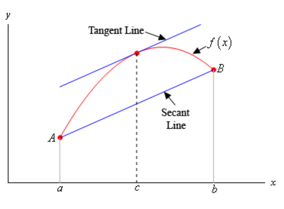

# Section 4.7 : The Mean Value Theorem

In this section we want to take a look at the Mean Value Theorem. In most
traditional textbooks this section comes before the sections containing the
First and Second Derivative Tests because many of the proofs in those sections
need the Mean Value Theorem. However, we feel that from a logical point of view
it’s better to put the Shape of a Graph sections right after the absolute
extrema section. So, if you've been following the proofs from the previous two
sections you’ve probably already read through this section.

Before we get to the Mean Value Theorem we need to cover the following theorem.

**Rolle's Theorem**

> Supose $f(x)$ is a function that satisfies all of the following.
>
> 1. $f(x)$ is continuous on the closed interval $[a, b]$.
> 2. $f(x)$ is differentiable on the open interval $(a, b)$.
> 3. $f(a) = f(b)$
>
> Then there is a number $c$ such that $a < c < b$ and $f'(c) = 0$. Or, in other
> words $f(x)$ has a critical point in $(a, b)$.

To see the proof of Rolle's Theorem see the
[**Proofs From Derivative Applications**](https://tutorial.math.lamar.edu/Classes/CalcI/DerivativeAppsProofs.aspx#Extras_DerAppPf_Rolles)
section of the Extras chapter.

Let's take a look at a quick example that uses Rolle's Theorem.

---

**Example 1** Show that $f(x) = 4x^5 + x^3 + 7x - 2$ has exactly one root.

**Solution**

From basic Algebra principles we know that since $f(x)$ is a 5th
degree polynomial it will have five roots. What we're being asked to prove here
is that only one of those 5 is a real number and the other 4 must be complex
roots.

First, we should show that it does have at least one real root. To do this note
that $f(0) = -2$ and that $f(1) = 10$ and so we can see that $f(0) < 0 < f(1)$.
Now, because $f(x)$ is a polynomial we know that it is continuous everywhere so
by the
[**Intermediate Value Theorem**](https://tutorial.math.lamar.edu/Classes/CalcI/Continuity.aspx#IVT)
there is a number $c$ such that $0 < c < 1$ and $f(c) = 0$. In other words
$f(x)$ has at least one real root.

We now need to show that this is in fact the only real root. To do this we'll
use an argument that is called contradiction proof. What we’ll do is assume that
$f(x)$ has at least two real roots. This means that we can find real numbers $a$
and $b$ (there might be more, but all we need for this particular argument is
two) such that $f(a) = f(b) = 0$. But if we do this then we know from Rolle's
Theorem that there must then be another number $c$ such that $f'(c) = 0$.

This is a problem however. The derivative of this function is,

$$ f'(x) = 20x^4 + 3x^2 +  $$

Because the exponents on the first two terms are even we know that the first two
terms will always be greater than or equal to zero and we are then going to add
a positive number onto that and so we can see that the smallest the derivative
will ever be is 7 and this contradicts the statement above that says we MUST
have a number $c$ such that $f'(c) = 0$.

We reached these contradictory statements by assuming that $f(x)$ has at least
two roots. Since this assumption leads to a contradiction the assumption must be
false and so we can only have a single real root.

---

The reason for covering Rolle's Theorem is that it is needed in the proof of the
Mean Value Theorem. To see the proof see the
[**Proofs From Derivative Applications**](https://tutorial.math.lamar.edu/Classes/CalcI/DerivativeAppsProofs.aspx#Extras_DerAppPf_MVT)
section of the Extras chapter. Here is the theorem.

**Mean Value Theorem**

> Suppose $f(x)$ is a function that satisfies both of the following.
>
> 1. $f(x)$ is continuous on the closed interval $[a, b]$.
> 2. $f(x)$ is differentiable on the open interval $(a, b)$.
>
> Then there is a number $c$ such that $a < c < b$ and
>
> $$ f'(c) = \frac{f(b) - f(a)}{b - a} $$
>
> Or,
>
> $$ f(b) - f(a) = f'(c)(b - a) $$

Note that the Mean Value Theorem doesn't tell us what $c$ is. It only tells us
that there is at least one number $c$ that will satisfy the conclusion of the
theorem.

Also note that if it weren't for the fact that we needed Rolle's Theorem to
prove this we could think of Rolle's Theorem as a special case of the Mean Value
Theorem. To see that just assume that $f(a) = f(b)$ and then the result of the
Mean Value Theorem gives the result of Rolle's Theorem.

Before we take a look at a couple of examples let's think about a geometric
interpretation of the Mean Value Theorem. First define
$A = \left(a, f(a)\right)$ and $B = \left(b, f(b)\right)$ and then we know from
the Mean Value Theorem that there is a $c$ such that $a < c < b$ and that

$$ f'(c) = \frac{f(b) - f(a)}{b - a} $$

Now, if we draw in the secant line connecting $A$ and $B$ then we can know that
the slope of the secant line is,

$$ \frac{f(b) - f(a)}{b - a} $$

Likewise, if we draw in the tangent line to $f(x)$ at $x = c$ we know that its
slope is $f'(c)$.

What the Mean Value Theorem tells us is that these two slopes must be equal or
in other words the secant line connecting $A$ and $B$ and the tangent line at
$x = c$ must be parallel. We can see this in the following sketch.

Let's now take a look at a couple of examples using the Mean Value Theorem.

---

**Example 2** Determine all the numbers $c$ which satisfy the conclusions of the
Mean Value Theorem for the following function.

$$ f(x) = x^3 + 2x^2 - x \quad \text{ on } \quad [-1, 2] $$

**Solution**

There isn't really a whole lot to this problem other than to notice that since
$f(x)$ is a polynomial it is both continuous and differentiable (_i.e._ the
derivative exists) on the interval given.

First let's find the derivative.

$$ f'(x) = 3x^2 + 4x - 1 $$

Now, to find the numbers that satisfy the conclusions of the Mean Value Theorem
all we need to do is plug this into the formula given by the Mean Value Theorem.

$$ f'(c) = \frac{f(2) - f(-1)}{2 - (-1)} $$

$$ 3c^2 + 4c - 1 = \frac{14 - 2}{3} = \frac{12}{3} = 4 $$

Now, this is just a quadratic equation,

$$ 3c^2 + 4c - 1 = 4 $$

$$ 3c^2 + 4c - 5 = 0 $$

Using the quadratic formula on this we get,

$$ c = \frac{-4 \pm \sqrt{16 - 4(3)(-5)}}{6} = \frac{-4 \pm \sqrt{76}}{6} $$

Notice that only one of these is actually in the interval given in the problem.
That means that we will exclude the second one (since it isn't in the interval).
The number that we're after in this problem is

$$ c = 0.7863 $$

Be careful to not assume that only one of the numbers will work. It is possible
for both of them to work.

---

**Example 3** Suppose that we know that $f(x)$ is continuous and differentiable
on $[6, 15]$. Let's also suppose that we know that $f(6) = -2$ and that we know
that $f'(x) \leq 10$. What is the largest possible value for $f(15)$?

**Solution**

Let's start with the conclusion of the Mean Value Theorem.

$$ f(15) - f(6) = f'(c)(15 - 6) $$

Plugging in for the known quantitites and rewriting this a little gives,

$$ f(15) = f(6) + f'(c)(15 - 6) = -2 + 9f'(c) $$

Now we know that $f'(x) \leq 10$ so in particular we know that $f'(c) \leq 10$.
This gives us the following,

$$ f(15) = -2 + 9f'(c) $$

$$ \quad \leq -2 + (9)10 $$

$$ \quad = 88 $$

All we did was replace $f'(c)$ with its largest possible value.

This means that the largest possible value for $f(15)$ is 88.

---

**Example 4** Suppose that we know that $f(x)$ is continuous and differentiable
everywhere. Let's also suppose that we know that $f(x)$ has two roots. Show that
$f'(x)$ must have at least one root.

**Solution**

It is important to note here that all we can say is that $f'(x)$ will have at
least one root. We can't say that it will have exactly one root. So don't
confuse this problem with the first one we worked.

This is actually a fairly simple thing to prove. Since we know that $f(x)$ has
two roots let's suppose that they are $a$ and $b$. Now, by assumption we know
that $f(x)$ is continuous and differentiable everywhere and so in particular it
is continous on $[a, b]$ and differentiable on $(a, b)$.

Therefore, by the Mean Value Theorem there is a number $c$ that is between $a$
and $b$ (this isn't needed for this problem, but it's true so it should be
pointed out) and that,

$$ f'(c) = \frac{f(b) - f(a)}{b - a} $$

But we now need to recall that $a$ and $b$ are roots of $f(x)$ and so this is,

$$ f'(c) = \frac{0 - 0}{b - a} = 0 $$

Or, $f'(x)$ has a root at $x = c$.

Again, it is important to note that we don't have a value of $c$. We have only
shown that it exists. We also haven't said anything about $c$ being the only
root. It is completely possible for $f'(x)$ to have more than one root.

---

It is completely possible to generalize the previous example significantly. For
isntance if we know that $f(x)$ is continuous and differentiable everywhere and
has three roots we can then show that not only will $f'(x)$ have at least two
roots but that $f''(x)$ will have at least one root. We'll leave it to you to
verify this, but the ideas involved are identical to those in the previous
example.

We'll close this section out witha couple of nice facts that can be proved using
the Mean Value Theorem. Note that in both of these facts we are assuming the
functions are continuous and differentiable on the interval $[a, b]$.

**Fact 1**

> If $f'(x) = 0$ for all $x$ in an interval $(a, b)$ then $f(x)$ is constant on
> $(a, b)$.

This fact is very easy to prove so let's do that here.

First, notice that because we are assuming the derivative exists on $(a, b)$ we
know that $f(x)$ is differentiable on $(a, b)$. In addition we
[**know**](https://tutorial.math.lamar.edu/Classes/CalcI/DefnOfDerivative.aspx#Deriv_Defn_DifCont)
that if a function is differentiable on an interval then it is also continuous
on that interval and so $f(x)$ will also be continuous on $(a, b)$.

Now, take any two $x$'s in the interval $(a, b)$, say $x_1$ and $x_2$. Then
since $f(x)$ is continuous and differentiable on $(a, b)$ it must also be
continuous and differentiable on $[x_1, x_2]$. This means that we can apply the
Mean Value Theorem for these two values of $x$. Doing this gives,

$$ f(x_2) - f(x_1) = f'(c)(x_2 - x_1) $$

where $x_1 < c < x_2$. But by assumption $f'(x) = 0$ for all $x$ in an interval
$(a, b)$ and so in particular we must have,

$$ f'(c) = 0 $$

Putting this into the equation above gives,

$$ f(x_2) - f(x_1) = 0 \quad \Rightarrow \quad f(x_2) = f(x_1) $$

Now, since $x_1$ and $x_2$ were any two values of $x$ in the interval $(a, b)$
we can see that we must have $f(x_2)$ = f(x_1)$ for all $x_1$ and $x_2$ in the
interval and this is exactly what it means for a function to be constant on the
interval and so we've proven the fact.

**Fact 2**

> If $f'(x) = g'(x)$ for all $x$ in an interval $(a, b)$ then in this interval
> we have $f(x) = g(x) + c$ where $c$ is some constant.

This fact is a direct result of the previous fact and is also easy to prove.

If we first define,

$$ h(x) = f(x) - g(x) $$

Then since both $f(x)$ and $g(x)$ are continuous and differentiable in the
interval $(a, b)$ then so must be $h(x)$. Therefore, the derivative of $h(x)$
is,

$$ h'(x) = f'(x) - g'(x) $$

However, by assumption $f'(x) = g'(x)$ for all $x$ in an interval $(a, b)$ and
so we must have that $h'(x) = 0$ for all $x$ in an interval $(a, b)$. So, by
Fact 1 $h(x)$ must be constant on the interval.

This means that we have,

$$ h(x) = c $$

$$ f(x) - g(x) = c $$

$$ f(x) = g(x) + c $$

which is what we were trying to show.

---

## Practice Problems

For problems 1 & 2 determine all the number(s) c which satisfy the conclusion of
Rolle's Theorem for the given function and interval.

**1.** $f(x) = x^2 - 2x - 8 \text{ on } [-1, 3]$

**Solution**

First let's verify that Rolle's Theorem can be used here.

The function is a polynomial and is continuous and differentiable everywhere,
and so will indeed be continuous on $[-1, 3]$ and differentiable on $(-1, 3)$.

$$ f(-1) = (-1)^2 - 2(-1) - 8 $$

$$ f(-1) = -5 $$

$$ f(3) = (3)^2 - 2(3) - 8 $$

$$ f(3) = -5 $$

Because $f(-1) = f(3)$, the conditions for Rolle's Theorem are met.

Now, we are trying to prove that there is at least one number, $c$ for which:

$$ f'(c) = 0 $$

And that, for the interval $[a, b]$, more specifically $[-1, 3]$:

$$ a < c < b $$

$$ -1 < c < 3 $$

If we now solve for the first derivative, we find:

$$ f'(c) = 2c - 2 $$

By setting this to $0$, we can find all numbers for which $f'(c) = 0$, we know
by Rolle's Theorem's conditions having been met, that there must be at least
one.

$$ 2c - 2 = 0 $$

$$ 2c = 2 $$

$$ \boxed{c = 1} $$

**2.** $g(t) = 2t - t^2 - t^3 \text{ on } [-2, 1]$

**Solution**

Again, check if we can even use Rolle's theorem.

Because $g(t)$ is a polynomial, we know it is continuous and differentiable
everywhere, and so therefore is continuous on $[-2, 1]$ and differentiable on
$(-2, 1)$.

Now, let's see if the values at the extremes of our interval are equivalent when
evaluated in the function:

$$ g(-2) = 2(-2) - (-2)^2 - (-2)^3 $$

$$ g(-2) = 0 $$

$$ g(1) = 2(1) - (1)^2 - (1)^3 $$

$$ g(1) = 0 $$

Yes, and so this function fulfills Rolle's Theorem, and therefore there must be
at least one number, $c$, for which $f'(c) = 0$. Let's first find the first
derivative:

$$ g(t) = 2t - t^2 - t^3 $$

$$ g'(c) = 2 - 2c - 3c^2 $$

Setting this to $0$ will find the roots of the derivative, and find all numbers
possible for $c$:

$$ 2 - 2c - 3c^2 = 0 $$

$$ 3c^2 + 2c - 2 = 0 $$

$$ c = \frac{-(2) \pm \sqrt{(2)^2 - 4(3)(-2)}}{2(3)} $$

$$ c = \frac{-2 \pm 2\sqrt{7}}{6} $$

$$ c = \frac{-1 \pm \sqrt{7}}{3} $$

$$ c \approx -1.2153 \text{, } c \approx  0.5486 $$

Both of these fall within the given interval $[-2, 1]$, so both are valid values
for $c$:

$$ \boxed{c = \frac{-1 - \sqrt{7}}{3} \text{, } c = \frac{-1 + \sqrt{7}}{3}} $$

For problems 3 & 4 determine all the number(s) c which satisfy the conclusion of
the Mean Value Theorem for the given function and interval.

**3.** $h(z) = 4z^3 - 8z^2 + 7z - 2 \text{ on } [2, 5]$

**Solution**

Since the given $h(z)$ is a polynomial, we can say that it is continuous and
differentiable everywhere, and is therefore continuous on $[2, 5]$ and
differentiable on $(2, 5)$. This satisfies the conditions necessary to even use
the Mean Value Theorem.

We therefore need to find at least one number $c$ such that $2 < c < 5$ and:

$$ h'(c) = \frac{h(5) - h(2)}{5 - 2} $$

Or,

$$ h(5) - h(2) = h'(c)(5 - 2) $$

We'll first need $h'(c)$, $h(5)$, and $h(2)$:

$$ h(z) = 4z^3 - 8z^2 + 7z - 2 $$

$$ h'(c) = 12c^2 - 16c + 7 $$

$$ h(5) = 4(5)^3 - 8(5)^2 + 7(5) - 2 $$

$$ h(5) = 333 $$

$$ h(2) = 4(2)^3 - 8(2)^2 + 7(2) - 2 $$

$$ h(2) = 12 $$

Now let's plug in for the Mean Value Theorem:

$$ h'(c) = \frac{h(5) - h(2)}{5 - 2} $$

$$ 12c^2 - 16c + 7 = \frac{333 - 12}{5 - 2} $$

And solve for $c$:

$$ 12c^2 - 16c + 7 = \frac{321}{3} $$

$$ 12c^2 - 16c + 7 = 107 $$

$$ 12c^2 - 16c - 100 = 0 $$

$$ c = \frac{-(-16) \pm \sqrt{(-16)^2 - 4(12)(-100)}}{2(12)} $$

$$ c = \frac{16 \pm 8\sqrt{79}}{24} $$

$$ c = \frac{2 \pm \sqrt{79}}{3} $$

$$ c \approx -2.2961 \text{, } c \approx 3.6294 $$

Only the second answer falls within the given range, so therefore we only have
one value for $c$:

$$ \boxed{c = \frac{2 + \sqrt{79}}{3}} $$

**4.** $A(t) = 8t + \mathbf{e}^{-3t} \text{ on } [-2, 3]$

**Solution**

The function $A(t)$ is a polynomial and an exponential function, both of which
are continuous and differentiable everywhere. Therefore we know that $A(t)$ is
continuous on $[-2, 3]$ and differentiable on $(-2, 3)$.

Thusly we have met the conditions necessary to use the Mean Value Theorem. And
we know that there exists some number $c$ for which $-2 < c < 3$ and:

$$ A'(c) = \frac{A(3) - A(-2)}{3 - (-2)} $$

Or:

$$ A(3) - A(-2) = A'(c)(3 - (-2)) $$

Let's first find $A'(c)$, $A(3)$, and $A(-2)$.

$$ A(t) = 8t + \mathbf{e}^{-3t} $$

$$ A'(c) = 8 - 3\mathbf{e}^{-3c} $$

$$ A(3) = 8(3) + \mathbf{e}^{-3(3)} $$

$$ A(3) = \frac{1}{\mathbf{e}^9} + 24 \approx 24.0001 $$

$$ A(-2) = 8(-2) + \mathbf{e}^{-3(-2)} $$

$$ A(-2) = \mathbf{e}^6 - 16 \approx 387.4288 $$

Now we plug into the Mean Value Theorem Formula and solve for $c$

$$ A'(c) = \frac{A(3) - A(-2)}{3 - (-2)} $$

$$ 8 - 3\mathbf{e}^{-3c} = \frac{24.0001 - 387.4288}{3 - (-2)} $$

$$ 8 - 3\mathbf{e}^{-3c} = \frac{-363.4287}{5} $$

$$ 8 - 3\mathbf{e}^{-3c} = -72.6857 $$

$$ -3\mathbf{e}^{-3c} = -80.6857 $$

$$ \mathbf{e}^{-3c} = 26.8952 $$

$$ \ln\left(\mathbf{e}^{-3c}\right) = \ln(26.8952) $$

$$ -3c = 3.2919 $$

$$ \boxed{c = -1.0973} $$

**5.** Suppose we know that $f(x)$ is continuous and differentiable on the
interval $[-7, 0]$, that $f(-7) = -3$ and that $f'(x) \leq 2$. What is the
largest possible value for $f(0)$?

**Solution**

Since we know that $f(x)$ is continuous and differentiable on the interval
$[-7, 0]$, we know that the Mean Value Theorem can be applied. Let's write out
the conclusion of the Mean Value Theorem:

$$ f'(c) = \frac{f(b) - f(a)}{b - a} $$

Now plug in what we know:

$$ f'(c) = \frac{f(0) - f(-7)}{0 - (-7)} $$

$$ f'(c) = \frac{f(0) - (-3)}{7} $$

Let's now solve for $f(0)$ in this context:

$$ 7f'(c) = f(0) - (-3) $$

$$ 7f'(c) = f(0) + 3 $$

$$ f(0) = 7f'(c) - 3 $$

We are trying to figure out the largest possible value we can have for $f(0)$,
therefore we need to know the largest possible value for $f'(c)$ to find this
value. The problem statement gives us this value when it reads:

$$ f'(x) \leq 2 $$

Therefore $2$ is the greatest possible value for $f'(c)$.

$$ f(0) = 7f'(c) - 3 \leq 7(2) - 3 = 11 $$

Therefore $11$ is the largest possible value for $f(0)$:

$$ \boxed{f(0) \leq 11} $$

**6.** Show that $f(x) = x^3 - 7x^2 + 25x + 8$ has exactly one real root.

**Solution**

We know that since $f(x)$ is a 3rd polynomial, it will have 3 roots,
but we don't know if any of them will be a real root or not. The odd degree of
the polynomial does tell us, however, that negative inputs will yield negative
outputs after a certain threshold.

We also know that we can use Rolle's Theorem here as it is continuous and
differentiable everywhere. Because of this we know that for any interval
$[a, b]$ there exists some number $c$ such that:

$$ a < c < b $$

And:

$$ f'(c) = 0 $$

We know that:

$$ f(0) = 8 $$

So that is exactly one real root. If we evaluate and solve for $c$, we can find
other roots that can exist within any interval.

$$ f'(c) = 3c^2 - 14c + 25 $$

$$ 3c^2 - 14c + 25 = 0 $$

$$ c = \frac{-(-14) \pm \sqrt{(-14)^2 - 4(3)(25)}}{2(3)} $$

$$ c = \frac{14 \pm 2i\sqrt{26}}{6} $$

But these are complex roots, and are the only other roots that exist other than
$0$. Thusly we can say that there is **exactly one root** at $f(0)$.

---

## Assignment Problems

For problems 1 – 4 determine all the number(s) c which satisfy the conclusion of
Rolle's Theorem for the given function and interval.

**1.** $f(x) = x^3 - 4x^2 + 3 \text{ on } [0, 4]$

**Solution**

Firstly, we should establish if we can use Rolle's Theorem. Since $f(x)$ is a
polynomial, we know that it is continuous and differentiable everywhere.
Therefore it is continuous on $[0, 4]$ and differentiable on $(0, 4)$ and
satisfies the first two conditions of Rolle's Theorem. Next let's evaluate
$f(0)$ and $f(4)$ to see if it satisfies the third condition:

$$ f(0) = (0)^3 - 4(0)^2 + 3 $$

$$ f(0) = 3 $$

$$ f(4) = 3 $$

$$ f(0) = f(4) $$

And this satisfies Rolle's Theorem's 3rd condition. Thusly we know
that there exists some number $c$ such that:

$$ 0 < c < 4 $$

And that:

$$ f'(c) = 0 $$

Thusly let's first find the first derivative for $f(c)$ and solve for some
number $c$ where $f'(c) = 0$:

$$ f(c) = c^3 - 4c^2 + 3 $$

$$ 3c^2 - 8c = 0 $$

$$ c(3c - 8) = 0 $$

$$ c = 0 $$

$$ 3c - 8 = 0 $$

$$ 3c = 8 $$

$$ c = \frac{8}{3} $$

Note that while $c = 0$ falls within the given interval, Rolle's Theorem states
that there exists some $c$ for which:

$$ a < c < b $$

Which is not inclusive, therefore we must omit this value from our answer set.
We have found one value for $c$:

$$ \boxed{c = \frac{8}{3}} $$

**2.** $Q(z) = 15 + 2z - z^2 \text{ on } [-2, 4]$

**Solution**

Again, we have a polynomial and for the reasons given in problem 1, we know that
we have satisfied the first two conditions of Rolle's Theorem, let's see about
the third:

$$ Q(-2) = 15 + 2(-2) - (-2)^2 $$

$$ Q(-2) = 7 $$

$$ Q(4) = 15 + 2(4) - (4)^2 $$

$$ Q(4) = 7 $$

And so the third condition is also met. Therefore, by Rolle's Theorem, there
exists some $c$ such that:

$$ -2 < c < 4 $$

And:

$$ Q'(c) = 0 $$

Let's evaluate for $Q'(c)$ and find any roots for which $c$ exists within the
given interval:

$$ Q(c) = 15 + 2c - c^2 $$

$$ Q'(c) = 2 - 2c $$

$$ 2 - 2c = 0 $$

$$ -2c = -2 $$

$$ c = 1 $$

This lies within our given interval of $(-2, 4)$, so therefore we have found one
value for $c$ which satisfies the conclusion of Rolle's Theorem:

$$ \boxed{c = 1} $$

**3.** $h(t) = 1 - \mathbf{e}^{t^2 - 9} \text{ on } [-3, 3]$

**Solution**

$h(t)$ is a polynomial with an exponential, which is continuous and
differentiable everywhere. Thusly the first two conditions of Rolle's Theorem
have been met for the given interval. Let's make sure the third condition is met
as well:

$$ h(-3) = 1 - \mathbf{e}^{(-3)^2 - 9} $$

$$ h(-3) = 0 $$

$$ h(3) = 1 - \mathbf{e}^{(3)^2 - 9} $$

$$ h(3) = 0 $$

And yes, the third condition for Rolle's Theorem is met. Therefore we know that
there exists some number, $c$ for which:

$$ -3 < c < 3 $$

And:

$$ h'(c) = 0 $$

Let's find $h'(c)$, and then evaluate for all $c$ where $h'(c) = 0$:

$$ h(c) = 1 - \mathbf{e}^{c^2 - 9} $$

$$ h'(c) = -\mathbf{e}^{c^2 - 9}\left(c^2 - 9\right)' $$

$$ h'(c) = -2c\mathbf{e}^{c^2 - 9} $$

$$ -2c\mathbf{e}^{c^2 - 9} = 0 $$

$$ c = 0 $$

Because an exponential can never return $0$, we cannot evaluate
$\mathbf{e}^{c^2 - 9}$ as one of the possible values for $c$. The other value
for $c$ falls within the given interval $(-3, 3)$, so therefore we have found
one value for $c$:

$$ \boxed{c = 0} $$

**4.** $g(w) = 1 + \cos\left[\pi w\right] \text{ on } [5, 9]$

**Solution**

The inclusion of a trigonometric function here is a potential hiccup, but if we
think about it, we know that both sine and cosine (but not tangent) is
continuous and differentiable everywhere, and so we know $g(w)$, being a
polynomial with the trigonometric function cosine, fulfills the first two
conditions of Rolle's Theorem. Let's check for the thrid condition:

$$ g(5) = 1 + \cos\left[\pi (5)\right] $$

$$ g(5) = 0 $$

$$ g(9) = 1 + \cos\left[\pi (9)\right] $$

$$ g(9) = 0 $$

Thusly the third condition is also met. Therefore, by Rolle's Theorem, we can
conclude that there exists some number, $c$, for which:

$$ 5 < c < 9 $$

And:

$$ g'(c) = 0 $$

Let's find $g'(c)$ and then find all values for $c$ for which $g'(c) = 0$:

$$ g(c) = 1 + \cos\left[\pi c\right] $$

$$ g'(c) = -\pi\sin\left[\pi c\right] $$

$$ -\pi\sin\left[\pi c\right] = 0 $$

$$ \sin\left[\pi c\right] = 0 $$

$$ \sin^{-1}(0) = \pi c $$

$$ \pi c = 0 + 2\pi n \text{, } \quad n = 0, \pm 1, \pm 2, \dots $$

$$ \pi c = \pi + 2\pi n \text{, } \quad n = 0, \pm 1, \pm 2, \dots $$

$$ c = 2n \text{, } \quad n = 0, \pm 1, \pm 2, \dots $$

$$ c = 1 + 2n \text{, } \quad n = 0, \pm 1, \pm 2, \dots $$

$n = 0$:

$$ c = \cancel{0} $$

$$ c = \cancel{1} $$

$n = 1$:

$$ c = \cancel{2} $$

$$ c = \cancel{3} $$

$n = 2$:

$$ c = \cancel{4} $$

$$ c = \cancel{5} $$

$n = 3$:

$$ c = 6 $$

$$ c = 7 $$

$n = 4$:

$$ c = 8 $$

$$ c = \cancel{9} $$

We have therefore found 3 values for $c$ that satisfy the conclusion of Rolle's
Theorem:

$$ \boxed{c = 6 \text{, } c = 7 \text{, } c = 8} $$

For problems 5 – 8 determine all the number(s) c which satisfy the conclusion of
the Mean Value Theorem for the given function and interval.

**5.** $f(x) = x^3 - x^2 + x + 8 \text{ on } [-3, 4]$

**Solution**

We once again are given a polynomial, which we know is continuous and
differentiable everywhere, and therefore satisfies the two conditions for the
Mean Value Theorem. This means that there exists some number $c$ for which:

$$ -3 < c < 4 $$

And also:

$$ f'(c) = \frac{f(4) - f(-3)}{4 - (-3)} $$

Or:

$$ f(4) - f(-3) = f'(c)(4 - (-3)) $$

By first finding the first deriviative, $f'(c)$, we can then set this equal to
the Mean Value Theorem formula and find all values for $c$ that satisfy it's
conclusion:

$$ f(c) = c^3 - c^2 + c + 8 $$

$$ f'(c) = 3c^2 - 2c + 1 $$

Now just find $f(-3)$ and $f(4)$ so we can plug in those values to the Mean
Value Theorem formula as well:

$$ f(-3) = (-3)^3 - (-3)^2 + (-3) + 8 $$

$$ f(-3) = -31 $$

$$ f(4) = (4)^3 - (4)^2 + (4) + 8 $$

$$ f(4) = 60 $$

Now plug everything in:

$$ f'(c) = \frac{f(4) - f(-3)}{4 - (-3)} $$

$$ 3c^2 - 2c + 1 = \frac{60 - (-31)}{4 - (-3)} $$

$$ 3c^2 - 2c + 1 = \frac{91}{7} $$

$$ 3c^2 - 2c + 1 = 13 $$

$$ 3c^2 - 2c - 12 = 0 $$

$$ c = \frac{-(-2) \pm \sqrt{(-2)^2 - 4(3)(-12)}}{2(3)} $$

$$ c = \frac{2 \pm 2\sqrt{37}}{6} $$

$$ c = \frac{1 \pm \sqrt{37}}{3} $$

$$ c \approx -1.6943 \text{, } c \approx 2.3609 $$

Both of these fall within the given interval, so we have found two values for
$c$ that satisfy the conclusion of the Mean Value Theorem.

$$ \boxed{c = \frac{1 - \sqrt{37}}{3} \text{, } c = \frac{1 + \sqrt{37}}{3}} $$

**6.** $g(t) = 2t^3 + t^2 + 7t - 1 \text{ on } [1, 6]$

**Solution**

Once again, we are presented with a polynomial, which is continuous and
differentiable everywhere, and so therefore satisfies the two conditions
necessary in order to utilize the Mean Value Theorem. This means that there
exists some number $c$ for which:

$$ 1 < c < 6 $$

And also:

$$ g'(c) = \frac{g(6) - g(1)}{6 - 1} $$

Or:

$$ g(6) - g(1) = g'(c)(6 - 1) $$

Let's find $g'(c)$, $g(6)$, and $g(1)$ in order to plug those values into the
Mean Value Theorem Formula and solve for all possible $c$:

$$ g(c) = 2c^3 + c^2 + 7c - 1 $$

$$ g'(c) = 6c^2 + 2c + 7 $$

$$ g(1) = 2(1)^3 + (1)^2 + 7(1) - 1 $$

$$ g(1) = 9 $$

$$ g(6) = 2(6)^3 + (6)^2 + 7(6) - 1 $$

$$ g(6) = 509 $$

Okay, let's plug in and solve for all $c$:

$$ g'(c) = \frac{g(6) - g(1)}{6 - 1} $$

$$ 6c^2 + 2c + 7 = \frac{509 - 9}{6 - 1} $$

$$ 6c^2 + 2c + 7 = \frac{500}{5} $$

$$ 6c^2 + 2c + 7 = 100 $$

$$ 6c^2 + 2c - 93 = 0 $$

$$ c = \frac{-(2) \pm \sqrt{(2)^2 - 4(6)(-93)}}{2(6)} $$

$$ c = \frac{-2 \pm 2\sqrt{559}}{12} $$

$$ c = \frac{-1 \pm \sqrt{559}}{6} $$

$$ c \approx -4.1072 \text{, } c \approx 3.7739 $$

And only one of these falls within the given interval, so therefore we have
found one value for $c$ that satisfies the conclusion of the Mean Value Theorem:

$$ \boxed{c = \frac{-1 + \sqrt{559}}{6}} $$

**7.** $P(t) = \mathbf{e}^{2t} - 6t - 3 \text{ on } [-1, 0]$

**Solution**

We are presented with a polynomial with an exponential in it, which is
continuous and differentiable everywhere. This means the two conditions for the
Mean Value Theorem are met and we can utilize it. This means that there exists
some number $c$ for which:

$$ -1 < c < 0 $$

And also:

$$ P'(c) = \frac{P(0) - P(-1)}{0 - (-1)} $$

Or:

$$ P(0) - P(-1) = P'(c)(0 - (-1)) $$

Let's evaluate for $P'(c)$, $P(-1)$, and $P(0)$ so we can plug in for the Mean
Value Theorem Formula and find all possible values for $c$.

$$ P(c) = \mathbf{e}^{2c} - 6c - 3 $$

$$ P'(c) = 2\mathbf{e}^{2c} - 6 $$

$$ P(-1) = \mathbf{e}^{2(-1)} - 6(-1) - 3 $$

$$ P(-1) = \frac{1}{\mathbf{e}^2} + 3 \approx 3.1353 $$

$$ P(0) = \mathbf{e}^{2(0)} - 6(0) - 3 $$

$$ P(0) = -2 $$

Okay, plug in and find all $c$:

$$ P'(c) = \frac{P(0) - P(-1)}{0 - (-1)} $$

$$ 2\mathbf{e}^{2c} - 6 = \frac{-2 - 3.1353}{0 - (-1)} $$

$$ 2\mathbf{e}^{2c} - 6 = \frac{-5.1353}{1} $$

$$ 2\mathbf{e}^{2c} - 6 = -5.1353 $$

$$ 2\mathbf{e}^{2c} = 0.8647 $$

$$ \mathbf{e}^{2c} = 0.4324 $$

$$ \ln\left(\mathbf{e}^{2c}\right) = \ln(0.4324) $$

$$ 2c = -0.8384 $$

$$ c = -0.4192 $$

And that does fall within our given range, so we have found one value for $c$
that satisfies the conclusion of the Mean Value Theorem:

$$ \boxed{c \approx -0.4192} $$

**8.** $h(x) = 9x - 8\sin\left(\dfrac{x}{2}\right) \text{ on } [-3, -1]$

**Solution**

We have a polynomial with a trigonometric function. It is Sine, which is
continuous and differentiable everywhere, so no worries. It fulfills the two
conditions necessary to use the Mean Value Theorem. This means there exists some
number $c$ for which:

$$ -3 < c < -1 $$

And:

$$ h'(c) = \frac{h(-1) - h(-3)}{-1 - (-3)} $$

Or:

$$ h(-1) - h(-3) = h'(c)(-1 - (-3)) $$

Let's evaluate for $h'(c)$, $h(-1)$, and $h(-3)$ so we can plug them into the
Mean Value Theorem Formula:

$$ h(c) = 9c - 8\sin\left(\dfrac{c}{2}\right) $$

$$ h'(c) = 9 - 4\cos\left(\frac{c}{2}\right) $$

$$ h(-1) = 9(-1) - 8\sin\left(\dfrac{(-1)}{2}\right) $$

$$ h(-1) \approx -5.1646 $$

$$ h(-3) = 9(-3) - 8\sin\left(\dfrac{(-3)}{2}\right) $$

$$ h(-3) \approx -19.0200 $$

Plug in and solve for all $c$:

$$ h'(c) = \frac{h(-1) - h(-3)}{-1 - (-3)} $$

$$ 9 - 4\cos\left(\frac{c}{2}\right) = \frac{-5.1646 - (-19.0200)}{-1 - (-3)} $$

$$ 9 - 4\cos\left(\frac{c}{2}\right) = \frac{13.8554}{2} $$

$$ 9 - 4\cos\left(\frac{c}{2}\right) = 6.9277 $$

$$ -4\cos\left(\frac{c}{2}\right) = -2.0723 $$

$$ \cos\left(\frac{c}{2}\right) = 0.5181 $$

$$ \frac{c}{2} = \cos^{-1}(0.5181) $$

$$ \frac{c}{2} = 2\pi - \cos^{-1}(0.5181) $$

$$ \frac{c}{2} = 1.0262 + 2\pi n \text{, } \quad n = 0, \pm 1, \pm 2, \dots $$

$$ \frac{c}{2} = 5.2570 + 2\pi n \text{, } \quad n = 0, \pm 1, \pm 2, \dots $$

$$ c = 2.0523 + 4\pi n \text{, } \quad n = 0, \pm 1, \pm 2, \dots $$

$$ c = 10.5140 + 4\pi n \text{, } \quad n = 0, \pm 1, \pm 2, \dots $$

$n = -1$:

$$ c = \cancel{-10.5141} $$

$$ c = -2.0524 $$

$n = 0$:

$$ c = \cancel{2.0523} $$

$$ c = \cancel{10.5140} $$

So we have found one value for $c$ that satisfies the conclusion of the Mean
Value Theorem:

$$ \boxed{c \approx -2.0524} $$

**9.** Suppose we know that $f(x)$ is continuous and differentiable on the
interval $[-2, 5]$, that $f(5) = 14$ and that $f'(x) \leq 10$. What is the
smallest possible value for $f(-2)$?

**Solution**

Let's start with the conclusion of the Mean Value Theorem:

$$ f(5) - f(-2) = f'(c)(5 - (-2)) $$

Plugging in for the known quantities and rewriting gives us:

$$ 14 - f(-2) = f'(c)(5 - (-2)) $$

$$ 14 - f(-2) = 7f'(c) $$

$$ -f(-2) = 7f'(c) - 14 $$

$$ f(-2) = 14 - 7f'(c) $$

Since we know that $f'(x) \leq 10$, this means that:

$$ f(-2) \geq 14 - 7(10) $$

$$ f(-2) \geq -56 $$

And this is our smallest possible value for $f(-2)$:

$$ \boxed{f(-2) \geq -56} $$

**10.** Suppose we know that $f(x)$ is continuous and differentiable on the
interval $[-6, -1]$, that $f(-6) = -23$ and that $f'(x) \geq -4$. What is the
smallest possible value for $f(-1)$?

**Solution**

Again, let's start with the conclusion of the Mean Value Theorem:

$$ f(-1) - f(-6) = f'(c)(-1 - (-6)) $$

Let's plug in our known values:

$$ f(-1) - (-23) = f'(c)(-1 - (-6)) $$

$$ f(-1) + 23 = 5f'(c) $$

$$ f(-1) = 5f'(c) - 23 $$

Since we know that $f'(x) \geq -4$, we know therefore that:

$$ f(-1) \geq 5(-4) - 23 $$

$$ f(-1) \geq -43 $$

And that is the smallest possible value for $f(-1)$:

$$ \boxed{f(-1) \geq -43} $$

**11.** Suppose we know that $f(x)$ is continuous and differentiable on the
interval $[-3, 4]$, that $f(-3) = 7$ and that $f'(x) \leq -17$. What is the
largest possible value for $f(4)$?

**Solution**

Again, we start with the conclusion of the Mean Value Theorem:

$$ f(4) - f(-3) = f'(c)(4 - (-3)) $$

Plugging in:

$$ f(4) - 7 = f'(c)(4 - (-3)) $$

$$ f(4) - 7 = 7f'(c) $$

$$ f(4) = 7f'(c) + 7 $$

And we know that $f'(x) \leq -17$, therefore:

$$ f(4) \leq 7(-17) + 7 $$

$$ f(4) \leq -112 $$

And this is the largest possible value for $f(4)$:

$$ \boxed{f(4) \leq -112} $$

**12.** Suppose we know that $f(x)$ is continuous and differentiable on the
interval $[1, 9]$, that $f(9) = 0$ and that $f'(x) \geq 8$. What is the largest
possible value for $f(1)$?

**Solution**

Conclusion of Mean Value Theorem:

$$ f(9) - f(1) = f'(c)(9 - 1) $$

Plug in:

$$ 0 - f(1) = f'(c)(9 - 1) $$

$$ -f(1) = 8f'(c) $$

$$ f(1) = -8f'(c) $$

We know $f'(x) \geq 8$, so therefore:

$$ f(1) \leq -8(8) $$

$$ \boxed{f(1) \leq -64} $$

**13.** Show that $f(x) = x^7 + 2x^5 + 3x^3 + 14x + 1$ has exactly one real
root.

**Solution**

We know that $f(x)$ is a polynomial, and therefore continuous and differentiable
everywhere.

We know that $f(x)$ can indeed be negative, even just plugging in $-1$ gives us
$-19$. We also know that $f(0) = 1$.

This gives us a range:

$$ -19 = f(-1) < 0 < f(0) = 1 $$

We therefore know by the Intermediate Value Theorem that there must exist at
least one real root within this range. We just don't know if there is **exactly
one** real root, which is what we are asked to show.

However, Rolle's Theorem gives us a hint. Recall that one of the conditions for
Rolle's Theorem to be utilized is:

$$ f(a) = f(b) $$

If both of these are roots, this would mean:

$$ f(a) = f(b) = 0 $$

If we can somehow prove that there are no two points along $f(x)$ that equal
$0$, then we can prove by Rolle's Theorem, that there are no two roots for
$f(x)$.

Recall that the conclusion to Rolle's Theorem is that there exists some $c$
between $a$ and $b$ such that:

$$ a < c < b $$

And:

$$ f'(c) = 0 $$

So, let's find $f'(c)$:

$$ f(c) = c^7 + 2c^5 + 3c^3 + 14c + 1 $$

$$ f'(c) = 7c^6 + 10c^4 + 9c^2 + 14 $$

One would think we could just set this to $0$ and solve for $c$:

$$ 7c^6 + 10c^4 + 9c^2 + 14 = 0 $$

But note that this can never be the case! Think on this:

$$ 7c^6 \geq 0 \text{, } 10c^4 \geq 0 \text{, } 9c^2 \geq 0 \text{, } 14 > 0 $$

Therefore $f'(c) > 0$. This means there exists no real roots we can find from
$f'(c)$ and yet by the Intermediate Value Theorem we know there must be at least
one real root somewhere within $(-19, 1)$. Thusly we know that there is
**exactly one real root**.

**14.** Show that $f(x) = 6x^3 - 2x^2 + 4x - 3$ has exactly one real root.

**Solution**

Again, we have a polynomial. Therefore we know that $f(x)$ is continuous and
differentiable everywhere. Because the degree of the polynomial is odd, it is
likely that $f(x)$ can return a negative output. We quickly find this to be true
for $f(-1)$. We also know that this will also give us a positive output, in fact
we find this for $f(1)$. Therefore:

$$ f(-1) < 0 < f(1) $$

This gives us a range, and by the Intermediate Value Theorem, we know there
exists at least one real root in this interval. We can also determine if there
is more than one root by evaluating $f'(c)$ and setting it to $0$ (if possible):

$$ f(c) = 6c^3 - 2c^2 + 4c - 3 $$

$$ f'(c) = 18c^2 - 4c + 4 $$

This could potentially lead us to other roots if we casually look at it.

$$ 18c^2 \geq 0 \text{,} -\infty < -4c < \infty \text{, } 4 > 0  $$

So let's evaluate it:

$$ 18c^2 - 4c + 4 = 0 $$

$$ c = \frac{-(-4) \pm \sqrt{(-4)^2 - 4(18)(4)}}{2(18)} $$

$$ c = \frac{4 \pm 4i\sqrt{17}}{36} $$

But we get complex numbers, which of course, are not real roots.

By these two evaluations, one by the Intermediate Value Theorem, which shows
that there must be at least one real root within the interval $(f(-1), f(1))$,
and by evaluating the first derivative for other roots and finding that only
complex roots exist for $f(x)$, we have determined that therefore there must be
**exactly one real root**.

**15.** Show that $f(x) = 20x - \mathbf{e}^{-4x}$ has exactly one real root.

**Solution**

We have a polynomial with an exponential, which also is continuous and
differentiable everywhere. $f(x)$ can potentially return negative numbers as
long as $20x < \mathbf{e}^{-4x}$.

$$ f(-1) \approx -74.5982 $$

$$ f(1) \approx 19.9817 $$

So we know that:

$$ f(-1) < 0 < f(1) $$

By the Intermediate Value Theorem, we know there must be at least one real root
within this range then.

If we then evaluate for $f'(c)$, we can find out if there are any other real
roots.

$$ f(c) = 20c - \mathbf{e}^{-4c} $$

$$ f'(c) = 20 + 4\mathbf{e}^{-4c} $$

If we try to set this to $0$ though, we quickly realize that this is impossible:

$$ 0 = 20 + 4\mathbf{e}^{-4c} $$

Thinking on this briefly we can see that:

$$ 20 > 0 \text{, } 4\mathbf{e}^{-4c} > 0 $$

This essentially means that $f(x)$ is strictly increasing (_i.e._ once it passes
$f(x) = 0$, it never returns).

As $20$ is obviously greater than $0$ and any exponential will always return
greater than $0$. Therefore we have no real roots that can be determined by the
first derivative, and because of this and what we have ascertained from the
Intermediate Value Theorem, we know there is **exactly one real root**.
