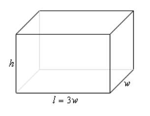
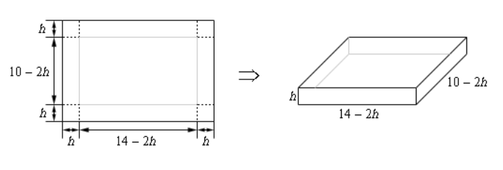

# Section 4.8 : Optimization

In this section we are going to look at optimization problems. In optimization
problems we are looking for the largest value or the smallest value that a
function can take. We saw how to solve one kind of optimization problem in the
[**Absolute Extrema**](https://tutorial.math.lamar.edu/Classes/CalcI/AbsExtrema.aspx)
section where we found the largest and smallest value that a function would take
on an interval.

In this section we are going to look at another type of optimization problem.
Here we will be looking for the largest or smallest value of a function subject
to some kind of constraint. The constraint will be some condition (that can
usually be described by some equation) that must absolutely, positively be true
no matter what our solution is. On occasion, the constraint will not be easily
described by an equation, but in these problems it will be easy to deal with as
we'll see.

This section is generally one of the more difficult for students taking a
Calculus course. One of the main reasons for this is that a subtle change of
wording can completely change the problem. There is also the problem of
identifying the quantity that we'll be optimizing and the quantity that is the
constraint and writing down equations for each.

The first step in all of these problems should be to very carefully read the
problem. Once you've done that the next step is to identify the quantity to be
optimized and the constraint.

In identifying the constraint remember that the constraint is the quantity that
must be true regardless of the solution. In almost every one of the problems
we'll be looking at here one quantity will be clearly indicated as having a
fixed value and so must be the constraint. Once you've got that identified the
quantity to be optimized should be fairly simple to get. It is however easy to
confuse the two if you just skim the problem so make sure you carefully read the
problem first!

Let's start the section off with a simple problem to illustrate the kinds of
issues we will be dealing with here.

---

**Example 1** We need to enclose a rectangular field with a fence. We have 500
feet of fencing material and a building is on one side of the field and so won't
need any fencing. Determine the dimensions of the field that will enclose the
largest area.

**Solution**

In all of these problems we will have two functions. The first is the function
that we are actually trying to optimize and the second will be the constraint.
Sketching the situation will often help us to arrive at these equations so let's
do that.

In this problem we want to maximize the area of a field and we know that will
use 500 ft of fencing material. So, the area will be the function we are trying
to optimize and the amount of fencing is the constraint. The two equations for
these are,

$$ \text{Maximize : } A = xy $$

$$ \text{Constraint : } 500 = x + 2y $$

Okay, we know how to find the largest or smallest value of a function provided
it's only got a single variable. The area function (as well as the constraint)
has two variables in it and so what we know about finding absolute extrema won't
work. However, if we solve the constraint for one of the two variables we can
substitute this into the area and we will then have a function of a single
variable.

So, let's solve the constraint for $x$. Note that we could have just as easily
solved for $y$ but that would have led to fractions and so, in this case,
solving for $x$ will probably be best.

$$ x = 500 - 2y $$

Substituting this into the area function gives a function of $y$.

$$ A(y) = (500 - 2y)y = 500yn - 2y^2 $$

Now we want to find the largest value this will have on the interval $[0, 250]$.
The limits in this interval corresponds to $y = 0$ (_i.e._ no sides to the
fence) and $y = 250$ (_i.e._ only two sides and no width, also if there are two
sides each mus be 250 ft to use the whole 500 ft).

Note that the endpoints of the interval won't make any sense from a physical
standpoint if we actually want to enclose some area because they would both give
zero area. They do, however, give us a set of limits on $y$ and so the
[**Extreme Value Theorem**](https://tutorial.math.lamar.edu/Classes/CalcI/MinMaxValues.aspx#EVT)
tells us that we will have a maximum value of the area somewhere between the two
endpoints. Having these limits will also mean that we can use the process we
discussed in the
[**Finding Absolute Extrema**](https://tutorial.math.lamar.edu/Classes/CalcI/AbsExtrema.aspx)
section earlier in the chapter to find the maximum value of the area.

So, recall that the maximum value of a continuous function (which we've got
here) on a closed interval (which we also have here) will occur at critical
points and/or end points. As we've already pointed out the end points in this
case will give zero area and so don't make any sense. That means our only option
will be the critical points.

So, let's get the derivative and find the critical points.

$$ A'(y) = 500 - 4y $$

Setting this equal to zero and solving ives a lone critical point of $y = 125$.
Plugging this into the area gives an area of $A(125) = 31250 \text{ ft}^2$. So
according to the method from Absolute Extrema section this must be the largest
possible area, since the area at either endpoint is zero.

Finally, let's not forget to get the value of $x$ and then we'll have the
dimensions since this is what the problem statement asked for. We can get the
$x$ by plugging in our $y$ into the constraint.

$$ x = 500 - 2(125) = 250 $$

The dimensions of the field that will give the largest area, subject to the fact
that we used exactly 500 ft of fencing material, are 250 x 125.

Don't forget to actually read the problem and give the answer that was asked
for. These types of problems can take a fair amount of time/effort to solve and
it's not hard to sometimes forget what the problem was actually asking for.

---

In the previous problem we used the method from the Finding Absolute Extrema
section to find the maximum value of the function we wanted to optimize.
However, as we'll see in later examples it will not always be easy to find
endpoints. Also, even if we can find the endpoints we will see that sometimes
dealing with the endpoints may not be easy either. Not only that, but this
method requires that the function we're optimizing be continuous on the interval
we're looking at, including the endpoints, and that may not always be the case.

So, before proceeding with any more examples let's spend a little time
discussing some methods for determining if our solution is in fact the absolute
minimum/maximum value that we're looking for. In some examples all of these will
work while in others one or more won't be all that useful. However, we will
always need to use some method for making sure that our answer is in fact that
optimal value that we're after.

**<ins>Method 1</ins> :** Use the method used in
[**Finding Absolute Extrema**.](https://tutorial.math.lamar.edu/Classes/CalcI/AbsExtrema.aspx)

This is the method used in the first example above. Recall that in order to use
this method the interval of possible values of the independent variable in the
function we are optimizing, let's call it $I$, must have finite endpoints. Also,
the function we're optimizing (once it's down to a single variable) must be
continuous on $I$, including the endpoints. If these conditions are met then we
know that the optimal value, either the maximum or minimum depending on the
problem, will occur at either the endpoints of the range or at a critical point
that is inside the range of possible solutions.

There are two main issues that will often prevent this method from being used
however. First, not every problem will actually have a range of possible
solutions that have finite endpoints at both ends. We'll see at least one
example of this as we work through the remaining examples. Also, many of the
functions we'll be optimizing will not be continuous once we reduce them down to
a single variable and this will prevent us from using this method.

**<ins>Method 2</ins> :** Use a variant of the
[**First Derivative Test**.](https://tutorial.math.lamar.edu/Classes/CalcI/ShapeofGraphPtI.aspx#FDT)

In this method we also will need an interval of possible values of the
independent variable in the function we are optimizing, $I$. However, in this
case, unlike the previous method the endpoints do not need to be finite. Also,
we will need to require that the function be continuous on the interior of the
interval $I$ and we will only need the function to be continuous at the end
points if the endpoint is finite and the function actually exists at the
endpoint. We'll see several problems where the function we're optimizing doesn't
actually exist at one of the endpoints. This will not prevent this method from
being used.

Let's suppose that $x = c$ is a critical point of the function we're trying to
optimize, $f(x)$. We already know from the First Derivative test that if
$f'(x) > 0$ immediately to the left of $x = c$ (_i.e._ the function is
increasing immediately to the left) and if $f'(x) < 0$ immediately to the right
of $x = c$ (_i.e._ the function is decreasing immediately to the right) then
$x = c$ will be a relative maximum for $f(x)$.

Now, this does not mean that the absolute maximum of $f(x)$ will occur at
$x = c$. However, suppose that we knew a little bit more information. Suppose
that in fact we knew that $f'(x) > 0$ for all $x$ in $I$ such that $x < c$.
Likewise, suppose that we knew that $f'(x) < 0$ for all $x$ in $I$ such that
$x < c$. In this case we know that to the left of $x = c$ provided we stay in
$I$ of course, the function is always increasing and to the right of $x = c$,
again staying in $I$, we are always decreasing. In this case we can say that the
absolute maximum of $f(x)$ in $I$ will occur at $x = c$.

Before we give a summary of this method let's discuss the continuity requirement
a little. Nowhere in the above discussion did the continuity requirement
apparently come into play. We require that the function we're optimizing to be
continuous in $I$ to prevent the following situation.

In this case, a relative maximum of the function clearly occurs at $x = c$.
Also, the function is always decreasing to the right and is always increasing to
the left. However, because of the discontinuity at $x = d$, we can clearly see
that $f(d) > f(c)$ and so the absolute maximum of the function does not occur at
$x = c$. Had the discontinuity at $x = d$ not be there this would not have
happened and the absolute maximum would have occured at $x = c$.

Here is a summary of this method.

**First Derivative Test for Absolute Extrema**

> Let $I$ be the interval for all possible values of $x$ in $f(x)$, the function
> we want to optimize, and further suppose that $f(x)$ is continuous on $I$,
> except possibly at the endpoints. Finally suppose that $x = c$ is a critical
> point of $f(x)$ and that $c$ is in the interval $I$. If we restrict $x$ to
> values from $I$ (_i.e._ we only consider possible optimal values of the
> function) then,
>
> 1. If $f'(x) > 0$ for all $x < c$ and if $f'(x) < 0$ for all $x > c$ then
>    $f(c)$ will be the absolute maximum value of $f(x)$ on the interval $I$.
> 2. If $f'(x) < 0$ for all $x < c$ and if $f'(x) > 0$ for all $x > c$ then
>    $f(c)$ will be the absolute minimum value of $f(x)$ on the interval $I$.

**<ins>Method 3</ins> :** Use the second derivative.

There are actually two ways to use the second derivative to help us identify the
optimal value of a function and both use the
[**Second Derivative Test**](https://tutorial.math.lamar.edu/Classes/CalcI/ShapeofGraphPtII.aspx#SDT)
to one extent or another.

The first way to use the second derivative doesn't actually help us to identify
the optimal value. What it does do is allow us to potentially exclude values and
knowing this can simplify our work somewhat and so is not a bad thing to do.

Suppose that we are looking for the absolute maximum of a function and after
finding the critical points we find that we have multiple critical points. Let's
also suppose that we run all of them through the second derivative test and
determine that some of them are in fact relative minimums of the function. Since
we are after the absolute maximum we know that a maximum (of any kind) can't
occur at relative minimums and so we immediately know that we can exclude these
points from further consideration. We could do a similar check if we were
looking for the absolute minimum. Doing this may not seem like all that great of
a thing to do, but it can, on occasion, lead to a nice reduction in the amount
of work that we need to do in later steps.

The second way of using the second derivative to identify the optimal value of a
function is in fact very similar to the second method above. In fact, we will
have the same requirements for this method as we did in that method. We need an
interval of possible values of the independent variable in function we are
optimizing, call it $I$ as before, and the endpoint(s) may or may not be finite.
We'll also need to require that the function, $f(x)$ be continuous everywhere in
$I$ except possibly at the endpoints as above.

Now, suppose that $x = c$ is a critical point and that $f''(c) > 0$. The second
derivative test tells us that $x = c$ must be a relative minimum of the
function. Suppose however that we also knew that $f''(x) > 0$ for all $x$ in
$I$. In this case we would know that the function was concave up in all of $I$
and that would in turn mean that tghe absolute minimum of $f(x)$ in $I$ wsould
inf act have to be at $x = c$.

Likewise, if $x = c$ is a critical point and $f''(x) < 0$ for all $x$ in $I$
then we would know that the funciton was concave down in $I$ and that the
absolute maximum of $f(x)$ in $I$ would have to be at $x = c$.

Here is a summary of this method.

**Second Derivative Test for Absolute Extrema**

> Let $I$ be the interval of all possible values of $x$ in $f(x)$, the function
> we want to optimize, and suppose that $f(x)$ is continuous on $I$, except
> possibly at the endpoints. Finally suppose that $x = c$ is a critical point of
> $f(x)$ and that $c$ is in the interval $I$. Then,
>
> 1. If $f''(x) > 0$ for all $x$ in $I$ then $f(c)$ will be the absolute minimum
>    value of $f(x)$ on the interval $I$.
> 2. If $f''(x) < 0$ for all $x$ in $I$ then $f(c)$ will be the absolute maximum
>    value of $f(x)$ on the interval $I$.

As we work examples over the next two sections we will use each of these methods
as needed in the examples. In some cases, the method we use will be the only
method we could use, in others it will be the easiest method to use and in
others it will simply be the method we chose to use for that example. It is
important to realize that we won't be able to use each of the methods for every
example. With some examples one method will be easiest to use or may be the only
method that can be used, however, each of the methods described above will be
used at least a couple of times through out all of the examples.

It is also important to be aware that some problems don't allow any of the
methods discussed above to be used exactly as outlined above. We may need to
modify one of them or use a combination of them to fully work the problem. There
is an example in the next section where none of the methods above work easily,
although we do also present an alternative solution method in which we can use
at least one of the methods discussed above.

Next, the vast majority of the examples worked over the course of the next
section will only have a single critical point. Problems with more than one
critical point are often difficult to know which critical point(s) give the
optimal value. There are a couple of examples in the next two sections with more
than one critical point including one in the next section mentioned above in
which none of the methods discussed above easily work. In that example you can
see some of the ideas you might need to do in order to find the optimal value.

Finally, in all of the methods above we referenced an interval $I$. This was
done to make the discussion a little easier. However, in all of the examples
over the next two sections we will never explicitly say "this is the interval
$I$". Just remember that the interval $I$is just the largest interval of
possible values of the independent variable in the function we are optimizing.

Okay, let's work some more examples.

---

**Example 2** We want to construct a box whose base length is 3 times the base
width. The material used to build the top and bottom cost $10/ft2 and
the material used to build the sides cost $6/ft2. If the box must
have a volume of 50ft3 determine the dimensions that will minimize
the cost to build the box.

**Solution**

First, a quick figure (probably not to scale...).

We want to minimize the cost of the materials subject to the constraint that the
volume must be 50ft3. Note as well that the cost for each side is
just the area of that side times the appropriate cost.

The two functions we'll be working with here this time are,

$$ \text{Minimize : } C = 10(2lw) + 6(2wh + 2lh) = 60w^2 + 48wh $$

$$ \text{Constraint : } 50 = lwh = 3w^2h $$

As with the first example, we will solve the constraint for one of the variables
and plug this into the cost. It will definitely be easier to solve the
constraint for $h$ so let's do that.

$$ h = \frac{50}{3w^2} $$

Plugging this into the cost gives,

$$ C(w) = 60w^2 + 48w\left(\frac{50}{3w^2}\right) = 60w^2 + \frac{800}{w} $$

Now, let's get the first and second (we’ll be needing this later...)
derivatives,

$$ C'(w) = 120w - 800w^{-2} = \frac{120w^3 - 800}{w^2} \quad \quad C''(w) = 120 + 1600w^{-3} $$

Now we need the critical point(s) for the cost function. First, notice that
$w = 0$ is not a critical point. Cleary the derivative does not exist at $w = 0$
but then neither does the function and remember that values of $w$ will only be
critical points if the function also exists at that point. Note that there is
also a physical reason to avoid $w = 0$. We are constructing a box and it would
make no sense to have a zero width of the box.

So it looks like the only critical point will come from determining where the
numerator is zero.

$$ 120w^3 - 800 = 0 \quad \Rightarrow \quad w = \sqrt[3]{\frac{800}{120}} = \sqrt[3]{\frac{20}{3}} = 1.8821 $$

So, we've got a single critical point and we now have to verify that this is in
fact the value that will give the absolute minimum cost.

In this case we can't use Method 1 from above. First, the function is not
continuous at one of the endpoints, $w = 0$, of our interval of possible values,
_i.e._ $w > 0$. Secondly, there is no theoretical upper limit to the width that
will give a box with volume of 50 ft3. If $w$ is very large then we
would just need to make $h$ very small.

The second method listed above would work here, but that's going to involve some
calculations, not difficult calculations, but more work nonetheless.

The third method however, will work quickly and simply here. First, we know that
whatever the value of $w$ that we get it will have to be positive and we can see
second derivative above that provided $w > 0$ we have $C''(w) > 0$ and so the
interval of possible optimal values the cost function will always be concave up
and so $w = 1.8821$ must give the absolute minimum cost.

All we need to do now is to find the remaining dimensions.

$$ w = 1.8821 $$

$$ l = 3w = 3(1.8821) = 5.6463 $$

$$ h = \frac{50}{3w^2} = \frac{50}{3(1.8821)^2} = 4.7050 $$

Also, even though it was not asked for, the minimumxcost is :
$C(1.8821) = \$637.60$.

---

**Example 3** We want to construct a box with a square base and we only have 10
m2 of material to use in construction of the box. Assuming that all
the material is used in the construction process determine the maximum volume
that the box can have.

**Solution**

This example is in many ways the exact opposite of the previous example. In this
case we want to optimize the volume and the constraint this time is the amount
of material used. We don't have a cost here, but if you think about it the cost
is nothing more than the amount of material used times a cost and so the amount
of material and cost are pretty much tied together. If you can do one you can do
the other as well. Note as well that the amount of material used is really just
the surface area of the box.

As always, let's start off with a quick sketch of the box.

Now, as mentioned above we want to maximize the volume and the amount of
material is the constraint so here are the equations we'll need.

$$ \text{Maximize : } V = lwh = w^2h $$

$$ \text{Constraint : } 10 = 2lw + 2wh + 2lh = 2w^2 + 4wh $$

We'll solve the constraint for $h$ and plug this into the equation for the
volume.

$$ h = \frac{10 - 2w^2}{4w} = \frac{5 - w^2}{2w} \quad \Rightarrow \quad V(w) = w^2\left(\frac{5 - w^2}{2w}\right) = \frac{1}{2}\left(5w - w^3\right) $$

Note as well here that provided $w > 0$, which from a physical standpoint we
know must be true for the width of the box, then the volume function will be
concave down and so if we get a single critical point then we know that it will
have to be the value that gives the absolute maximum.

Setting the first derivative equal to zero and solving gives us the two critical
points,

$$ w = \pm \sqrt{\frac{5}{3}} = \pm 1.2910 $$

In this case we can exclude the negative critical point since we are dealing
with a length of a box and we know that these must be positive. Do not however
get into the habit of just excluding any negative critical point. There are
problems where negative critical points are perfectly valid possible solutions.

Now, as noted above we got a single critical point, 1.2910, and so this must be
the value that gives the maximum volume and since the maximum volume is all that
was asked for in the problem statement the answer is then :

$$ V(1.2910) = 2.1517 \text{ m}^3 $$

Note that we could also have noted here that if $0 < w < 1.2910$ then
$V'(w) > 0$ (using a test point we have $V'(1) = 1 > 0$) and likewise if
$w > 1.2910$ then $V'(w) < 0$ (using a test point we have
$V'(2) = -\dfrac{7}{2} < 0$) and so if we are to the left of the critical point
the volume is always increasing and if we are to the right of the critical point
the volume is always decreasing and so by the Method 2 above we can also see
that the single critical point must give the absolute maximum of the volume.

Finally, even though these weren't asked for here are the dimension of the box
that gives the maximum volume.

$$ l = w = 1.2910 \quad \quad h = \frac{5 - 1.2910^2}{2(1.2910)} = 1.2910 $$

So, it looks like in this case we actually have a perfect cube.

---

In the last two examples we've seen that many of these optimization problems can
be done in both directions so to speak. In both examples we have essentially the
same two equations: volume and surface area. However, in Example 2 the volume
was the constraint and the cost (which is directly related to the surface area)
was the function we were trying to optimize. In Example 3, on the other hand, we
were trying to optimize the volume and the surface area was the constraint.

It is important to not get so locked into one way of doing these problems that
we can't do it in the opposite direction as needed as well. This is one of the
more common mistakes that students make with these kinds of problems. They see
one problem and then try to make every other problem that seems to be the same
conform to that one solution even if the problem needs to be worked differently.
Keep an open mind with these problems and make sure that you understand what is
being optimized and what the constraint is before you jump into the solution.

Also, as seen in the last example we used two different methods of verifying
that we did get the optimal value. Do not get too locked into one method of
doing this verification that you forget about the other methods.

Let's work some another example that this time doesn't involve a rectangle or
box.

---

**Example 4** A manufacturer needs to make a cylindrical can that will hold 1.5
liters of liquid. Determine the dimensions of the can that will minimize the
amount of material used in its construction.

**Solution**

Before starting the solution let's first address the fact that we are using
liters for volume. Because we want length measurements for the radius and height
we'll also need the volume to in terms of a length measurement. We can easily do
this using the fact that 1 Liter = 1000 cm3 and so we can convert 1.5
liters into 1500 cm3. This will in turn give a radius and height in
terms of centimeters.

In this problem the constraint is the volume and we want to minimize the amount
of material used. This means that what we want to minimize is the surface area
of the can and we'll need to include both the walls of the can as well as the
top and bottom "caps". Here is a quick sketch to get us started off.

We'll need the surface area of this can and that will be the surface area of the
walls of the can (which is really just a cylinder) and the area of the top and
bottom caps (which are just disks, and don't forget that there are two of them).

Note that if you think of a cylinder of height $h$ and radius $r$ as just a
bunch of disks/circles of radius $r$ stacked on top of each other the equations
for the surface area and volume are pretty simple to remember. The volume is
just the area of each of the disks times the height. Similarly, the surface area
of the walls of the cylinder is just the circumference of each circle times the
height. We also can't forget to add in the area of the two caps, $\pi r^2, to
the total surface area.

So, the equation for the volume and surface area of the walls of a cylinder are
then,

$$ V = \left(\pi r^2\right)(h) = \pi r^2h \quad \quad A = (2\pi r)(h) = 2\pi rh $$

Adding the surface area of the caps of the cylinder to the surface area the
equations that we'll need for this problem are,

$$ \text{Minimize : } A = 2\pi rh + 2\pi r^2 $$

$$ \text{Constraint : } 1500 = \pi r^2h $$

In this case it looks like our best option is to solve the constraint for $h$
and plug this into the area function.

$$ h = \frac{1500}{\pi r^2} \quad \Rightarrow \quad A(r) = 2\pi r\left(\frac{1500}{\pi r^2}\right) + 2\pi r^2 = 2\pi r^2 + \frac{3000}{r} $$

Notice that this formula will only make sense from a physical standpoint if
$r > 0$ which is a good thing as it is not defined at $r = 0$.

Next, let's get the first derivative.

$$ A'(r) = 4\pi r - \frac{3000}{r^2} = \frac{4\pi r^3 - 300}{r^2} $$

From this we can see that we have one critical points :
$r = \sqrt[3]{\dfrac{750}{\pi}} = 6.2035$ (where the derivative is zero). Note
that $r = 0$ is not a critical point because the area function does not exist
there, which makes sense from a physical standpoint as well given that we know
that $r$ must be positive in order to actually have a can.

So, we only have a single critical point to deal with here and notice that
$6.2035$ is the only value for which the derivative will be zero and hence the
only place (with $r > 0$ of course) that the derivative may change sign. It's
not difficult, using test points, to check that if $0 < r < 6.2035$ then
$A'(r) < 0$ and likewise if $r > 6.2035$ then $A'(r) > 0$. The variant of the
First Derivative Test above then tells us that the absolute minimum value of the
area (for $r > 0$) must occur at

$$ r = 6.2035 $$

.

All we need to do this is determine height of the can and we'll be done.

$$ h = \frac{1500}{\pi(6.2035)^2} = 12.4070 $$

Therefore, if the manufacturer makes the can with a radius of 6.2035 cm and a
height of 12.4070 cm the least amount of material will be used to make the can.

---

As an interesting side problem and extension to the above example you might want
to show that for a given volume, $L$, the minimum material will be used if
$h = 2r$ regardless of the volume of the can.

In the examples to this point we've put in quite a bit of discussion in the
solution. In the remaining problems we won't be putting in quite as much
discussion and leave it to you to fill in any missing details.

---

**Example 5** We have a piece of cardboard that is 14 inches by 10 inches and
we're going to cut out the corners as shown below and fold up the sides to form
a box, also shown below. Determine the height of the box that will give a
maximum volume.

**Solution**

Let's let the height of the box be $h$. So, the width/length of the corners
being cut out is also $h$ and so the vertical side will have a "new" height of
$10 - 2h$ and the horizontal side will have a "new" width of $14 - 2h$. Here is
a sketch with all this information put in,

In this example, for the first time, we've run into a problem where the
constraint doesn't really have an equation. The constraint is simply the size of
the piece of cardboard and has already been factored into the figure above. This
will happen on occasion and so don't get excited about it when it does. This
just means that we have one less equation to worry about. In this case we want
to maximize the volume. Here is the volume, in terms of $h$ and its first
derivative.

$$ V(h) = h(14 - 2h)(10 - 2h) = 140h - 48h^2 + 4h^3 \quad \quad V'(h) = 140 - 96h + 12h^2 $$

Setting the first derivative equal to zero and solving gives the following two
critical points,

$$ h = \frac{12 \pm \sqrt{39}}{3} = 1.9183 \text{, } 6.0817 $$

We now have an apparent problem. We have two critical points and we'll need to
determine which one is the value we need. The fact that we have two critical
points means that neither the first derivative test or the second derivative
test can be used here as they both require a single critical point. This isn't a
real problem however. Go back to the figure at the start of the solution and
notice that we can quite easily find limits on $h$. The smallest h can be is
$h = 0$ even though this doesn't make much sense as we won't get a box in this
case. Also, from the 10 inch side we can see that the largest h can be is
$h = 5$ although again, this doesn't make much sense physically.

So, knowing that whatever $h$ is it must be in the range $0 \leq h \leq 5$ we
can see that the second critical point is outside this range and so the only
critical point that we need to worry about is 1.9183.

Finally, since the volume is defined and continuous on $0 \leq h \leq 5$ all we
need to do is plug in the critical points and endpoints into the volume to
determine which gives the largest volume. Here are those function evaluations.

$$ V(0) = 0 \quad \quad V(1.9183) = 120.1644 \quad \quad V(5) = 0 $$

So, if we take $h = 1.9183$ we get a maximum volume.

---

**Example 6** A printer needs to make a poster that will have a total area of
200 in2 and will have 1 inch margins on the sides, a 2 inch margin on
the top and a 1.5 inch margin on the bottom as shown below. What dimensions will
give the largest printed area?

**Solution**

This problem is a little different from the previous problems. Both the
constraint and the function we are going to optimize are areas. The constraint
is that the overall area of the poster must be 200 in2 while we want
to optimize the printed area (_i.e._ the area of the poster with the margins
taken out).

Let's define the height of the poster to be h and the width of the poster to be
$w$. Here is a new sketch of the poster and we can see that once we’ve taken the
margins into account the width of the printed area is $w - 2$ and the height of
the printer area is $h - 3.5$.

Here are the equations that we'll be working with.

$$ \text{Maximize : } A = (w - 2)(h - 3.5) $$

$$ \text{Constraint : } 200 = wh $$

Solving the constraint for $h$ and plugging into the equation for the printed
area gives,

$$ A(w) = (w - 2)\left(\frac{200}{w} - 3.5\right) = 207 - 3.5w - \frac{400}{w} $$

The first and second derivatives are,

$$ A'(w) = -3.5 + \frac{400}{w^2} = \frac{400 - 3.5w^2}{w^2} \quad \quad A''(w) = -\frac{800}{w^3} $$

From the first derivative we have the following two critical points ($w = 0$ is
not a critical point because the area function does not exist there).

$$ w = \pm \sqrt{\frac{400}{3.5}} = \pm 10.6904 $$

However, since we're dealing with the dimensions of a piece of paper we know
that we must have $w > 0$ and so only 10.6904 will make sense.

Also notice that provided $w > 0$ the second derivative will always be negative
and so in the range of possible optimal values of the width the area function is
always concave down and so we know that the maximum printed area will be at
$w = 10.6904 \text{ inches}$.

The height of the paper that gives the maximum printed area is then,

$$ h = \frac{200}{10.6904} = 18.7084 \text{ inches} $$

---

We've worked quite a few examples to this point and we have quite a few more to
work. However, this section has gotten quite lengthy so let's continue our
examples in the next section. This is being done mostly because these notes are
also being presented on the web and this will help to keep the load times on the
pages down somewhat.

---

## Practice Problems

**1.** Find two positive numbers whose sum is 300 and whose product is a
maximum.

**Solution**

Let's first define the Maximum and the Constraint:

$$ \text{Maximize : } M = xy $$

$$ \text{Constraint : } 300 = x + y $$

We can define $x$ in terms of $y$ by solving our constraint for $x$ and plugging
that into our Maximum Function:

$$ 300 = x + y $$

$$ x = 300 - y$$

$$ M(y) = (300 - y)y $$

$$ M(y) = 300y - y^2 $$

Then by taking the first derivative of $M(y)$ and evaluating for $0$, we can
find critical points and ultimately our absolute maximum values for $x$ and $y$.

$$ M'(y) = 300 - 2y $$

$$ 300 - 2y = 0 $$

$$ 2y = 300 $$

$$ y = 150 $$

Note that we also want to evaluate endpoints here, and determining that is
relatively easy. We are told that both $x$ and $y$ are positive numbers, and the
constraint says that the sum of $x$ and $y$ cannot exceed 300. So:

$$ 0 < x + y \leq 300 $$

This gives us a range to work within, so we therefore evaluate $M$ for the two
endpoints and our critical point.

$$ M(y) = 300y - y^2 $$

$$ M(0) = 300(0) - (0)^2 $$

$$ M(0) = 0 $$

$$ M(150) = 300(150) - (150)^2 $$

$$ M(150) = 22500 $$

$$ M(300) = 0 $$

As we can see, we have one critical point and the endpoints both return $0$.
This indicates that $M(150) = 22500$ yields the absolute Maximum for the
function $M(y)$.

Now we need to just plug in our absolute maximum value of $y$ to find $x$ based
off our constraint formula:

$$ 300 = x + y $$

$$ 300 = x + 150 $$

$$ 150 = x $$

And so the two positive numbers whose sum is 300 and whose product is a maximum
are:

$$ \boxed{x = 150 \text{, } y = 150} $$

**2.** Find two positive numbers whose product is 750 and for which the sum of
one and 10 times the other is a minimum.

**Solution**

Let's establish our formula and our constraint:

$$ \text{Minimum : } S = x + 10y $$

$$ \text{Constraint : } 750 = xy $$

Let's use the constraint to solve for $x$ and define $S$ in terms of $y$:

$$ 750 = xy $$

$$ x = \frac{750}{y} $$

$$ S = x + 10y $$

$$ S(y) = \frac{750}{y} + 10y $$

Let's now find the first and second derivative of $S(y)$ to be used in finding
our answer:

$$ S(y) = 750y^{-1} + 10y $$

$$ S'(y) = -750y^{-2} + 10 $$

$$ S'(y) = 10 - \frac{750}{y^2} $$

$$ S'(y) = \frac{10y^2 - 750}{y^2} $$

$$ S''(y) = \frac{(10y^2 - 750)'(y^2) - (10y^2 - 750)(y^2)'}{(y^2)^2} $$

$$ S''(y) = \frac{(20y)(y^2) - (10y^2 - 750)(2y)}{y^4} $$

$$ S''(y) = \frac{20y^3 - 20y^3 + 1500y}{y^4} $$

$$ S''(y) = \frac{1500y}{y^4} $$

$$ S''(y) = \frac{1500}{y^3} $$

Now we set the first derivative to $0$ to find critical points. Because we
cannot evaluate for $y = 0$ as that will cause a division by zero error in our
original function, we will only evaluate the numerator for $0$:

$$ 10y^2 - 750 = 0 $$

$$ 10y^2 = 750 $$

$$ y^2 = 75 $$

$$ y = \pm \sqrt{75} $$

$$ y = \pm 5\sqrt{3} \approx \pm 8.6603 $$

We can only really accept the positive of the above as the problem statement
tells us to find two positive numbers.

$$ y = 5\sqrt{3} \approx 8.6603 $$

Next we can look and evaluate the second derivative to determine if the function
is concave up or down within this interval, and therefore determine if this
critical point is a absolute maximum or absolute minimum:

$$ S''(y) = \frac{1500}{y^3} $$

Because we know that $y$ is positive, we know then that $S''(y)$ will also
always be positive, and therefore our function $S$ is always concave up,
indicating that we have a relative minimum, which is what we were looking for.

Finally we can solve for $x$ by plugging our absolute minimum value for $y$ into
our Constraint formula:

$$ 750 = xy $$

$$ 750 = x\left(5\sqrt{3}\right) $$

$$ x = \frac{750}{5\sqrt{3}} = 50\sqrt{3} \approx 86.6025 $$

So the two positive numbers whose product is 750 and for which the sum of one
and 10 times the other is a minimum are:

$$ \boxed{x = 50\sqrt{3} \text{, } y = 5\sqrt{3}} $$

**3.** Let $x$ and $y$ be two positive numbers such that $x + 2y = 50$ and
$(x + 1)(y + 2)$ is a maximum.

**Solution**

Let's establish the Maximum and the constraint:

$$ \text{Maximum : } A = (x + 1)(y + 2) $$

$$ \text{Constraint : } 50 = x + 2y $$

Let's solve the constraint in terms of $y$ and plug that into our Maximum
formula:

$$ x + 2y = 50 $$

$$ x = 50 - 2y $$

$$ A(y) = (50 - 2y + 1)(y + 2) $$

$$ A(y) = (51 - 2y)(y + 2) $$

$$ A(y) = 47y - 2y^2 + 102 $$

Let's take the first and second derivative:

$$ A'(y) = 47 - 4y  $$

$$ A''(y) = -4 $$

Setting our first derivative to $0$ will find us our critical points:

$$ 47 - 4y = 0 $$

$$ 47 = 4y $$

$$ y = \frac{47}{4} = 11.75  $$

We can tell from the second derivative that it is concave down, which tells us
that the critical point found is an absolute maximum.

We now just need to plug our found value for $y$ into our Constraint equation to
find the value for $x$:

$$ 50 = x + 2y $$

$$ 50 = x + 2\left(\frac{47}{4}\right) $$

$$ 50 = x + \frac{47}{2} $$

$$ x = 50 - \frac{47}{2} $$

$$ x = \frac{53}{2} = 26.5 $$

And so the values for $x$ and $y$ where they are both positive numbers such that
$x + 2y = 50$ and $(x + 1)(y + 2)$ is a maximum are:

$$ \boxed{x = \frac{53}{2} \text{, } y = \frac{47}{4}} $$

**4.** We are going to fence in a rectangular field. If we look at the field
from above the cost of the vertical sides are $10/ft, the cost of the bottom is
$2/ft and the cost of the top is $7/ft. If we have $700 determine the dimensions
of the field that will maximize the enclosed area.

**Solution**

Let's establish our Maximum and Constraint:

$$ \text{Maximum : } A = lw $$

$$ \text{Constraint : } 700 = 2(10l) + 2w + 7w = 20l + 9w $$

If we solve our Constraint for $l$ we can then plug that into $A$ to find
$A(w)$:

$$ 700 = 20l + 9w $$

$$ 700 - 9w = 20l $$

$$ l = \frac{700 - 9w}{20} $$

$$ l = 35 - \frac{9}{20}w $$

$$ A = lw $$

$$ A(w) = \left(35 - \frac{9}{20}w\right)w $$

$$ A(w) = 35w - \frac{9}{20}w^2 $$

If we now solve for the first derivative we get:

$$ A'(w) = \frac{\left(700w - 9w^2\right)'(20) - \left(700w - 9w^2\right)(20)'}{(20)^2} $$

$$ A'(w) = \frac{(700 - 18w)(20)}{400} $$

$$ A'(w) = \frac{14000 - 360w}{400} $$

$$ A'(w) = 35 - \frac{9}{10}w $$

And setting this to $0$ will find our critical point(s):

$$ 35 - \frac{9}{10}w = 0 $$

$$ 35 = \frac{9}{10}w $$

$$ w = \frac{350}{9} \approx 38.8889 $$

And we'll use the Second derivative test:

$$ A''(w) = -\frac{9}{10} $$

This tells us that the Area function is always concave down, and so the critical
point we found must be an absolute maximum.

So let's now find $l$ by evaluating our Constraint function to finish up and
find our dimensions:

$$ 700 = 20l + 9w $$

$$ 700 = 20l + 9\left(\frac{350}{9}\right) $$

$$ 700 = 20l + 350 $$

$$ 350 = 20l $$

$$ l = \frac{35}{2} = 17.5 $$

And so our two dimensions are:

$$ \boxed{w = \frac{350}{9} \text{, } l = \frac{35}{2}} $$

(Obviously we kind of mixed up which was width and length here, but you get the
idea.)

**5.** We have 45 m2 of material to build a box with a square base
and no top. Determine the dimensions of the box that will maximize the enclosed
volume.

**Solution**

Let $w$ be the width of the final box, $l$ be the length of the final box$, and
$h$ be the height of the final box. Note that since it has a square base that
$w = l$.

Let's establish a Maximum and a Constraint:

$$ \text{Maximize : } V = lwh = w^2h $$

$$ \text{Constraint : } 45 = lw + 2(lh) + 2(wh) = w^2 + 4wh $$

If we then solve our Constraint for $h$ we can then plug that into our Volume
formula $V(w)$ and proceed finding our answer.

$$ 45 = w^2 + 4wh $$

$$ 45 - w^2 = 4wh $$

$$ h = \frac{45 - w^2}{4w} $$

$$ V = w^2h $$

$$ V(w) = w^2\left(\frac{45 - w^2}{4w}\right) $$

$$ V(w) = \frac{w^2\left(45 - w^2\right)}{4w}$$

$$ V(w) = \frac{w\left(45 - w^2\right)}{4}$$

$$ V(w) = \frac{45w - w^3}{4} $$

Taking the first derivative and then setting it to $0$ will allow us to find our
critical point(s):

$$ V'(w) = \frac{\left(45w - w^3\right)'(4) - \left(45w - w^3\right)(4)'}{(4)^2} $$

$$ V'(w) = \frac{(45 - 3w^2)(4)}{16} $$

$$ V'(w) = \frac{45 - 3w^2}{4} $$

$$ \frac{45 - 3w^2}{4} = 0 $$

$$ 45 - 3w^2 = 0 $$

$$ 45 = 3w^2 $$

$$ \frac{45}{3} = w^2 $$

$$ 15 = w^2 $$

$$ w = \pm \sqrt{15} $$

But we can omit the negative as these are dimensions of a box.

$$ w = \sqrt{15} $$

Now we need to take the second derivative as it's sign will indicate the
concavity of the function and will therefore tell us if there is an absolute
maximum or absolute minimum at this critical point.

$$ V'(w) = \frac{45 - 3w^2}{4} $$

$$ V''(w) = \frac{\left(45 - 3w^2\right)'(4) - \left(45 - 3w^2\right)(4)'}{(4)^2} $$

$$ V''(w) = \frac{(-6w)(4)}{16} $$

$$ V''(w) = -\frac{3}{2}w $$

Since we know that $w$ will always be a positive number by virtue of the fact
that this is a physical box, we therefore know that the concavity of our
function will be negative, and therefore our critical point is an absolute
maximum, which is what we were looking for.

Now all we have to do is plug our finding for $w$ into our Constraint formula to
find the dimension of $h$.

$$ 45 = w^2 + 4wh $$

$$ 45 = \left(\sqrt{15}\right)^2 + 4\left(\sqrt{15}\right)h $$

$$ 45 = 15 + 4\left(\sqrt{15}\right)h $$

$$ 30 = 4\left(\sqrt{15}\right)h $$

$$ \frac{15}{2} = \left(\sqrt{15}\right)h $$

$$ \frac{\sqrt{15}}{2} = h $$

So the dimensions that will maximize the Volume of our box are:

$$ \boxed{l = w = \sqrt{15} \approx 3.8730 \text{, } h = \frac{\sqrt{15}}{2} \approx 1.9365} $$

**6.** We want to build a box whose base length is 6 times the base width and
the box will enclose 20 in3. The cost of the material of the sides is
$3/in2 and the cost of the top and bottom is $15/in2.
Determine the dimensions of the box that will minimize the cost.

**Solution**

Let's establish some variables:

$$ l = \text{length of the box} $$

$$ w = \text{width of the box} $$

$$ h = \text{height of the box} $$

We know that the length is 6 times the width so:

$$ l = 6w $$

Let's now set up our Minimum and our Constraint:

$$ \text{Minimum : } C = 2(3)wh + 2(3)lh + 2(15)wl = 6wh + 6(6w)h + 30w(6w) = 6wh + 36wh + 180w^2 = 42wh + 180w^2 $$

$$ \text{Constraint: } V = 20 = lwh = 6w^2h $$

Cleaned up a bit this evalautes to:

$$ \text{Minimum : } C = 42wh + 180w^2 $$

$$ \text{Constraint: } 20 = 6w^2h $$

By evaluating our Constraint to solve for $h$, we can define our Minimum in
terms of $C(w)$:

$$ 20 = 6w^2h $$

$$ h = \frac{20}{6w^2} $$

$$ h = \frac{10}{3w^2} $$

Now let's plug in and evalutae for $C(w)$:

$$ C(w) = 42w\left(\frac{10}{3w^2}\right) + 180w^2 $$

$$ C(w) = \frac{420w}{3w^2} + 180w^2 $$

$$ C(w) = \frac{140}{w} + 180w^2 $$

Rewriting this in a different form will help with finding the first derivative:

$$ C(w) = 140w^{-1} + 180w^2 $$

Finding the first derivative and then solving for $0$ will give us our critical
points.

$$ C'(w) = -140w^{-2} + 360w $$

$$ C'(w) = -\frac{140}{w^2} + 360w $$

$$ C'(w) = \frac{360w^3 - 140}{w^2} $$

Note we cannot set $w = 0$ as that would create a division by $0$ error on the
first term of our Cost function, so we only need to evaluate the numerator for
$0$:

$$ 360w^3 - 140 = 0 $$

$$ 360w^3 = 140 $$

$$ w^3 = \frac{140}{360} $$

$$ w^3 = \frac{7}{18} $$

$$ w = \sqrt[3]{\frac{7}{18}} \approx 0.7299  $$

Now that we have found the critical point, we'll use the second derivative to
find the concavity of our Cost function and determine if this critical point is
an absolute maximum or minimum:

$$ C'(w) = -140w^{-2} + 360w $$

$$ C''(w) = 280w^{-3} + 360 $$

$$ C''(w) = \frac{280}{w^3} + 360 $$

We can see that this will always be positive as $w$ must be positive by virtue
of it being a physical dimension. Therefore the concavity of our Cost function
is concave up and therefore we have an absolute minimum, which is what we were
looking for.

By now plugging in our absolute minimum/critical point into our Volume function,
we can find the other dimensions of our box that will result in having the
constrained Volume for minimal cost.

$$ 20 = 6w^2h $$

$$ 20 = 6\left(\sqrt[3]{\frac{7}{18}}\right)^2h $$

$$ 20 = 6\left(\sqrt[3]{\frac{7}{18}}\right)^2h $$

$$ h \approx 6.2565 $$

$$ l = 6w $$

$$ l = 6\left(\sqrt[3]{\frac{7}{18}}\right) $$

$$ l \approx 4.3795 $$

So our dimension of our box that will fulfill the Volume constraint and will
incur the minimum cost are:

$$ \boxed{w \approx 0.7299 \text{, } l \approx 4.3795 \text{, } h \approx 6.2565} $$

**7.** We want to construct a cylindrical can with a bottom but no top that will
have a volume of 30 cm3. Determine the dimensions of the can that
will minimize the amount of material needed to construct the can.

**Solution**

Let's establish some variables:

$$ r = \text{ the radius of the caps of the cylinder} $$

$$ h = \text{ the height of the cylinder} $$

Let's now establish our Minimum and our Constraint:

$$ \text{Minimum : } A = 2\pi rh + \pi r^2 $$

$$ \text{Constraint: } V = 30 = \pi r^2h $$

Note that in the Minimum the second term would have been multiplied by $2$ if
there had been a top to our cylinder (but the problem statement says we only
have a bottom).

Now, let's solve our Volume for $h$ so we can define our Area formula as $A(r)$:

$$ 30 = \pi r^2h $$

$$ h = \frac{30}{\pi r^2} $$

$$ A = 2\pi rh + \pi r^2 $$

$$ A(r) = 2\pi r\left(\frac{30}{\pi r^2}\right) + \pi r^2 $$

$$ A(r) = \frac{60\pi r}{\pi r^2} + \pi r^2 $$

$$ A(r) = \frac{60}{r} + \pi r^2 $$

$$ A(r) = 60r^{-1} + \pi r^2 $$

Now finding the first derivative and setting it to $0$ will get us the critical
points and potential absolute minimum:

$$ A'(r) = -60r^{-2} + 2\pi r $$

$$ A'(r) = 2\pi r - \frac{60}{r^2} $$

$$ A'(r) = \frac{2\pi r^3 - 60}{r^2} $$

Setting $r = 0$ doesn't work because that would mean we wouldn't have a
cylinder, thusly we can simply set the numerator to $0$ to find our critical
point(s):

$$ 2\pi r^3 - 60 = 0 $$

$$ 2\pi r^3 = 60 $$

$$ r^3 = \frac{30}{\pi} $$

$$ r = \sqrt[3]{\frac{30}{\pi}} \approx 2.1216 $$

And finding our second derivative will help us determine if this critical point
is an absolute maximum, or, hopefully, an absolute minimum:

$$ A'(r) = -60r^{-2} + 2\pi r $$

$$ A''(r) = 120r^{-3} + 2\pi $$

$$ A''(r) = \frac{120}{r^3} + 2\pi $$

We know that $r$ is positive and therefore $A''(r)$ will also always be
positive. And because of this we know that the concavity will for $A(r)$ is
concave up. Meaning that our critical point is an absolute minimum, which is
what we were looking for.

Plugging in our critical point for $r$ into our Constraint formula will yield us
our height, and the dimensions for the cylinder that will use the least amount
of materials will become clear.

$$ 30 = \pi r^2h $$

$$ 30 = \pi \left(\sqrt[3]{\frac{30}{\pi}}\right)^2h $$

$$ h \approx 2.1216 $$

So our final answer for our dimensions are:

$$ \boxed{r \approx 2.1216 \text{, } h \approx 2.1216} $$

**8.** We have a piece of cardboard that is 50 cm by 20 cm and we are going to
cut out the corners and fold up the sides to form a box. Determine the height of
the box that will give a maximum volume.

**Solution**

Let's establish some variables:

$$ w = \text{ width of the final box} $$

$$ l = \text{ length of the final box} $$

$$ h = \text{ height of the final box} $$

We know the original dimensions of the flattened box are 50 cm x 20 cm. This
gives us formulas for both length of width of our final box:

$$ l = 20 - 2h $$

$$ w = 50 - 2h $$

Let's now establish a Maximum:

$$ \text{Maximum : } V = lwh = (20 - 2h)(50 - 2h)h = 4h^3 - 140h^2 + 1000h $$

Note that we aren't establishing a constraint, because it is inherent in our
calcalation of our maximum (we only are evaluating for a single variable).

Let's rewrite our Maximum as it is only in terms of $h$:

$$ \text{Maximum : } V(h) = 4h^3 - 140h^2 + 1000h $$

Let's take the first derivative and find critical points by setting it to $0$:

$$ V(h) = 4h^3 - 140h^2 + 1000h $$

$$ V'(h) = 12h^2 - 280h + 1000 $$

$$ 12h^2 - 280h + 1000 = 0 $$

$$ 3h^2 - 70h + 250 = 0 $$

$$ h = \frac{-(-70) \pm \sqrt{(-70)^2 - 4(3)(250)}}{2(3)} $$

$$ h = \frac{70 \pm 10\sqrt{19}}{6} $$

$$ h = \frac{35 \pm 5\sqrt{19}}{3} $$

$$ h \approx 4.4018 \text{, } h \approx 18.9315 $$

Since we have two suitable critical points, we must somehow determine which one
is an absolute maximum to find our solution. We can't use the first derivative
test nor the second derivative test as this requires us to have only single
critical point.

If we logically think about it though, if we can find constraints of $h$, we can
see if one of our points falls outside the possible range of $h$. The absolute
minimum of $h$ is certainly $0$, which of course, would mean we would have no
box at all.

If we take the maximum number $h$ can be, we will notice that if $h = 10$, we
also will not have a box as it the height will encompass the entire length of
our box! This gives us a range for $h$:

$$ 0 < h < 10 $$

And one of our found critical points falls outside of this dimension constraint.

Thusly we have found the absolute maximum for our height which is:

$$ \boxed{h = \frac{35 - 5\sqrt{19}}{3} \approx 4.4018} $$

---

## Assignment Problems

**1.** Find two positive numbers whose sum of six times one of them and the
second is 250 and whose product is a maximum.

**Solution**

**2.** Find two positive numbers whose sum of twice the first and seven times
the second is 600 and whose product is a maximum.

**Solution**

**3.** Let $x$ and $y$ be two positive numbers whose sum is 175 and
$(x + 3)(y + 4)$ is a maximum. Determine $x$ and $y$.

**Solution**

**4.** Find two positive numbers such that the sum of the one and the square of
the other is 200 and whose product is a maximum.

**Solution**

**5.** Find two positive numbers whose product is 400 and such that the sum of
twice the first and three times the second is a minimum.

**Solution**

**6.** Find two positive numbers whose product is 250 and such that the sum of
the first and four times the second is a minimum.

**Solution**

**7.** Let $x$ and $y$ be two positive numbers such that $y(x + 2) = 100$ and
whose sum is a minimum. Determine $x$ and $y$.

**Solution**

**8.** Find a positive number such that the sum of the number and its reciprocal
is a minimum.

**Solution**

**9.** We are going to fence in a rectangular field and have 200 feet of
material to construct the fence. Determine the dimensions of the field that will
enclose the maximum area.

**Solution**

**10.** We are going to fence in a rectangular field. Starting at the bottom of
the field and moving around the field in a counter clockwise manner the cost of
material for each side is $6/ft, $9/ft, $12/ft and $14/ft respectively. If we
have $1000 to buy fencing material determine the dimensions of the field that
will maximize the enclosed area.

**Solution**

**11.** We are going to fence in a rectangular field that encloses 75
ft2. Determine the dimensions of the field that will require the
least amount of fencing material to be used.

**Solution**

**12.** We are going to fence in a rectangular field that encloses 200
m2. If the cost of the material for of one pair of parallel sides is
$3/m and cost of the material for the other pair of parallel sides is $8/m
determine the dimensions of the field that will minimize the cost to build the
fence around the field.

**Solution**

**13.** Show that a rectangle with a fixed area and minimum perimeter is a
square.

**Solution**

**14.** Show that a rectangle with a fixed perimeter and a maximum area is a
square.

**Solution**

**15.** We have 350 m2 of material to build a box whose base width is
four times the base length. Determine the dimensions of the box that will
maximize the enclosed volume.

**Solution**

**16.** We have $1000 to buy the materials to build a box whose base length is
seven times the base width and has no top. If the material for the sides cost
$10/cm2 and the material for the bottom cost $15/cm2
determine the dimensions of the box that will maximize the enclosed volume.

**Solution**

**17.** We want to build a box whose base length is twice the base width and the
box will enclose 80 ft3. The cost of the material of the sides is
$0.5/ft2 and the cost of the top/bottom is $3/ft2.
Determine the dimensions of the box that will minimize the cost.

**Solution**

**18.** We want to build a box whose base is a square, has no top and will
enclose 100 m3. Determine the dimensions of the box that will
minimize the amount of material needed to construct the box.

**Solution**

**19.** We want to construct a cylindrical can with a bottom but no top that
will have a volume of 65 in3. Determine the dimensions of the can
that will minimize the amount of material needed to construct the can.

**Solution**

**20.** We want to construct a cylindrical can whose volume is 105
mm3. The material for the wall of the can costs $3/mm2,
the material for the bottom of the can costs $7/mm2 and the material
for the top of the can costs $2/mm2. Determine the dimensions of the
can that will minimize the cost of the materials needed to construct the can.

**Solution**

**21.** We have a piece of cardboard that is 30 cm by 16 cm and we are going to
cut out the corners and fold up the sides to form a box. Determine the height of
the box that will give a maximum volume.

**Solution**

**22.** We have a piece of cardboard that is 5 in by 20 in and we are going to
cut out the corners and fold up the sides to form a box. Determine the height of
the box that will give a maximum volume.

**Solution**

**23.** A printer needs to make a poster that will have a total of 500
cm2 that will have 3 cm margins on the sides and 2 cm margins on the
top and bottom. What dimensions of the poster will give the largest printed
area?

**24.** A printer needs to make a poster that will have a total of 125
in2 that will have $\dfrac{1}{2}$ inch margin on the bottom, 1 inch
margin on the right, 2 inch margin on the left and 4 inch margin on the top.
What dimensions of the poster will give the largest printed area?

