# Section 4.9 : More Optimization

Because these notes are also being presented on the web we've broken the
optimization examples up into several sections to keep the load times to a
minimum. Do not forget the various
[methods](https://tutorial.math.lamar.edu/Classes/CalcI/Optimization.aspx#DerivApps_Opt_Verify)
for verifying that we have the optimal value that we looked at in the previous
section. In this section we'll just use them without acknowledging so make sure
you understand them and can use them. So let’s get going on some more examples.

---

**Example 1** A window is being built and the bottom is a rectangle and the top
is a semicircle. If there is 12 meters of framing materials what must the
dimensions of the window be to let in the most light?

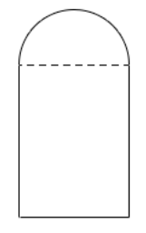

**Solution**

Okay, let's ask this question again in slightly easier to understand terms. We
want a window in the shape described above to have a maximum area (and hence let
in the most light) and have a perimeter of 12 m (because we have 12 m of framing
material). Little bit easier to understand in those terms.

Let the radius of the semicircle on the top be $r$ and the height of the
rectangle be $h$. Now, because the semicircle is on top of the window we can
think of the width of the rectangular portion at 2$r$ as shown below.

The perimeter (our constraint) is the lengths of the three sides on the
rectangular portion plus half the circumference of a circle of radius $r$. The
area (what we want to maximize) is the area of the rectangle plus half the area
of a circle of radius $r$. Here are the equations we'll be working with in this
example.

$$ \text{Maximize : } A = 2hr + \frac{1}{2}\pi r^2 $$

$$ \text{Constraint : } 12 = 2h + 2r + \pi r $$

In this case we’ll solve the constraint for $h$ and plug that into the area
equation.

$$ h = 6 - r - \frac{1}{2}\pi r \quad \Rightarrow \quad A(r) = 2r\left(6 - r - \frac{1}{2}\pi r\right) + \frac{1}{2}\pi r^2 = 12r - 2r^2 - \frac{1}{2}\pi r^2 $$

The first and second derivatives are,

$$ A'(r) = 12 - r(4 - \pi) \quad \quad A''(r) = -4 - \pi $$

We can see that the only critical point is,

$$ r = \frac{12}{4 + \pi} = 1.6803 $$

We can also see that the second derivative is always negative (in fact it's a
constant) and so we can see that the maximum area must occur at this point. So,
for the maximum area the semicircle on top must have a radius of 1.6803 and the
rectangle must have the dimensions 3.3606 x 1.6803 ($2r \times h$).

---

**Example 2** Determine the area of the largest rectangle that can be inscribed
in a circle of radius 4.

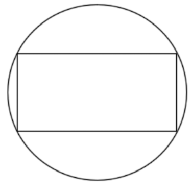

**Solution**

Huh? This problem type of problem never seems to make sense originally. What we
want to do is maximize the area of the largest rectangle that we can fit inside
a circle and have all of its corners touching the circle.

To do this problem it's easiest to assume that the circle (and hence the
rectangle) is centered at the origin of a standard xy axis system. Doing this we
know that the equation of the circle will be

$$ x^2 + y^2 = 16 $$

and that the right upper corner of the rectangle will have the coordinates
$(x, y)$. This means that the width of the rectangle will be $2x$ and the height
of the rectangle will be $2y$ as shown below

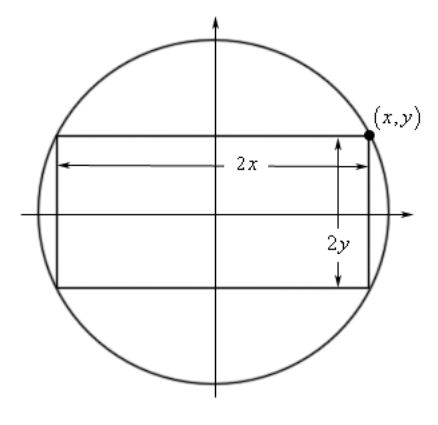

The area of the rectangle will then be,

$$ A = (2x)(2y) = 4xy $$

So, we've got the function we want to maximize (the area), but what is the
constraint? Well since the coordinates of the upper right corner must be on the
circle we know that $x$ and $y$ must satisfy the equation of the circle. In
other words, the equation of the circle is the constraint.

The first thing to do then is to solve the constraint for one of the variables.

$$ y = \pm \sqrt{16 - x^2} $$

Since the point that we're looking at is in the first quadrant we know that $y$
must be positive and so we can take the "+" part of this. Plugging this into the
area and computing the first derivative gives,

$$ A(x) = 4x\sqrt{16 - x^2} $$

$$ A'(x) = 4\sqrt{16 - x^2} - \frac{4x^2}{\sqrt{16 - x^2}} = \frac{64 - 8x^2}{\sqrt{16 - x^2}} $$

Before getting the critical points let's notice that we can limit $x$ to the
range $0 \leq x \leq 4$ since we are assuming that x is in the first quadrant
and must stay inside the circle. Now the four critical points we get (two from
the numerator and two from the denominator) are,

$$ 16 - x^2 = 0 \quad \Rightarrow \quad x = \pm 4 $$

$$ 64 - 8x^2 = 0 \quad \Rightarrow \quad x = \pm 2\sqrt{2} $$

We only want critical points that are in the range of possible optimal values so
that means that we have two critical points to deal with : $x = 2\sqrt{2}$ and
$x = 4$. Notice however that the second critical point is also one of the
endpoints of our interval.

Now, area function is continuous and we have an interval of possible solution
with finite endpoints so,

$$ A(0) = 0 \quad A\left(2\sqrt{2}\right) = 32 \quad A(4) = 0 $$

So, we can see that we’ll get the maximum area if $x = 2\sqrt{2}$ and the
corresponding value of $y$ is,

$$ y = \sqrt{16 = \left(2\sqrt{2}\right)^2} = \sqrt{8} = 2\sqrt{2} $$

It looks like the maximum area will be found if the inscribed rectangle is in
fact a square.

---

We need to again make a point that was made several times in the previous
section. We excluded several critical points in the work above. Do not always
expect to do that. There will often be physical reasons to exclude zero and/or
negative critical points, however, there will be problems where these are
perfectly acceptable values. You should always write down every possible
critical point and then exclude any that can't be possible solutions. This keeps
you in the habit of finding all the critical points and then deciding which ones
you actually need and that in turn will make it less likely that you'll miss one
when it is actually needed.

---

**Example 3** Determine the point(s) on $y = x^2 + 1$ that are closest to
$(0, 2)$.

**Solution**

Here's a quick sketch of the situation.

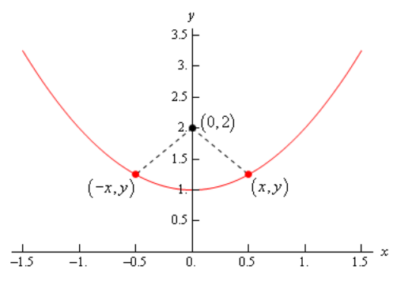

So, we’re looking for the shortest length of the dashed line. Notice as well
that if the shortest distance isn't at $x = 0$ there will be two points on the
graph, as we’ve shown above, that will give the shortest distance. This is
because the parabola is symmetric to the $y$-axis and the point in question is
on the $y$-axis. This won't always be the case of course so don't always expect
two points in these kinds of problems.

In this case we need to minimize the distance between the point $(0, 2)$ and any
point that is on the graph $(x, y)$. Or,

$$ d = \sqrt{(x - 0)^2 + (y - 2)^2} = \sqrt{x^2 + (y - 2)^2} $$

If you think about the situation here it makes sense that the point that
minimizes the distance will also minimize the square of the distance and so
since it will be easier to work with we will use the square of the distance and
minimize that. If you aren't convinced of this we'll take a closer look at this
after this problem. So, the function that we're going to minimize is,

$$ D = d^2 = x^2 + (y - 2)^2 $$

The constraint in this case is the function itself since the point must lie on
the graph of the function.

At this point there are two methods for proceeding. One of which will require
significantly more work than the other. Let's take a look at both of them.

_Solution 1_

In this case we will use the constraint in probably the most obvious way. We
already have the constraint solved for $y$ so let's plug that into the square of
the distance and get the derivatives.

$$ D(x) = x^2 + \left(x^2 + 1 - 2\right)^2 = x^4 - x^2 + 1 $$

$$ D'(x) = 4x^3 - 2x = 2x\left(2x^2 - 1\right) $$

$$ D''(x) = 12x^2 - 2 $$

So, it looks like there are three critical points for the square of the distance
and notice that this time, unlike pretty much every previous example we've
worked, we can't exclude zero or negative numbers. They are perfectly valid
possible optimal values this time.

$$ x = 0 \text{, } \quad x = \pm \frac{1}{\sqrt{2}} $$

Before going any farther, let's check these in the second derivative to see if
they are all relative minimums.

$$ D''(0) = -2 < 0 \quad D''\left(\frac{1}{\sqrt{2}}\right) = 4 \quad D''\left(-\frac{1}{\sqrt{2}}\right) = 4 $$

So, $x = 0$ is a relative maximum and so can't possibly be the minimum distance.
That means that we've got two critical points. The question is how we verify
that these give the minimum distance and yes we did mean to say that both will
give the minimum distance. Recall from our sketch above that if $x$ gives the
minimum distance then so will $-x$ and so if gives the minimum distance then the
other should as well.

None of the methods we discussed in the previous section will really work here.
We don't have an interval of possible solutions with finite endpoints and both
the first and second derivative change sign. In this case however, we can still
verify that they are the points that give the minimum distance.

First, let's see what we have if we are working on the interval
$\left[-\dfrac{1}{\sqrt{2}}, \dfrac{1}{\sqrt{2}}\right]$. On this interval we
can try to use the first method of finding absolute extrema discussed in the
previous section. That says to evaluate the function at the endpoints and the
critical points and in this case, even though we’ve excluded it we'll need to
include $x = 0$ since it is a critical point in the region. Doing this gives,

$$ D\left(-\frac{1}{\sqrt{2}}\right) = \frac{3}{4} \quad \quad D(0) = 1 \quad \quad D\left(\frac{1}{\sqrt{2}}\right) = \frac{3}{4} $$

So, we can see that the absolute minimum in the interval must occur at
$x = \pm \dfrac{1}{\sqrt{2}}$.

Next, we can see that if $x < -\dfrac{1}{\sqrt{2}}$ then $D'(x) < 0$. Or in
other words, if $x < -\dfrac{1}{\sqrt{2}}$ the function is decreasing until it
hits $x = -\dfrac{1}{\sqrt{2}}$ and so must always be larger than the function
at $x = -\dfrac{1}{\sqrt{2}}$.

Similarly, $x > \dfrac{1}{\sqrt{2}}$ then $D'(x) > 0$ and so the function is
always increasing to the right of $x = \dfrac{1}{\sqrt{2}}$ and so must be
larger than the function at $x = \dfrac{1}{\sqrt{2}}$.

So, putting all of this together tells us that we do in fact have an absolute
minimum at $x = \pm \dfrac{1}{\sqrt{2}}$.

All that we need to do is to find the value of $y$ for these points.

$$ x = \frac{1}{\sqrt{2}} \quad \quad \text{ : } \quad \quad y = \frac{3}{2} $$

$$ x = -\frac{1}{\sqrt{2}} \quad \quad \text{ : } \quad \quad y = \frac{3}{2} $$

So, the points on the graph that are closest to $(0, 2)$ are,

$$ \left(\frac{1}{\sqrt{2}}, \frac{3}{2}\right) \quad \quad \left(-\frac{1}{\sqrt{2}},\frac{3}{2}\right) $$

This solution method shows how tricky it can be to know that we have absolute
extrema when there are multiple critical points and none of the methods
discussed in the last section will work. Luckily for us, there is another,
easier, method we could have done instead.

_Solution 2_

The first solution that we worked was actually the long solution. There is a
much shorter, and easier, solution to this problem. Instead of plugging y into
the square of the distance let’s plug in $x$. From the constraint we get,

$$ x^2 = y - 1 $$

and notice that the only place $x$ show up in the square of the distance it
shows up as $x^2$ and let’s just plug this into the square of the distance.
Doing this gives,

$$ D(y) = y - 1 + (y - 2)^2 = y^2 - 3y + 3 $$

$$ D'(y) = 2y - 3 $$

$$ D''(y) = 2 $$

There is now a single critical point, $y = \dfrac{3}{2}$, and since the second
derivative is always positive we know that this point must give the absolute
minimum. So, all that we need to do at this point is find the value(s) of $x$
that go with this value of $y$.

$$ x^2 = \frac{3}{2} - 1 = \frac{1}{2} \quad \Rightarrow \quad x = \pm \frac{1}{\sqrt{2}} $$

The points are then,

$$ \left(\frac{1}{\sqrt{2}}, \frac{3}{2}\right) \quad \quad \left(-\frac{1}{\sqrt{2}}, \frac{3}{2}\right) $$

So, for significantly less work we got exactly the same answer.

---

This previous example had a couple of nice points. First, as pointed out in the
problem, we couldn't exclude zero or negative critical points this time as we've
done in all the previous examples. Again, be careful to not get into the habit
of always excluding them as we do many of the examples we'll work.

Next, some of these problems will have multiple solution methods and sometimes
one will be significantly easier than the other. The method you use is up to you
and often the difficulty of any particular method is dependent upon the person
doing the problem. One person may find one way easier and other person may find
a different method easier.

Finally, as we saw in the first solution method sometimes we'll need to use a
combination of the optimal value verification methods we discussed in the
previous section.

Now, before we move onto the next example let's take a look at the claim above
that we could find the location of the point that minimizes the distance by
finding the point that minimizes the square of the distance. We'll generalize
things a little bit,

**Fact**

> Supppose that we have a positive function, $f(x) > 0$, that exists everywhere
> then $f(x)$ and $g(x) = \sqrt{f(x)}$ will have the same critical points and
> the relative extrema will occur at the same points.

This is simple enough to prove so let's do that here. First let's take the
derivative of $g(x)$ and see what we can determine about the critical points of
$g(x)$.

$$ g'(x) = \frac{1}{2}\left[f(x)\right]^{-\frac{1}{2}}f'(x) = \frac{f'(x)}{2\sqrt{f(x)}} $$

Let's plug $x = c$ into this to get,

$$ g'(c) = \frac{f'(c)}{2\sqrt{f(c)}} $$

By assumption we know that $f(c)$ exists and $f(c) > 0$ and therefore the
denominator of this will always exist and will never be zero. We'll need this in
several places so we can't forget this.

If $f'(c) = 0$ then because we know that the denominator will not be zero here
we must also have $g'(c) = 0$. Likewise if $g'(c) = 0$ then we must have
$f'(c) = 0$. So, $f(x)$ and $g(x)$ will have the same critical points in which
the derivatives will be zero.

Next, if $f'(c)$ doesn't exist then $g'(c)$ will also not exist and likewise
$g'(c)$ doesn't exist then because we know that the denominator will not be zero
then this means that $f'(c)$ will also not exist. Therefore, $f(x)$ and $g(x)$
will have the same critical points in which the derivatives does not exist.

So, the upshot of all this is that $f(x)$ and $g(x)$ will have the same critical
points.

Next, let's notice that because we know that $2\sqrt{f(x)} > 0$ then $f'(x)$ and
$g'(x)$ will have the same sign and so if we apply the first derivative test
(and recalling that they have the same critical points) to each of these
functions we can see that the results will be the same and so the relative
extream will occur at the same points.

Note that we could also use the second derivative test to verify that the
critical points will have the same classification if we wanted to. The second
derivative is (and you should see if you can use the quotient rule to verify
this),

$$ g''(x) = \frac{2\sqrt{f(x)}f''(x) - \left[f'(x)\right]^2\left[f(x)\right]^{-\frac{1}{2}}}{4f(x)} $$

Then if $x = c$ is a critical point such that $f'(c) = 0$ ( and so we can use
the second derivative test) we get,

$$ g''(c) = \frac{2\sqrt{f(c)}f''(c) - \left[f'(c)\right]^2\left[f(c)\right]^{-\frac{1}{2}}}{4f(c)} $$

$$ \quad = \frac{2\sqrt{f(c)}f''(c) - [0]^2\left[f(c)\right]^{-\frac{1}{2}}}{4f(c)} = \frac{\sqrt{f(c)}f''(c)}{2f(c)} $$

Now, because we know that $2\sqrt{f(c)} > 0$ and by assumption $f(c) > 0$ we can
see that $f''(c)$ and $g''(c)$ will have the same sign and so will have the same
conclusion from the second derivative test.

So, now that we have that out of the way let's work some more examples.

---

**Example 4** A 2 feet piece of wire is cut into two pieces and one piece is
bent into a square and the other is bent into an equilateral triangle. Where, if
anywhere, should the wire be cut so that the total area enclosed by both is
minimum and maximum?

**Solution**

Before starting the solution recall that an equilateral triangle is a triangle
with three equal sides and each of the interior angles are $\dfrac{\pi}{3}$ (or
$60\degree$).

Also, note the "if anywhere" portion of the problem statement. What this is
saying is that it is possible to take the full piece of wire and put all of it
into either a square or a triangle. Do not forget about this as it will be
important later on in the problem.

Now, this is another problem where the constraint isn't really going to be given
by an equation, it is simply that there is 2 ft of wire to work with and this
will be taken into account in our work.

So, let's cut the wire into two pieces. The first piece will have length $x$
which we'll bend into a square and each side will have length $\dfrac{x}{4}$.
The <F2>econd piece will then have length $2 - x$ ( 2e just used the constraint
here...) and we'll bend this into an equilateral triangle and each side will
have length $\dfrac{1}{3}(2 - x)$. Here is a sketch of all this.

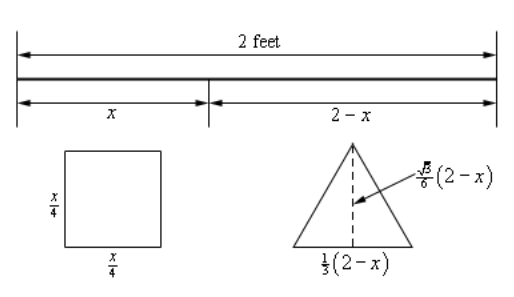

As noted in the sketch above we also will need the height of the triangle. This
is easy to get if you realize that the dashed line divides the equilateral
triangle into two other triangles. Let's look at the right one. The hypotenuse
is $\dfrac{1}{3}(2 - x)$ while the lower right angle is $\dfrac{\pi}{3}$.
Finally, the height is then the opposite side to the lower right angle so using
basic right triangle trig we arrive at the height of the triangle as follows.

$$ \sin\left(\frac{\pi}{3}\right) = \frac{\text{opp}}{\text{hyp}} \quad \Rightarrow \quad \text{opp} = \frac{1}{3}(2 - x)\sin\left(\frac{\pi}{3}\right) = \frac{1}{3}(2 - x)\left(\frac{\sqrt{3}}{2}\right) = \frac{\sqrt{3}}{6}(2 - x) $$

So, the total area of both objects is then,

$$ A(x) = \left(\frac{x}{4}\right)^2 + \frac{1}{2}\left(\frac{1}{3}(2 - x)\right)\left(\frac{\sqrt{3}}{6}(2 - x)\right) = \frac{x^2}{16} + \frac{\sqrt{3}}{36}(2 - x)^2 $$

Here's the first derivative of the area.

$$ A'(x) = \frac{x}{8} + \frac{\sqrt{3}}{2}(2)(2 - x)(-1) = \frac{x}{8} - \frac{\sqrt{3}}{9} + \frac{\sqrt{3}}{18}x $$

Setting this equal to zero and solving gives the single critical point of,

$$ x = \frac{8\sqrt{3}}{9 + 4\sqrt{3}} = 0.8699 $$

Now, let's notice that the problem statement asked for both the minimum and
maximum enclosed area and we got a single critical point. This clearly can't be
the answer to both, but this is not the problem that it might seem to be.

Let's notice that $x$ must be in the range $0 \leq x \leq 2$ and since the area
function is continuous we use the basic process for finding absolute extrema of
a function.

$$ A(0) = 0.1925 \quad \quad A(0.8699) = 0.1087 \quad \quad A(2) = 0.25 $$

So, it looks like the minimum area will arise if we take $x = 0.8699$ while the
maximum area will arise if we take the whole piece of wire and bend it into a
square.

---

As the previous problem illustrated we can't get too locked into the answers
always occurring at the critical points as they have to this point. That will
often happen, but one of the extrema in the previous problem was at an endpoint
and that will happen on occasion.

---

**Example 5** A piece of pipe is being carried down a hallway that is 10 feet
wide. At the end of the hallway there is a right-angled turn and the hallway
narrows down to 8 feet wide. What is the longest pipe that can be carried
(always keeping it horizontal) around the turn in the hallway?

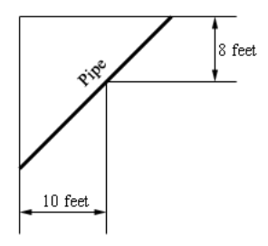

**Solution**

Let's start off with a sketch of the situation adding in some more information
so we can get a grip on what's going on and how we're going to have to go about
solving this.

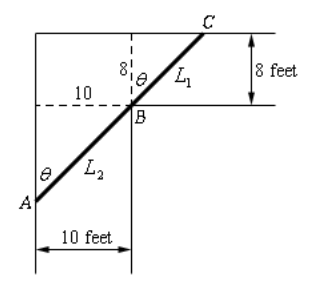

The largest pipe that can go around the turn will do so in the position shown
above. One end will be touching the outer wall of the hall way at $A$ and $C$
and the pipe will touch the inner corner at $B$. Let’s assume that the length of
the pipe in the small hallway is $L_1$ while $L_2$ is the length 9f the pipe in
the large hallway. The pipe then has a length of $L = L_1 + L_2$.

Now, if $\theta = 0$ thenn the pipe is completely in the wider hallway and we
can see that as $\theta \to 0$ the point $A$ will move down the vertical wall
and the point $C$ will move along the horizontal wall closer and closer to the
corner and as this happens $L$ lengthens and so $L \to \infty$ as
$\theta \to 0$.

Likewise, if $\theta = \dfrac{\pi}{2}$ the pipe is copletely in the narrow
hallway and as $\theta \to \dfrac{\pi}{2}$ we also have $L \to \infty$ by a
similar line of reasoning above for $\theta \to 0$.

So, because $L \to \infty$ as we near the ends of the interval of possible
angles somewhere in the interior of the interval, $0 < \theta < \dfrac{\pi}{2}$,
is an angle that will minimize $L$ and oddly enough that is the length that
we're after. The largets pipe that will fit around the turn will in fact be the
minimum value of $L$.

The constraint for this problem is not so obvious and there are actually two of
them. The constraints for this problem are the widths of the hallways. We'll use
these to get an equation for $L$ in terms of $\theta$ and we'll minimize this
new equation.

So, using basic right angle trig we can see that,

$$ L_1 = 8\sec\theta \quad \quad L_2 = 10\csc\theta \quad \quad \Rightarrow \quad \quad L = 8\sec\theta + 10\csc\theta $$

So, differentiating $L$ gives,

$$ L' = 8\sec\theta\tan\theta - 10\csc\theta\cot\theta $$

Setting this equal to zero and solving gives,

$$ 8\sec\theta\tan\theta = 10\csc\theta\cot\theta $$

$$ \frac{\sec\theta\tan\theta}{\csc\theta\cot\theta} = \frac{10}{8} $$

$$ \frac{\sin\theta\tan^2\theta}{\cos\theta} = \frac{5}{4} \quad \quad \Rightarrow \quad \quad \tan^3\theta = 1.25 $$

Solving for $\theta$ gives,

$$ \tan\theta = \sqrt[3]{1.25} \quad \quad \Rightarrow \quad \quad \theta = \tan^{-1}\left(\sqrt[3]{1.25}\right) = 0.8226 $$

So, if $\theta = 0.8226$ radians then the pipe will have a minimum length and
will just fit around the turn. Anything larger will not fit around the turn and
so the largest pipe that can be carried around the turn is,

$$ L = 8\sec(0.8226) + 10\csc(0.8226) = 25.4033 \text{ feet} $$

---

**Example 6** Two poles, one 6 meters tall and one 15 meters tall, are 20 meters
apart. A length of wire is attached to the top of each pole and it is also
staked to the ground somewhere between the two poles. Where should the wire be
staked so that the minimum amount of wire is used?

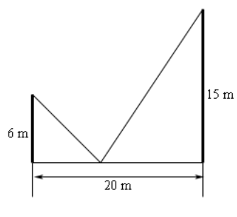

**Solution**

As always let's start off with a sketch of this situation with some more
information added.

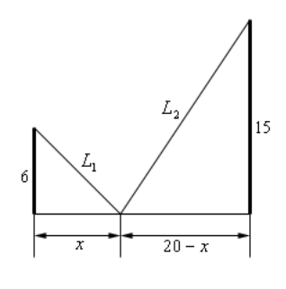

The total length of the wire is $L = L_1 + L_2$ and we need to determine the
value 9f $x$ that will minimize this. The constraint in this problem is that the
poles must be 20 meters apart and that $x$ must be in the range
$0 \leq x \leq 20$. The first thing that we'll need to do here is to get the
length of wire in terms of $x$, which is fairly simple 5o do using the
Pythagorean Theorem.

$$ L_1 = \sqrt{36 + x^2} \quad \quad L_2 = \sqrt{225 + (20 - x)^2} \quad \quad L = \sqrt{36 + x^2} + \sqrt{625 - 40x + x^2} $$

Not the nicest function we've had to work with but there it is. Note however,
that it is a continuous function and we've got an interval with finite endpoints
and so finding the absolute minimum won't require much more work than just
getting the critical points of this function. So, let's do that. Here's the
derivative.

$$ L' = \frac{x}{\sqrt{36 + x^2}} + \frac{x - 20}{\sqrt{625 - 40x + x^2}} $$

It's probably been quite a while since you've been asked to solve something like
this. To solve this, we'll need to square both sides to get rid of the roots,
but this will cause problems as well soon see. Let's first just square both
sides and solve that equation.

$$ x^2\left(625 - 40x + x^2\right) = (x - 20)^2\left(36 + x^2\right) $$

$$ 625x^2 - 40x^3 + x^4 = 14400 - 1440x + 436x^2 - 40x^3 + x^4 $$

$$ 189x^2 + 1440x - 14400 = 0 $$

$$ 9(3x + 40)(7x - 40) = 0 \quad \quad \Rightarrow \quad \quad x = -\frac{40}{3} \text{, }  x = \frac{40}{7} $$

Note that if you can't do that factoring don't worry, you can always just use
the quadratic formula and you'll get the same answers.

Okay two issues that we need to discuss briefly here. The first solution above
(note that we didn't call it a critical point...) doesn't make any sense because
it is negative and outside of the range of possible solutions and so we can
ignore it.

Secondly, and maybe more importantly, if you were to plug $x = -\dfrac{40}{3}$
into the derivative you would not get zero and so is not even a critical point.
How is this possible? It is a solution after all. We'll recall that we squared
both sides of the equation above and it was mentioned at the time that this
would cause problems. We'll we’ve hit those problems. In squaring both sides
we've inadvertently introduced a new solution to the equation. When you do
something like this you should ALWAYS go back and verify that the solutions that
you get are in fact solutions to the original equation. In this case we were
lucky and the "bad" solution also happened to be outside the interval of
solutions we were interested in but that won't always be the case.

So, if we go back and do a quick verification we can in fact see that the only
critical point is $x = \dfrac{40}{7} = 5.7143$ and this is nicely in our range
of acceptable solutions, $0 \leq x \leq 20$.

Now all that we need to do is plug this critical point and the endpoints of the
wire into the length formula and identify the one that gives the minimum value.

$$ L(0) = 31 \quad \quad L\left(\frac{40}{7}\right) = 29 \quad \quad L(20) = 35.8806 $$

So, we will get the minimum length of wire if we stake it to the ground
$\dfrac{40}{7}$ feet from the smaller pole.

---

Let's do a modification of the above problem that asks a completely different
question.

---

**Example 7** Two poles, one 6 meters tall and one 15 meters tall, are 20 meters
apart. A length of wire is attached to the top of each pole and it is also
staked to the ground somewhere between the two poles. Where should the wire be
staked so that the angle formed by the two pieces of wire at the stake is a
maximum?

**Solution**

Here's a sketch for this example with some more information added.

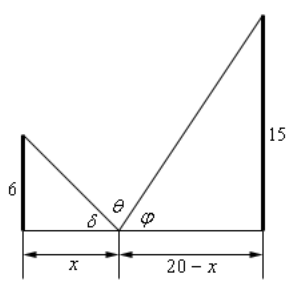

The equation that we're going to need to work with here is not obvious. We can
see from the sketch above that,

$$ \delta + \theta + \varphi = 180 = \pi  $$

Note that we need to make sure that the equation is equal to $\pi$ because of
how we're going to work this problem. Now, basic right triangle trig tells us
the following,

$$ \tan\delta = \frac{6}{x} \quad \quad \Rightarrow \quad \quad \delta = \tan^{-1}\left(\frac{6}{x}\right) $$

$$ \tan\varphi = \frac{15}{20 - x} \quad \quad \Rightarrow \quad \quad \varphi = \tan^{-1}\left(\frac{15}{20  - x}\right) $$

Plugging these into the equation above and solving for $\theta$ gives,

$$ \theta = \pi - \tan^{-1}\left(\frac{6}{x}\right) - \tan^{-1}\left(\frac{15}{20 - x}\right) $$

Note that this is the reason for the $\pi$ in our equation. The inverse tangents
give angles that are in radians and so can't use the 180 that we're used to in
this kind of equation.

Next, we'll need the derivative so hopefully you'll recall how to
[**differentiate inverse tangents**](https://tutorial.math.lamar.edu/Classes/CalcI/DiffInvTrigFcns.aspx)

$$ \theta' = -\frac{1}{1 + \left(\dfrac{6}{x}\right)^2}\left(-\frac{6}{x^2}\right) - \frac{1}{1 + \left(\dfrac{15}{20 - x}\right)^2}\left(\frac{15}{(20 - x)^2}\right) $$

$$ \quad = \frac{6}{x^2 + 36} - \frac{15}{(20 - x)^2 + 225} $$

$$ \quad = \frac{6}{x^2 + 36} - \frac{15}{x^2 - 40x + 625} = \frac{-3\left(3x^2 + 80x - 1070\right)}{\left(x^2 + 36\right)\left(x^2 - 40x + 625\right)} $$

Setting this equal to zero and solving give the following two critical points.

$$ x = \frac{-40 \pm \sqrt{4810}}{3} = -36.4514 \text{, } \quad 9.7847 $$

The first critical point is not in the interval of possible solutions and so we
can exclude it.

Clearly $x$ must be in the interval $[0, 20]$ and so using test points it's not
difficult to show that if $0 \leq x \leq 9.7847$ we have $\theta' > 0$ (and so
$\theta$ is increasing) and if $9.7847 < x \leq 20$ that $\theta' < 0$ (and so
$\theta$ is decreasing). So by the first derivatifve test when $x = 9.7847$ we
will get the maximum value of $\theta$.

---

**Example 8** A trough for holding water is formed by taking a piece 9f sheet
metal 60 cm wide and folding the 20 cm on either end up as shown below.
Determine the angle $\theta$ that will maximize the amount of water that the
trough can hold.

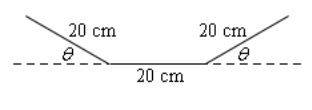

**Solution**

Now, in this case we are being asked to maximize the volume that a trough can
hold, but if you think about it the volume of a trough in this shape is nothing
more than the cross‑sectional area times the length of the trough. So, for a
given length in order to maximize the volume all you really need to do is
maximize the cross‑sectional area.

To get a formula for the cross-sectional area let's redo the sketch above a
little.

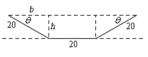

We can think of the cross-sectional area as a rectangle in the middle with width
20 and height $h$ and two identical triangles on either end with height $h$,
base $b$ and hypotenuse 20. Also note that basic geometry tells us that the
angle between the hypotenuse and the base must also be the same angle $\theta$
that we had in our original sketch.

Also, basic right triangle trig tells us that the base and height can be written
as,

$$ b = 20\cos\theta \quad \quad h = 20\sin\theta $$

The cross-sectional area for the whole trough, in terms of $\theta$, is then,

$$ A = 20h + 2\left(\frac{1}{2}bh\right) = 400\sin\theta + (20\cos\theta)(20\sin\theta) = 400(\sin\theta + \sin\theta\cos\theta) $$

The derivative of the area is,

$$ A'(\theta) = 400\left(\cos\theta + \cos^2\theta - \sin^2\theta\right) $$

$$ \quad = 400\left(\cos\theta + \cos^2\theta - \left(1 - \cos^2\theta\right)\right) $$

$$ \quad = 400\left(2\cos^2\theta + \cos\theta - 1\right) $$

$$ \quad = 400\left(2\cos\theta - 1\right)\left(\cos\theta + 1\right) $$

So, we have either,

$$ 2\cos\theta - 1 = 0 \quad \quad \Rightarrow \quad \quad \cos\theta = \frac{1}{2} \quad \quad \Rightarrow \quad \quad \theta = \frac{\pi}{3} $$

$$ \cos\theta + 1 = 0 \quad \quad \Rightarrow \quad \quad \cos\theta = -1 \quad \quad \Rightarrow \quad \quad \theta = \pi $$

However, we can see that $\theta$ must be in the interval
$0 \leq \theta \leq \dfrac{\pi}{2}$ or we won't get a trough in the proper
shape. Therefore, the second critical point makes no sense and also note that we
don't need to add on the standard "$+2\pi n$" for the same reason.

Finally, since the equation for the area is continuous all we need to do is plug
in the critical point and the end points to find the one that gives the maximum
area.

$$ A(0) = 0 \quad \quad A\left(\frac{\pi}{3}\right) = 519.6152 \quad \quad A\left(\frac{\pi}{2}\right) = 400 $$

So, we will get a maximum cross-sectional area, and hence a maximum volume, when
$\theta = \dfrac{\pi}{3}$.

---

## Practice Problems

**1.** We want to construct a window whose middle is a rectangle and the top and
bottom of the window are semi-circles. If we have 50 meters of framing material
what are the dimensions of the window that will let in the most light?

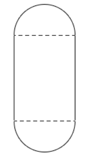

**Solution**

We have a rectangle with two semi-circles on the ends of the rectangle. We wanta
window in the shape described above to have a maximum area (and hence let in the
most light) and have a perimter of 50 m (because we have 50 meters of framing
material).

let the radius of the semi-circles be $r$ and the height of the rectangle be
$h$. Because one semi-circle is on the top and one semi-circle is on the bottom
of the rectangle, we can think of teh width of the rectangular potion as being
$2r$.

The perimter (our contstraint) is the lengths of the two sides on teh
rectangular portion plus half the circumference of one of the circles of radius
$r$ multiplied by 2, which essentially just means the circumference of one full
circle of radius $r$. Here are the equations we'll be working with in this
example:

$$ \text{Maximize : } A = 2hr + 2\left(\frac{1}{2}\pi r^2\right) = 2hr + \pi r^2 $$

$$ \text{Constraint : } P = 50 = 2h + 2\pi r $$

Let's first solve the constraint in terms of $h$, so we can plug that into
$A(h)$:

$$ 50 = 2h + 2\pi r $$

$$ 50 - 2\pi r = 2h $$

$$ h = \frac{50 - 2\pi r}{2} $$

$$ h = 25 - \pi r $$

$$ A = 2hr + \pi r^2 $$

$$ A(h) = 2(25 - \pi r)r + \pi r^2 $$

$$ A(h) = 50r - 2\pi r^2 + \pi r^2 $$

$$ A(h) = 50r - \pi r^2 $$

Now let's take the first derivative, solve for critical points using the first
derivative, and also find the second derivatives of $A(h)$ so we can determine
if its a relative minimum or relative maximum:

$$ A'(h) = 50 - 2\pi r $$

$$ 50 - 2\pi r = 0 $$

$$ 50 = 2\pi r $$

$$ \frac{50}{2\pi} = r $$

$$ r = \frac{25}{\pi} $$

$$ A''(h) = -2\pi $$

Note that the second derivative shows that the concavity for the entire Area
function is negative/concave down, meaning that we have a relative (absolute)
maximum at $r = \dfrac{25}{\pi}$. Let's now use this value for the radius to
determine the dimensions of our window:

$$ h = 25 - \pi r $$

$$ h = 25 - \pi\left(\frac{25}{\pi}\right) = 0 $$

Basically, the height of the rectangle is $0$ and so we will get the maximum
area (and light coming through our window) if we just have a circular window
with a radius $r = \dfrac{25}{\pi}$.

**2.** Determine the area of the largest rectangle that can be inscribed in a
circle of radius 1.

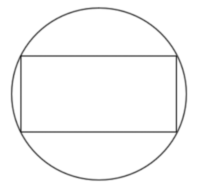

**Solution**

This will be more easily solved if we assume the circle lies perfectly dead
center on a standard cartesian graph. We know that the formula for a circle on
such a graph is:

$$ x^2 + y^2 = r^2 $$

So therefore we know that:

$$ x^2 + y^2 = 1^2 = 1 $$

We also know that the upper right hand corner of the rectangle that will
intersect with the edge of the circle will have both $x$ and $y$ be positive.
And this further lets us know that the width of the rectangle will be $2x$ and
the height of the rectangle will be $2y$. Therefore the area of the rectangle
will simply be:

$$ A = wh = (2x)(2y) = 4xy $$

The constraint is simply that the rectangle must fit inside the circle. We can
therefore solve our circle formula in terms of either $x$ or $y$:

$$ x^2 + y^2 = 1 $$

$$ y^2 = 1 - x^2 $$

$$ y = \pm \sqrt{1 - x^2} $$

$$ y = \sqrt{1 - x^2} $$

We omit the $\pm$ since we are only evaluating for $y$ in the first quadrant.

We can now express $A$ in terms of $A(x)$:

$$ A = 4xy $$

$$ A(x) = 4x\left(\sqrt{1 - x^2}\right) $$

And then find the first derivative:

$$ A(x) = 4x\left(1 - x^2\right)^{\frac{1}{2}} $$

$$ A'(x) = (4x)'\left(1 - x^2\right)^{\frac{1}{2}} + (4x)\left[\left(1 - x^2\right)^{\frac{1}{2}}\right]' $$

$$ A'(x) = 4\left(1 - x^2\right)^{\frac{1}{2}} + 4x\left(\frac{1}{2}\right)\left(1 - x^2\right)^{-\frac{1}{2}}\left(1 - x^2\right)' $$

$$ A'(x) = 4\left(1 - x^2\right)^{\frac{1}{2}} + 4x\left(\frac{1}{2}\right)\left(1 - x^2\right)^{-\frac{1}{2}}(-2x) $$

$$ A'(x) = 4\left(1 - x^2\right)^{\frac{1}{2}} + \frac{4x\left(\dfrac{1}{2}\right)(-2x)}{\left(1 - x^2\right)^{\frac{1}{2}}}$$

$$ A'(x) = 4\left(1 - x^2\right)^{\frac{1}{2}} - \frac{4x^2}{\left(1 - x^2\right)^{\frac{1}{2}}}$$

$$ A'(x) = \frac{4\left(1 - x^2\right) - 4x^2}{\left(1 - x^2\right)^{\frac{1}{2}}}$$

$$ A'(x) = \frac{4 - 4x^2 - 4x^2}{\left(1 - x^2\right)^{\frac{1}{2}}}$$

$$ A'(x) = \frac{4 - 8x^2}{\left(1 - x^2\right)^{\frac{1}{2}}}$$

Now, we know that the range of $x$ is $0 \leq x \leq 1$ since we are assuming
that $x$ is in the first quadrant and must stay inside the circle. Let's now
find our critical points by setting both the first derivative's numerator and
denominator to $0$:

$$ 4 - 8x^2 = 0 $$

$$ 4 = 8x^2 $$

$$ \frac{1}{2} = x^2 $$

$$ \pm \sqrt{\frac{1}{2}} = x $$

$$ x = \pm \frac{1}{\sqrt{2}}$$

$$ 1 - x^2 = 0 $$

$$ 1 = x^2 $$

$$ x = \pm 1 $$

We only want the positive critical points since those fall within our range. So
The points we will deal with are: $x = \dfrac{1}{\sqrt{2}}$ and $x = 1$. But one
of these critical points is also our endpoint. Thusly we just need to evaluate
both endpoints and this other critical point in our Area function. Once
evaluated, we'll take the highest output as our maximum possible area for our
rectangle.

$$ A(0) = 4(0)\left(\sqrt{1 - (0)^2}\right) $$

$$ A(0) = 0 $$

$$ A\left(\frac{1}{\sqrt{2}}\right) = 4\left(\frac{1}{\sqrt{2}}\right)\left(\sqrt{1 - \left(\frac{1}{\sqrt{2}}\right)^2}\right) $$

$$ A\left(\frac{1}{\sqrt{2}}\right) = 2 $$

$$ A(1) = 4(1)\left(\sqrt{1 - (1)^2}\right) $$

$$ A(1) = 4(1)(0) = 0 $$

So, we can see that we'll get the maximum area of $2$ if
$x = \dfrac{1}{\sqrt{2}}$ and the corresponding value of $y$ is:

$$ y = \sqrt{1 - x^2} $$

$$ y = \sqrt{1 - \left(\frac{1}{\sqrt{2}}\right)^2} $$

$$ y = \sqrt{1 - \frac{1}{2}} $$

$$ y = \frac{1}{\sqrt{2}} $$

So it looks like the maximum area will be found if the inscribed rectangle is in
fact a square.

**3.** Find the point(s) on $x = 3 - 2y^2$ that are closest to $(-4, 0)$.

**Solution**

Here is a graph of the equation given:

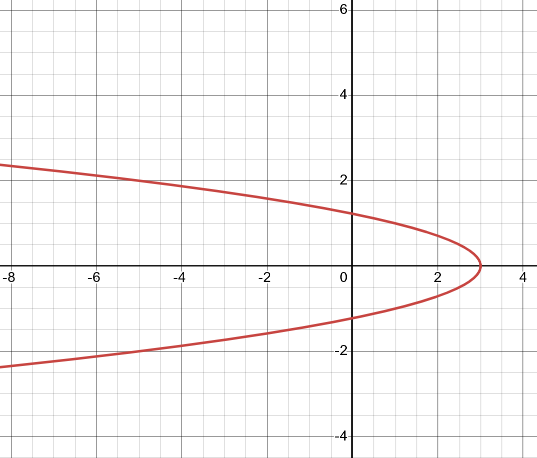

We are looking for one or two point closest to $(-4, 0)$ such that there is
$(-x, -y)$ and/or $(-x, y)$ such that they will give the shortest distance. This
is because the parabola is symmetric to the $x$-axis and the point in question
is on the $x$ axis. We can use the distance formula to find a formula specific
to our problem:

$$ d = \sqrt{(x - (-4))^2 + (y - 0)^2} = \sqrt{(x + 4)^2 + y^2} $$

We can then abstract this into a function $D$:

$$ D = d^2 = (x + 4)^2 + y^2 $$

The constraint is the function itself since the point must lie on the graph of
the function.

We already have the constraint solved for $x$, so we can just plug that into our
distance formula to express it in terms of $y$:

$$ D = (x + 4)^2 + y^2 $$

$$ x = 3 - 2y^2 $$

$$ D(y) = \left((3 - 2y^2) + 4\right)^2 + y^2 $$

$$ D(y) = 4y^4 - 27y^2 + 49 $$

Now let's find our first and second derivatives:

$$ D'(y) = 16y^3 - 54y $$

$$ D''(y) = 48y^2 - 54 $$

Set the first derivative to $0$ and solve for critical points:

$$ 16y^3 - 54y = 0 $$

$$ y\left(16y^2 - 54\right) = 0 $$

$$ y = 0 $$

$$ 16y^2 - 54 = 0 $$

$$ 16y^2 = 54 $$

$$ y^2 = \frac{54}{16} = \frac{27}{8} $$

$$ y = \pm \frac{3\sqrt{6}}{4} $$

So our three critical points are:

$$ y = 0 \text{, } y = \pm \frac{3\sqrt{6}}{4} $$

Because we are looking for the distances closest to the point $(-4, 0)$, this
means we are looking for relative minimums. Let's plug in these three critical
points into the second derivative to check for their concavity via the sign of
the outputs and see if they are minimums or maximums:

$$ D''\left(-\frac{3\sqrt{6}}{4}\right) = 48\left(-\frac{3\sqrt{6}}{4}\right)^2 - 54 = 108 $$

$$ D''(0) = 48(0)^2 - 54 = -54 $$

$$ D''\left(\frac{3\sqrt{6}}{4}\right) = 48\left(\frac{3\sqrt{6}}{4}\right)^2 - 54 = 108 $$

So we can in theory omit $y = 0$ as the concavity is down and that is a relative
maximum, and again, we're looking only for minimums.

Now we just have to plug in the two points $y = \pm \dfrac{3\sqrt{6}}{4}$ into
our Distance function to determine if they are smaller. We'll also need to
include $y = 0$ even though it isn't a relative minimum, as it could still count
as the single point with the shortest distance.

$$ D(y) = 4y^4 - 27y^2 + 49 $$

$$ D\left(-\frac{3\sqrt{6}}{4}\right) = 4\left(-\frac{3\sqrt{6}}{4}\right)^4 - 27\left(-\frac{3\sqrt{6}}{4}\right)^2 + 49 = \frac{55}{16}  $$

$$ D(0) = 4(0)^4 - 27(0)^2 + 49 = 49 $$

$$ D\left(\frac{3\sqrt{6}}{4}\right) = 4\left(\frac{3\sqrt{6}}{4}\right)^4 - 27\left(\frac{3\sqrt{6}}{4}\right)^2 + 49 = \frac{55}{16}  $$

So we can see that indeed an absolute minimum distance occurs at both
$y = \pm \dfrac{3\sqrt{6}}{4}$. Now we just have to evaluate for $x$:

$$ x = 3 - 2y^2 $$

$$ x = 3 - 2\left(-\frac{3\sqrt{6}}{4}\right)^2 = -\frac{15}{4}  $$

$$ x = 3 - 2\left(\frac{3\sqrt{6}}{4}\right)^2 = -\frac{15}{4}  $$

Therefore the two points on the graph that are closest to $(-4, 0)$ are:

$$ \left(-\frac{15}{4}, -\frac{3\sqrt{6}}{4}\right) \quad \left(-\frac{15}{4}, \frac{3\sqrt{6}}{4}\right) $$

**4.** An 80 cm piece of wire is cut into two pieces. One piece is bent into an
equilateral triangle and the other will be bent into a rectangle with one side 4
times the length of the other side. Determine where, if anywhere, the wire
should be cut to maximize the area enclosed by the two figures.

**Solution**

Let $x$ be the length of the first cut of wire, and let $80 - x$ be the length
of the remaining wire.

To determine the dimensions of our rectangle, we have to consider the problem
statement:

$$ x = 2L + 2(4L) = 10L \quad \rightarrow \quad L = \frac{x}{10} $$

This gives us two sides of our rectangle:

$$ L_1 = \frac{x}{10} $$

$$ L_2 = 4\left(\frac{x}{10}\right) = \frac{4x}{10} = \frac{2x}{5} $$

This will come in handy later when we need the area of the rectangle.

Each leg of our equilateral triangle will be $\dfrac{1}{3}(80 - x)$ in length,
with each angle being $\dfrac{\pi}{3}$ radians.

Let's first determine the height of the equilateral triangle using standard
right angle trigonmetry:

$$ \sin\left(\frac{\pi}{3}\right) = \frac{\text{opp}}{\text{hyp}} $$

$$ \text{opp} = \frac{1}{3}(80 - x)\sin\left(\frac{\pi}{3}\right) $$

$$ \text{opp} = \frac{1}{3}(80 - x)\left(\frac{\sqrt{3}}{2}\right) $$

$$ \text{opp} = \frac{\sqrt{3}}{6}(80 - x) $$

We are trying to maximize the area of both the rectangle and the equilateral
triangle. Let's express the area in terms of $x$:

$$ A(x) = \left(\frac{x}{10}\right)\left(\frac{2x}{5}\right) + \frac{1}{2}\left[\frac{1}{3}(80 - x)\right]\left[\frac{\sqrt{3}}{6}(80 - x)\right] $$

$$ A(x) = \frac{x^2}{25} + \frac{\sqrt{3}}{36}(80 - x)^2 $$

Now let's find the first derivative:

$$ A'(x) = \frac{\left(x^2\right)'(25) - \left(x^2\right)(25)'}{(25)^2} + \left(\frac{\sqrt{3}}{36}\right)'(80 - x)^2 + \left(\frac{\sqrt{3}}{36}\right)\left[(80 - x)^2\right]' $$

$$ A'(x) = \frac{2x(25)}{(25)^2} + \left(\frac{\sqrt{3}}{36}\right)(2)(80 - x)(80 - x)' $$

$$ A'(x) = \frac{2x}{25} + \left(\frac{2\sqrt{3}(80 - x)}{36}\right)(-1) $$

$$ A'(x) = \frac{2x}{25} - \frac{\sqrt{3}(80 - x)}{18} $$

Set to $0$ and find critical point(s):

$$ \frac{2x}{25} - \frac{\sqrt{3}(80 - x)}{18} = 0 $$

$$ x = \frac{\dfrac{40\sqrt{3}}{9}}{\dfrac{2}{25} + \dfrac{\sqrt{3}}{18}} \approx 43.6828 $$

Determine second derivative to see if there are relative max/mins:

$$ A''(x) = \frac{(2x)'(25) - (2x)(25)'}{(25)^2} - \frac{(\sqrt{3}(80 - x))'(18) - (\sqrt{3}(80 - x))(18)'}{(18)^2} $$

$$ A''(x) = \frac{(2)(25)}{(25)^2} + \frac{\sqrt{3}}{18} $$

$$ A''(x) = \frac{2}{25} + \frac{\sqrt{3}}{18} $$

Since this is always positive, we know that this will always be concave up and
the critical point we got above is a relative minimum. But we were asked for a
relative maximum...

Since the problem statements uses the words "if anywhere", the only conclusion
we can come to is that somewhere in the range of $0$ (all wire goes to the
triangle) or $80$ (all wire goes to the rectangle) there is some relative
maximum. We have more or less determined that the relative maximum cannot exist
at the critical point, so it must live at one of the extrema of our range. Let's
plug into our Area formula the endpoints and critical point to find out:

$$ A(x) = \frac{x^2}{25} + \frac{\sqrt{3}}{36}(80 - x)^2 $$

$$ A(0) = \frac{(0)^2}{25} + \frac{\sqrt{3}}{36}(80 - (0))^2 \approx 307.9201  $$

$$ A(43.6828) = \frac{(43.6828)^2}{25} + \frac{\sqrt{3}}{36}(80 - (43.6828))^2 \approx 139.7850 $$

$$ A(80) = \frac{(80)^2}{25} + \frac{\sqrt{3}}{36}(80 - (80))^2 = 256  $$

So it looks like we can maximize our area simply by taking the entire wire and
bending it into an equilateral triangle.

**5.** A line through the point $(2, 5)$ forms a right triangle with the
$x$-axis and $y$-axis in the 1st quadrant. Determine the equation of
the line that will minimize the area of this triangle.

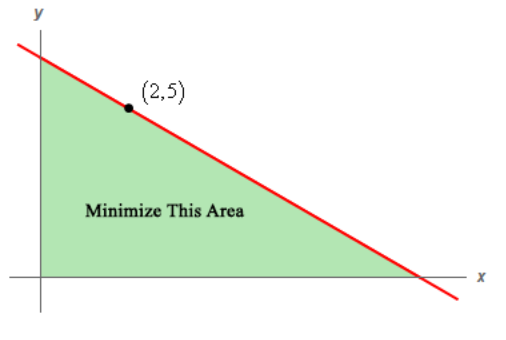

**Solution**

Let $(a, 0)$ be the point on the $x$-axis that marks one leg of the triangle,
and also let $(0, b)$ be the point on the $y$-axis that marks the other leg of
the triangle. Note that we are given that a point $(2, 5)$ lies on the
hypotenuse of this triangle. By observing this, we know that $a > 2$ and that
$b > 5$.

Let's now use $a$ and $b$ to express the area of a right triangle formula:

$$ A = \frac{1}{2}ab $$

We can use the slope formula to express the slope of our line. Recall that the
basic slope formula is:

$$ m = \frac{y_2 - y_1}{x_2 - x_1} $$

If we use the point given, $(2, 5)$, and use the $x$-axis point $(a, 0)$, this
becomes:

$$ m = \frac{5 - 0}{2 - a} $$

$$ m = \frac{5}{2 - a} $$

We already know that $b$ is the $y$-intercept, and so the equation of the line
through the point is:

$$ y = mx + b $$

$$ y = \left(\frac{5}{2 - a}\right)x + b $$

This might seem problematic, as we don't know four different variables here. But
by using our $x$-intercept (not the $y$-intercept), we can rewrite this line
equation:

$$ y = \left(\frac{5}{2 - a}\right)x + b $$

Now plug in $(a, 0)$:

$$ 0 = \left(\frac{5}{2 - a}\right)a + b $$

Note that if we plugged in the $y$ -intercept, $(0, b)$, we'd get:

$$ b = \left(\frac{5}{2 - 0}\right)0 + b $$

$$ b = 0 + b $$

$$ 0 = 0 $$

Which doesn't work. Instead, let's rewrite our line formula with the
$x$-intercept plugged in:

$$ 0 = \left(\frac{5}{2 - a}\right)a + b $$

$$ b = -\left(\frac{5}{2 - a}\right)a $$

$$ b = \frac{5a}{a - 2} $$

So now we have an expression of $b$, in terms of $a$, that respects the
Constraint that there must be an $x$ and $y$ intercept. Let's now rewrite our
Area formula in terms of $a$:

$$ A = \frac{1}{2}ab $$

$$ A(a) = \frac{1}{2}a\left(\frac{5a}{a - 2}\right) $$

$$ A(a) = \frac{5a^2}{2(a - 2)} $$

$$ A(a) = \frac{5a^2}{2a - 4} $$

Let's now find the critical points from the first derivative:

$$ A'(a) = \frac{(5a^2)'(2a - 4) - (5a^2)(2a - 4)'}{(2a - 4)^2} $$

$$ A'(a) = \frac{(10a)(2a - 4) - (5a^2)(2)}{(2a - 4)^2} $$

$$ A'(a) = \frac{20a^2 - 40a - 10a^2}{(2a - 4)^2} $$

$$ A'(a) = \frac{10a^2 - 40a}{(2a - 4)^2} $$

$$ 10a^2 - 40a = 0 $$

$$ a^2 - 4a = 0 $$

$$ a(a - 4) = 0 $$

$$ a = 0 \text{, } a = 4 $$

$$ 2a - 4 = 0 $$

$$ 2a = 4 $$

$$ a = 2 $$

So our critical points are:

$$ a = 0 \text{, } a = 2 \text{, } a = 4 $$

Thinking on it, we can't use $a = 0$, as that will negate our triangle. We also
can't use $a = 2$ for a couple of reasons. Firstly it negates our given point
$(2, 5)$, and also if we plug it into the Area formula, it causes our area to be
$0$.

This leaves only $a = 4$ as a critical point that could lead to an absolute
minimum. Let's first evaluate the second derivative, check it's concavity, and
see if the sign indicates a relative maximum or minimum:

$$ A'(a) = \frac{10a^2 - 40a}{(2a - 4)^2} $$

$$ A''(a) = \frac{\left(10a^2 - 40a\right)'\left[(2a - 4)^2\right] - \left(10a^2 - 40a\right)\left[(2a - 4)^2\right]'}{\left[(2a - 4)^2\right]^2} $$

$$ A''(a) = \frac{(20a - 40)(2a - 4)^2 - \left(10a^2 - 40a\right)(2)(2a - 4)(2a - 4)'}{(2a - 4)^4} $$

$$ A''(a) = \frac{(20a - 40)(2a - 4)^2 - \left(10a^2 - 40a\right)(2)(2a - 4)(2)}{(2a - 4)^4} $$

$$ A''(a) = \frac{320a - 640}{(2a - 4)^4} $$

From this we can see that $A''(a)$ will always be positive as long as $a > 2$
(evaluate the denominator for $0$), meaning that we have a concave up concavity,
and therefore our critical point(s) will always be relative minimums, which is
what we are looking for.

We can now plug in our critical point of $a = 4$ into both the slope and line
formulas to find our line:

$$ m = \frac{5}{2 - a} $$

$$ m = \frac{5}{2 - 4} $$

$$ m = \frac{5}{-2} $$

$$ m = -\frac{5}{2} $$

$$ b = \frac{5a}{a - 2} $$

$$ b = \frac{5(4)}{(4) - 2} $$

$$ b = \frac{20}{2} $$

$$ b = 10 $$

Now the line formula:

$$ y = mx + b $$

$$ \boxed{y = -\frac{5}{2}x + 10} $$

**6.** A piece of pipe is being carried down a hallway that is 18 feet wide. At
the end of the hallway there is a right-angled turn and the hallway narrows down
to 12 feet wide. What is the longest pipe (always keeping it horizontal) that
can be carried around the turn in the hallway?

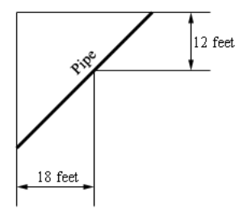

**Solution**

Let's establish a few variables:

$$ \theta = \text{ the angle of the pipe from the wider hallway wall in relation to the outer corner} $$

$$ \theta = \text{ also the angle of the pipe from the narrow hallway wall in relation to the inner corner} $$

$$ L = \text{ the length of the pipe} $$

$$ L_1 = \text{ the length of the pipe from the outer wall on the wider hallway to the inner corner} $$

$$ L_2 = \text{ the length of the pipe from the outer wall on the narrow hallway to the inner corner} $$

We have two constraints that are established by the hallway. We can use right
angle trigonometry to find:

$$ \cos\theta = \frac{12}{L_1} $$

$$ \sec\theta = \frac{L_1}{12} $$

$$ L_1 = 12\sec\theta $$

$$ \sin\theta = \frac{18}{L_2} $$

$$ \csc\theta = \frac{L_2}{18} $$

$$ L_2 = 18\csc\theta $$

This in turn gives us the overall Length of the pipe expressed by our two
constraints as:

$$ L = 12\sec\theta + 18\csc\theta $$

We can use this to determine the longest the pipe can be within these two
constraints. First let's find the first derivative of this formula and set it to
$0$ to find our critical point(s) (you'll need
[**derivatives of trig functions**](https://tutorial.math.lamar.edu/Classes/CalcI/DiffTrigFcns.aspx#MathJax-Element-54-Frame)):

$$ L' = 12\sec\theta\tan\theta - 18\csc\theta\cot\theta $$

$$ 12\sec\theta\tan\theta - 18\csc\theta\cot\theta = 0 $$

$$ 12\sec\theta\tan\theta = 18\csc\theta\cot\theta $$

$$ \frac{\sec\theta\tan\theta}{\csc\theta\cot\theta} = \frac{18}{12} $$

$$ \frac{\sin\theta\tan^2\theta}{\cos\theta} = \frac{3}{2} $$

$$ \tan^3\theta = \frac{3}{2} $$

$$ \tan\theta = \sqrt[3]{\frac{3}{2}} $$

$$ \theta = \tan^{-1}\left(\sqrt[3]{\frac{3}{2}}\right) \approx 0.8528 $$

Plugging this into our formula for $L$ should give us our answer:

And this is the critical point that we need.

$$ L = 12\sec\theta + 18\csc\theta $$

$$ L = 12\sec(0.8528) + 18\csc(0.8528) $$

$$ \boxed{L \approx 42.1409 \text{ ft}} $$

**7.** Two 10 meter tall poles are 30 meters apart. A length of wire is attached
to the top of each pole and it is staked to the ground somewhere between the two
poles. Where should the wire be staked so that the minimum amount of wire is
used?

**Solution**

Let's establish some variables:

$$ x = \text{ the length along the ground from the left pole to the stake} $$

$$ 30 - x = \text{ the length along the ground from the right pole to the stake} $$

$$ L_1 = \text{ the length of the wire from the left pole to the stake} $$

$$ L_2 = \text{ the length of the wire from the right pole to the stake} $$

$$ L = \text{ the total length of the wire} $$

$$ \text{Minimize : } L = L_1 + L_2 $$

The constraint is that the two poles must be $30$ meters apart.

Given that we have two right traingles here, we can establish formulas for $L_1$
and $L_2$ like so:

$$ x^2 + 10^2 = (L_1)^2 $$

$$ L_1 = \sqrt{x^2 + 100}$$

$$ (30 - x)^2 + 10^2 = (L_2)^2 $$

$$ L_2 = \sqrt{(30 - x)^2 + 100} $$

And this means therefore that:

$$ L = L_1 + L_2 $$

$$ L = \sqrt{x^2 + 100} + \sqrt{(30 - x)^2 + 100} $$

And we have a range given by our constraint that $0 \leq x \leq 30$.

Let's find the first derivative:

$$ L = \sqrt{x^2 + 100} + \sqrt{(30 - x)^2 + 100} $$

$$ L = \left(x^2 + 100\right)^{\frac{1}{2}} + \left((30 - x)^2 + 100\right)^{\frac{1}{2}} $$

$$ L' = \frac{1}{2}\left(x^2 + 100\right)^{-\frac{1}{2}}\left(x^2 + 100\right)' + \frac{1}{2}\left((30 - x)^2 + 100\right)^{-\frac{1}{2}}\left((30 - x)^2 + 100\right)' $$

$$ L' = \frac{1}{2}\left(x^2 + 100\right)^{-\frac{1}{2}}(2x) + \frac{1}{2}\left((30 - x)^2 + 100\right)^{-\frac{1}{2}}\left(2(30 - x)(30 - x)'\right) $$

$$ L' = \frac{1}{2}\left(x^2 + 100\right)^{-\frac{1}{2}}(2x) + \frac{1}{2}\left((30 - x)^2 + 100\right)^{-\frac{1}{2}}(2)(30 - x)(-1) $$

$$ L' = \left(x^2 + 100\right)^{-\frac{1}{2}}(x) + \left((30 - x)^2 + 100\right)^{-\frac{1}{2}}(x - 30) $$

$$ L' = \frac{x}{\sqrt{x^2 + 100}} + \frac{x - 30}{\sqrt{(30 - x)^2 + 100}} $$

And now let's set this to $0$ to find our critical point(s):

$$ \frac{x}{\sqrt{x^2 + 100}} + \frac{x - 30}{\sqrt{(30 - x)^2 + 100}} = 0 $$

$$ \frac{x}{\sqrt{x^2 + 100}} = -\frac{x - 30}{\sqrt{(30 - x)^2 + 100}} $$

$$ x\sqrt{(30 - x)^2 + 100} = -(x - 30)\sqrt{x^2 + 100} $$

$$ x^2\left((30 - x)^2 + 100\right) = (x - 30)^2\left(x^2 + 100\right) $$

$$ x^2\left(x^2 - 60x + 1000\right) = \left(x^2 - 60x + 900\right)\left(x^2 + 100\right) $$

$$ x^4 - 60x^3 + 1000x^2 = x^4 - 60x^3 + 1000x^2 - 6000x + 90000 $$

$$ 0 = -6000x + 90000 $$

$$ 6000x = 90000 $$

$$ x = 15 $$

Note that $x$ here falls within our range of $0 \leq x \leq 30$.

Now we just have to check $L(x)$ at $x = 0 \text{, } x = 15 \text{, } x = 30$
and choose the one with the smallest output (the minimum) as our answer.

$$ L(0) \approx 41.6228 \text{, } L(15) \approx 36.0555 \text{, } L(30) \approx 41.6228  $$

And so our wire should be staked $15 \text{ m}$ between the poles to minimize
the amount of wire used.

---

## Assignment Problems

**1.** We want to construct a window whose bottom is a rectangle and the top of
the window is an equilateral triangle. If we have 75 inches of framing material
what are the dimensions of the window that will let in the most light?

**Solution**

Let's establish some variables and then define our Maximum and Area formulas:

$$ x = \text{ the width of the rectangle as well as the length of each leg of the triangle} $$

$$ h = \text{ the height of the rectangle} $$

$$ \text{Maximize : } A = \frac{\sqrt{3}}{4}x^2 + xh $$

$$ \text{Constraint : } P = 75 = x + 2h + 2x = 3x + 2h $$

If we express our Contsraint as an equation for $h$, we can plug that into our
Area formula to express our Area in terms of that constraint:

$$ 75 = 3x + 2h $$

$$ 2h = 75 - 3x $$

$$ h = \frac{75 - 3x}{2} $$

$$ A = \frac{\sqrt{3}}{4}x^2 + xh $$

$$ A(x) = \frac{\sqrt{3}}{4}x^2 + x\left(\frac{75 - 3x}{2}\right) $$

$$ A(x) = \frac{\sqrt{3}x^2}{4} + \frac{75x - 3x^2}{2} $$

$$ A(x) = \frac{\sqrt{3}x^2}{4} + \frac{150x - 6x^2}{4} $$

$$ A(x) = \frac{\sqrt{3}x^2 + 150x - 6x^2}{4} $$

$$ A(x) = \frac{x^2\left(\sqrt{3} - 6\right) + 150x}{4} $$

Now finding the derivative and setting it to $0$ will help us find the critical
point(s):

$$ A'(x) = \frac{\left[x^2\left(\sqrt{3} - 6\right) + 150x\right]'(4) - \left[x^2\left(\sqrt{3} - 6\right) + 150x\right](4)'}{(4)^2} $$

$$ A'(x) = \frac{\left[2x\left(\sqrt{3} - 6\right) + 150\right](4)}{(4)^2} $$

$$ A'(x) = \frac{\left[2x\left(\sqrt{3} - 6\right) + 150\right]}{4} $$

$$ A'(x) = \frac{x\left(\sqrt{3} - 6\right) + 75}{2} $$

$$ \frac{x\left(\sqrt{3} - 6\right) + 75}{2} = 0 $$

$$ x\left(\sqrt{3}  - 6\right) + 75 = 0 $$

$$ x\left(\sqrt{3}  - 6\right) = -75 $$

$$ x = -\frac{75}{\sqrt{3} - 6} $$

$$ x = \frac{75}{6 - \sqrt{3}} $$

$$ x \approx 17.5728 $$

Check the second derivative to ensure it's a relative maximum:

$$ A'(x) = \frac{x\left(\sqrt{3} - 6\right) + 75}{2} $$

$$ A''(x) = \frac{(x(\sqrt{3} - 6) + 75)'(2) - (x(\sqrt{3} - 6) + 75)(2)'}{(2)^2} $$

$$ A''(x) = \frac{(\sqrt{3} - 6)(2)}{4} $$

$$ A''(x) = \frac{\sqrt{3} - 6}{2} $$

This is always negative, which means concave up, which means relative minimum,
yay.

Let's determine our height now:

$$ h = \frac{75 - 3x}{2} $$

$$ h = \frac{75 - 3\left(\dfrac{75}{6 - \sqrt{3}}\right)}{2} $$

$$ h \approx 11.1408 $$

So our dimensions that will yield the most light are:

$$ \boxed{x \approx 17.5728 \text{ in, } h \approx 11.1408 \text{ in}} $$

**2.** We want to construct a window whose middle is a rectangle and the top and
bottom of the window are equilateral triangles. If we have 4 feet of framing
material what are the dimensions of the window that will let in the most light?

**Solution**

This is similar to 1. Let's establish some variables:

$$ x = \text{ the length of each leg of the triangles as well as the width of the rectangle} $$

$$ h = \text{ the height of the rectangle} $$

Let's now establish the constraint and maximize formula:

$$ \text{Maximize : } A = 2\left(\frac{\sqrt{3}}{4}\right)x^2 + xh = \frac{x^2\sqrt{3}}{2} + xh $$

$$ \text{Constraint : } P = 4 = x + x + h + x + x + h = 4x + 2h $$

If we solve our constraint in terms of $h$ we can express our area in terms of
the constraint:

$$ 4 = 4x + 2h $$

$$ 4 - 4x = 2h $$

$$ h = \frac{4 - 4x}{2} $$

$$ h = 2 - 2x $$

Now plug in to find the Area in terms of the constraint:

$$ A = \frac{x^2\sqrt{3}}{2} + xh $$

$$ A(x) = \frac{x^2\sqrt{3}}{2} + x(2 - 2x) $$

$$ A(x) = \frac{x^2\sqrt{3}}{2} + 2x - 2x^2 $$

$$ A(x) = \frac{x^2\sqrt{3} + 4x - 4x^2}{2} $$

$$ A(x) = \frac{x^2\left(\sqrt{3} -  4\right) + 4x}{2} $$

Now find the first derivative and set to $0$ to find the critical points:

$$ A'(x) = \frac{\left[x^2\left(\sqrt{3} -  4\right) + 4x\right]'(2) - \left[x^2\left(\sqrt{3} -  4\right) + 4x\right](2)'}{(2)^2} $$

$$ A'(x) = \frac{\left[x^2\left(\sqrt{3} -  4\right) + 4x\right]'(2)}{(2)^2} $$

$$ A'(x) = \frac{\left[x^2\left(\sqrt{3} -  4\right) + 4x\right]'}{2} $$

$$ A'(x) = \frac{2x\left(\sqrt{3} - 4\right) + 4}{2} $$

$$ A'(x) = x\left(\sqrt{3} - 4\right) + 2 $$

$$ x\left(\sqrt{3} - 4\right) + 2 = 0 $$

$$ x\left(\sqrt{3} - 4\right) = -2 $$

$$ x = -\frac{2}{\sqrt{3} - 4} $$

$$ x = \frac{2}{4 - \sqrt{3}} $$

$$ x \approx 0.8819 $$

Now let's check the concavity via the second derivative to ensure this critical
point is a maximum:

$$ A'(x) = x\left(\sqrt{3} - 4\right) + 2 $$

$$ A''(x) = \sqrt{3} - 4 $$

This is always negative, which means concave down, which means maximum, yay.
Let's now calculate the height:

$$ h = 2 - 2x $$

$$ h = 2 - 2\left(\frac{2}{4 - \sqrt{3}}\right) $$

$$ h \approx 0.2362 $$

So our dimensions that will yield the most light are:

$$ \boxed{x \approx 0.8819 \text{ ft, } h \approx 0.2362 \text{ ft}} $$

**3.** We want to construct a window whose middle is a rectangle, the top of the
window is a semicircle and the bottom of the window is an equilateral triangle.
If we have 1500 cm of framing material what are the dimensions of the window
that will let in the most light?

**Solution**

Let's set up some variables:

$$ r = \text{ the radius of  the semicircle} $$

$$ 2r = \text{ the width of the rectangle as well as the length of each leg of the triangle} $$

$$ h = \text{ the height of the rectangle} $$

$$ C = \text{ the circumference of the semicircle} $$

Let's now set up the maximize and constraint:

$$ \text{Maximize : } A = 2hr + \frac{1}{2}\pi r^2 + \frac{\sqrt{3}}{4}(2r) $$

$$ \text{Constraint : } P = 1500 = \pi r + h + 2r + 2r + h = \pi r + 2h + 4r = r(\pi + 4) + 2h $$

Let's first solve our constraint for $h$ and plug it into our area:

$$ 1500 = r(\pi + 4) + 2h $$

$$ 1500 - r(\pi + 4) = 2h $$

$$ h = \frac{1500 - r(\pi + 4)}{2} $$

$$ A = 2hr + \frac{1}{2}\pi r^2 + \frac{\sqrt{3}}{4}(2r) $$

$$ A(r) = r\left(1500 - r(\pi + 4)\right) + \frac{1}{2}\pi r^2 + \frac{\sqrt{3}}{4}(2r) $$

$$ A(r) = 1500r - r^2(\pi + 4) + \frac{1}{2}\pi r^2 + \frac{\sqrt{3}}{4}(2r) $$

$$ A(r) = 1500r - r^2(\pi + 4) + \frac{1}{2}\pi r^2 + \frac{r\sqrt{3}}{2} $$

$$ A(r) = r^2\left(\frac{1}{2}\pi - (\pi + 4)\right) + r\left(1500 + \frac{\sqrt{3}}{2}\right) $$

$$ A(r) = r^2\left(-\frac{\pi}{2} - 4\right) + r\left(1500 + \frac{\sqrt{3}}{2}\right) $$

$$ A(r) = r\left(1500 + \frac{\sqrt{3}}{2}\right) - r^2\left(\frac{\pi}{2} + 4\right) $$

Let's now calculate the first derivative and set to $0$ to find the critical
points:

$$ A'(r) = \left(1500 + \frac{\sqrt{3}}{2}\right) - 2r\left(\frac{\pi}{2} + 4\right) $$

$$ \left(1500 + \frac{\sqrt{3}}{2}\right) - 2r\left(\frac{\pi}{2} + 4\right) = 0 $$

$$ 2r\left(\frac{\pi}{2} + 4\right) = 1500 + \frac{\sqrt{3}}{2} $$

$$ r = \frac{1500 + \dfrac{\sqrt{3}}{2}}{2\left(\dfrac{\pi}{2} + 4\right)} $$

$$ r \approx 134.7084 $$

Let's check to be sure it's a maximum with the second derivative/concavity:

$$ A'(r) = \left(1500 + \frac{\sqrt{3}}{2}\right) - 2r\left(\frac{\pi}{2} + 4\right) $$

$$ A''(r) = -2\left(\frac{\pi}{2} + 4\right) $$

Negative second derivative, concave down, relative maximum, yay.

Let's now determine height, each leg of the triangle, and circumference of the
semicircle:

$$ h = \frac{1500 - r(\pi + 4)}{2} $$

$$ h = \frac{1500 - \left(\dfrac{1500 + \dfrac{\sqrt{3}}{2}}{2\left(\dfrac{\pi}{2} + 4\right)}\right)(\pi + 4)}{2} $$

$$ h \approx 268.9837 $$

$$ 2r = 2\left(\frac{1500 + \dfrac{\sqrt{3}}{2}}{2\left(\dfrac{\pi}{2} + 4\right)}\right) $$

$$ 2r \approx 269.4168 $$

$$ C = \pi r $$

$$ C = \pi\left(\dfrac{1500 + \dfrac{\sqrt{3}}{2}}{2\left(\dfrac{\pi}{2} + 4\right)}\right) $$

$$ C \approx 423.1989 $$

So our dimensions to allow the most amount of light in are:

$$ \boxed{h \approx 268.9837 \text{ cm, } 2r \approx 269.4168 \text{ cm, } C \approx 423.1989 \text{ cm}} $$

**4.** Determine the area of the largest rectangle that can be inscribed in a
circle of radius 5.

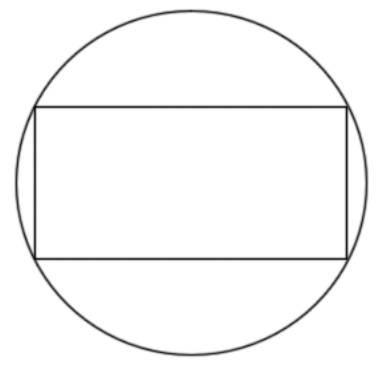

**Solution**

We know that the formula for circle is:

$$ x^2 + y^2 = r^2 $$

And we know the radius is $5$ so:

$$ x^2 + y^2 = (\pm 5)^2 = 25 $$

And we can remove the minus if we think of the circle being centered on the
standard cartesian $x$ $y$ axis, and the upper right hand corner of the
rectangle being a point along the circumference of the circle:

$$ x^2 + y^2 = 5^2 = 25 $$

We therefore can determine that the length of the rectangle is $2y$ and the
width of the rectangle is $2x$. This gives us a formula for the Area of the
rectangle, which ultimately we are trying to find:

$$ A = lw = (2y)(2x) = 4xy $$

So now we have a maximize and a constraint:

$$ \text{Maximize : } A = 4xy $$

$$ \text{Constraint : } x^2 + y^2 = 25 $$

If we solve for $y$ from our constraint, we can find our Area in terms of $x$:

$$ x^2 + y^2 = 25 $$

$$ y^2 = 25 - x^2 $$

$$ y = \pm \sqrt{25 - x^2} $$

Again, since the point we're using for reference is in the first quadrant, we
can drop the $\pm$ in favor of $+$.

$$ y = \sqrt{25 - x^2} $$

Now plug it into $A$ to find $A(x)$:

$$ A = 4xy $$

$$ A(x) = 4x\sqrt{25 - x^2} $$

And then take the first derivative to find critical points.

$$ A(x) = 4x(25 - x^2)^{\frac{1}{2}} $$

$$ A'(x) = (4x)'(25 - x^2)^{\frac{1}{2}} + (4x)\left[(25 - x^2)^{\frac{1}{2}}\right]' $$

$$ A'(x) = 4\sqrt{25 - x^2} + 4x\left(\frac{1}{2}\right)(25 - x^2)^{-\frac{1}{2}}(25 - x^2)' $$

$$ A'(x) = 4\sqrt{25 - x^2} + 2x(25 - x^2)^{-\frac{1}{2}}(-2x) $$

$$ A'(x) = 4\sqrt{25 - x^2} - \frac{4x^2}{\sqrt{25 - x^2}} $$

$$ A'(x) = \frac{4(25 - x^2) - 4x^2}{\sqrt{25 - x^2}} $$

$$ A'(x) = \frac{100 - 4x^2 - 4x^2}{\sqrt{25 - x^2}} $$

$$ A'(x) = \frac{100 - 8x^2}{\sqrt{25 - x^2}} $$

Since $x$ must stay inside the circle, and within the first quadrant, this gives
us a range of $0 \leq x \leq 5$. Let's now set our first derivative to $0$ to
find the critical point(s):

$$ \frac{100 - 8x^2}{\sqrt{25 - x^2}} = 0 $$

$$ 100 - 8x^2 = 0 $$

$$ 100 = 8x^2 $$

$$ x^2 = \frac{25}{2} $$

$$ x = \pm \sqrt{\frac{25}{2}} $$

$$ x = \pm \frac{5}{\sqrt{2}} $$

$$ 25 - x^2 = 0 $$

$$ 25 = x^2 $$

$$ x = \pm 5 $$

Since we only want points within the range, we can omit the negatives from
these, giving us two critical points that lie within the range:

$$ x = \frac{5}{\sqrt{2}} \approx 3.5355 $$

$$ x = 5 $$

One of these is also the endpoint. We test the endpoints in our Area function,
as well as the critical points. Whichever yields a maximum value is our answer.

$$ A(x) = 4x\sqrt{25 - x^2} $$

$$ A(0) = 4(0)\sqrt{25 - (0)^2} $$

$$ A(0) = 0 $$

$$ A\left(\frac{5}{\sqrt{2}}\right) = 4\left(\frac{5}{\sqrt{2}}\right)\sqrt{25 - \left(\frac{5}{\sqrt{2}}\right)^2} $$

$$ A\left(\frac{5}{\sqrt{2}}\right) = 50 $$

$$ A(5) = 4(5)\sqrt{25 - (5)^2} $$

$$ A(5) = 0 $$

So we will get the maximum area if $x = \dfrac{5}{\sqrt{2}}$. Let's plug it into
our formula for $y$ to see what the coordinates will be:

$$ y = \sqrt{25 - x^2} $$

$$ y = \sqrt{25 - \left(\frac{5}{\sqrt{2}}\right)^2} $$

$$ y = \frac{5}{\sqrt{2}}$$

And so the rectangle is in fact a square.

**5.** Determine the area of the largest rectangle whose base is on the $x$-axis
and the top two corners lie on semicircle of radius 16.

**Solution**

This is similar to 4, except we have a semi-circle here and, of course, the
radius is a different value.

Let's first establish what a semi-circle's formula is. Recall the equation for
the circle:

$$ x^2 + y^2 = r^2 $$

A semi-circle above the $x$-axis, is just a circle where all $y$ is positive.
Solving for $y$ makes this clear:

$$ x^2 + y^2 = r^2 $$

$$ y^2 = r^2 - x^2 $$

$$ y = \pm \sqrt{r^2 - x^2} $$

And then to get all $y$ that are positive, just limit $y$ to positive:

$$ y = \sqrt{r^2 - x^2} $$

Plugging in our radius of $16$ gives us:

$$ y = \sqrt{256 - x^2} $$

The area of the rectangle is slightly different than problem 4 though. While the
width is still $2x$, since the rectangle's base is limited to the $x$-axis, the
length is only $y$. Therefore, we can calculate the Area of the rectangle like
so:

$$ A = lw = 2xy $$

This gives us a Maximize and Constraint:

$$ \text{Maximize : } A = 2xy $$

$$ \text{Constraint : } y = \sqrt{256 - x^2} $$

Let's first find $A(x)$:

$$ A = 2xy $$

$$ A(x) = 2x\sqrt{256 - x^2} $$

Now let's find the first derivative and then solve for $0$ to find critical
point(s):

$$ A(x) = 2x(256 - x^2)^{\frac{1}{2}} $$

$$ A'(x) = (2x)'(256 - x^2)^{\frac{1}{2}} + (2x)\left[(256 - x^2)^{\frac{1}{2}}\right]' $$

$$ A'(x) = 2\sqrt{256 - x^2} + 2x\left(\frac{1}{2}\right)(256 - x^2)^{-\frac{1}{2}}(256 - x^2)' $$

$$ A'(x) = 2\sqrt{256 - x^2} + 2x\left(\frac{1}{2}\right)(256 - x^2)^{-\frac{1}{2}}(-2x) $$

$$ A'(x) = 2\sqrt{256 - x^2} - \frac{2x^2}{\sqrt{256 - x^2}} $$

$$ A'(x) = \frac{2(256 - x^2) - 2x^2}{\sqrt{256 - x^2}} $$

$$ A'(x) = \frac{512 - 2x^2 - 2x^2}{\sqrt{256 - x^2}} $$

$$ A'(x) = \frac{512 - 4x^2}{\sqrt{256 - x^2}} $$

Let's set to $0$ and find critical point(s):

$$ 512 - 4x^2 = 0 $$

$$ 512 = 4x^2 $$

$$ 128 = x^2 $$

$$ x = \pm \sqrt{128} $$

$$ x = \pm 8\sqrt{2} \approx 11.3137 $$

$$ 256 - x^2 = 0 $$

$$ 256 = x^2 $$

$$ x = \pm 16 $$

But the range if we take only one point in the first quadrant would be:

$$ 0 \leq x \leq 16 $$

So we can omit the negative critical points. This leaves us with:

$$ x = 8\sqrt{2} \text{, } x = 16 $$

And we can plug these into our Area function (one is an endpoint) along with our
endpoints to see which is our maximum.

$$ A(x) = 2x\sqrt{256 - x^2} $$

$$ A(0) = 2(0)\sqrt{256 - (0)^2} = 0 $$

$$ A(8\sqrt{2}) = 2(8\sqrt{2})\sqrt{256 - (8\sqrt{2})^2} \approx 76.1093 $$

$$ A(16) = 2(16)\sqrt{256 - (16)^2} = 0 $$

So it looks like we'll get the maximum area of our rectangle if $x = 8\sqrt{2}$.
Let's also find our $y$ coordinate:

$$ y = \sqrt{256 - x^2} $$

$$ y = \sqrt{256 - (8\sqrt{2})^2} \approx 11.3137 $$

One might be tempted to think this is also a square, but it's not. Because the
width is $2x$, and the length is $y$, the width is approximately $2(11.3137)$
while the length is approximately $11.3137$.

**6.** Determine the area of the largest rectange whose base is on the $x$-axis
and the tope two corners lie $y = 4 - x^2$.

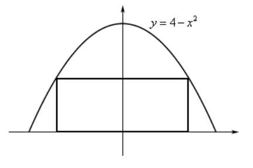

**Solution**

Here we are given the formula of an inverted parabola as the shape that will
constrain our rectangle.

Let's first establish the Area formula for our rectangle. Much like in number 5,
we can first set a point in the first quadrant as positive $x$ and $y$. This
again will make our width $2x$ and our length $y$ (as we never dip into negative
$y$ as the base is at the $x$-axis). This leaves us with the Area formula of:

$$ A = lw = 2xy $$

This leaves us with our Maximize and Constraint as:

$$ \text{Maximize : } A = 2xy  $$

$$ \text{Constraint : } y = 4 - x^2 $$

We can plug this constraint into our Area formula like so:

$$ A = 2xy $$

$$ A(x) = 2x(4 - x^2) $$

$$ A(x) = 8x - 2x^3 $$

Let's now find the first derivative and set it to $0$ to find critical point(s):

$$ A'(x) = 8 - 6x^2 $$

$$ 0 = 8 - 6x^2 $$

$$ -8 = -6x^2 $$

$$ 6x^2 = 8 $$

$$ x^2 = \frac{8}{6} $$

$$ x = \pm \sqrt{\frac{4}{3}} $$

$$ x = \pm \frac{2}{\sqrt{3}} $$

And again, we're looking for just the first point in the first quadrant, so $x$
is positive:

$$ x = \frac{2}{\sqrt{3}} \approx 1.1547 $$

Let's also establish that our range as well. We'll need to establish this a bit
differently than before. Consider that our only constraint is that the rectangle
must remain within the parabola and must be above the $x$-axis.

$$ y = 4 - x^2 \geq 0 $$

$$ 4 - x^2 \geq 0 $$

$$ 4 \geq x^2 $$

$$ 2 \geq x \geq -2 $$

$$ -2 \leq x \leq 2 $$

And the critical point we found is within that range. Let's evaluate $A(x)$ at
this critical point and the endpoints of our range. Taking the maximum of the
results will yield our answer.

$$ A(x) = 8x - 2x^3 $$

$$ A(-2) = 8(-2) - 2(-2)^3 = 0 $$

$$ A\left(\frac{2}{\sqrt{3}}\right) = 8\left(\frac{2}{\sqrt{3}}\right) - 2\left(\frac{2}{\sqrt{3}}\right)^3 \approx 6.1584 $$

$$ A(2) = 8(2) - 2(2)^3 = 0 $$

So it looks like our rectangle will be at maximum area at
$x = \dfrac{2}{\sqrt{3}}$. Let's find the $y$-coordinate at this point:

$$ y = 4 - x^2 $$

$$ y = 4 - \left(\frac{2}{\sqrt{3}}\right)^2 \approx 2.6667  $$

Obviously, we definitely have a rectangle here, with a width approximately of
$2(1.1547)$ and a length of approximately $2.6667$.

**7.** Find the point(s) on $\dfrac{x^2}{4} + \dfrac{y^2}{36} = 1$ that are
closest to $(0, 1)$.

**Solution**

Here is a graph of the given function:

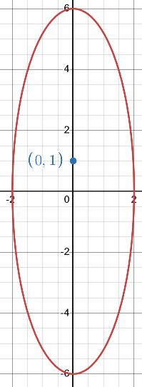

Recall also that the distance formula is:

$$ d = \sqrt{\left(x_2 - x_1\right)^2 + \left(y_2 - y_1\right)^2} $$

Because the point given is $(0, 1)$, this means there will be two points that
give the shortest distance, as the graph is an ellipse with the graph's origin
as the center. This means we can plug this point into our distance formula:

$$ d = \sqrt{(x - 0)^2 + (y - 1)^2} = \sqrt{x^2 + (y - 1)^2} $$

Let's now express this as a function squared for ease of use:

$$ D = d^2 = x^2 + (y - 1)^2 $$

We could just plug in for $y$, but as demonstrated in the lecture notes, a
second method is usually easier. Let's take our original constraint formula and
solve for $x^2$:

$$ \frac{x^2}{4} + \dfrac{y^2}{36} = 1 $$

$$ \frac{x^2}{4} = 1 - \dfrac{y^2}{36} $$

$$ x^2 = 4\left(1 - \dfrac{y^2}{36}\right) $$

$$ x^2 = 4 - \frac{y^2}{9} $$

Plugging this into our Distance function yields:

$$ D = x^2 + (y - 1)^2 $$

$$ D(y) = 4 - \frac{y^2}{9} + (y - 1)^2 $$

$$ D(y) = 4 - \frac{y^2}{9} + y^2 - 2y + 1 $$

$$ D(y) = \frac{8}{9}y^2 - 2y + 5 $$

Then take the first and second derivative of $D(y)$:

$$ D'(y) = \frac{16}{9}y - 2  $$

$$ D''(y) = \frac{16}{9} $$

Let's now also find our critical point(s):

$$ \frac{16}{9}y - 2 = 0 $$

$$ \frac{16}{9}y = 2 $$

$$ y = \frac{9}{8} $$

We have a single critical point, and since the second derivative is positive, we
know that the concavity is up, and therefore this is a relative minimum, which
is what we are looking for (minimizing distance).

We now just need to plug this $y$ into our formula for $x^2$, find $x$, and this
will yield our two points.

$$ x^2 = 4 - \frac{y^2}{9} $$

$$ x^2 = 4 - \frac{\left(\dfrac{9}{8}\right)^2}{9} $$

$$ x^2 = \frac{247}{64} $$

$$ x = \pm \sqrt{\frac{247}{64}} = \pm \frac{\sqrt{247}}{8} \approx \pm 1.9645 $$

So our two critical points are:

$$ \left(-\frac{\sqrt{247}}{8}, \frac{9}{8}\right) \text{, } \left(\frac{\sqrt{247}}{8}, \frac{9}{8}\right) $$

And indeed, graphing these points indicates this is correct:

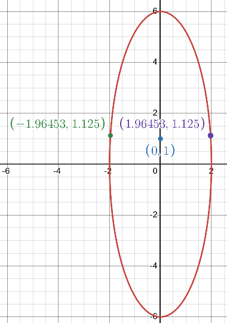

**8.** Find the point(s) on $x = y^2 - 8$ that are closest to $(5, 0)$.

**Solution**

Here is a graph of the given function:

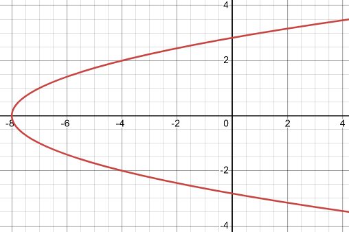

If the shortest distance isn't at $y = 0$, there will be two points on the
graph. Let's revisit our distance formula:

$$ d = \sqrt{(x_2 - x_1)^2 + (y_2 - y_1)^2} $$

Given the constraints of the function as well as the point, we can take the
point and adjust the distance formula like so:

$$ d = \sqrt{(x - 5)^2 + (y - 0)^2} = \sqrt{(x - 5)^2 + y^2} $$

Let's now rewrite this as a form of $d^2$ for ease of use:

$$ D = d^2 = (x - 5)^2 + y^2 $$

We could just plug in for $x$, but solving for $y^2$ and plugging that in might
be easier.

$$ x = y^2 - 8 $$

$$ y^2 = x + 8 $$

$$ D = (x - 5)^2 + y^2 $$

$$ D(x) = (x - 5)^2 + x + 8 $$

$$ D(x) = x^2 - 9x + 33 $$

And take the first and second derivative:

$$ D'(x) = 2x - 9 $$

$$ D''(x) = 2 $$

And find critical point(s):

$$ 2x - 9 = 0 $$

$$ 2x = 9 $$

$$ x = \frac{9}{2} $$

We have a single critical point. We also know that since the second derivative
is a constant positive, we know that this is concave up, and that this critical
point is a relative minimum, which is what we are looking for. Plugging in for
$x$ into our formula for $y^2$ will yield our two points as the answer:

$$ y^2 = x + 8 $$

$$ y^2 = \left(\frac{9}{2}\right) + 8 $$

$$ y^2 = \frac{25}{2} $$

$$ y = \pm \sqrt{\frac{25}{2}} $$

$$ y = \pm \frac{5}{\sqrt{2}} $$

So our two points closest too $(5, 0)$ are:

$$ \boxed{\left(\frac{9}{2}, -\frac{5}{\sqrt{2}}\right) \text{, } \left(\frac{9}{2}, \frac{5}{\sqrt{2}}\right)} $$

**9.** Find the point(s) on $y = 2 - x^2$ that are closest to $(0, -3)$.

**Solution**

Graph of the given function and point:

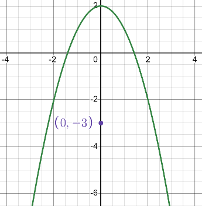

Unless $x = 0$, there will be two points. Distance formula:

$$ d = \sqrt{(x_2 - x_1)^2 + (y_2 - y_1)^2} $$

$$ d = \sqrt{(x - 0)^2 + (y - (-3))^2} = \sqrt{x^2 + (y + 3)^2} $$

$$ D = d^2 = x^2 + (y + 3)^2 $$

Plug in for $x^2$.

$$ y = 2 - x^2 $$

$$ y - 2 = -x^2 $$

$$ x^2 = 2 - y $$

$$ D = x^2 + (y + 3)^2 $$

$$ D(y) = (2 - y) + (y + 3)^2 $$

$$ D(y) = y^2 + 5y + 11 $$

Find first and second derivatives:

$$ D'(y) = 2y + 5 $$

$$ D''(y) = 2 $$

Find critical point(s):

$$ 2y + 5 = 0 $$

$$ 2y = -5 $$

$$ y = -\frac{5}{2} $$

We have a single critical point and the second derivative is concave up, meaning
relative minimum, yay.

Plug in for $x^2$ to find our two final points:

$$ x^2 = 2 - y $$

$$ x^2 = 2 - \left(-\frac{5}{2}\right) $$

$$ x^2 = \frac{9}{2} $$

$$ x = \pm \frac{3}{\sqrt{2}} $$

So our two points are:

$$ \boxed{\left(-\frac{3}{\sqrt{2}}, -\frac{5}{2}\right) \text{, } \left(\frac{3}{\sqrt{2}}, -\frac{5}{2}\right)} $$

**10.** A 6 ft piece of wire is cut into two pieces. One piece is bent into an
equilateral triangle and the other will be bent into a rectangle with one side
twice the length of the other side. Determine where, if anywhere, the wire
should be cut to minimize the area enclosed by the two figures.

**Solution**

**11.** A 250 cm piece of wire is cut into two pieces. One piece is bent into an
equilateral triangle and the other will be bent into circle. Determine where, if
anywhere, the wire should be cut to maximize the area enclosed by the two
figures.

**Solution**

**12.** A 250 cm piece of wire is cut into two pieces. One piece is bent into an
equilateral triangle and the other will be bent into circle. Determine where, if
anywhere, the wire should be cut to minimize the area enclosed by the two
figures.

**Solution**

**13.** A 4 m piece of wire is cut into two pieces. One piece is bent into a
circle and the other will be bent into a rectangle with one side three times the
length of the other side. Determine where, if anywhere, the wire should be cut
to maximize the area enclosed by the two figures.

**Solution**

**14.** A line through the point $(-4, 1)$ forms a right triangle with the
$x$-axis and $y$-axis in the 2nd quadrant. Determine the equation of
the line that will minimize the area of this triangle.

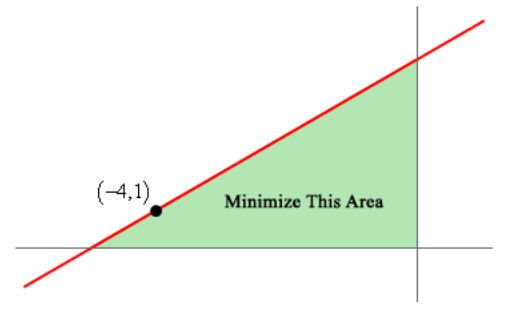

**Solution**

**15.** A line through the point $(3, 3)$ forms a right triangle with the
$x$-axis and $y$-axis in the 1st quadrant. Determine the equation of
the line that will minimize the area of this triangle.

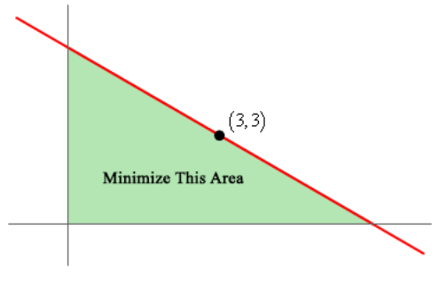

**Solution**

**16.** A piece of pipe is being carried down a hallway that is 14 feet wide. At
the end of the hallway there is a right-angled turn and the hallway narrows down
to 6 feet wide. What is the longest pipe (always keeping it horizontal) that can
be carried around the turn in the hallway?

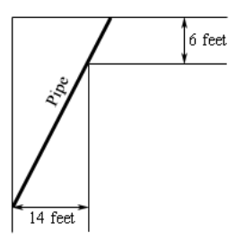

**Solution**

**17.** A piece of pipe is being carried down a hallway that is 9 feet wide. At
the end of the hallway there is a right-angled turn and the hallway widens up to
25 feet wide. What is the longest pipe (always keeping it horizontal) that can
be carried around the turn in the hallway?

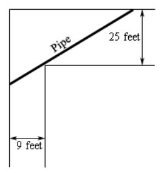

**Solution**

**18.** Two poles, one 15 meters tall and one 10 meters tall, are 40 meters
apart. A length of wire is attached to the top of each pole and it is staked to
the ground somewhere between the two poles. Where should the wire be staked so
that the minimum amount of wire is used?

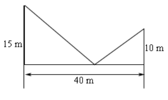

**Solution**

**19.** Two poles, one 2 feet tall and one 5 feet tall, are 3 feet apart. A
length of wire is attached to the top of each pole and it is staked to the
ground somewhere between the two poles. Where should the wire be staked so that
the minimum amount of wire is used?

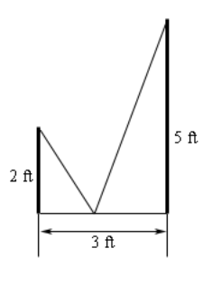

**Solution**

**20.** Two poles, one 15 meters tall and one 10 meters tall, are 40 meters
apart. A length of wire is attached to the top of each pole and it is staked to
the ground somewhere between the two poles. Where should the wire be staked so
that the angle formed by the two pieces of wire at the stake is a maximum?

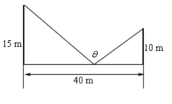

**Solution**

**21.** Two poles, one 34 inches tall and one 17 inches tall, are 3 feet apart.
A length of wire is attached to the top of each pole and it is staked to the
ground somewhere between the two poles. Where should the wire be staked so that
the angle formed by the two pieces of wire at the stake is a maximum?

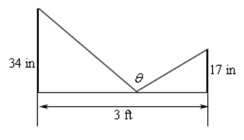

**Solution**

**22.** A trough for holding water is to be formed as shown in the figure below.
Determine the angle $\theta$ that will maximize the amount of water that the
trough can hold.

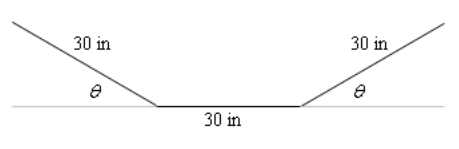

**Solution**

**23.** A trough for holding water is to be formed as shown in the figure below.
Determine the angle $\theta$ that will maximize the amount of water that the
trough can hold.

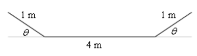

**Solution**
