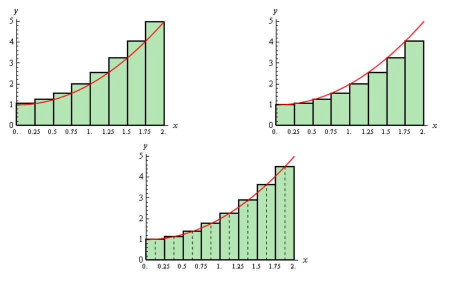

# Section 5.5 : Area Problem

As noted in the first section of this section there are two kinds of integrals
and to this point we've looked at indefinite integrals. It is now time to start
thinking about the second kind of integral : Definite Integrals. However, before
we do that we’re going to take a look at the Area Problem. The area problem is
to definite integrals what the tangent and rate of change problems are to
derivatives.

The area problem will give us one of the interpretations of a definite integral
and it will lead us to the definition of the definite integral.

To start off we are going to assume that we've got a function $f(x)$ that is
positive on some interval $[a, b]$. What we want to do is determine the area of
the region between the function and the $x$-axis.

It's probably easiest to see how we do this with an example. So, let's determine
the area between $f(x) = x^2 + 1$ on $[0, 2]$. In other words, we want to
determine the area of the shaded region below.

Now, at this point, we can’t do this exactly. However, we can estimate the area.
We will estimate the area by dividing up the interval into n subintervals each
of width,

$$ \Delta x = \frac{b - a}{n} $$

Then in each interval we can form a rectangle whose height is given by the
function value at a specific point in the interval. We can then find the area of
each of these rectangles, add them up and this will be an estimate of the area.

It's probably easier to see this with a sketch of the situation. So, let's
divide up the interval into 4 subintervals and use the function value at the
right endpoint of each interval to define the height of the rectangle. This
gives,

Note that by choosing the height as we did each of the rectangles will over
estimate the area since each rectangle takes in more area than the graph each
time. Now let's estimate the area. First, the width of each of the rectangles is
$\dfrac{1}{2}$. The height of each rectangle is determined by the function value
at the right endpoint and so the height of each rectangle is nothing more that
the function value at the right endpoint. Here is the estimated area.

$$ A_r = \frac{1}{2}f\left(\frac{1}{2}\right) + \frac{1}{2}f(1) + \frac{1}{2}f\left(\frac{3}{2}\right) + \frac{1}{2}f(2) $$

$$ \quad = \frac{1}{2}\left(\frac{5}{4}\right) + \frac{1}{2}(2) + \frac{1}{2}\left(\frac{13}{4}\right) + \frac{1}{2}(5) $$

$$ \quad = 5.75 $$

Of course, taking the rectangle heights to be the function value at the right
endpoint is not our only option. We could have taken the rectangle heights to be
the function value at the left endpoint. Using the left endpoints as the heights
of the rectangles will give the following graph and estimated area.

$$ A_l = \frac{1}{2}f(0)  + \frac{1}{2}f\left(\frac{1}{2}\right) + \frac{1}{2}f(1) + \frac{1}{2}f\left(\frac{3}{2}\right) $$

$$ \quad = \frac{1}{2}(1) + \frac{1}{2}\left(\frac{5}{4}\right) + \frac{1}{2}(2) + \frac{1}{2}\left(\frac{13}{4}\right) $$

$$ \quad = 3.75 $$

In this case we can see that the estimation will be an underestimation since
each rectangle misses some of the area each time.

There is one more common point for getting the heights of the rectangles that is
often more accurate. Instead of using the right or left endpoints of each sub
interval we could take the midpoint of each subinterval as the height of each
rectangle. Here is the graph for this case.

So, it looks like each rectangle will over and under estimate the area. This
means that the approximation this time should be much better than the previous
two choices of points. Here is the estimation for this case.

$$ A_m = \frac{1}{2}f\left(\frac{1}{4}\right) + \frac{1}{2}f\left(\frac{3}{4}\right) + \frac{1}{2}f\left(\frac{5}{4}\right) +\frac{1}{2}f\left(\frac{7}{4}\right)  $$

$$ \quad = \frac{1}{2}\left(\frac{17}{16}\right) + \frac{1}{2}\left(\frac{25}{16}\right) + \frac{1}{2}\left(\frac{41}{16}\right) + \frac{1}{2}\left(\frac{65}{16}\right) $$

$$ \quad = 4.625 $$

We've now got three estimates. For comparison's sake the exact area is

$$ A = \frac{14}{3} = 4.66\overline{6} $$

So, both the right and left endpoint estimation did not do all that great of a
job at the estimation. The midpoint estimation however did quite well.

Be careful to not draw any conclusion about how choosing each of the points will
affect our estimation. In this case, because we are working with an increasing
function choosing the right endpoints will overestimate and choosing left
endpoint will underestimate.

If we were to work with a decreasing function we would get the opposite results.
For decreasing functions the right endpoints will underestimate and the left
endpoints will overestimate.

Also, if we had a function that both increased and decreased in the interval we
would, in all likelihood, not even be able to determine if we would get an
overestimation or underestimation.

Now, let's suppose that we want a better estimation, because none of the
estimations above really did all that great of a job at estimating the area. We
could try to find a different point to use for the height of each rectangle but
that would be cumbersome and there wouldn't be any guarantee that the estimation
would in fact be better. Also, we would like a method for getting better
approximations that would work for any function we would chose to work with and
if we just pick new points that may not work for other functions.

The easiest way to get a better approximation is to take more rectangles (_i.e._
increase $n$). Let’s double the number of rectangles that we used and see what
happens. Here are the graphs showing the eight rectangles and the estimations
for each of the three choices for rectangle heights that we used above.

Here are the area estimations for each of these cases.

$$ A_r = 5.1875 \quad A_l = 4.1875 \quad A_m = 4.65625 $$

So, increasing the number of rectangles did improve the accuracy of the
estimation as we’d guessed that it would.

Let's work a slightly more complicated example.

---

**Example 1** Estimate the area between $f(x) = x^3 - 5x^2 + 6x + 5$ and the
$x$-axis on $[0, 4]$ using $n = 5$ subintervals and all three cases above for
the heights of each rectangle.

**Solution**

First, let's get the graph to make sure that the function is positive.

So, the graph is positive and the width of each subinterval will be,

$$ \Delta x = \frac{4}{5} = 0.8 $$

This means that the endpoints of the subintervals are,

$$ 0 \text{, } 0.8 \text{, } 1.6 \text{, } 2.4 \text{, } 3.2 \text{, }  4 $$

Let's first look at using the right endpoints for the function height. Here is
the graph for this case.

Notice, that unlike the first area we looked at, the choosing the right
endpoints here will both over and underestimate the area depending on where we
are on the curve. This will often be the case with a more general curve that the
one we initially looked at. The area estimation using the right endpoints of
each interval for the rectangle height is,

$$ A_r = 0.8f(0.8) + 0.8f(1.6) + 0.8f(2.4) + 0.8f(3.2) + 0.8f(4) $$

$$ \quad = 28.96 $$

Now let's take a look at left endpoints for the function height. Here is the
graph.

The area estimation using the left endpoints of each interval for the rectangle
height is,

$$ A_l = 0.8f(0) + 0.8f(0.8) + 0.8f(1.6) + 0.8f(2.4) + 0.8f(3.2) $$

$$ \quad = 22.56 $$

Finally, let's take a look at the midpoints for the heights of each rectangle.
Here is the graph,

The area estimation using the midpoint is then,

$$ A_m = 0.8f(0.4) + 0.8f(1.2) + 0.8f(2) + 0.8f(2.8) + 0.8f(3.6) $$

$$ \quad = 25.12 $$

For comparison purposes the exact area is,

$$ A = \frac{76}{3} = 25.33\overline{3} $$

---

So, again the midpoint did a better job than the other two. While this will be
the case more often than not, it won't always be the case and so don't expect
this to always happen.

Now, let's move on to the general case. Let's start out with $f(x) \geq 0$ on
$[a, b]$ and we'll divide the interval into $n$ subintervals each of length,

$$ \Delta x = \frac{b - a}{n} $$

Note that the subintervals don't have to be equal length, but it will make our
work significantly easier. The endpoints of each subinterval are,

$$ x_0 = a $$

$$ x_1 = a + \Delta x $$

$$ x_2 = a + 2 \Delta x $$

$$ \vdots $$

$$ x_i = a + i\Delta x $$

$$ \vdots $$

$$ x_{n - 1} = a + (n - 1)\Delta x $$

$$ x_n = a + n\Delta x \quad \quad \quad = b $$

Next in each interval,

$$ [x_0, x_1]\text{, } [x_1, x_2] \text{, } \dots \text{, } [x_{i - 1}, x_i] \text{, } \dots \text{, } [x_{n - 1}, x_n] $$

we choose a point $x_1^*,x_2^*,\dots,x_i^*,\dots,x_n^*$. These points will
define the height of the rectangle in each subinterval. Note as well that these
points do not have to occur at the same point in each subinterval. However, they
are usually the left end point of the interval, right end point of the interval
or the midpoint of the interval.

Here is a sketch of this situation.

The area under the curve on the given interval is then approximately,

$$ A \approx f\left(x_1^*\right)\Delta x + f\left(x_2^*\right)\Delta x + \dots + f\left(x_i^*\right)\Delta x + \dots + f\left(x_n^*\right)\Delta x $$

We will use **summation notation** or **sigma notation** at this point to
simplify up our notation a little. If you need a refresher on summation notation
check out the
[**section**](https://tutorial.math.lamar.edu/Classes/CalcI/SummationNotation.aspx)
devoted to this in the Extras chapter.

Using summation notation the area estimation is,

$$ A \approx \sum\limits_{i = 1}^n f\left(x_i^*\right)\Delta x $$

The summation in the above equation is called a **Riemann Sum**.

To get a better estimation we will take n larger and larger. In fact, if we let
n go out to infinity we will get the exact area. In other words,

$$ A = \lim\limits_{n \to \infty}\sum_{i = 1}^nf\left(x_i^*\right)\Delta x $$

Before leaving this section let's address one more issue. To this point we've
required the function to be positive in our work. Many functions are not
positive however. Consider the case of $f(x) = x^2 - 4$ on $[0, 2]$. If we use
$n = 8$ and the midpoints for the rectangle height we get the following graph,

In this case let's notice that the function lies completely below the $x$-axis
and hence is always negative. If we ignore the fact that the function is always
negative and use the same ideas above to estimate the area between the graph and
the $x$-axis we get,

$$ A_m = \frac{1}{4}f\left(\frac{1}{8}\right) + \frac{1}{4}f\left(\frac{3}{8}\right) + \frac{1}{4}f\left(\frac{5}{8}\right) + \frac{1}{4}\left(\frac{7}{8}\right) + \frac{1}{4}f\left(\frac{9}{8}\right) + \frac{1}{4}f\left(\frac{11}{8}\right) + \frac{1}{4}f\left(\frac{13}{8}\right) + \frac{1}{4}f\left(\frac{15}{8}\right) $$

$$ \quad = -5.34375 $$

Our answer is negative as we might have expected given that all the function
evaluations are negative.

So, using the technique in this section it looks like if the function is above
the $x$-axis we will get a positive area and if the function is below the
$x$-axis we will get a negative area. Now, what about a function that is both
positive and negative in the interval? For example, $f(x) = x^2 - 2$ on
$[0, 2]$. Using $n = 8$ and midpoints the graph is,

Some of the rectangles are below the x-axis and so will give negative areas
while some are above the $x$-axis and will give positive areas. Since more
rectangles are below the $x$-axis than above it looks like we should probably
get a negative area estimation for this case. In fact that is correct. Here the
area estimation for this case.

$$ A_m  = \frac{1}{4}f\left(\frac{1}{8}\right) + \frac{1}{4}f\left(\frac{3}{8}\right) + \frac{1}{4}f\left(\frac{5}{8}\right) + \frac{1}{4}f\left(\frac{7}{8}\right) + \frac{1}{4}f\left(\frac{9}{8}\right) + \frac{1}{4}f\left(\frac{11}{8}\right) + \frac{1}{4}f\left(\frac{13}{8}\right) + \frac{1}{4}f\left(\frac{15}{8}\right) $$

$$ \quad = -1.34375 $$

In cases where the function is both above and below the $x$-axis the technique
given in the section will give the net area between the function and the
$x$-axis with areas below the $x$-axis negative and areas above the $x$-axis
positive. So, if the net area is negative then there is more area under the
$x$-axis than above while a positive net area will mean that more of the area is
above the $x$-axis.

---

## Practice Problems

For problems 1 - 3 estimate the area of the region between the function and the
$x$-axis on the given interval using $n = 6$ and using,

**(a)** the right end points of the subintervals for the height of the
rectangles

**(b)** the left end points of the subintervals for the height of the rectangles
and,

**\(c\)** the midpoints of the subintervals for the height of the rectangles.

**1.** $f(x) = x^3 - 2x^2 + 4$ on $[1, 4]$

**(a)**

**Solution**

First establish the $\Delta x$:

$$ \Delta x =\frac{b - a}{n} $$

$$ \Delta x =\frac{4 - 1}{6} = \frac{1}{2} $$

This means that within the interval, $[1, 4]$, we start at $1$, and travel
$\dfrac{1}{2}$ to find the value for $f(x_i^*)$. The question is then which side
do we take, in this case, we are taking the right-end endpoints. This means we
omit $f(1)$ at the beginning because that will be the left most point.

$$ A \approx \frac{1}{2}f\left(\frac{3}{2}(\right) + \frac{1}{2}f(2) + \frac{1}{2}f\left(\frac{5}{2}\right) + \frac{1}{2}f(3) + \frac{1}{2}\left(\frac{7}{2}\right) + \frac{1}{2}f(4) $$

$$ A \approx \frac{1}{2}\left(\frac{23}{8}\right) + \frac{1}{2}(4) + \frac{1}{2}\left(\frac{57}{8}\right) + \frac{1}{2}(13) + \frac{1}{2}\left(\frac{179}{8}\right) + \frac{1}{2}(36) $$

$$ \boxed{A \approx \frac{683}{16} = 42.6875} $$

**(b)**

**Solution**

Here, we start at $1$, but omit $4$ since we are looking at the left-most
points.

$$ A \approx \frac{1}{2}f(1) + \frac{1}{2}f\left(\frac{3}{2}\right) + \frac{1}{2}f(2) + \frac{1}{2}f\left(\frac{5}{2}\right) + \frac{1}{2}f(3) + \frac{1}{2}\left(\frac{7}{2}\right) $$

$$ A \approx \frac{1}{2}(3) + \frac{1}{2}\left(\frac{23}{8}\right) + \frac{1}{2}(4) + \frac{1}{2}\left(\frac{57}{8}\right) + \frac{1}{2}(13) + \frac{1}{2}\left(\frac{179}{8}\right) $$

$$ \boxed{A \approx \frac{419}{16} \approx 26.1875} $$

**\(c\)**

**Solution**

Here we have to think about the midpoints between the two intervals to find
which input to plug into $f(x)$.

Let's just take our first interval for example our first interval lies in the
range of $\left[1, \dfrac{3}{2}\right]$, the midpoint between this is
$1 + \dfrac{1}{4}$ or $\dfrac{5}{4}$, we then still travel by $\dfrac{1}{2}$
intervals.

$$ A \approx \frac{1}{2}f\left(\frac{5}{4}\right) + \frac{1}{2}f\left(\frac{7}{4}\right) + \frac{1}{2}f\left(\frac{9}{4}\right) + \frac{1}{2}f\left(\frac{11}{4}\right) + \frac{1}{2}f\left(\frac{13}{4}\right) + \frac{1}{2}f\left(\frac{15}{4}\right) $$

$$ A \approx \frac{1}{2}\left(\frac{181}{64}\right) + \frac{1}{2}\left(\frac{207}{64}\right) + \frac{1}{2}\left(\frac{337}{64}\right) + \frac{1}{2}\left(\frac{619}{64}\right) + \frac{1}{2}\left(\frac{1101}{64}\right) + \frac{1}{2}\left(\frac{1831}{64}\right) $$

$$ \boxed{A \approx \frac{1069}{32} = 33.40625} $$

**2.** $g(x) = 4 - \sqrt{x^2 + 2}$ on $[-1, 3]$

**(a)**

**Solution**

This doesn't change much from **1**, just that we are working with a different
function and a different nterval. Let's plug in our range into our $\Delta x$
formula:

$$ \Delta x = \frac{3 - (-1)}{6} = \frac{2}{3} $$

This means we don't start from $-1$ (because we are looking at the rightmost
points of the rectangles formed by the intervals). But rather from
$-1 + \dfrac{2}{3} = -\dfrac{1}{3}$.

$$ A \approx \frac{2}{3}f\left(-\frac{1}{3}\right) + \frac{2}{3}f\left(\frac{1}{3}\right) + \frac{2}{3}f(1)  + \frac{2}{3}f\left(\frac{5}{3}\right) + \frac{2}{3}f\left(\frac{7}{3}\right) + \frac{2}{3}f(3) $$

$$ A \approx \frac{2}{3}\left(4 - \frac{\sqrt{19}}{3}\right) + \frac{2}{3}\left(4 - \frac{\sqrt{19}}{3}\right) + \frac{2}{3}\left(4 - \sqrt{3}\right)  + \frac{2}{3}\left(4 - \frac{\sqrt{43}}{3}\right) + \frac{2}{3}\left(4 - \frac{\sqrt{67}}{3}\right) + \frac{2}{3}\left(4 - \sqrt{11}\right) $$

$$ \boxed{A \approx 7.420752005} $$

**(b)**

**Solution**

Now from the left hand side which means we incldue $-1$, but omit $3$.

$$ A \approx \frac{2}{3}f(-1) + \frac{2}{3}f\left(-\frac{1}{3}\right) + \frac{2}{3}f\left(\frac{1}{3}\right) + \frac{2}{3}f(1)  + \frac{2}{3}f\left(\frac{5}{3}\right) + \frac{2}{3}f\left(\frac{7}{3}\right) $$

$$ A \approx \frac{2}{3}\left(4 - \sqrt{3}\right) + \frac{2}{3}\left(4 - \frac{\sqrt{19}}{3}\right) + \frac{2}{3}\left(4 - \frac{\sqrt{19}}{3}\right) + \frac{2}{3}\left(4 - \sqrt{3}\right)  + \frac{2}{3}\left(4 - \frac{\sqrt{43}}{3}\right) + \frac{2}{3}\left(4 - \frac{\sqrt{67}}{3}\right) $$

$$ A \approx \frac{2}{3}\left(4 - \sqrt{3}\right) + \frac{2}{3}\left(4 - \frac{\sqrt{19}}{3}\right) + \frac{2}{3}\left(4 - \frac{\sqrt{19}}{3}\right) + \frac{2}{3}\left(4 - \sqrt{3}\right)  + \frac{2}{3}\left(4 - \frac{\sqrt{43}}{3}\right) + \frac{2}{3}\left(4 - \frac{\sqrt{67}}{3}\right) $$

$$ \boxed{A \approx 8.477134660} $$

**\(c\)**

**Solution**

Again, we're tasked with estimating the area by taking the midpoint of each
interval. Let's start by finding the first midpoint:

$$ \left[-1, -\frac{1}{3}\right] $$

The midpoint between these lies at $-\dfrac{2}{3}$

We can use this starting point to estimate our area:

$$ A \approx \frac{2}{3}f\left(-\frac{2}{3}\right) + \frac{2}{3}f(0) +\frac{2}{3}f\left(\frac{2}{3}\right) + \frac{2}{3}f\left(\frac{4}{3}\right) + \frac{2}{3}f(2) + \frac{2}{3}f\left(\frac{8}{3}\right) $$

$$ A \approx \frac{2}{3}\left(4 - \frac{\sqrt{22}}{3}\right) + \frac{2}{3}\left(4 - \sqrt{2}\right) +\frac{2}{3}\left(4 - \frac{\sqrt{22}}{3}\right) + \frac{2}{3}\left(4 - \frac{\sqrt{34}}{3}\right) + \frac{2}{3}\left(4 - \sqrt{6}\right) + \frac{2}{3}\left(4 - \frac{\sqrt{82}}{3}\right)  $$

$$ \boxed{A \approx 8.031493674} $$

**3.** $h(x) = -x\cos\left(\dfrac{x}{3}\right)$ on $[0, 3]$

**(a)**

**Solution**

Again, find $\Delta x$:

$$ \Delta x = \frac{3 - 0}{6} = \frac{1}{2} $$

Again, we don't start at $0$ since we're looking at the right side points.

$$ A \approx \frac{1}{2}f\left(\frac{1}{2}\right) + \frac{1}{2}f(1) + \frac{1}{2}f\left(\frac{3}{2}\right) + \frac{1}{2}f(2) + \frac{1}{2}f\left(\frac{5}{2}\right) + \frac{1}{2}f(3) $$

$$ A \approx \frac{1}{2}\left(-\frac{1}{2}\cos\left(\frac{1}{6}\right)\right) + \frac{1}{2}\left(-\cos\left(\frac{1}{3}\right)\right) + \frac{1}{2}\left(-\frac{3}{2}\cos\left(\frac{1}{2}\right)\right) + \frac{1}{2}\left(-2\cos\left(\frac{2}{3}\right)\right) + \frac{1}{2}\left(-\frac{5}{2}\cos\left(\frac{5}{6}\right)\right) + \frac{1}{2}\left(-3\cos(1)\right) $$

$$ \boxed{A \approx -3.814057227} $$

**(b)**

**Solution**

Same as part a, just taking the left side, this means we include the $0$, but
omit the $3$:

$$ A \approx \frac{1}{2}f(0) + \frac{1}{2}f\left(\frac{1}{2}\right) + \frac{1}{2}f(1) + \frac{1}{2}f\left(\frac{3}{2}\right) + \frac{1}{2}f(2) + \frac{1}{2}f\left(\frac{5}{2}\right) $$

$$ A \approx \frac{1}{2}(0) + \frac{1}{2}\left(-\frac{1}{2}\cos\left(\frac{1}{6}\right)\right) + \frac{1}{2}\left(-\cos\left(\frac{1}{3}\right)\right) + \frac{1}{2}\left(-\frac{3}{2}\cos\left(\frac{1}{2}\right)\right) + \frac{1}{2}\left(-2\cos\left(\frac{2}{3}\right)\right) + \frac{1}{2}\left(-\frac{5}{2}\cos\left(\frac{5}{6}\right)\right) $$

$$ \boxed{A \approx -3.003603768} $$

**\(c\)**

Now take the first interval as a hint on where to start:

$$ \left[0, \frac{1}{2}\right] $$

Midpoint is $\dfrac{1}{4}$.

$$ A \approx \frac{1}{2}f\left(\frac{1}{4}\right) + \frac{1}{2}f\left(\frac{3}{4}\right) + \frac{1}{2}f\left(\frac{5}{4}\right) + \frac{1}{2}f\left(\frac{7}{4}\right) +\frac{1}{2}f\left(\frac{9}{4}\right) + \frac{1}{2}f\left(\frac{11}{4}\right) $$

$$ A \approx \frac{1}{2}\left(-\frac{1}{4}\cos\left(\frac{1}{12}\right)\right) + \frac{1}{2}\left(-\frac{3}{4}\cos\left(\frac{1}{4}\right)\right) + \frac{1}{2}\left(-\frac{5}{4}cos\left(\frac{5}{12}\right)\right) + \frac{1}{2}\left(-\frac{7}{4}\cos\left(\frac{7}{12}\right)\right) +\frac{1}{2}\left(-\frac{9}{4}\cos\left(\frac{3}{4}\right)\right) + \frac{1}{2}\left(-\frac{11}{4}\cos\left(\frac{11}{12}\right)\right) $$

$$ \boxed{A \approx -3.449532216} $$

**4.** Estimate the net area between $f(x) = 8x^2 - x^5 - 12$ on the $x$-axis on
$[-2, 2]$ using $n = 8$ and the midpoints of the subintervals for the height of
the rectangles. Without looking at a graph of the function on the interval does
it appear that more of the area is above or below the $x$-axis?

**Solution**

The appearnace of whether the graph of the function on the given interval
creates an area that is more above or more below the $x$-axis is dependant ont
the estimated area found. Let's start by finding $\Delta x$:

$$ \Delta x = \frac{b - a}{n} $$

$$ \Delta x = \frac{2 - (-2)}{8} = \frac{1}{2} $$

The first midpoint can be found by knowing the first interval:

$$ \left[-2, -\frac{3}{2}\right] $$

This means our first midpoint lies at $-\dfrac{7}{4}$

$$ A \approx \frac{1}{2}f\left(-\frac{7}{4}\right) + \frac{1}{2}f\left(-\frac{5}{4}\right) + \frac{1}{2}f\left(-\frac{3}{4}\right) + \frac{1}{2}f\left(-\frac{1}{4}\right) + \frac{1}{2}f\left(\frac{1}{4}\right) + \frac{1}{2}f\left(\frac{3}{4}\right) + \frac{1}{2}f\left(\frac{5}{4}\right) + \frac{1}{2}f\left(\frac{7}{4}\right) $$

$$ \boxed{A \approx -6} $$

Thusly this would indicate that the majority of the area created is **below**
the $x$-axis.

---

## Assignment Problems

For problems 1 - 5 estimate the area of the region between the function and the
$x$-axis on the given interval using $n = 6$ and using,

**(a)** the right end points of the subintervals for the height of the
rectangles,

**(b)** the left end points of the subintervals for the height of the rectangles
and,

**\(c\)** the midpoints of the subintervals for the height of the rectangles.

**1.** $f(x) = 15 + 4x - x^3$ on $[1, 3]$

**(a)**

**Solution**

First let's find $\Delta x$:

$$ \Delta x = \frac{b - a}{n} $$

$$ \Delta x = \frac{3 - 1}{6} = \frac{1}{3}  $$

Since we're looking at the right end points, we omit $1$, and start at
$\dfrac{4}{3}$:

$$ A \approx \frac{1}{3}f\left(\frac{4}{3}\right) + \frac{1}{3}f\left(\frac{5}{3}\right) + \frac{1}{3}f(2) + \frac{1}{3}f\left(\frac{7}{3}\right) + \frac{1}{3}f\left(\frac{8}{3}\right) + \frac{1}{3}f(3) $$

$$ A \approx \frac{1}{3}\left(\frac{485}{27}\right) + \frac{1}{3}\left(\frac{460}{27}\right) + \frac{1}{3}(15) + \frac{1}{3}\left(\frac{314}{27}\right) + \frac{1}{3}\left(\frac{181}{27}\right) + \frac{1}{3}(0) $$

$$ \boxed{A \approx \frac{615}{27} = 22.77777778} $$

**(b)**

**Solution** For the left endpoints, we start at $1$, but omit $3$.

$$ A \approx \frac{1}{3}f(1) + \frac{1}{3}f\left(\frac{4}{3}\right) + \frac{1}{3}f\left(\frac{5}{3}\right) + \frac{1}{3}f(2) + \frac{1}{3}f\left(\frac{7}{3}\right) + \frac{1}{3}f\left(\frac{8}{3}\right) $$

$$ A \approx \frac{1}{3}(18) + \frac{1}{3}\left(\frac{485}{27}\right) + \frac{1}{3}\left(\frac{460}{27}\right) + \frac{1}{3}(15) + \frac{1}{3}\left(\frac{314}{27}\right) + \frac{1}{3}\left(\frac{181}{27}\right) $$

$$ \boxed{A \approx \frac{259}{9} = 28.77777778} $$

**\(c\)**

**Solution**

To find the midpoint interval, let's simply find our first midpoint and
extrapolate from there. Our first interval is:$

$$ \left[1, \frac{4}{3}\right] $$

So our midpoint of this first interval lies at $\dfrac{7}{6}$.

$$ A \approx \frac{1}{3}f\left(\frac{7}{6}\right) + \frac{1}{3}f\left(\frac{3}{2}\right) + \frac{1}{3}f\left(\frac{11}{6}\right) + \frac{1}{3}f\left(\frac{13}{6}\right) + \frac{1}{3}f\left(\frac{5}{2}\right) + \frac{1}{3}f\left(\frac{17}{6}\right) $$

$$ \boxed{A \approx 26.11111111} $$

**2.** $g(x) = -3x^2 + 2x - 1$ on $[-4, 0]$

**(a)**

**Solution**

$$ \Delta x = \frac{0 - (-4)}{6} = \frac{2}{3} $$

$$ A \approx \frac{2}{3}f\left(-\frac{10}{3}\right) + \frac{2}{3}f\left(-\frac{8}{3}\right) + \frac{2}{3}f(-2) + \frac{2}{3}f\left(-\frac{4}{3}\right) + \frac{2}{3}f\left(-\frac{2}{3}\right) + \frac{2}{3}f(0) $$

$$ A \approx \frac{2}{3}(-41) + \frac{2}{3}\left(-\frac{83}{3}\right) + \frac{2}{3}(-17) + \frac{2}{3}(-9) + \frac{2}{3}\left(-\frac{11}{3}\right) + \frac{2}{3}(-1) $$

$$ \boxed{A \approx -\frac{596}{9} =  -66.22222222} $$

**(b)**

**Solution**

$$ A \approx \frac{2}{3}f(-4) + \frac{2}{3}f\left(-\frac{10}{3}\right) + \frac{2}{3}f\left(-\frac{8}{3}\right) + \frac{2}{3}f(-2) + \frac{2}{3}f\left(-\frac{4}{3}\right) + \frac{2}{3}f\left(-\frac{2}{3}\right) $$

$$ A \approx \frac{2}{3}(-57) + \frac{2}{3}(-41) + \frac{2}{3}\left(-\frac{83}{3}\right) + \frac{2}{3}(-17) + \frac{2}{3}(-9) + \frac{2}{3}\left(-\frac{11}{3}\right) $$

$$ \boxed{A \approx -\frac{932}{9} = -103.5555556} $$

**\(c\)**

**Solution**

$$ \left[-4, -\frac{10}{3}\right] $$

Midpoint for first interval is $-\dfrac{11}{3}$.

$$ A \approx \frac{2}{3}f\left(-\frac{11}{3}\right) + \frac{2}{3}f(-3) + \frac{2}{3}f\left(-\frac{7}{3}\right) + \frac{2}{3}f\left(-\frac{5}{3}\right) + \frac{2}{3}f(-1) + \frac{2}{3}f\left(-\frac{1}{3}\right) $$

$$ A \approx \frac{2}{3}\left(-\frac{146}{3}\right) + \frac{2}{3}(-34) + \frac{2}{3}(-22) + \frac{2}{3}\left(-\frac{38}{3}\right) + \frac{2}{3}(-6) + \frac{2}{3}(-2) $$

$$ \boxed{A \approx -\frac{752}{9} = -83.55555556} $$

**3.** $h(x) = 8\ln(x) - x$ on $[2, 6]$

**(a)**

**Solution**

$$ \Delta x = \frac{6 - 2}{6} = \frac{2}{3} $$

$$ A \approx \frac{2}{3}f\left(\frac{8}{3}\right) + \frac{2}{3}f\left(\frac{10}{3}\right) + \frac{2}{3}f(4) + \frac{2}{3}f\left(\frac{14}{3}\right) + \frac{2}{3}f\left(\frac{16}{3}\right) + \frac{2}{3}f(6) $$

$$ A \approx \frac{2}{3}\left(24\ln(2) - \frac{8}{3}\ln(3)\right) + \frac{2}{3}\left(\ln(100000000) - \frac{10}{3} - 8\ln(3)\right) + \frac{2}{3}\left(16\ln(2) - 4\right) + \frac{2}{3}\left(\ln(1475789056) - \frac{14}{3}\ln(3)\right) + \frac{2}{3}\left(32\ln(2) - \frac{16}{3} - 8\ln(3)\right) + \frac{2}{3}\left(\ln(1679616) - 6\right) $$

$$ \boxed{A \approx 28.41214593} $$

**(b)**

**Solution**

$$ A \approx \frac{2}{3}f(2) + \frac{2}{3}f\left(\frac{8}{3}\right) + \frac{2}{3}f\left(\frac{10}{3}\right) + \frac{2}{3}f(4) + \frac{2}{3}f\left(\frac{14}{3}\right) + \frac{2}{3}f\left(\frac{16}{3}\right) $$

$$ A \approx \frac{2}{3}(8\ln(2) - 2) + \frac{2}{3}\left(24\ln(2) - \frac{8}{3}\ln(3)\right) + \frac{2}{3}\left(\ln(100000000) - \frac{10}{3} - 8\ln(3)\right) + \frac{2}{3}\left(16\ln(2) - 4\right) + \frac{2}{3}\left(\ln(1475789056) - \frac{14}{3}\ln(3)\right) + \frac{2}{3}\left(32\ln(2) - \frac{16}{3} - 8\ln(3)\right) $$

$$ \boxed{A \approx 25.21954706} $$

**\(c\)**

**Solution**

$$ \left[2, \frac{8}{3}\right] $$

First midpoint is $\dfrac{7}{3}$.

$$ A \approx \frac{2}{3}f\left(\frac{7}{3}\right) + \frac{2}{3}f\left(\frac{9}{3}\right) + \frac{2}{3}f\left(\frac{11}{3}\right) + \frac{2}{3}f\left(\frac{13}{3}\right) + \frac{2}{3}f\left(\frac{15}{3}\right) + \frac{2}{3}f\left(\frac{17}{3}\right) $$

$$ A \approx \frac{2}{3}\left(8\ln(7) - \frac{7}{3} - 8\ln(3)\right) + \frac{2}{3}\left(8\ln(3) - 3\right) + \frac{2}{3}\left(8\ln(11) - \frac{11}{3} - 8\ln(3)\right) + \frac{2}{3}\left(8\ln(13) - \frac{13}{3} - 8\ln(3)\right) + \frac{2}{3}\left(8\ln(5) - 5\right) + \frac{2}{3}\left(8\ln(17) - \frac{17}{3} - 8\ln(3)\right) $$

$$ \boxed{A \approx 26.96303557} $$

**4.** $f(x) = \sin^2\left(\dfrac{x}{2}\right)$ on $[0, 3]$

**(a)**

**Solution**

$$ \Delta x = \frac{3 - 0}{6} = \frac{1}{2} $$

$$ A = \frac{1}{2}f\left(\frac{1}{2}\right) + \frac{1}{2}f(1) + \frac{1}{2}f\left(\frac{3}{2}\right) + \frac{1}{2}f(2) + \frac{1}{2}f\left(\frac{5}{2}\right) + \frac{1}{2}f(3) $$

$$ A = \frac{1}{2}\left(\sin^2\left(\frac{1}{4}\right)\right) + \frac{1}{2}\left(\sin^2\left(\frac{1}{2}\right)\right) + \frac{1}{2}\left(\sin^2\left(\frac{3}{4}\right)\right) + \frac{1}{2}\left(\sin^2(1)\right) + \frac{1}{2}\left(\sin^2\left(\frac{5}{4}\right)\right) + \frac{1}{2}\left(\sin^2\left(\frac{3}{2}\right)\right) $$

$$ \boxed{A \approx 1.679665220} $$

**(b)**

**Solution**

$$ A = \frac{1}{2}f(0) + \frac{1}{2}f\left(\frac{1}{2}\right) + \frac{1}{2}f(1) + \frac{1}{2}f\left(\frac{3}{2}\right) + \frac{1}{2}f(2) + \frac{1}{2}f\left(\frac{5}{2}\right) $$

$$ A = \frac{1}{2}(0) + \frac{1}{2}\left(\sin^2\left(\frac{1}{4}\right)\right) + \frac{1}{2}\left(\sin^2\left(\frac{1}{2}\right)\right) + \frac{1}{2}\left(\sin^2\left(\frac{3}{4}\right)\right) + \frac{1}{2}\left(\sin^2(1)\right) + \frac{1}{2}\left(\sin^2\left(\frac{5}{4}\right)\right) $$

$$ \boxed{A \approx 1.182167096} $$

**\(c\)**

**Solution**

First midpoint is $\dfrac{1}{4}$.

$$ A \approx \frac{1}{2}f\left(\frac{1}{4}\right) + \frac{1}{2}f\left(\frac{3}{4}\right) + \frac{1}{2}f\left(\frac{5}{4}\right) + \frac{1}{2}f\left(\frac{7}{4}\right) + \frac{1}{2}f\left(\frac{9}{4}\right) + \frac{1}{2}f\left(\frac{11}{4}\right) $$

$$ A \approx \frac{1}{2}\left(\sin^2\left(\frac{1}{8}\right)\right) + \frac{1}{2}\left(\sin^2\left(\frac{3}{8}\right)\right) + \frac{1}{2}\left(\sin^2\left(\frac{5}{8}\right)\right) + \frac{1}{2}\left(\sin^2\left(\frac{7}{8}\right)\right) + \frac{1}{2}\left(\sin^2\left(\frac{9}{8}\right)\right) + \frac{1}{2}\left(\sin^2\left(\frac{11}{8}\right)\right) $$

$$ \boxed{A \approx 1.428699601} $$

**5.** $g(x) = \sin(x)\cos(x) - 1$ on $[-2, 1]$

**(a)**

**Solution**

$$ \Delta x = \frac{1 - (-2)}{6} = \frac{1}{2} $$

$$ A \approx \frac{1}{2}f\left(-\frac{3}{2}\right) + \frac{1}{2}f(-1) + \frac{1}{2}f\left(-\frac{1}{2}\right) + \frac{1}{2}f(0) + \frac{1}{2}f\left(\frac{1}{2}\right) + \frac{1}{2}f(1) $$

$$ A \approx \frac{1}{2}\left(-\frac{1}{2}\sin(3) - 1\right) + \frac{1}{2}\left(-\frac{1}{2}\sin(2) - 1\right) + \frac{1}{2}\left(-\frac{1}{2}\sin(1) - 1\right) + \frac{1}{2}(-1) + \frac{1}{2}\left(\frac{1}{2}\sin(1) - 1\right) + \frac{1}{2}\left(\frac{1}{2}\sin(2) - 1\right) $$

$$ \boxed{A \approx -3.035280002} $$

**(b)**

**Solution**

$$ A \approx \frac{1}{2}f(-2) + \frac{1}{2}f\left(-\frac{3}{2}\right) + \frac{1}{2}f(-1) + \frac{1}{2}f\left(-\frac{1}{2}\right) + \frac{1}{2}f(0) + \frac{1}{2}f\left(\frac{1}{2}\right) $$

$$ A \approx \frac{1}{2}\left(-\frac{1}{4}\sin(4) - \frac{1}{2}\right) + \frac{1}{2}\left(-\frac{1}{2}\sin(3) - 1\right) + \frac{1}{2}\left(-\frac{1}{2}\sin(2) - 1\right) + \frac{1}{2}\left(-\frac{1}{2}\sin(1) - 1\right) + \frac{1}{2}(-1) + \frac{1}{2}\left(\frac{1}{2}\sin(1) - 1\right) $$

$$ \boxed{A \approx -3.073403734} $$

**\(c\)**

**Solution**

$$ \left[-2, -\frac{3}{2}\right] $$

First midpoint is $-\dfrac{7}{4}$

$$ A \approx \frac{1}{2}f\left(-\frac{7}{4}\right) + \frac{1}{2}f\left(-\frac{5}{4}\right) + \frac{1}{2}f\left(-\frac{3}{4}\right) + \frac{1}{2}f\left(-\frac{1}{4}\right) + \frac{1}{2}f\left(\frac{1}{4}\right) + \frac{1}{2}f\left(\frac{3}{4}\right) $$

$$ A \approx \frac{1}{2}\left(-\frac{1}{2}\sin\left(\frac{7}{2}\right) - 1\right) + \frac{1}{2}\left(-\frac{1}{2}\sin\left(\frac{5}{2}\right) - 1\right) + \frac{1}{2}\left(-\frac{1}{2}\sin\left(\frac{3}{2}\right) - 1\right) + \frac{1}{2}\left(-\frac{1}{2}\sin\left(\frac{1}{2}\right) - 1\right) + \frac{1}{2}\left(\frac{1}{2}\sin\left(\frac{1}{2}\right) - 1\right) + \frac{1}{2}\left(\frac{1}{2}\sin\left(\frac{3}{2}\right) - 1\right) $$

$$ \boxed{A \approx -3.061922229} $$

For problems 6 - 8 estimate the net area between the function and the $x$-axis
on the given interval using $n = 8$ and the midpoints of the subintervals for
the height of the rectangles. Without looking at a graph of the function on the
interval does it appear that more of the area is above or below the $x$-axis?

**6** $h(x) = 8x - \sqrt{x + 4}$ on $[-3, 2]$

**Solution**

$$ \Delta x  = \frac{b - a}{n} $$

$$ \Delta x  = \frac{2 - (-3)}{8} = \frac{5}{8} $$

First interval is $\left[-\dfrac{48}{16}, -\dfrac{38}{16}\right]$.

First midpoint is $-\dfrac{43}{16}$.

$$ A \approx \frac{5}{8}f\left(-\frac{43}{16}\right) + \frac{5}{8}f\left(-\frac{33}{16}\right) + \frac{5}{8}f\left(-\frac{23}{16}\right) + \frac{5}{8}f\left(-\frac{13}{16}\right) + \frac{5}{8}f\left(-\frac{3}{16}\right) + \frac{5}{8}f\left(\frac{7}{16}\right) + \frac{5}{8}f\left(\frac{17}{16}\right) + \frac{5}{8}f\left(\frac{27}{16}\right) $$

$$ A \approx \frac{5}{8}\left(-\frac{1}{4}\sqrt{21} - \frac{43}{2}\right) + \frac{5}{8}\left(-\frac{1}{4}\sqrt{31} - \frac{33}{2}\right) + \frac{5}{8}\left(-\frac{1}{4}\sqrt{41} - \frac{23}{2}\right) + \frac{5}{8}\left(-\frac{1}{4}\sqrt{51} - \frac{13}{2}\right) + \frac{5}{8}\left(-\frac{1}{4}\sqrt{61} - \frac{3}{2}\right) + \frac{5}{8}\left(-\frac{1}{4}\sqrt{71} + \frac{7}{2}\right) + \frac{5}{8}\left(\frac{25}{4}\right) + \frac{5}{8}\left(-\frac{1}{4}\sqrt{91} + \frac{27}{2}\right) $$

$$ \boxed{A \approx -29.13604440} $$

The net area appears to be negative.

**7** $g(x) = 5 + x - x^2$ on $[0, 4]$

**Solution**

$$ \Delta x = \frac{4 - 0}{8} = \frac{1}{2} $$

First interval is $\left[0, \dfrac{1}{2}\right]$

First midpoint therefore is $\dfrac{1}{4}$.

$$ A \approx \frac{1}{2}f\left(\frac{1}{4}\right) + \frac{1}{2}f\left(\frac{3}{4}\right) + \frac{1}{2}f\left(\frac{5}{4}\right) + \frac{1}{2}f\left(\frac{7}{4}\right) + \frac{1}{2}f\left(\frac{9}{4}\right) + \frac{1}{2}f\left(\frac{11}{4}\right) + \frac{1}{2}f\left(\frac{13}{4}\right) + \frac{1}{2}f\left(\frac{15}{4}\right) $$

$$ A \approx \frac{1}{2}\left(\frac{83}{16}\right) + \frac{1}{2}\left(\frac{83}{16}\right) + \frac{1}{2}\left(\frac{75}{16}\right) + \frac{1}{2}\left(\frac{59}{16}\right) + \frac{1}{2}\left(\frac{35}{16}\right) + \frac{1}{2}\left(\frac{3}{16}\right) + \frac{1}{2}\left(-\frac{37}{16}\right) + \frac{1}{2}\left(-\frac{85}{16}\right) $$

$$ A \approx \frac{27}{4} $$

The area appears to have more above the $x$-axis.

**8** $f(x) = x\mathbf{e}^{-x^2}$ on $[-1, 1]$

**Solution**

$$ \Delta x = \frac{1 -(-1)}{8} = \frac{1}{4} $$

First interval is $\left[-\dfrac{8}{8}, -\dfrac{6}{8}\right]$

First midpoint is $-\dfrac{7}{8}$.

$$ A \approx \frac{1}{4}f\left(-\frac{7}{8}\right) + \frac{1}{4}f\left(-\frac{5}{8}\right) + \frac{1}{4}f\left(-\frac{3}{8}\right) + \frac{1}{4}f\left(-\frac{1}{8}\right) + \frac{1}{4}f\left(\frac{1}{8}\right) + \frac{1}{4}f\left(\frac{3}{8}\right) + \frac{1}{4}f\left(\frac{5}{8}\right) + \frac{1}{4}f\left(\frac{7}{8}\right) $$

$$ A \approx \frac{1}{4}\left(-\frac{7}{8\mathbf{e}^{\frac{49}{64}}}\right) + \frac{1}{4}\left(-\frac{5}{8\mathbf{e}^{\frac{25}{64}}}\right) + \frac{1}{4}\left(-\frac{3}{8\mathbf{e}^{\frac{9}{64}}}\right) + \frac{1}{4}\left(-\frac{1}{8\mathbf{e}^{\frac{1}{64}}}\right) + \frac{1}{4}\left(\frac{1}{8\mathbf{e}^{\frac{1}{64}}}\right) + \frac{1}{4}\left(\frac{3}{8\mathbf{e}^{\frac{9}{64}}}\right) + \frac{1}{4}\left(\frac{5}{8\mathbf{e}^{\frac{25}{64}}}\right) + \frac{1}{4}\left(\frac{7}{8\mathbf{e}^{\frac{49}{64}}}\right) $$

$$ A \approx 0 $$

It appears that the function has an equivalent amount of area both above and
below the $x$-axis.
