# Section 6.2 : Area Between Curves

In this section we are going to look at finding the area between two curves.
There are actually two cases that we are going to be looking at.

In the first case we want to determine the area between $y = f(x)$ and
$y = g(x)$ on the interval $[a, b]$. We are also going to assume that
$f(x) \geq g(x)$. Take a look at the following sketch to get an idea of what
we’re initially going to look at.

In the
[**Area and Volume Formulas**](https://tutorial.math.lamar.edu/Classes/CalcI/Area_Volume_Formulas.aspx)
section of the Extras chapter we derived the following formula for the area in
this case.

$$ A = \int_{a}^{b}{f(x) - g(x)\, dx} \quad \quad \quad (1) $$

The second case is almost identical to the first case. Here we are going to
determine the area between $x = f(y)$ and $x = g(y)$ on the interval $[c, d]$
with $f(y) \geq g(y)$.

In this case the formula is,

$$ A = \int_{c}^{d}{f(y) - g(y)\, dy} \quad \quad \quad (2) $$

Now
[**(1)**](https://tutorial.math.lamar.edu/Classes/CalcI/AreaBetweenCurves.aspx#mjx-eqn-eqeq1)
and
[**(2)**](https://tutorial.math.lamar.edu/Classes/CalcI/AreaBetweenCurves.aspx#mjx-eqn-eqeq2)
are perfectly serviceable formulas, however, it is sometimes easy to forget that
these always require the first function to be the larger of the two functions.
So, instead of these formulas we will instead use the following "word" formulas
to make sure that we remember that the area is always the larger" function minus
the "smaller" function.

In the first case we will use,

> $$ A = \int_{a}^{b}{\left(\text{upper function}\right) - \left(\text{lower function}\right)\, dx} \text{, }  \quad a \leq x \leq b \quad \quad \quad (3) $$

In the second case we will use,

> $$ A = \int_{c}^{d}{\left(\text{right function}\right) - \left(\text{left function}\right)\, dy} \text{, } \quad c \leq y \leq d \quad \quad \quad (4) $$

Using these formulas will always force us to think about what is going on with
each problem and to make sure that we've got the correct order of functions when
we go to use the formula.

Let's work an example.

---

**Example 1** Determine the area of the region enclosed by $y = x^2$ and
$y = \sqrt{x}$.

**Solution**

First of all, just what do we mean by "area enclosed by". This means that the
region we're interested in must have one of the two curves on every boundary of
the region. So, here is a graph of the two functions with the enclosed region
shaded.Area

Note that we don't take any part of the region to the right of the rightmost
intersection point of these two graphs. In this region there is no boundary on
the right side and so this region is not part of the enclosed area. Remember
that one of the given functions must be on the boundary of the enclosed region.

Also, from this graph it's clear that the upper function will be dependent on
the range of $x$'s that we use. Because of this you should always sketch of a
graph of the region. Without a sketch it's often easy to mistake which of the
two functions is the larger. In this case most would probably say that $y = x^2$
is the upper function and they would be right for the vast majority of the
$x$'s. However, in this case it is the lower of the two functions.

The limits of integration for this will be the intersection points of the two
curves. In this case it's pretty easy to see that they will intersect at $x = 0$
and $x = 1$ so these are the limits of integration.

So, the integral that we'll need to compute to find the area is,

$$ A = \int_{a}^{b}{\left(\text{upper function}\right) - \left(\text{lower function}\right)\, dx} $$

$$ \quad = \int_{0}^{1}{\sqrt{x} - x^2\, dx} $$

$$ \quad = \left. \left(\frac{2}{3}x^{\frac{3}{2}} - \frac{1}{3}x^3\right) \right|_{0}^{1} $$

$$ \quad = \frac{1}{3} $$

---

Before moving on to the next example, there are a couple of important things to
note.

First, in almost all of these problems a graph is pretty much required. Often
the bounding region, which will give the limits of integration, is difficult to
determine without a graph.

Also, it can often be difficult to determine which of the functions is the upper
function and which is the lower function without a graph. This is especially
true in cases like the last example where the answer to that question actually
depended upon the range of $x$'s that we were using.

Finally, unlike the area under a curve that we looked at in the previous chapter
the area between two curves will always be positive. If we get a negative number
or zero we can be sure that we’ve made a mistake somewhere and will need to go
back and find it.

Note as well that sometimes instead of saying region enclosed by we will say
region bounded by. They mean the same thing.

Let's work some more examples.

---

**Example 2** Determine the area of the region bounded by
$y = x\mathbf{e}^{-x^2}$, $y = x + 1$, $x = 2$, and the $y$-axis.

**Solution**

In this case the last two pieces of information, $x = 2$ and the $y$-axis, tell
us the right and left boundaries of the region. Also, recall that the $y$-axis
is given by the line $x = 0$. Here is the graph with the enclosed region shaded
in.

Here, unlike the first example, the two curves don't meet. Instead we rely on
two vertical lines to bound the left and right sides of the region as we noted
above

Here is the integral that will give the area.

$$ A = \int_{a}^{b}{\left(\text{upper function}\right) - \left(\text{lower function}\right)\, dx} $$

$$ \quad = \int_{0}^{2}{x + 1 - x\mathbf{e}^{-x^2}\, dx} $$

$$ \quad = \left. \left(\frac{1}{2}x^2 + x + \frac{1}{2}\mathbf{e}^{-x^2}\right) \right|_{0}^{2} $$

$$ \quad = \frac{7}{2} + \frac{\mathbf{e}^{-4}}{2} = 3.5092 $$

---

**Example 3** Determine the area of the region bounded by $y = 2x^2 + 10$ and
$y = 4x + 16$.

**Solution**

In this case the intersection points (which we’ll need eventually) are not going
to be easily identified from the graph so let's go ahead and get them now. Note
that for most of these problems you'll not be able to accurately identify the
intersection points from the graph and so you'll need to be able to determine
them by hand. In this case we can get the intersection points by setting the two
equations equal.

$$ 2x^2 + 10 = 4x + 16 $$

$$ 2x^2 - 4x - 6 = 0 $$

$$ 2(x + 1)(x - 3) = 0 $$

So, it looks like the two curves will intersect at $x = -1$ and $x = 3$. If we
need them we can get the $y$ values corresponding to each of these by plugging
the values back into either of the equations. We'll leave it to you to verify
that the coordinates of the two intersection points on the graph are $(-1,12)$
and $(3,28)$.

Note as well that if you aren't good at graphing knowing the intersection points
can help in at least getting the graph started. Here is a graph of the region.

With the graph we can now identify the upper and lower function and so we can
now find the enclosed area.

$$ A = \int_{a}^{b}{\left(\text{upper function}\right) - \left(\text{lower function}\right)\, dx} $$

$$ \quad = \int_{-1}^{3}{4x + 16 - \left(2x^2 + 10\right)\, dx} $$

$$ \quad = \int_{-1}^{3}{-2x^2 + 4x + 6\, dx} $$

$$ \quad = \left. \left(-\frac{2}{3}x^3 + 2x^2 + 6x\right) \right|_{-1}^{3} $$

$$ \quad = \frac{64}{3} $$

---

Be careful with parenthesis in these problems. One of the more common mistakes
students make with these problems is to neglect parenthesis on the second term.

---

**Example 4** Determine the area of the region bounded by $y = 2x^2 + 10$,
$y = 4x + 16$ $x = -2$ and $x = 5$.

**Solution**

So, the functions used in this problem are identical to the functions from the
first problem. The difference is that we've extended the bounded region out from
the intersection points. Since these are the same functions we used in the
previous example we won't bother finding the intersection points again.

Here is a graph of this region.

Okay, we have a small problem here. Our formula requires that one function
always be the upper function and the other function always be the lower function
and we clearly do not have that here. However, this actually isn't the problem
that it might at first appear to be. There are three regions in which one
function is always the upper function and the other is always the lower
function. So, all that we need to do is find the area of each of the three
regions, which we can do, and then add them all up.

Here is the area.

$$ A = \int_{-2}^{-1}{2x^2 + 10 - (4x + 16)\, dx} + \int_{-1}^{3}{4x + 16 - \left(2x^2 + 10\right)\, dx} + \int_{3}^{5}{2x^2 + 10 - (4x + 16)\, dx} $$

$$ \quad = \int_{-2}^{-1}{2x^2 - 4x - 6\, dx} + \int_{-1}^{3}{-2x^2 + 4x + 6\, dx} + \int_{3}^{5}{2x^2 - 4x - 6\, dx} $$

$$ \quad = \left. \left(\frac{2}{3}x^3 - 2x^2 - 6x\right) \right|_{-2}^{-1} + \left. \left(-\frac{2}{3} + 2x^2 + 6x\right) \right|_{-1}^{3} + \left. \left(\frac{2}{3}x^3 - 2x^2 - 6x\right) \right|_{3}^{5} $$

$$ \quad = \frac{14}{3} + \frac{64}{3} + \frac{64}{3} $$

$$ \quad = \frac{142}{3} $$

---

**Example 5** Determine the area of the region enclosed by $y = \sin x$,
$y = \cos x$, $x = \dfrac{\pi}{2}$, and the $y$-axis.

**Solution**

First let's get a graph of the region.

So, we have another situation where we will need to do two integrals to get the
area. The intersection point will be where

$$ \sin x = \cos x $$

in the interval. We'll leave it to you to verify that this will be
$x = \dfrac{\pi}{4}$. The area is then,

$$ A = \int_{0}^{\frac{\pi}{r}}{\cos x - \sin x\, dx} + \int_{\frac{\pi}{4}}^{\frac{\pi}{2}}{\sin x - \cos x\, dx} $$

$$ \quad = \left. (\sin x + \cos x) \right|_{0}^{\frac{\pi}{4}} + \left. (-\cos x - \sin x) \right|_{\frac{\pi}{4}}^{\frac{\pi}{2}} $$

$$ \quad = \sqrt{2} - 1 + \left(\sqrt{2} - 1\right) $$

$$ \quad = 2\sqrt{2} - 2 = 0.828427 $$

---

We will need to be careful with this next example.

---

**Example 6** Determine the area of the region enclosed by
$x = \dfrac{1}{2}y^2 - 3$ and $y = x - 1$.

**Solution**

Don't let the first equation get you upset. We will have to deal with these
kinds of equations occasionally so we’ll need to get used to dealing with them.

As always, it will help if we have the intersection points for the two curves.
In this case we'll get the intersection points by solving the second equation
for $x$ and then setting them equal. Here is that work,

$$ y + 1 = \frac{1}{2}y^2 - 3 $$

$$ 2y + 2 = y^2 - 6 $$

$$ 0 = y^2 - 2y - 8 $$

$$ 0 = (y - 4)(y + 2) $$

So, it looks like the two curves will intersect at $y = -2$ and $y = 4$ or if we
need the full coordinates they will be : $(-1,-2)$ and $(5,4)$.

Here is a sketch of the two curves.

Now, we will have a serious problem at this point if we aren't careful. To this
point we've been using an upper function and a lower function. To do that here
notice that there are actually two portions of the region that will have
different lower functions. In the range $[-3,-1]$ the parabola is actually both
the upper and the lower function.

To use the formula that we've been using to this point we need to solve the
parabola for $y$. This gives,

$$ y = \pm \sqrt{2x + 6} $$

where the "+" gives the portion of the parabola and the "-" gives the lower
portion.

Here is a sketch of the complete area with each region shaded that we’d need if
we were going to use the first formula.

The integrals for the area would then be,

$$ A = \int_{-3}^{-1}{\sqrt{2x + 6} - \left(-\sqrt{2x + 6}\right)\, dx} + \int_{-1}^{5}{\sqrt{2x + 6} - (x - 1)\, dx} $$

$$ \quad = \int_{-3}^{-1}{2\sqrt{2x + 6}\, dx} + \int_{-1}^{5}{\sqrt{2x + 6} - x + 1\, dx} $$

$$ \quad = \int_{-3}^{-2}{2\sqrt{2x + 6}\, dx} + \int_{-1}^{5}{\sqrt{2x + 6}\, dx} + \int_{-1}^{5}{-x + 1\, dx} $$

$$ \quad \left. \frac{2}{3}u^{\frac{3}{2}} \right|_{0}^{4} + \left. \frac{1}{3}u^{\frac{3}{2}} \right|_{4}^{16} + \left. \left(-\frac{1}{2}x^2 + x\right) \right|_{-1}^5{} $$

$$ \quad = 18 $$

While these integrals aren't terribly difficult they are more difficult than
they need to be.

Recall that there is another formula for determining the area. It is,

$$ A = \int_{c}^{d}{\left(\text{right function}\right) - \left(\text{left function}\right)\, dy} \text{, } \quad c \leq y \leq d $$

and in our case we do have one function that is always on the left and the other
is always on the right. So, in this case this is definitely the way to go. Note
that we will need to rewrite the equation of the line since it will need to be
in the form $x = f(y)$ but that is easy enough to do. Here is the graph for
using this formula.

The area is,

$$ A = \int_{c}^{d}{\left(\text{right function}\right) - \left(\text{left function}\right)\, dy} $$

$$ \quad = \int_{-2}^{4}{(y + 1) - \left(\frac{1}{2}y^2 - 3\right)\, dy} $$

$$ \quad = \int_{-2}^{4}{-\frac{1}{2}y^2 + y + 4\, dy} $$

$$ \quad = \left. \left(-\frac{1}{6}y^3 + \frac{1}{2}y^2 + 4y\right) \right|_{-2}^{4} $$

$$ \quad = 18 $$

This is the same that we got using the first formula and this was definitely
easier than the first method.

---

So, in this last example we've seen a case where we could use either formula to
find the area. However, the second was definitely easier.

Students often come into a calculus class with the idea that the only easy way
to work with functions is to use them in the form $y = f(x)$. However, as we've
seen in this previous example there are definitely times when it will be easier
to work with functions in the form $x = f(y)$. In fact, there are going to be
occasions when this will be the only way in which a problem can be worked so
make sure that you can deal with functions in this form.

Let's take a look at one more example to make sure we can deal with functions in
this form.

---

**Example 7** Determine the area of the region bounded by $x = -y^2 + 10$ and
$x = (y - 2)^2$.

**Solution**

First, we will need intersection points.

$$ -y^2 + 10 = (y - 2)^2 $$

$$ -y^2 + 10 = y^2 - 4y + 4 $$

$$ 0 = 2y^2 - 4y - 6 $$

$$ 0 = 2(y + 1)(y - 3) $$

The intersection points are $y = -1$ and $y = 3$. Here is a sketch of the
region.

This is definitely a region where the second area formula will be easier. If we
used the first formula there would be three different regions that we’d have to
look at.

The area in this case is,

$$ A = \int_{c}^{d}{\left(\text{right function}\right) - \left(\text{left function}\right)\, dy} $$

$$ \quad = \int_{-1}^{3}{-y^2 + 10 - (y - 2)^2\, dy} $$

$$ \quad = \int_{-1}^{3}{-2y^2 + 4y + 6\, dy} $$

$$ \quad = \left. \left(-\frac{2}{3}y^3 + 2y^2 + 6y\right) \right|_{-1}^{3} = \frac{64}{3} $$

---

## Practice Problems

**1.** Determine the area below $f(x) = 3 + 2x - x^2$ and above the $x$-axis.

**Solution**

Let's take it slow, we are bounded by $y = 0$ when the problem statement says
"and above the $x$-axis". Since this is a downward turning parabola, we know
that there is a region in which we are bounded by. Let's graph this real quick
to see:

Let's evaluate the given function for $0$ to find our boundaries:

$$ f(x) = 3 + 2x - x^2 $$

$$ 3 + 2x - x^2 = 0 $$

$$ x^2 - 2x - 3 = 0 $$

$$ (x + 1)(x - 3) = 0 $$

So we are bounded by $x = -1$ and $x = 3$.

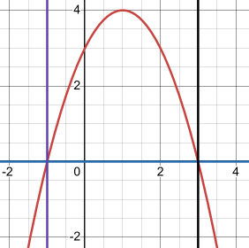

Now we have a boundary, and we know that the second "lower" function is just
$f(x) = 0$.

$$ A = \int_{a}^{b}{\left(\text{upper function}\right) - \left(\text{lower function}\right)\, dx} $$

$$ \quad = \int_{-1}^{3}{3 + 2x - x^2 - (0)\, dx} $$

$$ \quad = \left. \left(3x + x^2 - \frac{1}{3}x^3\right) \right|_{-1}^{3} $$

$$ \quad = \left(3(3) + (3)^2 - \frac{1}{3}(3)^3\right) - \left(3(-1) + (-1)^2 - \frac{1}{3}(-1)^3\right) $$

$$ \quad = (9 + 9 - 9) - \left(-3 + 1 + \frac{1}{3}\right) $$

$$ \quad = 9 + 9 - 9 + 3 - 1 - \frac{1}{3} $$

$$ \boxed{\quad = \frac{32}{3}} $$

**2.** Determine the area to the left of $g(y) = 3 - y^2$ and to the right of
$x = -1$.

**Solution**

Let's just straight up look at a graph of this to start:

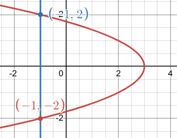

Very similar to the previous problem, just we're going from right to left to
find the area this time. We also need to set the given functions equal to each
other to find our where our two functions intersect.

$$ g(y) = 3 - y^2 $$

$$ -1 = 3 - y^2 $$

$$ y^2 = 4 $$

$$ y = \pm 2 $$

And this is what our graph illustrates. We know that the leftmost function is
$g(y) = -1$, so this, along with our intersection points is all we need to get
started.

$$ A = \int_{c}^{d}{\left(\text{right function}\right) - \left(\text{left function}\right)\, dy} \quad c \leq y \leq d $$

$$ \quad = \int_{-2}^{2}{3 - y^2 - (-1)\, dy} $$

$$ \quad = \int_{-2}^{2}{4 - y^2\, dy} $$

$$ \quad = \left. \left(4y - \frac{1}{3}y^3\right) \right|_{-2}^{2} $$

$$ \quad = \left(4(2) - \frac{1}{3}(2)^3\right) - \left(4(-2) - \frac{1}{3}(-2)^3\right) $$

$$ \quad = \left(8 - \frac{8}{3}\right) - \left(-8 + \frac{8}{3}\right) $$

$$ \quad = 8 - \frac{8}{3} + 8 - \frac{8}{3} $$

$$ \quad = 16 - \frac{16}{3} $$

$$ \boxed{\quad = \frac{32}{3}} $$

For problems 3 - 11 determine the area of the region bounded by the given set of
curves.

**3.** $y = x^2 + 2$, $y = \sin(x)$, $x = -1$ and $x = 2$

**Solution**

Graph:

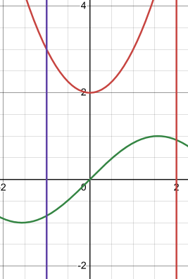

The graph shows us that $y = x^2 + 2$ is the upper function, and that
$y = \sin(x)$ is the lower function. We are also given the boundary that
$-1 \leq x \leq 2$. We therefore have everything we need to find the Area:

$$ A = \int_{-1}^{2}{x^2 + 2 - (\sin(x))\, dx} $$

$$ \quad  = \left. \left(\frac{1}{3}x^3 + 2x + \cos(x)\right) \right|_{-1}^{2} $$

$$ \quad  = \left(\frac{1}{3}(2)^3 + 2(2) + \cos(2)\right) - \left(\frac{1}{3}(-1)^3 + 2(-1) + \cos(-1)\right) $$

$$ \quad  = \left(\frac{8}{3} + 4 + \cos(2)\right) - \left(-\frac{1}{3} - 2 + \cos(-1)\right) $$

$$ \quad  = \frac{8}{3} + 4 + \cos(2) + \frac{1}{3} + 2 - \cos(-1) $$

$$ \quad  = \frac{9}{3} + 6 + \cos(2) - \cos(-1) $$

$$ \quad  = 3 + 6 + \cos(2) - \cos(-1) $$

$$ \boxed{\quad  = 9 + \cos(2) - \cos(-1) \approx 8.043550858} $$

**4.** $y = \dfrac{8}{x}$, $y = 2x$ and $x = 4$

**Solution**

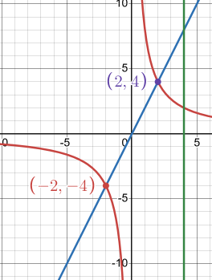

Since we are only given one boundary line (_i.e._ $x = 4$), we'll have to find a
remaining intersection point to know our bounds. Setting the given functions
equal to each other, we should be ble to find this out.

$$ \frac{8}{x} = 2x $$

$$ \left(\frac{8}{x}\right)x = (2x)x $$

$$ 8 = 2x^2 $$

$$ 2x^2 = 8 $$

$$ x^2 = 4 $$

$$ x = \pm 2 $$

We can discard the negative because at $x = 0$, the first function is no longer
continuous as it has a divison by $0$ error at it, so any values for $x \leq 0$
would stop prior to the $y$-axis (_i.e._ $x = 0$). This clear when looking at
the graph, but worth noting as to why. Thusly our boundary for our region is
defined by the interval $[2, 4]$. And we have all we need to find our Area.

$$ A = \int_{2}^{4}{2x - \left(\frac{8}{x}\right)\, dx} $$

$$ \quad = \int_{2}^{4}{2x - 8\left(\frac{1}{x}\right)\, dx} $$

$$ \quad = \left. \left(x^2 - 8\ln|x| \right) \right|_{2}^{4}  $$

$$ \quad = \left((4)^2 - 8\ln|(4)|\right) - \left((2)^2 - 8\ln|(2)|\right) $$

$$ \quad = (16 - 8\ln(4)) - (4 - 8\ln(2)) $$

$$ \quad = 16 - 8\ln(4) - 4 + 8\ln(2) $$

$$ \boxed{\quad = 12 - 8\ln(4) + 8\ln(2) \approx 6.454822556} $$

**5.** $x = 3 + y^2$, $x = 2 - y^2$, $y = 1$ and $y = -2$

**Solution**

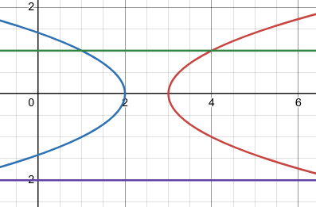

As long as we understand that this is a right/left paradigm we're working in,
this is a relatively straight forward Area to calculate. We are given the
boundaries and the functions and now we have the graph, so let's just find the
area.

$$ A = \int_{-2}^{1}{3 + y^2 - \left(2 - y^2\right)\, dy}$$

$$ \quad = \int_{-2}^{1}{3 + y^2 - 2 + y^2\, dy}$$

$$ \quad = \int_{-2}^{1}{1 + 2y^2\, dy}$$

$$ \quad = \left. \left(y + \frac{2}{3}y^3\right) \right|_{-2}^{1} $$

$$ \quad = \left((1) + \frac{2}{3}(1)^3\right) - \left((-2) + \frac{2}{3}(-2)^3\right) $$

$$ \quad = \left(1 + \frac{2}{3}\right) - \left(-2 - \frac{16}{3}\right) $$

$$ \quad = 1 + \frac{2}{3} + 2 + \frac{16}{3} $$

$$ \quad = 3 + \frac{18}{3} $$

$$ \quad = 3 + 6 $$

$$ \boxed{\quad = 9} $$

**6.** $x = y^2 - y - 6$ and $x = 2y + 4$

**Solution**

We know that this is a right/left paradigm since the functions are presented in
terms of $f(y)$. We are given no explicit boundaries to go by, so we have to
find them by setting the two functions equal to each other to find their
intersection points.

$$ y^2 - y - 6 = 2y + 4 $$

$$ y^2 - 3y - 10 = 0 $$

$$ (y + 2)(y - 5) = 0 $$

$$ y = -2 \text{, } y = 5 $$

Our boundary is in terms of $y$, so it is the interval of $[-2, 5]$.

Our graph shows this. This gives us our bounding region. By looking at the graph
we can tell the right most function is $x = 2y + 4$, so we have everything we
need to find our area.

$$ A = \int_{-2}^{5}{2y + 4 - \left(y^2 - y - 6\right)\, dy} $$

$$ \quad = \int_{-2}^{5}{2y + 4 - y^2 + y + 6\, dy} $$

$$ \quad = \int_{-2}^{5}{3y + 10 - y^2\, dy} $$

$$ \quad = \left. \left(\frac{3}{2}y^2 + 10y - \frac{1}{3}y^3\right) \right|_{-2}^{5} $$

$$ \quad = \left(\frac{3}{2}(5)^2 + 10(5) - \frac{1}{3}(5)^3\right) - \left(\frac{3}{2}(-2)^2 + 10(-2) - \frac{1}{3}(-2)^3\right) $$

$$ \quad = \left(\frac{75}{2} + 50 - \frac{125}{3}\right) - \left(6 - 20 + \frac{8}{3}\right) $$

$$ \quad = \frac{75}{2} + 50 - \frac{125}{3} - 6 + 20 - \frac{8}{3} $$

$$ \quad = \frac{75}{2} + 64 - \frac{133}{3} $$

$$ \boxed{\quad = \frac{343}{6} \approx 57.16666667} $$

**7.** $y = x\sqrt{x^2 + 1}$, $y = \mathbf{e}^{-\frac{1}{2}x}$, $x = -3$ and the
$y$-axis.

**Solution**

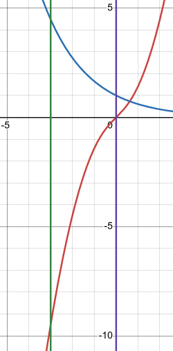

We're actually given everything we need here, we have the two functions, we have
the boundaries, and we have our graph to tell us that the upper function is
$y = \mathbf{e}^{-\frac{1}{2}x}$. Let's find our area.

$$ A = \int_{-3}^{0}{\mathbf{e}^{-\frac{1}{2}x} - \left(x\sqrt{x^2 + 1}\right)\, dx} $$

$$ \quad = \int_{-3}^{0}{\mathbf{e}^{-\frac{1}{2}x} - x\sqrt{x^2 + 1}\, dx} $$

The difficulty here lies in the substitution steps, so let's go slow.

$$ \int_{-3}^{0}{\mathbf{e}^{-\frac{1}{2}x} - x\sqrt{x^2 + 1}\, dx} = \int_{-3}^{0}{\mathbf{e}^{-\frac{1}{2}x}\, dx} - \int_{-3}^{0}{x\sqrt{x^2 + 1}\, dx} $$

$$ u = -\frac{1}{2}x \quad du = -\frac{1}{2}dx \quad \Rightarrow \quad -2du = dx $$

$$ x = -3 \quad u = -\frac{1}{2}(-3) = \frac{3}{2} $$

$$ x = 0 \quad u = -\frac{1}{2}(0) = 0 $$

$$ v = x^2 + 1 \quad dv = (2x)dx \quad \Rightarrow \quad \frac{1}{2}dv = (x)dx $$

$$ x = -3 \quad v = (-3)^2 + 1 = 10 $$

$$ x = 0 \quad v = (0)^2 + 1 = 1 $$

$$ \quad = -2\int_{\frac{3}{2}}^{0}{\mathbf{e}^u\, du} - \frac{1}{2}\int_{10}^{1}{v^{\frac{1}{2}}\, dv} $$

$$ \quad = -2\left[\left. \left(\mathbf{e}^u\right) \right|_{\frac{3}{2}}^{0} \right] - \frac{1}{2}\left[\left. \left(\frac{2}{3}v^{\frac{3}{2}}\right) \right|_{10}^{1} \right] $$

$$ \quad = -2\left[\left(\mathbf{e}^{(0)}\right) - \left(\mathbf{e}^{(\frac{3}{2})}\right)\right] - \frac{1}{2}\left[\left(\frac{2}{3}(1)^{\frac{3}{2}}\right) - \left(\frac{2}{3}(10)^{\frac{3}{2}}\right)\right] $$

$$ \quad = -2\left[1 - \mathbf{e}^{\frac{3}{2}}\right] - \frac{1}{2}\left[\frac{2}{3} - \frac{20(10)^{\frac{1}{2}}}{3}\right] $$

$$ \quad = -2 + 2\mathbf{e}^{\frac{3}{2}} - \frac{1}{3} + \frac{20\sqrt{10}}{6} $$

$$ \quad = -2 + 2\mathbf{e}^{\frac{3}{2}} + \frac{10\sqrt{10} - 1}{3} $$

$$ \boxed{\quad = 2\mathbf{e}^{\frac{3}{2}} + \frac{10\sqrt{10} - 7}{3} \approx 17.17097034} $$

**8.** $y = 4x + 3$, $y = 6 - x - 2x^2$, $x = -4$, and $x = 2$

**Solution**

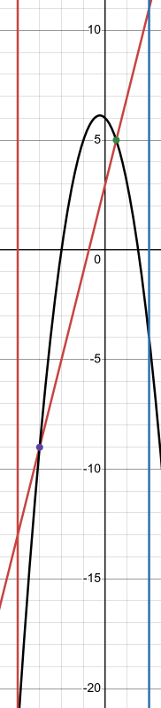

Notice we have three different regions in which we have areas that overlap
within this interval. We'll have to be careful because we'll be evaluating this
as an upper/lower paradigm. Let's first set our functions equal to each other to
find the other intervals in which we'll be setting boundaries.

$$ 6 - x - 2x^2 = 4x + 3 $$

$$ 0 = 2x^2 + x - 6 + 4x + 3 $$

$$ 0 = 2x^2 + 5x - 3 $$

$$ 0 = (2x - 1)(x + 3) $$

$$ 2x - 1 = 0 $$

$$ 2x = 1 $$

$$ x = \frac{1}{2} $$

$$ x = -3 $$

Thinking on the boundaries given and these intersection points, we therefore
know our three intervals to be calculated are:

$$ [-4, -3], \left[-3, \frac{1}{2}\right], \left[\frac{1}{2}, 2\right] $$

Also notice that our up upper and lower functions switch depending on which
interval we are at. In the leftmost interval $[-4, -3]$, the upper function is
$y = 4x + 3$, this is also the case in the last interval from
$\left[\dfrac{1}{2}, 2\right]$. In the middle interval of
$\left[-3, \dfrac{1}{2}\right]$, the upper function is $y = 6 - x - 2x^2$. Let's
carefully now setup our Area formula which will be a sum of integrals for areas
of each of these regions.

$$ A = \int_{-4}^{-3}{4x + 3 - \left(6 - x - 2x^2\right)\, dx} + \int_{-3}^{\frac{1}{2}}{6 - x - 2x^2 - (4x + 3)\, dx} + \int_{\frac{1}{2}}^{2}{4x + 3 - \left(6 - x - 2x^2\right)\, dx} $$

$$ A = \int_{-4}^{-3}{4x + 3 - 6 + x + 2x^2\, dx} + \int_{-3}^{\frac{1}{2}}{6 - x - 2x^2 - 4x - 3\, dx} + \int_{\frac{1}{2}}^{2}{4x + 3 - 6 + x + 2x^2\, dx} $$

$$ A = \int_{-4}^{-3}{5x - 3 + 2x^2\, dx} + \int_{-3}^{\frac{1}{2}}{3 - 5x - 2x^2\, dx} + \int_{\frac{1}{2}}^{2}{5x - 3 + 2x^2\, dx} $$

$$ A = \left. \left(\frac{5}{2}x^2 - 3x + \frac{2}{3}x^3\right) \right|_{-4}^{-3} + \left. \left(3x - \frac{5}{2}x^2 - \frac{2}{3}x^3\right) \right|_{-3}^{\frac{1}{2}} + \left. \left(\frac{5}{2}x^2 - 3x + \frac{2}{3}x^3\right) \right|_{\frac{1}{2}}^{2} $$

$$
\begin{aligned}
A = {} & \left[\left(\frac{5}{2}(-3)^2 - 3(-3) + \frac{2}{3}(-3)^3\right)
        - \left(\frac{5}{2}(-4)^2 - 3(-4) + \frac{2}{3}(-4)^3\right)\right] \\
      & + \left[\left(3\left(\frac{1}{2}\right) - \frac{5}{2}\left(\frac{1}{2}\right)^2
        - \frac{2}{3}\left(\frac{1}{2}\right)^3\right)
        - \left(3(-3) - \frac{5}{2}(-3)^2 - \frac{2}{3}(-3)^3\right)\right] \\
      & + \left[\left(\frac{5}{2}(2)^2 - 3(2) + \frac{2}{3}(2)^3\right)
        - \left(\frac{5}{2}\left(\frac{1}{2}\right)^2 - 3\left(\frac{1}{2}\right)
        + \frac{2}{3}\left(\frac{1}{2}\right)^3\right)\right]
\end{aligned}
$$

$$
\begin{aligned}
A = {} & \left[\left(\frac{45}{2} + 9 - 18\right)
        - \left(40 + 12 - \frac{128}{3}\right)\right] \\
      & + \left[\left(\frac{3}{2} - \frac{5}{8}
        - \frac{1}{12}\right)
        - \left(-9 - \frac{45}{2} + 18\right)\right] \\
      & + \left[\left(4 + \frac{16}{3}\right)
        - \left(\frac{5}{8} - \frac{3}{2}
        + \frac{1}{12}\right)\right]
\end{aligned}
$$

$$
\begin{aligned}
A = {} & \left[\frac{45}{2} + 9 - \frac{54}{3}
        - 40 - 12 + \frac{128}{3}\right] \\
      & + \left[\frac{3}{2} - \frac{5}{8}
        - \frac{1}{12}
        + 9 + \frac{45}{2} - 18\right] \\
      & + \left[10 - 6 + \frac{16}{3}
        - \frac{5}{8} + \frac{3}{2}
        - \frac{1}{12}\right]
\end{aligned}
$$

$$ A = \frac{47}{6} + \frac{35}{3} + \frac{77}{24} $$

$$ \boxed{A = \frac{343}{12} \approx 28.58333333} $$

**9.** $y = \dfrac{1}{x + 2}$, $y = (x + 2)^2$, $x = -\dfrac{3}{2}$, $x = 1$

**Solution**

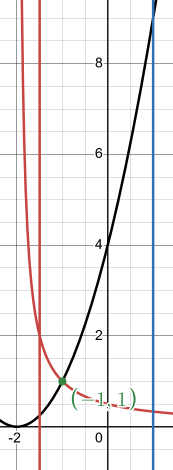

Notice we have two regions, let's find where the intersection point is so we
know which two regions we'll be working with.

$$ \frac{1}{x + 2} = (x + 2)^2 $$

$$ 1 = (x + 2)^3 $$

$$ x + 2 = \sqrt[3]{1} $$

$$ x + 2 = 1 $$

$$ x = -1 $$

And our graph shows this.

So the two intervals that define our regions are
$\left[-\dfrac{3}{2}, -1\right]$ and $[-1, 1]$.

Notice also that the upper/lower functions switch, the first interval's upper
function is $y = \dfrac{1}{x + 2}$, and in the second interval, the upper
function is $y = (x + 2)^2$. So we'll have to set up our Area formula carefully:

$$ A = \int_{-\frac{3}{2}}^{-1}{\frac{1}{x + 2} - (x + 2)^2\, dx} + \int_{-1}^{1}{(x + 2)^2 - \frac{1}{x + 2}\, dx} $$

$$ A = \int_{-\frac{3}{2}}^{-1}{\frac{1}{x + 2} - \left(x^2 + 4x + 4\right)\, dx} + \int_{-1}^{1}{x^2 + 4x + 4 - \frac{1}{x + 2}\, dx} $$

$$ A = \int_{-\frac{3}{2}}^{-1}{\frac{1}{x + 2} - x^2 - 4x - 4\, dx} + \int_{-1}^{1}{x^2 + 4x + 4 - \frac{1}{x + 2}\, dx} $$

$$ A = \int_{-\frac{3}{2}}^{-1}{\frac{1}{x + 2}\, dx} - \int_{-\frac{3}{2}}^{-1}{x^2 - 4x - 4\, dx} + \int_{-1}^{1}{x^2 + 4x + 4\, dx} - \int_{-1}^{1}{\frac{1}{x + 2}\, dx} $$

$$ u = x + 2 \quad \Rightarrow \quad du = dx $$

$$ x = -\frac{3}{2} \quad u = \left(-\frac{3}{2}\right) + 2 = \frac{1}{2} $$

$$ x = -1 \quad u = (-1) + 2 = 1 $$

$$ v = x + 2 \quad \Rightarrow \quad dv = dx $$

$$ x = -1 \quad v = (-1) + 2 = 1 $$

$$ x = 1 \quad v = (1) + 2 = 3 $$

$$ A = \int_{\frac{1}{2}}^{1}{\frac{1}{u}\, du} - \int_{-\frac{3}{2}}^{-1}{x^2 - 4x - 4\, dx} + \int_{-1}^{1}{x^2 + 4x + 4\, dx} - \int_{1}^{3}{\frac{1}{v}\, dv} $$

$$ \quad = \left. \left(\ln|u|\right) \right|_{\frac{1}{2}}^{1} - \left. \left(\frac{1}{3}x^3 - 2x^2 - 4x\right) \right|_{-\frac{3}{2}}^{-1} + \left. \left(\frac{1}{3}x^3 + 2x^2 + 4x\right) \right|_{-1}^{1} - \left. \left(\ln|v|\right) \right|_{1}^{3} $$

$$
\begin{aligned} = {}
      & \left[-\ln\left(\frac{1}{2}\right)\right] \\
      & - \left[\left(-\frac{1}{3} - 2 + 4\right) -
      \left(-\frac{9}{8} - \frac{9}{2} + 6\right)\right] \\
      & + \left[\left(\frac{1}{3} + 2 + 4\right) -
      \left(-\frac{1}{3} + 2 - 4\right)\right] \\
      & - \left[\ln(3)\right]
\end{aligned}
$$

$$
\begin{aligned} = {}
      & -\ln\left(\frac{1}{2}\right) \\
      & - \left[-\frac{1}{3} - 2 + 4
      + \frac{9}{8} + \frac{9}{2} - 6\right] \\
      & + \left[\frac{1}{3} + 2 + 4
      + \frac{1}{3} - 2 + 4\right] \\
      & - \ln(3)
\end{aligned}
$$

$$ \quad = -\ln\left(\frac{1}{2}\right) - \left(\frac{31}{2}\right) + \left(\frac{26}{3}\right) - \ln(3) $$

$$ \boxed{\quad = -\ln\left(\frac{1}{2}\right) - \ln(3) + \frac{67}{8} \approx 7.969534892} $$

**10.** $x = y^2 + 1$, $x = 5$, $y = -3$ and $y = 3$

**Solution**

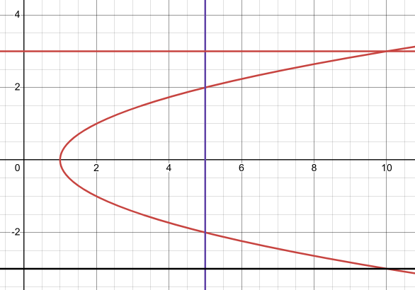

Don't get confused by the $x = 5$. We have three regions on this $f(y)$
right/left paradigm. Let's find where our functions intersect so we know the
three regions we're dealing with.

$$ y^2 + 1 = 5 $$

$$ y^2 = 4 $$

$$ y = \pm 2 $$

**11.** $x = \mathbf{e}^{1 + 2y}$, $x = \mathbf{e}^{1 - y}$, $y = -2$ and
$y = 1$

**Solution**

So our three ranges are $[-3, -2]$, $[-2, 2]$, and $[2, 3]$.

Also notice that the right/left functions switch in the middle interval. So the
right most function for both the first and last interval is $x = y^2 + 1$, while
in the middle interval's right most function is $x = 5$. Let's set up our Area
formula:

$$ A = \int_{-3}^{-2}{y^2 + 1 - 5\, dy} + \int_{-2}^{2}{5 - \left(y^2 + 1\right)\, dy} + \int_{2}^{3}{y^2 + 1 - 5\, dy} $$

$$ A = \int_{-3}^{-2}{y^2 - 4\, dy} + \int_{-2}^{2}{4 - y^2\, dy} + \int_{2}^{3}{y^2 - 4\, dy} $$

$$ A = \left. \left(\frac{1}{3}y^3 - 4y\right) \right|_{-3}^{-2} + \left. \left(4y - \frac{1}{3}y^3\right) \right|_{-2}^{2} + \left. \left(\frac{1}{3}y^3 - 4y\right) \right|_{2}^{3} $$

$$
\begin{aligned}
A = {} & \left[\left(\frac{1}{3}(-2)^3 - 4(-2)\right)
      - \left(\frac{1}{3}(-3)^3 - 4(-3)\right)\right] \\
      & + \left[\left(4(2) - \frac{1}{3}(2)^3\right)
      - \left(4(-2) - \frac{1}{3}(-2)^3\right)\right] \\
      & + \left[\left(\frac{1}{3}(3)^3 - 4(3)\right)
      - \left(\frac{1}{3}(2)^3 - 4(2)\right)\right]
\end{aligned}
$$

$$
\begin{aligned}
A = {} & \left[\left(-\frac{8}{3} + 8\right)
      - (-9 + 12)\right] \\
      & + \left[\left(8 - \frac{8}{3}\right)
      - \left(-8 + \frac{8}{3}\right)\right] \\
      & + \left[(9 - 12)
      - \left(\frac{8}{3} - 8\right)\right]
\end{aligned}
$$

$$
\begin{aligned}
A = {} & \left[-\frac{8}{3} + 8 + 9 - 12\right] \\
      & + \left[8 - \frac{8}{3} + 8 - \frac{8}{3}\right] \\
      & + \left[9 - 12 - \frac{8}{3} + 8\right]
\end{aligned}
$$

$$ A = \left(\frac{7}{3}\right) + \left(\frac{32}{3}\right) + \left(\frac{7}{3}\right) $$

$$ \boxed{A = \frac{46}{3} \approx 15.33333333} $$

---

## Assignment Problems

**1.** Determine the area below $f(x) = 8x - 2x^2$ and above the $x$-axis.

**Solution**

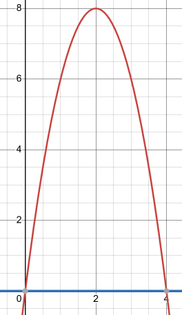

This is simple, the function on the bottom in this case is $f(x) = 0$. We just
need to find the range of th e region by setting the two functions given equal
to one another.

$$ 8x - 2x^2 = 0 $$

$$ x(8 - 2x) = 0 $$

$$ 8 - 2x = 0 $$

$$ 8 = 2x $$

$$ 4 = x $$

$$ x = 0 $$

So our interval is $[0, 4]$, as is shown in our graph, and our upper function is
$f(x) = 8x - 2x^2$.

$$ A = \int_{0}^{4}{8x - 2x^2 - 0\, dx} $$

$$ \quad = \int_{0}^{4}{8x - 2x^2\, dx} $$

$$ \quad = \left. \left(4x^2 - \frac{2}{3}x^3\right) \right|_{0}^{4} $$

$$ \quad = \left(4(4)^2 - \frac{2}{3}(4)^3\right) - \left(4(0)^2 - \frac{2}{3}(0)^3\right) $$

$$ \quad = 64 - \frac{128}{3} $$

$$ \boxed{\quad = \frac{64}{3} \approx 21.33333333} $$

**2.** Determine the area above $f(x) = 3x^2 + 6x - 9$ and below the $x$-axis.

**Solution**

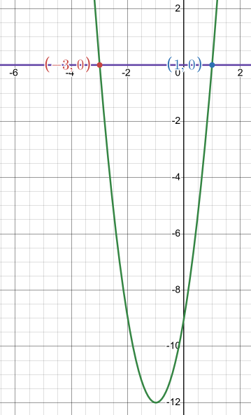

Similar to the previous problem, let's set them equal so we know the range.

$$ 3x^2 + 6x - 9 = 0 $$

$$ 3\left(x^2 + 2x - 3\right) = 0 $$

$$ 3(x - 1)(x + 3) = 0 $$

$$ x = 1 \text{, } x = -3  $$

Our graph shows this, so our range is $[-3, 1]$.

We know that our upper function is $f(x) = 0$, this is enough to find the area:

$$ A = \int_{-3}^{1}{0 - \left(3x^2 + 6x - 9\right)\, dx} $$

$$ \quad = \int_{-3}^{1}{-3x^2 - 6x + 9\, dx} $$

$$ \quad = \left. \left(-x^3 - 3x^2 + 9x\right) \right|_{-3}^{1} $$

$$ \quad = \left(-(1)^3 - 3(1)^2 + 9(1)\right) - \left(-(-3)^3 - 3(-3)^2 + 9(-3)\right) $$

$$ \quad = (-1 - 3 + 9) - (27 - 27 - 27) $$

$$ \quad = -1 - 3 + 9 - 27 + 27 + 27 $$

$$ \boxed{\quad = 32} $$

**3.** Determine the area to the right of $g(y) = y^2 + 4y - 5$ and to the left
of the $y$-axis.

**Solution**

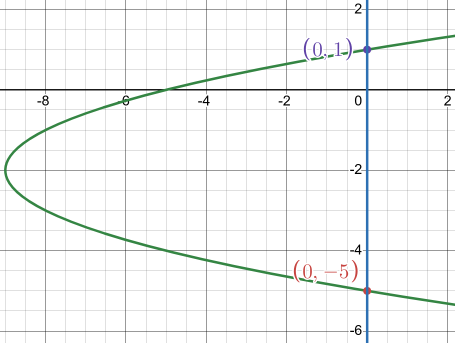

This is a right/left paradigm area problem. The second function is $g(y) = 0$.
Let's find where they intersect:

$$ y^2 + 4y - 5 = 0 $$

$$ (y - 1)(y + 5)= 0 $$

$$ y = 1 \text{, } y = -5 $$

The interval of the region we're calculating the area from is therefore
$[-5, 1]$.

We can see from our graph that the right most function is $g(y) = 0$.

Let's now use this to calculate our area:

$$ A = \int_{-5}^{1}{0 - \left(y^2 + 4y - 5\right)\, dy} $$

$$ A = \int_{-5}^{1}{-y^2 - 4y + 5\, dy} $$

$$ A = \left. \left(-\frac{1}{3}y^3 - 2y^2 + 5y\right) \right|_{-5}^{1} $$

$$ A = \left(-\frac{1}{3}(1)^3 - 2(1)^2 + 5(1)\right) - \left(-\frac{1}{3}(-5)^3 - 2(-5)^2 + 5(-5)\right) $$

$$ A = \left(-\frac{1}{3} - 2 + 5\right) - \left(\frac{125}{3} - 50 - 25\right) $$

$$ A = -\frac{1}{3} - 2 + 5 - \frac{125}{3} + 50 + 25 $$

$$ \boxed{A = 36} $$

**4.** Determine the area to the left of $g(y) = -4y^2 + 24y - 20$ and to the
right of the $y$-axis.

**Solution**

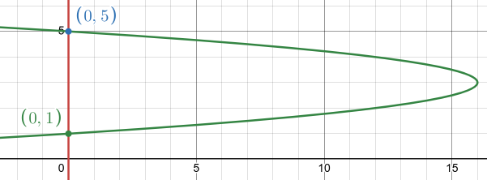

The second function is $g(y) = 0$. Set them equal to find the intersection
points.

$$ -4y^2 + 24y - 20 = 0 $$

$$ -4\left(y^2 - 6y + 5\right) = 0 $$

$$ -4(y - 1)(y - 5) = 0 $$

$$ y = 1 \text{, } y = 5 $$

Our graph shows this, our interval for the region is $[1, 5]$. Our right most
function as we can see in our graph is $g(y) = -4y^2 + 24y - 20$ We have enough
to calculate the area now.

$$ A = \int_{1}^{5}{-4y^2 + 24y - 20 - 0\, dy} $$

$$ A = \int_{1}^{5}{-4y^2 + 24y - 20\, dy} $$

$$ A = \left. \left(-\frac{4}{3}y^3 + 12y^2 - 20y\right) \right|_{1}^{5} $$

$$ A = \left(-\frac{4}{3}(5)^3 + 12(5)^2 - 20(5)\right) - \left(-\frac{4}{3}(1)^3 + 12(1)^2 - 20(1)\right) $$

$$ A = \left(-\frac{500}{3} + 300 - 100\right) - \left(-\frac{4}{3} + 12 - 20\right) $$

$$ A = -\frac{500}{3} + 300 - 100 + \frac{4}{3} - 12 + 20 $$

$$ \boxed{A = \frac{128}{3} \approx 42.66666667} $$

**5.** Determine the area below $f(x) = 10 - 2x^2$ and above the line $y = 3$.

**Solution**

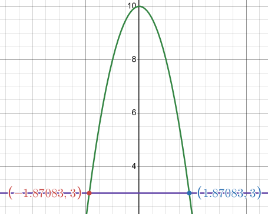

Very similar to problem 1, just needs to adjust since we're no longer bounded by
the $x$-axis, but rather by $y = 3$. Let's set them equal to find intersections
and definitions of our region.

$$ 10 - 2x^2 = 3 $$

$$ 7 = 2x^2 $$

$$ \frac{7}{2} = x^2 $$

$$ \frac{7}{2} = x^2 $$

$$ x = \pm \sqrt{\frac{7}{2}} \approx \pm 1.870828693 $$

Which is what our graph shows. Thusly our range for the region is:

$$ \left[-\sqrt{\frac{7}{2}}, \sqrt{\frac{7}{2}}\right] $$

Our upper function is $f(x) = 10 - 2x^2$. Let's get started on that area:

$$ A = \int_{-\sqrt{\frac{7}{2}}}^{\sqrt{\frac{7}{2}}}{10 - 2x^2 - 3\, dx} $$

$$ A = \int_{-\sqrt{\frac{7}{2}}}^{\sqrt{\frac{7}{2}}}{7 - 2x^2\, dx} $$

$$ A = \left. \left(7x - \frac{2}{3}x^3\right) \right|_{-\sqrt{\frac{7}{2}}}^{\sqrt{\frac{7}{2}}} $$

$$ A = \left(7\left(\sqrt{\frac{7}{2}}\right) - \frac{2}{3}\left(\sqrt{\frac{7}{2}}\right)^3\right) - \left(7\left(-\sqrt{\frac{7}{2}}\right) - \frac{2}{3}\left(-\sqrt{\frac{7}{2}}\right)^3\right) $$

$$ \boxed{A = \frac{14\sqrt{14}}{3} \approx 17.46106780} $$

**6.** Determine the area above $f(x) = x^2 + 2x + 3$ and below the line
$y = 11$.

**Solution**

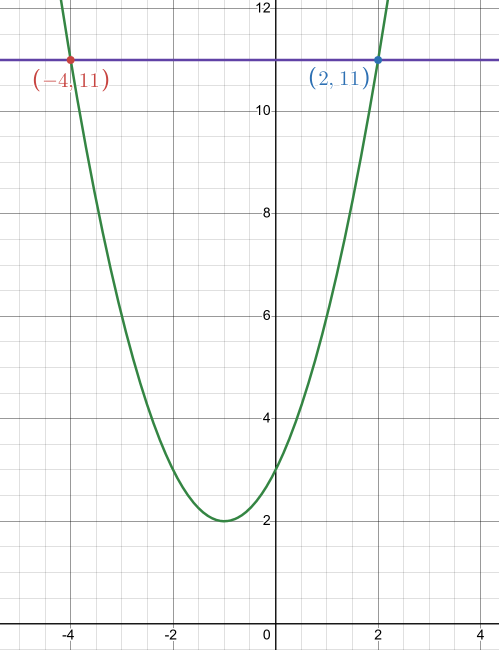

Set them equal to find intersections:

$$ x^2 + 2x + 3 = 11 $$

$$ x^2 + 2x + 3 - 11 = 0 $$

$$ x^2 + 2x - 8 = 0 $$

$$ (x - 2)(x + 4) = 0 $$

$$ x = -4 \text{, } x = 2 $$

So our range for the region is $[-4, 2]$. We can see from the graph that the
upper function is $f(x) = 11$. Let's get the area:

$$ A = \int_{-4}^{2}{11 - \left(x^2 + 2x + 3\right)\, dx} $$

$$ A = \int_{-4}^{2}{11 - x^2 - 2x - 3\, dx} $$

$$ A = \int_{-4}^{2}{8 - x^2 - 2x\, dx} $$

$$ A = \left. \left(8x - \frac{1}{3}x^3 - x^2\right) \right|_{-4}^{2} $$

$$ A = \left(8(2) - \frac{1}{3}(2)^3 - (2)^2\right) - \left(8(-4) - \frac{1}{3}(-4)^3 - (-4)^2\right) $$

$$ A = \left(16 - \frac{8}{3} - 4\right) - \left(-32 + \frac{64}{3} - 16\right) $$

$$ A = 16 - \frac{8}{3} - 4 + 32 - \frac{64}{3} + 16 $$

$$ \boxed{A = 36} $$

**7.** Determine the area to the right of $g(y) = y^2 + 2y - 4$ and to the left
of the line $x = -1$.

**Solution**

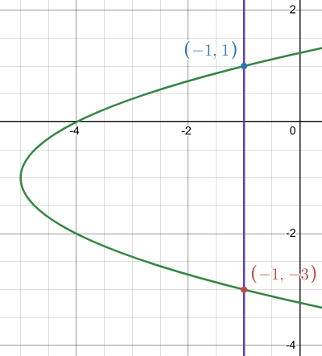

Similar as always, let's set them equal, find intersections, find region.

$$ y^2 + 2y - 4 = -1 $$

$$ y^2 + 2y - 4 + 1 = 0 $$

$$ y^2 + 2y - 3 = 0 $$

$$ (y + 3)(y - 1) = 0 $$

$$ [-3, 1] $$

Right most function is $g(y) = -1$.

$$ A = \int_{-3}^{1}{-1 - \left(y^2 + 2y - 4\right)\, dy} $$

$$ A = \int_{-3}^{1}{-1 - y^2 - 2y + 4\, dy} $$

$$ A = \int_{-3}^{1}{-y^2 - 2y + 3\, dy} $$

$$ A = \left. \left(-\frac{1}{3}y^3 - y^2 + 3y\right) \right|_{-3}^{1} $$

$$ A = \left(-\frac{1}{3}(1)^3 - (1)^2 + 3(1)\right) - \left(-\frac{1}{3}(-3)^3 - (-3)^2 + 3(-3)\right) $$

$$ A = \left(-\frac{1}{3} - 1 + 3\right) - (9 - 9 - 9) $$

$$ A = -\frac{1}{3} - 1 + 3 - 9 + 9 + 9 $$

$$ \boxed{A = \frac{32}{3} \approx 10.66666667} $$

**8.** Determine the area to the left of $g(y) = 2 + 4y - y^2$ and to the right
of the line $x = -1$.

**Solution**

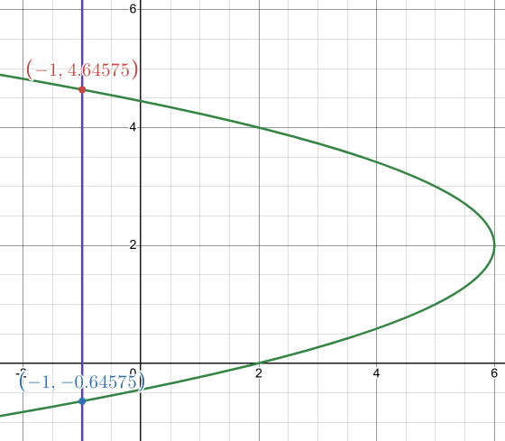

$$ 2 + 4y - y^2 = -1 $$

$$ 3 + 4y - y^2 = 0 $$

$$ y^2 - 4y - 3 = 0 $$

$$ y = \frac{-(-4) \pm \sqrt{(-4)^2 - 4(1)(-3)}}{2(1)} $$

$$ y = \frac{4 \pm 2\sqrt{7}}{2} $$

$$ y = 2 \pm \sqrt{7} $$

$$ y = 2 - \sqrt{7} \approx -0.6457513111 $$

$$ y = 2 + \sqrt{7} \approx 4.645751311 $$

Which is what our graph shows.

$$ \left[2 - \sqrt{7}, 2 + \sqrt{7}\right] $$

Right most function is $g(y) = 2 + 4y + y^2$.

$$ A = \int_{2 - \sqrt{7}}^{2 + \sqrt{7}}{2 + 4y - y^2 - (-1)\, dy} $$

$$ A = \int_{2 - \sqrt{7}}^{2 + \sqrt{7}}{2 + 4y - y^2 + 1\, dy} $$

$$ A = \int_{2 - \sqrt{7}}^{2 + \sqrt{7}}{3 + 4y - y^2\, dy} $$

$$ A = \left. \left(3y + 2y^2 - \frac{1}{3}y^3\right) \right|_{2 - \sqrt{7}}^{2 + \sqrt{7}} $$

$$ A = \left(3\left(2 + \sqrt{7}\right) + 2\left(2 + \sqrt{7}\right)^2 - \frac{1}{3}\left(2 + \sqrt{7}\right)^3\right) - \left(3\left(2 - \sqrt{7}\right) + 2\left(2 - \sqrt{7}\right)^2 - \frac{1}{3}\left(2 - \sqrt{7}\right)^3\right) $$

$$ \boxed{A = \frac{28\sqrt{7}}{3} \approx 24.69367890} $$

For problems 9 - 26 determine the area of the region bounded by the given set of
curves.

**9.** $y = x^3 + 2$, $y = 1$ and $x = 2$.

**Solution**

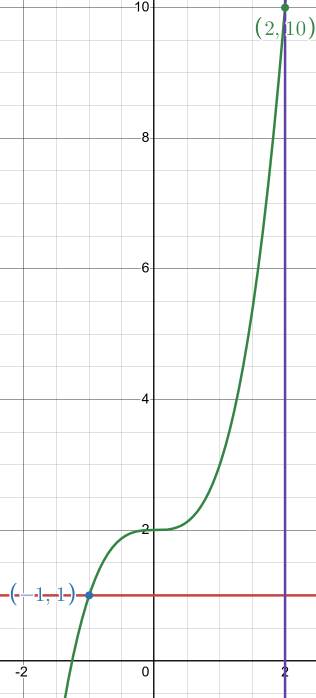

We need need one intersection point to know the range we are working with. set
them equal.

$$ x^3 + 2 = 1 $$

$$ x^3 + 1 = 0 $$

$$ x^3 = -1 $$

$$ x = \sqrt[3]{-1} $$

$$ x = -1 $$

So our range is $[-1, 2]$. The upper function is $f(x) = x^3 + 2$. Let's find
the area:

$$ A = \int_{-1}^{2}{x^3 + 2 - (1)\, dx} $$

$$ A = \int_{-1}^{2}{x^3 + 1\, dx} $$

$$ A = \left. \left(\frac{1}{4}x^4 + x\right) \right|_{-1}^{2} $$

$$ A = \left(\frac{1}{4}(2)^4 + (2)\right) - \left(\frac{1}{4}(-1)^4 + (-1)\right) $$

$$ A = (4 + 2) - \left(\frac{1}{4} - 1\right) $$

$$ A = 4 + 2 - \frac{1}{4} + 1 $$

$$ \boxed{A = \frac{27}{4} = 6.75} $$

**10.** $y = x^2 - 6x + 10$ and $y = 5$.

**Solution**

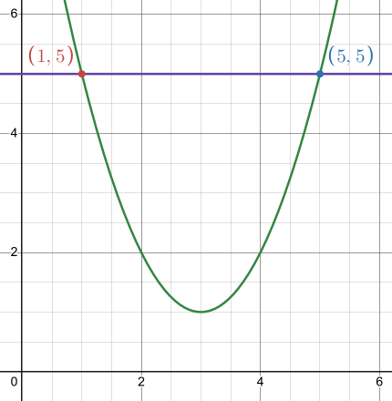

We don't know either endpoint of the range, so let's set the given functions
equal to find them.

$$ x^2 - 6x + 10 = 5 $$

$$ x^2 - 6x + 5 = 0 $$

$$ (x - 5)(x - 1) = 0 $$

$$ [1, 5] $$

Our upper funtion is $f(x) = 5$. Area:

$$ A = \int_{1}^{5}{5 - \left(x^2 - 6x + 10\right)\, dx} $$

$$ A = \int_{1}^{5}{5 - x^2 + 6x - 10\, dx} $$

$$ A = \int_{1}^{5}{-x^2 + 6x - 5\, dx} $$

$$ A = \left. \left(-\frac{1}{3}x^3 + 3x^2 - 5x\right) \right|_{1}^{5} $$

$$ A = \left(-\frac{1}{3}(5)^3 + 3(5)^2 - 5(5)\right) - \left(-\frac{1}{3}(1)^3 + 3(1)^2 - 5(1)\right) $$

$$ A = \left(-\frac{125}{3} + 75 - 25\right) - \left(-\frac{1}{3} + 3 - 5\right) $$

$$ A = -\frac{125}{3} + 75 - 25 + \frac{1}{3} - 3 + 5 $$

$$ \boxed{A = \frac{32}{3} \approx 10.66666667} $$

**11.** $y = x^2 - 6x + 10$, $x = 1$, $x = 5$ and the $x$-axis.

**Solution**

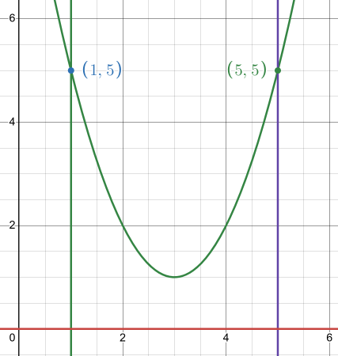

We already have our bounds, so there's no need to find them. The other function
is $y = 0$. Our upper function is $f(x) = x^2 - 6x + 10$. Area:

$$ A = \int_{1}^{5}{x^2 - 6x + 10 - (0)\, dx} $$

$$ A = \int_{1}^{5}{x^2 - 6x + 10\, dx} $$

$$ A = \left. \left(\frac{1}{3}x^3 - 3x^2 + 10x\right) \right|_{1}^{5} $$

$$ A = \left(\frac{1}{3}(5)^3 - 3(5)^2 + 10(5)\right) - \left(\frac{1}{3}(1)^3 - 3(1)^2 + 10(1)\right) $$

$$ A = \left(\frac{125}{3} - 75 + 50\right) - \left(\frac{1}{3} - 3 + 10\right) $$

$$ A = \frac{125}{3} - 75 + 50 - \frac{1}{3} + 3 - 10 $$

$$ \boxed{A = \frac{28}{3} \approx 9.333333333} $$

**12.** $x = y^2 + 2y + 4$ and $x = 4$.

**Solution**

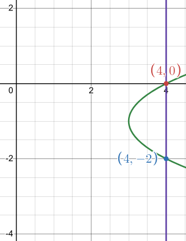

We're given no range for bounds, let's set equal and find:

$$ y^2 + 2y + 4 = 4 $$

$$ y^2 + 2y = 0 $$

$$ y(y + 2) = 0 $$

$$ [-2, 0] $$

Our right most function is $x = 4$. Find area:

$$ A = \int_{-2}^{0}{4 - \left(y^2 + 2y + 4\right)\, dy} $$

$$ A = \int_{-2}^{0}{4 - y^2 - 2y - 4\, dy} $$

$$ A = \int_{-2}^{0}{-y^2 - 2y\, dy} $$

$$ A = \left. \left(-\frac{1}{3}y^3 - y^2\right) \right|_{-2}^{0} $$

$$ A = \left(-\frac{1}{3}(0)^3 - (0)^2\right) - \left(-\frac{1}{3}(-2)^3 - (-2)^2\right) $$

$$ A = -\left(\frac{8}{3} - 4\right) $$

$$ A = -\frac{8}{3} + 4 $$

$$ \boxed{A = \frac{4}{3} \approx 1.333333333} $$

**13.** $y = 5 - \sqrt{x}$, $x = 1$, $x = 4$ and the $x$-axis.

**Solution**

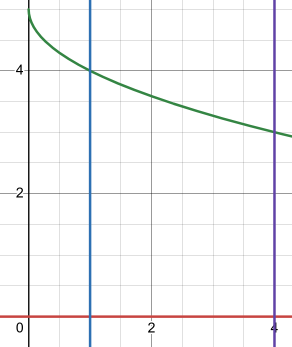

We're given our range of $[1, 4]$. The other function is $y = 0$. The upper
function is $f(x) = 5 - \sqrt{x}$. Area:

$$ A = \int_{1}^{4}{5 - \sqrt{x} - (0)\, dx} $$

$$ A = \int_{1}^{4}{5 - x^{\frac{1}{2}}\, dx} $$

$$ A = \left. \left(5x - \frac{2}{3}x^{\frac{3}{2}}\right) \right|_{1}^{4} $$

$$ A = \left(5(4) - \frac{2}{3}(4)^{\frac{3}{2}}\right) - \left(5(1) - \frac{2}{3}(1)^{\frac{3}{2}}\right) $$

$$ \boxed{A = \frac{31}{3} \approx 10.33333333} $$

**14.** $x = \mathbf{e}^y$, $x = 1$, $y = 1$ and $y = 2$.

**Solution**

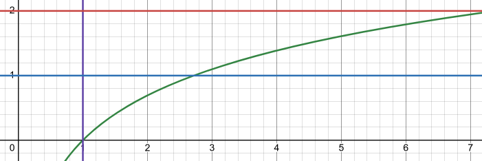

Again, we're given our range of $[1, 2]$, the 9ther function is $x = 1$. Our
right most function is $x = \mathbf{e}^y$. Area:

$$ A = \int_{1}^{2}{\mathbf{e}^y - 1\, dy} $$

$$ A = \left. \left(\mathbf{e}^y - y\right) \right|_{1}^{2} $$

$$ A = \left(\mathbf{e}^{(2)} - (2)\right) - \left(\mathbf{e}^{(1)} - (1)\right) $$

$$ A = \left(\mathbf{e}^{2} - 2\right) - \left(\mathbf{e} - 1\right) $$

$$ A = \mathbf{e}^{2} - 2 - \mathbf{e} + 1 $$

$$ \boxed{A = \mathbf{e}^{2} - \mathbf{e} - 1 \approx 3.670774270} $$

**15.** $x = 4y - y^2$ and the $y$-axis.

**Solution**

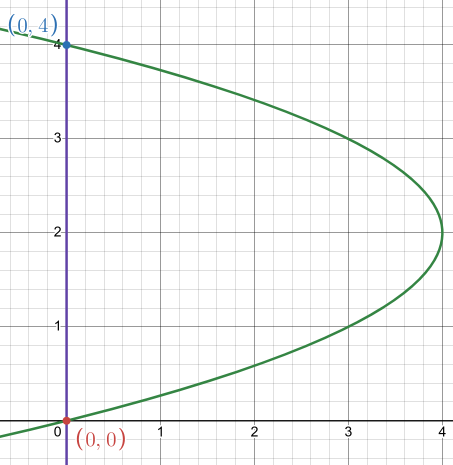

We're not given our range, so let's find it.

$$ 4y - y^2 = 0 $$

$$ y(4 - y) = 0 $$

$$ 4 - y = 0 $$

$$ 4 = y $$

$$ 0 = y $$

$$ [0, 4] $$

Right most function is $x = 4y - y^2$. Other function is $x = 0$. Area:

$$ A = \int_{0}^{4}{4y - y^2 - (0)\, dy} $$

$$ A = \int_{0}^{4}{4y - y^2\, dy} $$

$$ A = \left. \left(2y^2 - \frac{1}{3}y^3\right) \right|_{0}^{4} $$

$$ A = \left(2(4)^2 - \frac{1}{3}(4)^3\right) - \left(2(0)^2 - \frac{1}{3}(0)^3\right) $$

$$ A = 32 - \frac{64}{3} $$

$$ \boxed{A = \frac{32}{3} \approx 10.66666667} $$

**16.** $y = x^2 + 2x + 4$, $y = 3x + 6$, $x = -3$ and $x = 3$.

**Solution**

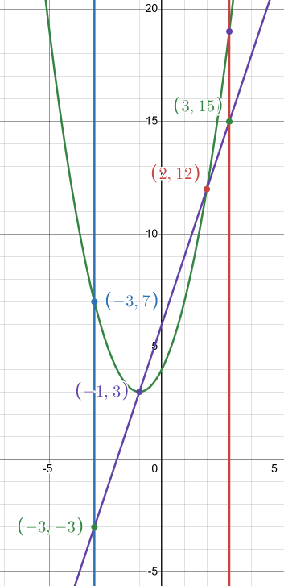

More going on here, graph shows us we have three regions of area to add up. Find
intersection points to define regions.

$$ x^2 + 2x + 4 = 3x + 6 $$

$$ x^2 - x - 2 = 0 $$

$$ (x - 2)(x + 1) = 0 $$

$$ x = -1 \text{, } x = 2 $$

Our three ranges thusly are:

$$ [-3, -1], [-1, 2], [2, 3] $$

Note also that our upper most function switches per interval. In the first and
last interval the upper most function is $y = x^2 + 2x + 4$, and in our middle
interval it is $y = 3x + 6$. Set up your area formula carefully:

$$ A = \int_{-3}^{-1}{x^2 + 2x + 4 - (3x + 6)\, dx} + \int_{-1}^{2}{3x + 6 - \left(x^2 + 2x + 4\right)\, dx} + \int_{2}^{3}{x^2 + 2x + 4 - (3x + 6)\, dx} $$

$$ A = \int_{-3}^{-1}{x^2 + 2x + 4 - 3x - 6\, dx} + \int_{-1}^{2}{3x + 6 - x^2 - 2x - 4\, dx} + \int_{2}^{3}{x^2 + 2x + 4 - 3x - 6\, dx} $$

$$ A = \int_{-3}^{-1}{x^2 - x - 2\, dx} + \int_{-1}^{2}{-x^2 + x + 2\, dx} + \int_{2}^{3}{x^2 - x - 2\, dx} $$

$$ A = \left. \left(\frac{1}{3}x^3 - \frac{1}{2}x^2 - 2x\right) \right|_{-3}^{-1} + \left. \left(-\frac{1}{3}x^3 + \frac{1}{2}x^2 + 2x\right) \right|_{-1}^{2} + \left. \left(\frac{1}{3}x^3 - \frac{1}{2}x^2 - 2x\right) \right|_{2}^{3} $$

$$
\begin{aligned}
A = {} & \left[\left(\frac{1}{3}(-1)^3 - \frac{1}{2}(-1)^2 - 2(-1)\right)
    - \left(\frac{1}{3}(-3)^3 - \frac{1}{2}(-3)^2 - 2(-3)\right)\right] \\
    & + \left[\left(-\frac{1}{3}(2)^3 + \frac{1}{2}(2)^2 + 2(2)\right)
    - \left(-\frac{1}{3}(-1)^3 + \frac{1}{2}(-1)^2 + 2(-1)\right)\right] \\
    & + \left[\left(\frac{1}{3}(3)^3 - \frac{1}{2}(3)^2 - 2(3)\right)
    - \left(\frac{1}{3}(2)^3 - \frac{1}{2}(2)^2 - 2(2)\right)\right]
\end{aligned}
$$

$$
\begin{aligned}
A = {} & \left[\left(-\frac{1}{3} - \frac{1}{2} + 2\right)
    - \left(-9 - \frac{9}{2} + 6\right)\right] \\
    & + \left[\left(-\frac{8}{3} + 2 + 4\right)
    - \left(\frac{1}{3} + \frac{1}{2} - 2\right)\right] \\
    & + \left[\left(9 - \frac{9}{2} - 6\right)
    - \left(\frac{8}{3} - 2 - 4\right)\right]
\end{aligned}
$$

$$
\begin{aligned}
A = {} & \left[-\frac{1}{3} - \frac{1}{2} + 2
    + 9 + \frac{9}{2} - 6\right] \\
    & + \left[-\frac{8}{3} + 2 + 4
    - \frac{1}{3} - \frac{1}{2} + 2\right] \\
    & + \left[9 - \frac{9}{2} - 6
    - \frac{8}{3} + 2 + 4\right]
\end{aligned}
$$

$$ A = \left(\frac{26}{3}\right) + \left(\frac{9}{2}\right) + \left(\frac{11}{6}\right) $$

$$ \boxed{A = 15} $$

**17.** $x = 6y - y^2$, $x = 2y$, $y = -2$ and $y = 5$.

**Solution**

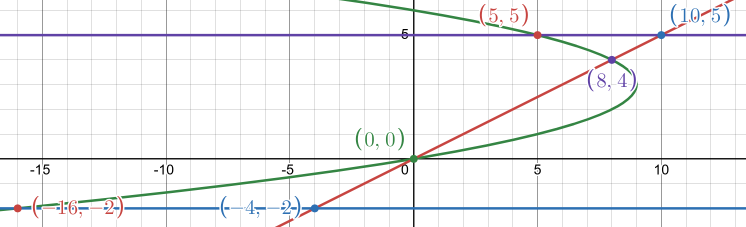

Again, we have three regions, this time we're going right/left paradigm. Set
functions equal to each other to find regions and then explicitly declare
intervals.

$$ 6y - y^2 = 2y $$

$$ 4y - y^2 = 0 $$

$$ y(4 - y) = 0 $$

$$ 4 - y = 0 $$

$$ y = 0 , y = 4 $$

So our intervals are $[-2, 0], [0, 4], [4, 5]$.

Note that the rightmost function on both the first and last interval is
$x = 2y$, while in the middle interval, the rightmost functionis $x = 6y - y^2$.
Set up your area function carefully:

$$ A = \int_{-2}^{0}{2y - \left(6y - y^2\right)\, dy} + \int_{0}^{4}{6y - y^2 - (2y)\, dy} + \int_{4}^{5}{2y - \left(6y - y^2\right)\, dy} $$

$$ A = \int_{-2}^{0}{-4y + y^2\, dy} + \int_{0}^{4}{4y - y^2\, dy} + \int_{4}^{5}{-4y + y^2\, dy} $$

$$ A = \left. \left(-2y^2 + \frac{1}{3}y^3\right) \right|_{-2}^{0} + \left. \left(2y^2 - \frac{1}{3}y^3\right) \right|_{0}^{4} + \left. \left(-2y^2 + \frac{1}{3}y^3\right) \right|_{4}^{5} $$

$$
\begin{aligned}
A = {} & \left[\left(-2(0)^2 + \frac{1}{3}(0)^3\right)
    - \left(-2(-2)^2 + \frac{1}{3}(-2)^3\right)\right] \\
    & + \left[\left(2(4)^2 - \frac{1}{3}(4)^3\right)
    - \left(2(0)^2 - \frac{1}{3}(0)^3\right)\right] \\
    & + \left[\left(-2(5)^2 + \frac{1}{3}(5)^3\right)
    - \left(-2(4)^2 + \frac{1}{3}(4)^3\right)\right]
\end{aligned}
$$

$$
\begin{aligned}
A = {} & -\left(-8 - \frac{8}{3}\right) \\
    & + \left(32 - \frac{64}{3}\right) \\
    & + \left[\left(-50 + \frac{125}{3}\right)
    - \left(-32 + \frac{64}{3}\right)\right]
\end{aligned}
$$

$$
\begin{aligned}
A = {} & \left(8 + \frac{8}{3}\right) \\
    & + \left(32 - \frac{64}{3}\right) \\
    & + \left(-50 + \frac{125}{3} + 32 - \frac{64}{3}\right)
\end{aligned}
$$

$$ A = \left(\frac{32}{3}\right) + \left(\frac{32}{3}\right) + \left(\frac{7}{3}\right) $$

$$ \boxed{A = \frac{71}{3} \approx 23.66666667} $$

**18.** $y = x^2 + 8$, $y = 3x^2$, $x = -3$ and $x = 4$.

**Solution**

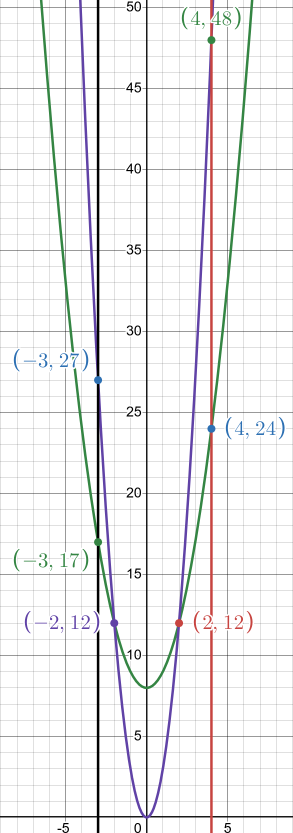

We again have three regions, set 'em equal, find the ranges.

$$ x^2 + 8 = 3x^2 $$

$$ 8 = 2x^2 $$

$$ 4 = x^2 $$

$$ x = \pm 2 $$

So our ranges are:

$$ [-3, -2], [-2, 2], [2, 4] $$

Our upper function changes as always. First and last intervals have $y = 3x^2$
as the upper function. Middle interval has $y = x^2 + 8$ as the upper function.
Set up area carefully now:

$$ A = \int_{-3}^{-2}{3x^2 - \left(x^2 + 8\right)\, dx} + \int_{-2}^{2}{x^2 + 8 - \left(3x^2\right)\, dx} + \int_{2}^{4}{3x^2 - \left(x^2 + 8\right)\, dx} $$

$$ A = \int_{-3}^{-2}{2x^2 - 8\, dx} + \int_{-2}^{2}{8 - 2x^2\, dx} + \int_{2}^{4}{2x^2 - 8\, dx} $$

$$ A = \left. \left(\frac{2}{3}x^3 - 8x\right) \right|_{-3}^{-2} + \left. \left(8x - \frac{2}{3}x^3\right) \right|_{-2}^{2} + \left. \left(\frac{2}{3}x^3 - 8x\right) \right|_{2}^{4} $$

$$
\begin{aligned}
A = {} & \left[\left(\frac{2}{3}(-2)^3 - 8(-2)\right)
    - \left(\frac{2}{3}(-3)^3 - 8(-3)\right)\right] \\
    & + \left[\left(8(2) - \frac{2}{3}(2)^3\right)
    - \left(8(-2) - \frac{2}{3}(-2)^3\right)\right] \\
    & + \left[\left(\frac{2}{3}(4)^3 - 8(4)\right)
    - \left(\frac{2}{3}(2)^3 - 8(2)\right)\right]
\end{aligned}
$$

$$
\begin{aligned}
A = {} & \left[\left(-\frac{16}{3} + 16\right)
    - \left(-\frac{54}{3} + 24\right)\right] \\
    & + \left[\left(16 - \frac{16}{3}\right)
    - \left(-16 + \frac{16}{3}\right)\right] \\
    & + \left[\left(\frac{128}{3} - 32\right)
    - \left(\frac{16}{3} - 16\right)\right]
\end{aligned}
$$

$$
\begin{aligned}
A = {} & \left[-\frac{16}{3} + 16 + \frac{54}{3} - 24\right] \\
    & + \left[16 - \frac{16}{3} + 16 - \frac{16}{3}\right] \\
    & + \left[\frac{128}{3} - 32 - \frac{16}{3} + 16\right]
\end{aligned}
$$

$$ A = \left(\frac{14}{3}\right) + \left(\frac{64}{3}\right) + \left(\frac{64}{3}\right) $$

$$ \boxed{A = \frac{142}{3} \approx 47.33333333} $$

**19.** $x = y^2$, $x = y^3$ and $y = 2$.

**Solution**

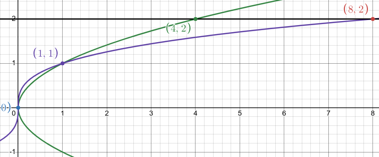

$$ y^2 = y^3 $$

$$ y^2 - y^3 = 0 $$

$$ y^2(1 - y) = 0 $$

$$ y^2 = 0 $$

$$ y = 0 $$

$$ 1 - y = 0 $$

$$ 1 = y $$

$$ [0, 1], [1, 2] $$

Two regions, Rightmost function changes depending on interval. In first
interval, rightmost function is $x = y^2$. In second interval, rightmost
function is $x = y^3$.

$$ A = \int_{0}^{1}{y^2 - y^3\, dy} + \int_{1}^{2}{y^3 - y^2\, dy} $$

$$ A = \left. \left(\frac{1}{3}y^3 - \frac{1}{4}y^4\right) \right|_{0}^{1} + \left. \left(\frac{1}{4}y^4 - \frac{1}{3}y^3\right) \right|_{1}^{2} $$

$$
\begin{aligned}
A = {} & \left[\left(\frac{1}{3}(1)^3 - \frac{1}{4}(1)^4\right)
    - \left(\frac{1}{3}(0)^3 - \frac{1}{4}(0)^4\right)\right] \\
    & + \left[\left(\frac{1}{4}(2)^4 - \frac{1}{3}(2)^3\right)
    - \left(\frac{1}{4}(1)^4 - \frac{1}{3}(1)^3\right)\right]
\end{aligned}
$$

$$
\begin{aligned}
A = {} & \left(\frac{1}{3} - \frac{1}{4}\right) \\
    & + \left[\left(4 - \frac{8}{3}\right)
    - \left(\frac{1}{4} - \frac{1}{3}\right)\right]
\end{aligned}
$$

$$
\begin{aligned}
A = {} & \left(\frac{1}{3} - \frac{1}{4}\right) \\
    & + \left[4 - \frac{8}{3} - \frac{1}{4} + \frac{1}{3}\right]
\end{aligned}
$$

$$ A = \left(\frac{1}{12}\right) + \left(\frac{17}{12}\right) $$

$$ \boxed{A = \frac{3}{2} = 1.5} $$

**20.** $y = \dfrac{7}{x}$, $y = \dfrac{1}{x} - 3$, $x = -1$ and $x = -4$.

**Solution**

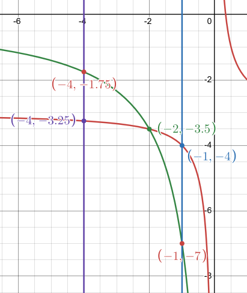

Two regions, let's find 'em.

$$ \frac{7}{x} = \frac{1}{x} $$

$$ \frac{7}{x} = \frac{1}{x} - 3 $$

$$ 7 = 1 - 3x $$

$$ 6 = -3x $$

$$ x = -2 $$

$$ [-4, -2], [-2, -1] $$

Our upper function of course changes on which interval. In the first interval,
the upper most funciton is $y = \dfrac{7}{x}$. In our second interval, the upper
most function is $y = \dfrac{1}{x} - 3$. Area:

$$ A = \int_{-4}^{-2}{\frac{7}{x} - \left(\frac{1}{x} - 3\right)\, dx} + \int_{-2}^{-1}{\frac{1}{x} - 3 - \frac{7}{x}\, dx} $$

$$ A = \int_{-4}^{-2}{\frac{6}{x} + 3\, dx} + \int_{-2}^{-1}{-3 - \frac{6}{x}\, dx} $$

$$ A = \int_{-4}^{-2}{6\left(\frac{1}{x}\right) + 3\, dx} + \int_{-2}^{-1}{-3 - 6\left(\frac{1}{x}\right)\, dx} $$

$$ A = \left. \left(6\ln|x| + 3x\right) \right|_{-4}^{-2} + \left. \left(-3x - 6\ln|x|\right) \right|_{-2}^{-1} $$

$$
\begin{aligned}
A = {} & \left[\left(6\ln|(-2)| + 3(-2)\right)
    - \left(6\ln|(-4)| + 3(-4)\right)\right] \\
    & + \left[\left(-3(-1) - 6\ln|(-1)|\right)
    - \left(-3(-2) - 6\ln|(-2)|\right)\right]
\end{aligned}
$$

$$
\begin{aligned}
A = {} & \left[(6\ln(2) - 6) - (6\ln(4) - 12)\right] \\
    & + \left[(3) - (6 - 6\ln(2))\right]
\end{aligned}
$$

$$
\begin{aligned}
A = {} & \left[6\ln(2) - 6 - 6\ln(4) + 12\right] \\
    & + \left[3 - 6 + 6\ln(2)\right]
\end{aligned}
$$

$$
\begin{aligned}
A = {} & 6\ln(2) - 6\ln(4) + 6 - 3 + 6\ln(2)
\end{aligned}
$$

$$
\begin{aligned}
A = {} & 12\ln(2) - 6\ln(4) + 3
\end{aligned}
$$

$$ A = 3(4\ln(2) - 2\ln(4) + 1) $$

$$ \boxed{A = 3} $$

**21.** $y = 2x^2 + 1$, $y = 7 - x$, $x = 4$ and the $y$-axis.

**Solution**

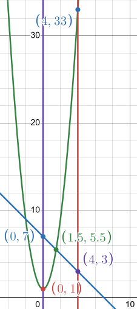

Again, two sections.

$$ 2x^2 + 1 = 7 - x $$

$$ 2x^2 + x - 6 = 0 $$

$$ x = \frac{-(1) \pm \sqrt{(1)^2 - 4(2)(-6)}}{2(2)} $$

$$ x = \frac{-1 \pm 7}{4} $$

$$ x = \frac{-1 - 7}{4} = -2 $$

$$ x = \frac{-1 + 7}{4} = \frac{3}{2} $$

We can omit the $-2$ because it falls outside of the established bounds of
$x = 0$. Essentally we can have no values that are less than $0$ in this case.
This leaves us with the following regions/intervals:

$$ \left[0, \frac{3}{2}\right], \left[\frac{3}{2}, 4\right] $$

And of course, the upper/lower functions change. In the first interval the upper
function is $y = 7 - x$. In the second interval the upper function is
$y = 2x^2 + 1$. Area:

$$ A = \int_{0}^{\frac{3}{2}}{7 - x - \left(2x^2 + 1\right)\, dx} + \int_{\frac{3}{2}}^{4}{2x^2 + 1 - (7 - x)\, dx} $$

$$ A = \int_{0}^{\frac{3}{2}}{6 - x - 2x^2\, dx} + \int_{\frac{3}{2}}^{4}{2x^2 - 6 + x\, dx} $$

$$ A = \left. \left(6x - \frac{1}{2}x^2 - \frac{2}{3}x^3\right) \right|_{0}^{\frac{3}{2}} + \left. \left(\frac{2}{3}x^3 - 6x +  \frac{1}{2}x^2\right) \right|_{\frac{3}{2}}^{4} $$

$$
\begin{aligned}
A = {} & \left[\left(6\left(\frac{3}{2}\right)
    - \frac{1}{2}\left(\frac{3}{2}\right)^2
    - \frac{2}{3}\left(\frac{3}{2}\right)^3\right)
    - \left(6(0) - \frac{1}{2}(0)^2 - \frac{2}{3}(0)^3\right)\right] \\
    & + \left[\left(\frac{2}{3}(4)^3 - 6(4) +  \frac{1}{2}(4)^2\right)
    - \left(\frac{2}{3}\left(\frac{3}{2}\right)^3 - 6\left(\frac{3}{2}\right)
    +  \frac{1}{2}\left(\frac{3}{2}\right)^2\right)\right]
\end{aligned}
$$

$$
\begin{aligned}
A = {} & \left[9 - \frac{9}{8} - \frac{54}{24}\right] \\
    & + \left[\left(\frac{128}{3} - 24 +  8\right)
    - \left(\frac{54}{24} - 9 + \frac{9}{8}\right)\right]
\end{aligned}
$$

$$
\begin{aligned}
A = {} & \left[9 - \frac{9}{8} - \frac{54}{24}\right] \\
    & + \left[\frac{128}{3} - 24 +  8 - \frac{54}{24} + 9 - \frac{9}{8}\right]
\end{aligned}
$$

$$ A = \left(\frac{45}{8}\right) + \left(\frac{775}{24}\right) $$

$$ \boxed{A = \frac{455}{12} \approx 37.91666667} $$

**22.** $y = \sin\left(\dfrac{1}{2}x\right)$, $y = 3 + \cos(2x)$, $x = 0$ and
$x = \dfrac{\pi}{4}$.

**Solution**

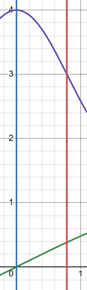

We actually have everything we need to get started right away. The upper
function is $y = 3 + \cos(2x)$.

$$ A = \int_{0}^{\frac{\pi}{4}}{3 + \cos(2x) - \sin\left(\frac{1}{2}x\right)\, dx} $$

We just have to do some substitution, ugh.

$$ A = \int_{0}^{\frac{\pi}{4}}{3\, dx} + \int_{0}^{\frac{\pi}{4}}{\cos(2x)\, dx} - \int_{0}^{\frac{\pi}{4}}{\sin\left(\frac{1}{2}x\right)\, dx} $$

$$ u = 2x \quad du = (2)dx \quad \Rightarrow \quad \frac{1}{2}du = dx $$

$$ x = 0 \quad u = 2(0) = 0 $$

$$ x = \frac{\pi}{4} \quad u = 2\left(\frac{\pi}{4}\right) = \frac{\pi}{2} $$

$$ v = \frac{1}{2}x \quad dv = \left(\frac{1}{2}\right)dx \quad \Rightarrow \quad 2dv = dx $$

$$ x = 0 \quad v = \frac{1}{2}(0) = 0 $$

$$ x = \frac{\pi}{4} \quad v = \frac{1}{2}\left(\frac{\pi}{4}\right) = \frac{\pi}{8} $$

$$ A = \int_{0}^{\frac{\pi}{4}}{3\, dx} + \frac{1}{2}\int_{0}^{\frac{\pi}{2}}{\cos(u)\, du} - 2\int_{0}^{\frac{\pi}{8}}{\sin(v)\, dv} $$

$$ A = \left. (3x) \right|_{0}^{\frac{\pi}{4}} + \frac{1}{2}\left. \left(\sin(u)\right) \right|_{0}^{\frac{\pi}{2}} + 2\left. \left(-\cos(v)\right) \right|_{0}^{\frac{\pi}{8}} $$

$$
\begin{aligned}
A = {} & \left[\left(3\left(\frac{\pi}{4}\right)\right)
    - \left(3(0)\right)\right] \\
    & + \frac{1}{2}\left[\left(\sin\left(\frac{\pi}{2}\right)\right)
    - \left(\sin(0)\right)\right] \\
    & + 2\left[\left(-\cos\left(\frac{\pi}{8}\right)\right)
    - \left(-\cos(0)\right)\right]
\end{aligned}
$$

$$
\begin{aligned}
A = {} & \left[\frac{3\pi}{4}\right] \\
    & + \frac{1}{2}\left[(1) - (0)\right] \\
    & + 2\left[-\cos\left(\frac{\pi}{8}\right) - (-1)\right]
\end{aligned}
$$

$$ A = \frac{3\pi}{4} + \frac{1}{2} + 2\left[-\cos\left(\frac{\pi}{8}\right) + 1\right] $$

$$ A = \frac{3\pi}{4} + \frac{1}{2} - 2\cos\left(\frac{\pi}{8}\right) + 2 $$

$$ \boxed{A \approx 3.008435425} $$

**23.** $x = \sqrt{2y + 6}$, $x = y - 1$, $y = 1$ and $y = 6$.

**Solution**

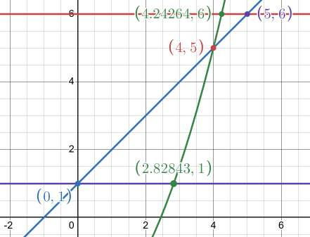

We have two regions, set them equal to find the intervals:

$$ \sqrt{2y + 6} = y - 1 $$

$$ 2y + 6 = (y - 1)^2 $$

$$ 2y + 6 = (y - 1)(y - 1) $$

$$ 2y + 6 = y^2 - 2y + 1 $$

$$ y^2 - 4y - 5 = 0 $$

$$ (y - 5)(y + 1) = 0 $$

$$ y = -1 \text{, } y = 5 $$

We can omit $y = -1$ $because it falls outside of our bound of $y = 1$,
essentially we can't have an intersection where $y \leq 1$. This leaves our
intervals as:

$$ [1, 5], [5, 6] $$

First interval has right most function of $x = \sqrt{2y + 6}$. Second interval
has right most function of $x = y - 1$. Set up area:

$$ A = \int_{1}^{5}{\sqrt{2y + 6} - (y - 1)\, dy} + \int_{5}^{6}{y - 1 - \sqrt{2y + 6}\, dy} $$

$$ A = \int_{1}^{5}{\sqrt{2y + 6} - y + 1\, dy} + \int_{5}^{6}{y - 1 - \sqrt{2y + 6}\, dy} $$

$$ A = \int_{1}^{5}{\sqrt{2y + 6}\, dy} - \int_{1}^{5}{y + 1\, dy} + \int_{5}^{6}{y - 1\, dy} - \int_{5}^{6}{\sqrt{2y + 6}\, dy} $$

$$ u = 2y + 6 \quad du = (2)dy \quad \Rightarrow \quad \frac{1}{2}du = dy $$

$$ y = 1 \quad u = 2(1) + 6 = 8 $$

$$ y = 5 \quad u = 2(5) + 6 = 16 $$

$$ v = 2y + 6 \quad dv = (2)dy \quad \Rightarrow \quad \frac{1}{2}dv = dy $$

$$ y = 5 \quad v = 2(5) + 6 = 16 $$

$$ y = 6 \quad v = 2(6) + 6 = 18 $$

$$ A = \frac{1}{2}\int_{8}^{16}{u^{\frac{1}{2}}\, du} - \int_{1}^{5}{y + 1\, dy} + \int_{5}^{6}{y - 1\, dy} - \frac{1}{2}\int_{16}^{18}{v^{\frac{1}{2}}\, dv} $$

$$ A = \frac{1}{2}\left. \left(\frac{2}{3}u^{\frac{3}{2}}\right) \right|_{8}^{16} - \left. \left(\frac{1}{2}y^2 + y\right) \right|_{1}^{5} + \left. \left(\frac{1}{2}y^2 - y\right) \right|_{5}^{6} - \frac{1}{2}\left. \left(\frac{2}{3}v^{\frac{3}{2}}\right) \right|_{16}^{18}  $$

$$
\begin{aligned}
A = {} & \frac{1}{2}\left[\left(\frac{2}{3}(16)^{\frac{3}{2}}\right)
    - \left(\frac{2}{3}(8)^{\frac{3}{2}}\right)\right] \\
    & - \left[\left(\frac{1}{2}(5)^2 + (5)\right)
    - \left(\frac{1}{2}(1)^2 + (1)\right)\right] \\
    & + \left[\left(\frac{1}{2}(6)^2 - (6)\right)
    - \left(\frac{1}{2}(5)^2 - (5)\right)\right] \\
    & - \frac{1}{2}\left[\left(\frac{2}{3}(18)^{\frac{3}{2}}\right)
    - \left(\frac{2}{3}(16)^{\frac{3}{2}}\right)\right]
\end{aligned}
$$

$$
\begin{aligned}
A = {} & \frac{1}{2}\left[\left(\frac{2}{3}(16)^{\frac{3}{2}}\right)
    - \left(\frac{2}{3}(8)^{\frac{3}{2}}\right)\right] \\
    & - \left[\left(\frac{25}{2} + 5\right)
    - \left(\frac{1}{2} + 1\right)\right] \\
    & + \left[\left(\frac{36}{2} - 6\right)
    - \left(\frac{25}{2} - 5\right)\right] \\
    & - \frac{1}{2}\left[\left(\frac{2}{3}(18)^{\frac{3}{2}}\right)
    - \left(\frac{2}{3}(16)^{\frac{3}{2}}\right)\right]
\end{aligned}
$$

$$ \boxed{A \approx 6.413371790} $$

**24.** $y = 2 - \mathbf{e}^{2 - x}$, $y = x^2 - 4x + 7$, $x = 3$ and the
$y$-axis. Note: These functions do not intersect.

**Solution**

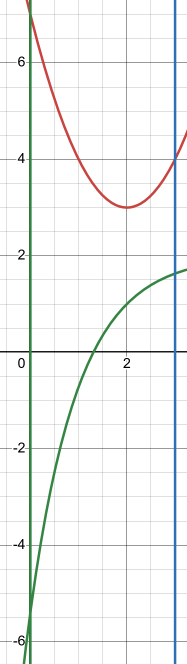

This is meant to throw you off. The assumption is that since the functions never
intersect that the area must be $0$, but the two functions still recate a region
inbetwteen $x = 0$ and $x = 3$. It actually is a simple problem. Observe only
that the upper function is $y = x^2 - 4x + 7$

$$ A = \int_{0}^{3}{x^2 - 4x + 7 - \left(2 - \mathbf{e}^{2 - x}\right)\, dx} $$

$$ A = \int_{0}^{3}{x^2 - 4x + 7 - 2 + \mathbf{e}^{2 - x}\, dx} $$

$$ A = \int_{0}^{3}{x^2 - 4x + 5 + \mathbf{e}^{2 - x}\, dx} $$

$$ A = \int_{0}^{3}{x^2 - 4x + 5\, dx} + \int_{0}^{3}{\mathbf{e}^{2 - x}\, dx} $$

$$ u = 2 - x \quad du = (-1)dx \quad \Rightarrow \quad -du = dx $$

$$ x = 0 \quad u = 2 - (0) = 2 $$

$$ x = 3 \quad u = 2 - (3) = -1 $$

$$ A = \int_{0}^{3}{x^2 - 4x + 5\, dx} - \int_{2}^{-1}{\mathbf{e}^u\, du} $$

$$ A = \left. \left(\frac{1}{3}x^3 - 2x^2 + 5x\right) \right|_{0}^{3} - \left. \left(\mathbf{e}^u\right) \right|_{2}^{-1}  $$

$$
\begin{aligned}
A = {} & \left[\left(\frac{1}{3}(3)^3 - 2(3)^2 + 5(3)\right)
    - \left(\frac{1}{3}(0)^3 - 2(0)^2 + 5(0)\right)\right] \\
    & - \left[\left(\mathbf{e}^{(-1)}\right)
    - \left(\mathbf{e}^{(2)}\right)\right]
\end{aligned}
$$

$$ A = (9 - 18 + 15) - \left(\frac{1}{\mathbf{e}}\right) + \mathbf{e}^2 $$

$$ A = 6 - \left(\frac{1}{\mathbf{e}}\right) + \mathbf{e}^2 $$

$$ \boxed{A \approx 13.02117666} $$

**25.** $y = \mathbf{e}^{2x - 1}$, $y = \mathbf{e}^{5 - x}$, $x = 0$ and
$x = 3$.

**Solution**

I won't post the graph, because while there are regions, one of them appears to
go off towards infinity. If you think on it though, both these functions _are_
finite. We just need to find the intersection to divide up our intervals and
know which one is the upper function on each interval (as per usual).

$$ \mathbf{e}^{2x - 1} = \mathbf{e}^{5 - x} $$

$$ \ln\left(\mathbf{e}^{2x - 1}\right) = \ln\left(\mathbf{e}^{5 - x}\right) $$

$$ 2x - 1 = 5 - x $$

$$ 3x = 6 $$

$$ x = 2 $$

So our intervals are:

$$ [0, 2], [2, 3] $$

The only issue with the graph is that it is not easily apparent which function
is "upper". We can determine which is "upper" within the interval by comparing
values within the ranges between the two functions. Let's start with $[0, 2]$,
let's just pick $1$:

$$ y = \mathbf{e}^{2x - 1} $$

$$ y = \mathbf{e}^{2(1) - 1} $$

$$ y = \mathbf{e} $$

$$ y = \mathbf{e}^{5 - x} $$

$$ y = \mathbf{e}^4 $$

Clearly $\mathbf{e}^4$ is greater than $\mathbf{e}$, so the upper function in
the first interval is:

$$ y = \mathbf{e}^{5 - x} $$

Let's check the second interval of $[2, 3]$, let's pick $2.5$:

$$ y = \mathbf{e}^{2x - 1} $$

$$ y = \mathbf{e}^{2(2.5) - 1} $$

$$ y = \mathbf{e}^4 $$

$$ y = \mathbf{e}^{5 - x} $$

$$ y = \mathbf{e}^{5 - (2.5)} $$

$$ y = \mathbf{e}^{2.5} $$

And here we see that indeed the upper function for the second interval is:

$$ y = \mathbf{e}^{2x - 1} $$

We now have all we need to get started evaluating our area:

$$ A = \int_{0}^{2}{\mathbf{e}^{5 - x} - \mathbf{e}^{2x - 1}\, dx} + \int_{2}^{3}{\mathbf{e}^{2x - 1} - \mathbf{e}^{5 - x}\, dx} $$

$$ A = \int_{0}^{2}{\mathbf{e}^{5 - x}\, dx} - \int_{0}^{2}{\mathbf{e}^{2x - 1}\, dx} + \int_{2}^{3}{\mathbf{e}^{2x - 1}\, dx} - \int_{2}^{3}{\mathbf{e}^{5 - x}\, dx} $$

$$ A = \left. \left(-\mathbf{e}^{5 - x}\right) \right|_{0}^{2} - \left. \left(\frac{1}{2}\mathbf{e}^{2x - 1}\right) \right|_{0}^{2} + \left. \left(\frac{1}{2}\mathbf{e}^{2x - 1}\right) \right|_{2}^{3} - \left. \left(-\mathbf{e}^{5 - x}\right) \right|_{2}^{3} $$

$$
\begin{aligned}
A = {} & \left[\left(-\mathbf{e}^{5 - (2)}\right)
    - \left(-\mathbf{e}^{5 - (0)}\right)\right] \\
    & - \left[\left(\frac{1}{2}\mathbf{e}^{2(2) - 1}\right)
    - \left(\frac{1}{2}\mathbf{e}^{2(0) - 1}\right)\right] \\
    & + \left[\left(\frac{1}{2}\mathbf{e}^{2(3) - 1}\right)
    - \left(\frac{1}{2}\mathbf{e}^{2(2) - 1}\right)\right] \\
    & - \left[\left(-\mathbf{e}^{5 - (3)}\right)
    - \left(-\mathbf{e}^{5 - (2)}\right)\right]
\end{aligned}
$$

$$
\begin{aligned}
A = {} & \left[\mathbf{e}^5 - \mathbf{e}^3\right] \\
    & - \left[\frac{1}{2}\mathbf{e}^3 - \frac{1}{2}\left(\frac{1}{\mathbf{e}}\right)\right] \\
    & + \left[\frac{1}{2}\mathbf{e}^5 - \frac{1}{2}\mathbf{e}^3\right] \\
    & - \left[\mathbf{e}^3 - \mathbf{e}^{2}\right]
\end{aligned}
$$

$$ \boxed{A \approx 169.9361237} $$

**26.** $x = \cos(\pi y)$, $x = 3$, $y = 0$ and $y = 4$.

**Solution**

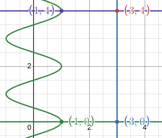

We actually have everything we need as there is only one region with no
overlapping of functions. Our rightmost function is $x = 3$.

$$ A = \int_{0}^{4}{3 - \cos(\pi y)\, dy} $$

$$ A = \int_{0}^{4}{3\, dy} - \int_{0}^{4}{\cos(\pi y)\, dy} $$

$$ u = \pi y \quad du = (\pi)dy \quad \Rightarrow \quad \frac{1}{\pi}du = dy $$

$$ y = 0 \quad u = \pi(0) = 0 $$

$$ y = 4 \quad u = \pi(4) = 4\pi $$

$$ A = \int_{0}^{4}{3\, dy} - \frac{1}{\pi}\int_{0}^{4\pi}{\cos(u)\, du} $$

$$ A = \left. \left(3y\right) \right|_{0}^{4} - \frac{1}{\pi} \left. \left(\sin(u)\right) \right|_{0}^{4\pi} $$

$$
\begin{aligned}
A = {} & \left[(3(4)) - (3(0))\right] \\
    & - \frac{1}{\pi}\left[\left(\sin(4\pi)\right)
    - \left(\sin(0)\right)\right] \\
\end{aligned}
$$

$$ A = [12] - \frac{1}{\pi}[0 - 0] $$

$$ \boxed{A = 12} $$
